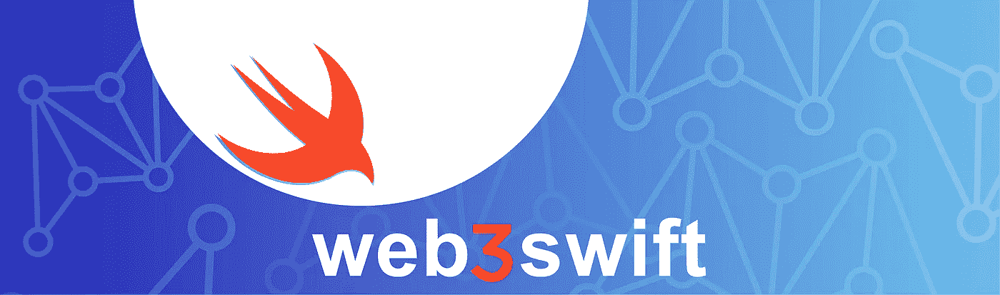

# iOS 的 Web3:如何使用 web3swift 在以太坊上调用自定义智能合约

> 原文：<https://medium.com/coinmonks/web3-of-ios-how-to-call-custom-smart-contract-on-ethereum-using-web3swift-52cd09b84df0?source=collection_archive---------9----------------------->

image source: web3swift

# 动机

我是一名 iOS 开发者。我正在自学区块链开发。一开始我不知道怎么能在 iOS 上调用我定制的以太坊智能合约。所以我希望这篇文章可以帮助想学习区块链的人在 iOS 上开发。

# 介绍

在本文中，我不会实现如何在以太坊上编写和部署智能合约。因为有很多文章教学。因此，我将重点介绍如何使用 swift 与智能合约进行交互。

要在 iOS 上进行智能合约的交互，我们需要“web3swift”。web3swift 是一个面向 iOS 的开源库。它可以帮助我们在网上做很多事情。如果你对 web3swift 感兴趣，那就去看看他们的 github。

web 3 swift:[https://github.com/skywinder/web3swift#license](https://github.com/skywinder/web3swift#license)

# 履行

## 智能合同部分

我使用 [Remix](http://remix.ethereum.org/) 编写一个简单的智能契约，并部署在以太坊上。只有一个函数会返回“Hello world！!"。额外信息，solidity 中的“查看”功能不收任何油费。

## 快速部分

1.  使用 SPM 导入 web3swift 库
2.  导入和初始化 web3swift

3.写调用函数

最后可以得到一个“Hello World！!"on 返回由 helloWorld 协定上 HelloWorld 函数传递字符串。

> 加入 Coinmonks [电报频道](https://t.me/coincodecap)和 [Youtube 频道](https://www.youtube.com/c/coinmonks/videos)了解加密交易和投资

# 另外，阅读

*   [5 款最佳加密交易终端](https://coincodecap.com/crypto-trading-terminals) | [最佳 DeFi 应用](https://coincodecap.com/best-defi-apps)
*   [比特币基地 vs 瓦济克斯](https://coincodecap.com/coinbase-vs-wazirx) | [比特鲁点评](https://coincodecap.com/bitrue-review) | [波洛涅克斯 vs 比特鲁](https://coincodecap.com/poloniex-vs-bittrex)
*   [德国最佳加密交易所](https://coincodecap.com/crypto-exchanges-in-germany) | [Arbitrum:第二层解决方案](https://coincodecap.com/arbitrum)
*   [币安交易机器人](/coinmonks/binance-trading-bots-d0d57bb62c4c) | [OKEx 审查](/coinmonks/okex-review-6b369304110f) | [阿塔尼审查](https://coincodecap.com/atani-review)
*   [最佳加密交易信号电报](/coinmonks/best-crypto-signals-telegram-5785cdbc4b2b) | [MoonXBT 评论](/coinmonks/moonxbt-review-6e4ab26d037)
*   [如何在 Bitbns 上购买柴犬(SHIB)币？](https://coincodecap.com/buy-shiba-bitbns) | [购买 Floki](https://coincodecap.com/buy-floki-inu-token)
*   [CoinFLEX 评论](https://coincodecap.com/coinflex-review) | [AEX 交易所评论](https://coincodecap.com/aex-exchange-review) | [UPbit 评论](https://coincodecap.com/upbit-review)