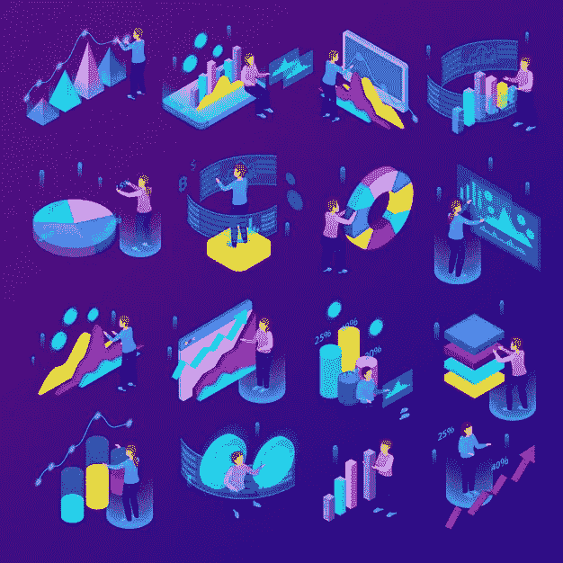

# web 3/链上工作以及如何为其定位

> 原文：<https://medium.com/coinmonks/web3-on-chain-jobs-and-how-to-position-for-them-d3467cf41a5b?source=collection_archive---------7----------------------->

## 为未来做好准备

这不是新闻，web3 是每个主要社交媒体空间的讨论话题。自从脸书宣布更名为 Meta 之后，每个人心中的疑问都是 web3 是什么？我该如何为它定位？在此之前，我们需要先定义什么是 web3。

Onchain jobs ([source](https://image.freepik.com/free-vector/isometric-glowing-business-analytics-icons-set-with-people-making-various-graphs-diagrams-3d-isolated-vector-illustration_1284-30862.jpg))

# 什么是 web3？

简单来说，web3 是 web2 的高级改进版本。Web3 是一个去中心化的网络，不受任何公司或政府的控制，不像以前的网络版本，大型科技公司负责用户的数据并控制一切。Web3 把权力还给用户，让他们对自己的身份负责。

既然我们已经有了明确的定义，你脑海中的下一个问题是 web3 上的工作类型是什么，我如何为它们定位？在我开始之前，让我们看看为什么你应该考虑网络 3/连锁工作。

首先，每个人都会感受到 web3 的影响。这不是一个将被限制在特定人群中的变化或运动。只要你是一个互联网用户，你就必须拥抱 web3，你不能逃避或躲避它，除非你想排斥自己，去石头底下离开，这没关系，我们不理解你，但我们尊重你的愿望，祝你一切顺利。

其次，web3 让年轻人有能力在这么短的时间内成为专家，而不必等待多年，不像其他工作，你必须获得一个又一个学位才能成为专家。在 web3 中，你所要做的就是参与，随着时间的推移，你会成为你所选择的 web3 领域的专家。

最后，目前方公司中最聪明的人大量外流。世界上最聪明的人正在辞去他们的工作，给 web3 一个机会。问题是，难道你不想与这些聪明人交往并分享想法，并可能创造一些有意义的东西吗？

# web 3/链上作业

Web3 是一项蓬勃发展的创新，将涵盖我们生活的所有领域。Web2 主要是开发者、投资者和科技公司的天下。在 Web3 中，我们将看到投资者、开发者、加密货币公司、艺术家、音乐家、作家、游戏玩家等的统治。没有人会被豁免。Web3 是民有、民治、民享的创新。

# 如何定位网络 3/连锁工作

**1:志愿者实习**

志愿实习是发现某个空间是否适合你和你的职业抱负的最快方法。对于希望了解加密货币并获得一些经验的新手来说，这是最佳选择。要真正发现你能在 Web3 和区块链空间做什么，你需要尝试不同的 web3 生态系统。

**2:写**

你的写作能力是你能拥有的最有价值的技能之一。不仅很难写出好的内容，而且很难有勇气表达自己，永远不要告诉自己做不了作家。我也从来没有认为自己是一个作家，但现在我为你打出了这些内容。作家们把自己锁在房间里或去沙漠寻找新书灵感的日子已经一去不复返了。如今，你需要写的只是一部手机和把自己放在那里的意愿。

成为早期采用者是在竞争中领先的一个好方法。

早期采用者通常是早期雇佣的最佳人选。创始人希望雇佣那些对自己的使命充满热情、相信组织目标的人。那些已经在业余时间为项目做贡献的早期采用者比那些寻求补偿的职业雇佣工人更有资格。

**4:利用社交媒体平台**

Web3 目前几乎没有进入壁垒，现在是利用社交媒体平台进入的好时机。有没有一个你特别喜欢的 web3 项目？咄咄逼人地发微博。你相信并认为你能为一个 web3 社区的发展做出贡献吗？加入他们的不和群，参加那里正在进行的活动。你有一项技能，并且你认为它将有益于一个特定的 web3 项目吗？在推特上发布相关信息，并标记该公司。

**5:加入一个 DAO(去中心化自治组织)**

如果您对特定的产品或协议有所了解或有特殊的爱好，那么加入 DAO 是获得早期经验和提高声誉的一个很好的方法。展示你对道的价值是一个很好的开始方式，你的贡献会得到回报。

# 结论

世界正在走向无许可经济，你不需要任何政府、公司、组织、机构的许可就可以参与 web3 和区块链技术。找到你的 web3 家庭，你属于的地方，做一些美好的事情。

> 加入 Coinmonks [电报频道](https://t.me/coincodecap)和 [Youtube 频道](https://www.youtube.com/c/coinmonks/videos)了解加密交易和投资

# 另外，阅读

*   [加密复制交易平台](/coinmonks/top-10-crypto-copy-trading-platforms-for-beginners-d0c37c7d698c) | [Coinmama 审核](/coinmonks/coinmama-review-ace5641bde6e)
*   [印度的加密交易所](/coinmonks/bitcoin-exchange-in-india-7f1fe79715c9) | [比特币储蓄账户](/coinmonks/bitcoin-savings-account-e65b13f92451)
*   [OKEx vs KuCoin](https://coincodecap.com/okex-kucoin) | [摄氏替代度](https://coincodecap.com/celsius-alternatives) | [如何购买 VeChain](https://coincodecap.com/buy-vechain)
*   [币安期货交易](https://coincodecap.com/binance-futures-trading)|[3 commas vs Mudrex vs eToro](https://coincodecap.com/mudrex-3commas-etoro)
*   [如何购买 Monero](https://coincodecap.com/buy-monero) | [IDEX 评论](https://coincodecap.com/idex-review) | [BitKan 交易机器人](https://coincodecap.com/bitkan-trading-bot)
*   [CoinDCX 评论](/coinmonks/coindcx-review-8444db3621a2) | [加密保证金交易交易所](https://coincodecap.com/crypto-margin-trading-exchanges)
*   [红狗赌场评论](https://coincodecap.com/red-dog-casino-review) | [Swyftx 评论](https://coincodecap.com/swyftx-review) | [CoinGate 评论](https://coincodecap.com/coingate-review)
*   [Bookmap 评论](https://coincodecap.com/bookmap-review-2021-best-trading-software) | [美国 5 大最佳加密交易所](https://coincodecap.com/crypto-exchange-usa)