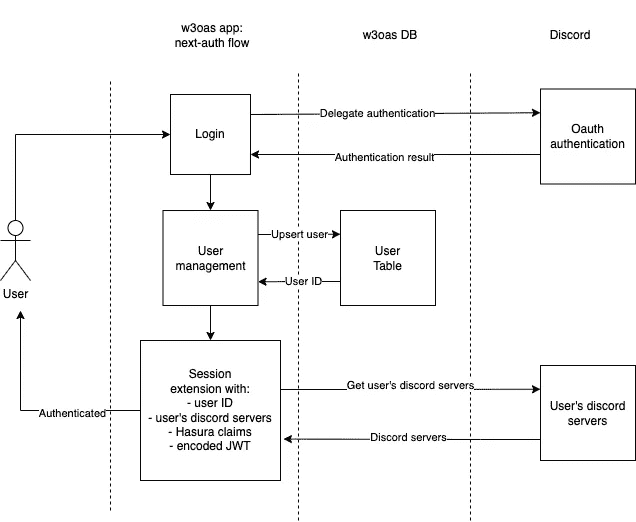
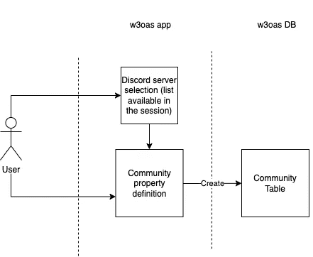
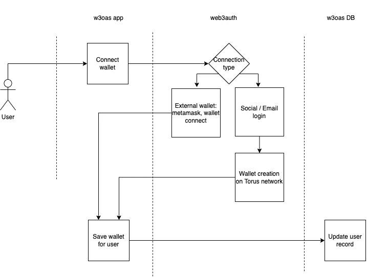
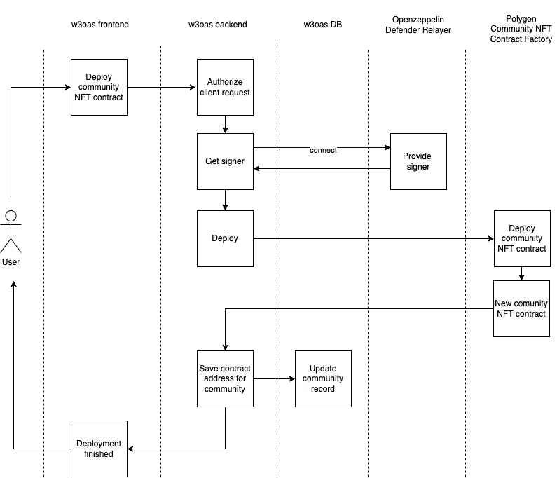
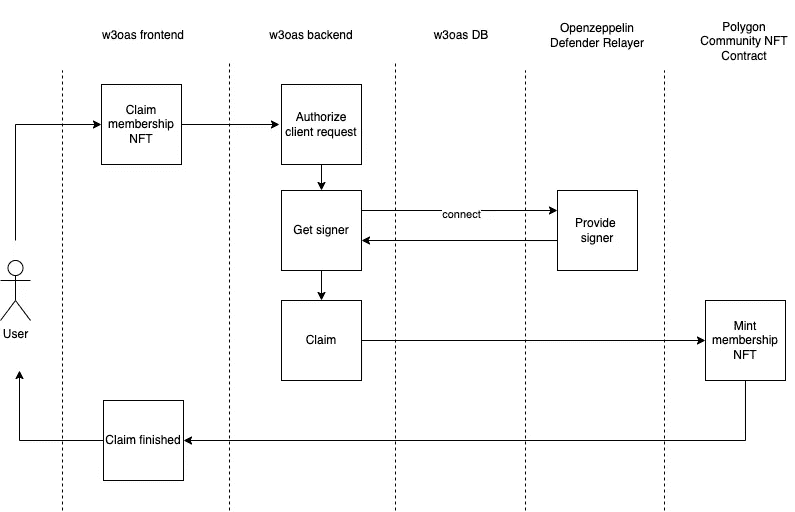

# Web3 onboarding as a service:技术细节

> 原文：<https://medium.com/coinmonks/web3-onboarding-as-a-service-technical-details-f9f19b8daba5?source=collection_archive---------14----------------------->

在[的第一篇文章](/@szmizorsz/cfbb70fa9d54)中，我们详细介绍了应用背后的动机和用例。在本文中，我们将更深入地探讨技术。您可以通过检查代码来跟踪文章:查看[应用程序](https://github.com/szmizorsz/w3oas)和[合同](https://github.com/szmizorsz/w3oas-contracts)，并使用[应用程序](https://w3oas.vercel.app/)。

说到技术，以下是基本的技术决策:

*   [Typescript](https://www.typescriptlang.org/) :相比 javascript，我更喜欢 Typescript，尤其是当它与一些类型和代码生成工具一起使用时，比如 [GraphQL 代码生成器](https://www.graphql-code-generator.com/)。当应用程序变得更大时，打字真的很重要。例如:你必须进行实体级的重构，其结果会泄露到应用程序的许多部分。在这种情况下，类型安全可以提前捕捉许多错误，这只是一个例子。
*   [Next.js](https://nextjs.org/) : Next.js 是一个 React 框架，它为您提供了创建 web 应用程序的构建块。它为您提供了服务器端渲染、静态站点生成、搜索引擎优化等等…例如，它附带了一个后端，我们可以广泛地使用它来创建我们的自定义端点。
*   [Next-auth](https://next-auth.js.org/) :是 Next.js 的认证框架，我们用来实现 oauth discord 认证流程，定制相对简单。
*   [Hasura graphql 引擎](https://hasura.io/):在基于实体的类型是应用程序的本质的环境中，我更喜欢 graphql 查询而不是 REST API 调用。基于关系数据库的应用程序就是这种情况。
*   [Postgres](https://www.postgresql.org/) : Hasura 是和 Postgres 一起开箱的。
*   Polygon :由于 Polygon 是目前最流行的扩展解决方案，我们希望我们的 onboarding 服务又快又便宜，这是一个自然的选择。
*   [Web3auth](https://web3auth.io/) : web3auth 让用户的入职流程变得轻量级。他们不必为创建钱包、私钥管理和备份而烦恼。他们只需使用他们的社交网站登录，生成的钱包将存储在 Torus 网络的不同区块中。所有的块都只能由所有者访问，而不能由环面网络中的节点提供者访问，所以它被安全地存储。Web3auth 是广泛采用 web3 的基础设施的重要组成部分。
*   [安全帽](https://hardhat.org/):这是 EVM 兼容智能合约最流行的开发环境。
*   [Openzeppelin](https://www.openzeppelin.com/) ，ERC1155:实现标准的事实上的智能契约库。在我们的案例中，我们建立在 erc1155 标准之上。
*   open zeppelin Defender Relay:Defender Relay 服务允许您通过常规的 HTTP API 发送交易，并负责私钥安全存储、交易签名、随机数管理、汽油价格估计和重新提交。这是为用户创建元事务的完美解决方案，否则会很复杂。因此，他们不必为购买 Matic 和签署交易来申请他们的 NFT 而烦恼。这就是第一次 web3 体验变得像使用普通 web2 应用一样流畅的原因。

**让我们详细介绍一些用户流程**

1.认证流程

身份验证流程基于 next-auth 的 JWT 身份验证流程，具有以下定制:

*   登录被委托给不一致 oauth 认证
*   一旦用户登录，就会在 w3oas DB 中创建或更新一个用户记录，其中包含来自 discord 的用户数据:用户名、电子邮件、头像等
*   next-auth 提供的会话用以下信息扩展:
    -用户记录 id
    -用户的不一致服务器:表示用户是特定服务器的所有者或成员
    - Hasura 声明:相同的 JWT 令牌用于对 Hasura 的认证，但它需要一些特定的声明存在
    - JWT 令牌:也用于对 w3oas 后端和 Hasura 的认证



如您所见，认证不涉及任何 web3 特定的部分。钱包连接是一个完全独立的流程。

2.社区创建流程

社区创建非常简单:

*   用户的 discord 服务器已经在会话中可用
*   他可以选择自己拥有的、尚未注册为 w3oas 社区的社区
*   指定社区的属性后，它被保存到 w3oas 数据库中
*   所以 w3oas 社区记录是它们对应的 discord 服务器的一个稍微修改的版本。



3.钱包连接流程

钱包连接基于 web3auth 流，完全独立于认证流:

*   一旦通过身份验证，用户可以随时连接或断开钱包
*   web3auth 流中的 Wallet 连接取决于连接类型:
*   如果用户已经有一个外部钱包，如 metamask 或 wallet connect，他可以选择使用它
*   用户也可以选择使用基于他的社交登录或电子邮件登录的 web3auth 钱包创建:
    -一旦用户通过所选提供商的认证，在 Torus 网络上创建新的钱包
    -重新创建钱包的单独声明由 Torus 网络上的独立节点提供商持有，并且只有用户可以重新创建他的私钥。没有一个节点提供程序有足够的信息来重新创建密钥。
*   连接或创建钱包后，钱包地址会保存在 w3oas 数据库的用户记录中，以备后用，例如 NFT 空投



4.社区 NFT 合同部署

社区 NFT 合同部署作为一项服务提供给社区所有者。因此，它是免费和无气的体验与以下流程:

*   如果社区还没有 NFT 合同，则社区所有者启动部署
*   部署由 w3oas 后端的专用端点管理。
*   它首先根据 JWT 对请求进行身份验证。
*   认证成功后，它连接到 Openzeppelin Defender Relayer，后者持有将对部署事务进行签名的私钥
*   它通过向 Polygon 上的“社区 NFT 工厂”契约发送事务来启动部署。交易由 Openzeppelin Defender Relayer 中保存的地址签署。在相同的事务中，发生了以下事情:
    -部署了新的社区 NFT 契约，其是 ERC1155 契约
    -用 tokenId = 1 创建了成员资格 NFT
    -发起事务的社区所有者通过向其地址发布 tokenId = 1 的数量= 1，自动获得其成员资格 NFT
*   一旦创建了新的契约，地址就会保存到社区的 w3oas DB 中。
*   整个流程成功后，用户会得到适当的反馈。



5.要求加入 NFT

会员 NFT 索赔非常类似于社区 NFT 合同部署。它也是一种服务，免费和无汽油的体验，其流程如下:

*   如果会员附上了他的钱包，他可以发起索赔
*   该声明由 w3oas 后端的专用端点管理。
*   它首先根据 JWT 对请求进行身份验证。
*   认证成功后，它连接到 Openzeppelin Defender Relayer，后者持有将对部署事务进行签名的私钥
*   它通过向 Polygon 上的社区 NFT 合同发送一个事务来启动索赔。交易由 Openzeppelin Defender Relayer 中保存的地址签署。
*   交易成功或失败后，用户会得到相应的反馈。



**开发者体验**

在 web2 和 web3 这两个方面，花一些时间在开发者体验上是值得的。

在 web2 开发者体验中，最大的附加值是 Hasura 和 [GraphQL 代码生成器](https://www.graphql-code-generator.com/)。从模式和实体定义到前端的类型和使用查询挂钩，使用这些工具，整个过程变得非常流畅和快速。让我们来看看细节:
1。只需点击几下鼠标，就可以在 Hasura 控制台上定义实体和模式修改。
2。Hasura 自动生成迁移和元数据更改文件，稍后可以应用这些文件来构建相同的模式。这是一个类似 Liquidbase 的数据库模式管理解决方案。
3。Hasura 有一个内置的 graphql 编辑器，可以让我们编写 graphql 查询。
4。从 schema 和 graphql 查询中，在 GrahpQL 代码生成器的帮助下，我们可以生成类型、类型化的 useQuery 钩子，以及使在前端使用 typescript 和生成的钩子变得容易的一切:为查询、查询变量、查询结果等分离文档类型。如果我们注意 graphql 查询中的字段片段，那么我们可以很容易地将查询结果分成子部分，并将它们传递给不同的 UI 组件，因此访问嵌套类型不会变得很麻烦。我真的推荐使用这个工具，并深入了解如何以正确的方式使用它。
使用这些工具，将一个特征从模型创建发布到用户界面的过程变得更加快速和流畅。

通过 Hardhat 生成的输入，web3 开发人员的体验也变得更加流畅。我真的推荐使用它，从测试和脚本中的类型安全智能契约交互，到类型安全配置。生成的类型在应用程序的其他层也变得有用，如后端和前端，它们可以以类型安全的方式与契约交互。

有一件事我没有花时间去解决并使我的 web2 和 web3 开发人员体验更好，那就是找到一种适当的方法来与 w3oas 应用程序共享从契约中生成的类型。合同与应用程序本身有不同的存储库，所以每当我更改合同并重新生成类型时，我必须手动将类型从一个 repo 复制到另一个 repo。解决这个问题的一个方法是创建一个 monorepository，其中契约和应用程序都有自己的包，应用程序可以将契约声明为依赖项。

**某种技术深度**

我想花点时间讲讲我们刚开始学习 web3 时在教程中通常找不到的东西。我非常支持关注点分离和单一责任原则。因此，与任何其他逻辑一样，web3 交互可以提取到它们自己的实用程序中。

1.  例如，获取一个 web3 提供者通常被嵌入到一个组件中。我认为最好创建一个单独的上下文，并将每一个与 web3 提供商相关的逻辑嵌入其中。在 w3oas 应用程序中， [web3provider context](https://github.com/szmizorsz/w3oas/blob/develop/src/components/Web3Provider.tsx) 具有以下接口:

```
export interface IWeb3Context {
  web3Provider: ethers.providers.Web3Provider | null
  web3Loading: boolean
  connectWallet: () => Promise<string[] | undefined>
  disconnectWallet: () => Promise<void>
  getUserInfo: () => Promise<void>
  getAccounts: () => Promise<string[] | undefined>
}
```

web3Provider 是对区块链连接的通常(ethers.provider)抽象。

这些函数管理连接。connectWallet 函数包含 web3auth 连接部分:

```
const connectWallet = async () => {
    if (!web3AuthInstance) {
      console.log('web3auth not initialized yet')
      return
    }
    const provider = await web3AuthInstance.connect()
    if (!provider) {
      console.log('web3provider not initialized')
      return
    }
    const web3ProviderFromWeb3Auth = new ethers.providers.Web3Provider(provider)
    const accounts = await web3ProviderFromWeb3Auth.listAccounts()
    setWeb3Provider(web3ProviderFromWeb3Auth)
    return accounts
  }
```

web3AuthInstance.connect()打开 web3 auth 对话框，并向用户演示钱包连接步骤。

因此，在我们的应用程序中，web3provider 被用作任何其他提供者和上下文:

```
function MyApp({ Component, pageProps }: AppProps) {
  return (
    <ChakraProvider>
      <SessionProvider session={pageProps.session} refetchInterval={0}>
        <Web3Provider>
          <ApolloProviderWithAuth>
            <Component {...pageProps} />
          </ApolloProviderWithAuth>
        </Web3Provider>
      </SessionProvider>
    </ChakraProvider>
  )
}
```

2.web3 连接按钮也配有自己的[组件](https://github.com/szmizorsz/w3oas/blob/develop/src/components/web3Button.tsx)。它封装了上面描述的钱包连接流。它建立在 web3 提供者上下文中的 connectWallet 和 disconnectWallet 函数的基础上，并管理 DB 中的钱包地址持久性。

3.契约连接逻辑也应该有自己独立的钩子:

```
export default function useCommunityNftContract(
  address: string | null | undefined,
  signer?: ethers.providers.JsonRpcSigner
) {
  const [communityNftcontract, setCommunityNftContract] =
    useState<CommunityNFT | null>(null)useEffect(() => {
    ;(async () => {
      if (!process.env.NEXT_PUBLIC_RPC_TARGET || !address) {
        return
      }const signerOrProvider =
        signer ||
        new ethers.providers.JsonRpcProvider(process.env.NEXT_PUBLIC_RPC_TARGET)const contract = CommunityNFT__factory.connect(address, signerOrProvider)setCommunityNftContract(contract)
    })()
  }, [signer, address])return communityNftcontract
}
```

从组件获取契约连接变得很容易理解:

```
const communityNftContract = useCommunityNftContract(
    communityNftContractAddress
  )
```

当你在一个专业的 web3 项目中时，这些事情可能是显而易见的，但是当你试图学习 web3 概念和实现模式时就不那么明显了。

有两个新的库可以取代这些自己的组件和挂钩:

*   wag mi:React 钩子的集合，用于契约交互、钱包连接等。
*   RainbowKit :一个 [React](https://reactjs.org/) 库，可以很容易地将钱包连接添加到你的 dapp。

**托管环境**

应用程序托管在以下基于分布式云服务的环境中:

*   哈苏拉云
*   Heroku postgres 数据库
*   Vercel for Next.js
*   Matic 孟买测试网
*   契约阅读 RPC 连接:炼金术
*   交易(合同撰写):Openzeppelin Defender Relayer 项目
*   Web3auth 项目

如果您想在本地开发环境中运行它:

*   Hasura + Postgres 与 [Docker 构成](https://github.com/szmizorsz/w3oas/blob/develop/docker-compose.yml)
*   Next.js 本地 web 服务器:npm 运行开发
*   安全帽局域网

**结论**

有时候不容易找到比教程级别更高级的技术模板。在 github repos 中搜索著名项目是可能的，但是它们可能太复杂了。我希望通过 w3oas 平台的这些低复杂度用例，我可以给你一些提示或者至少一些启发。

> 加入 Coinmonks [电报频道](https://t.me/coincodecap)和 [Youtube 频道](https://www.youtube.com/c/coinmonks/videos)了解加密交易和投资

# 另外，阅读

*   [分散交易所](https://coincodecap.com/what-are-decentralized-exchanges) | [比特 FIP](https://coincodecap.com/bitbns-fip) | [宾邦评论](https://coincodecap.com/bingbon-review)
*   用信用卡购买密码的 10 个最佳地点
*   [加拿大最佳加密交易机器人](https://coincodecap.com/5-best-crypto-trading-bots-in-canada) | [Bybit vs 币安](https://coincodecap.com/bybit-binance-moonxbt)
*   [阿联酋 5 大最佳加密交易所](https://coincodecap.com/best-crypto-exchanges-in-uae) | [SimpleSwap 评论](https://coincodecap.com/simpleswap-review)
*   购买 Dogecoin 的 7 种最佳方式 | [ZebPay 评论](https://coincodecap.com/zebpay-review)
*   [最佳期货交易信号](https://coincodecap.com/futures-trading-signals) | [流动性交易回顾](https://coincodecap.com/liquid-exchange-review)
*   【Huobi 的加密交易信号 | [Swapzone 审查](/coinmonks/swapzone-review-crypto-exchange-data-aggregator-e0ad78e55ed7)