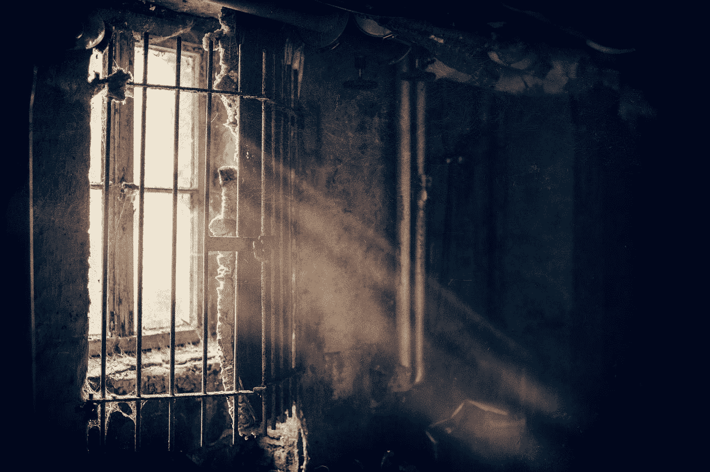

# Web3 出版？当然，如果你喜欢被囚禁的工作

> 原文：<https://medium.com/coinmonks/web3-publishing-sure-if-you-like-your-work-held-captive-c4887c853b5d?source=collection_archive---------33----------------------->

Photo by [Denny Müller](https://unsplash.com/@redaquamedia?utm_source=medium&utm_medium=referral) on [Unsplash](https://unsplash.com?utm_source=medium&utm_medium=referral)

我原以为 Web3 会彻底改变在线写作，但发表这篇文章改变了我的想法。这个过程很简单:我只需将文字粘贴到文本栏，点击*发布*，支付几个*密码分*，就这样了——不需要账户、电子邮件或版主参与。但是现在我做了，我不再相信我拥有我的作品。

从技术上讲，在 Web3 中有两种发布方式。你可以将你的内容添加到区块链，比如比特币、以太坊和 [ArWeave](https://www.arweave.org/) ，或者添加到文件共享网络，比如 [IPFS](https://ipfs.io/) 和 [Swarm](https://www.ethswarm.org/) 。无论哪种方式，你的作品都会公之于众，并被复制到全球成千上万的电脑上。哦，他们都在你的控制之外。

[我在 ArWeave](https://vcrnmxcjjkqkrbpcqpvmttogsgged7fn3uq532nqyukeumhf3pjq.arweave.net/qKLWXElKoKiF4oPqyc3GkYxB_K3dId3psMUUSjDl29M) 发表了这篇文章。它将在我的余生中保持不变，这是由设计决定的。这个想法是*如果你可以审查任何人，你就可以审查所有人*，所以根本没有审查机制。区块链里发生的事情都留在区块链里，只有永远和公开。这就像一次糟糕的拉斯维加斯之旅，你无法忘记。有人说这是终极的言论自由，但我担心这是终极的公地悲剧。

想象一下，我想为我的作品收费。把它贴在没有付费墙的公共场所对我有什么帮助？

然后，知道我的工作将永远存在让我如此焦虑，我自我审查了这篇文章。我无法遵守潜在的*停止和终止*信，所以我删除了大部分公司名称。我不知道什么会让人们在 30 年后被取消，所以我删除了一些有争议的观点。现在更安全了，但如果我需要遵守一些新的法律，想要接受一些未来雇主的限制性政策，或者只是改变对该话题的看法，该怎么办？这一块哪儿也去不了。

如今，是 it 巨头们管理着我们的数据。缺点是他们把它作为资本和竞争优势。有利的一面是，他们受到监管，并负责任。如果我需要删除我的记录，他们必须这样做，否则将面临法律后果。但是区块链数据归谁管，我怎么起诉他们？这看起来像一个没有具体同志负责的共同所有制公社。他们统治着我的数据，我对此没有发言权。

这种问责制的缺乏将区块链变成了一个充满垃圾邮件、[泄露文档、个人数据](https://www.schneier.com/blog/archives/2021/03/illegal-content-and-the-blockchain.html)，甚至[非法色情](https://internetofbusiness.com/bitcoin-blockchain-contains-illegal-porn-say-researchers/)的发布场所。我打赌盗版电影、书籍和歌曲也在里面。作为网络参与者下载它合法吗？因为这是加密货币矿工要做的。似乎还没有法律上的先例，但我担心从长远来看，这将危及整个分权思想。

我认为 Web3 有一些很棒的应用，像[给内容](https://en.wikipedia.org/wiki/Trusted_timestamping#Decentralized_timestamping_on_the_blockchain)加时间戳来证明它的合法性，但我不认为出版是其中之一。至少现在还没有。我会远离它，坚持我的廉价 WordPress 博客。它很好地完成了工作，并且没有夺走我对数据的控制权。

这个故事最初发表在 adamadam.blog 上，作者是 Adam Zielinski。

> 加入 Coinmonks [电报频道](https://t.me/coincodecap)和 [Youtube 频道](https://www.youtube.com/c/coinmonks/videos)了解加密交易和投资

# 另外，阅读

*   [Coldcard 评论](https://coincodecap.com/coldcard-review) | [BOXtradEX 评论](https://coincodecap.com/boxtradex-review)|[uni swap 指南](https://coincodecap.com/uniswap)
*   [比特币基地评论](/coinmonks/coinbase-review-6ef4e0f56064) | [德里比特评论](/coinmonks/deribit-review-options-fees-apis-and-testnet-2ca16c4bbdb2) | [FTX 评论](/coinmonks/ftx-crypto-exchange-review-53664ac1198f)
*   [n ave 零点回顾](/coinmonks/ngrave-zero-review-c465cf8307fc) | [Phemex 回顾](/coinmonks/phemex-review-4cfba0b49e28) | [PrimeXBT 回顾](/coinmonks/primexbt-review-88e0815be858)
*   最佳[区块链分析](https://bitquery.io/blog/best-blockchain-analysis-tools-and-software)工具| [赚比特币](/coinmonks/earn-bitcoin-6e8bd3c592d9)
*   [Cloudbet 赌场评论](https://coincodecap.com/cloudbet-casino-review) | [点火赌场评论](https://coincodecap.com/ignition-casino-review)
*   [加密套利](/coinmonks/crypto-arbitrage-guide-how-to-make-money-as-a-beginner-62bfe5c868f6)指南| [如何做空比特币](/coinmonks/how-to-short-bitcoin-568a2d0b4ae5)
*   [如何在加拿大购买加密货币？](https://coincodecap.com/how-to-buy-cryptocurrency-in-canada)
*   [百无聊赖的猿游艇俱乐部(BAYC)评论](https://coincodecap.com/bored-ape-yacht-club-bayc-review)