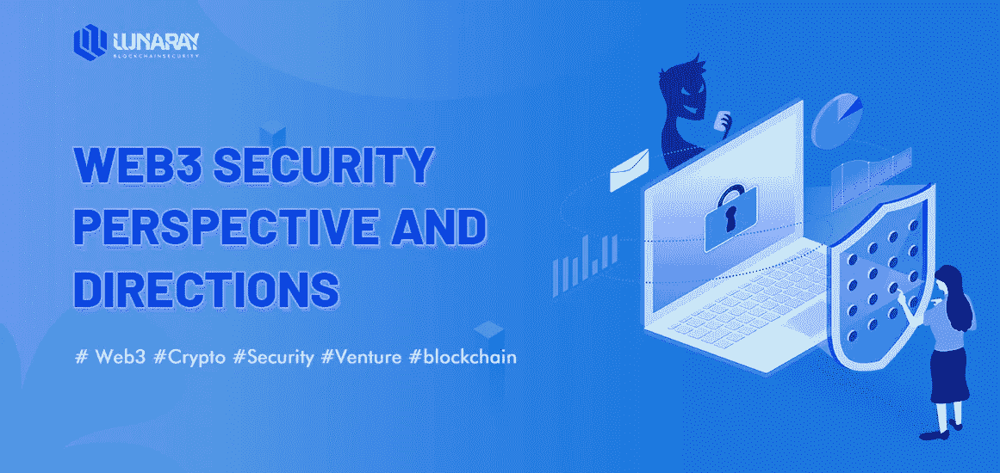
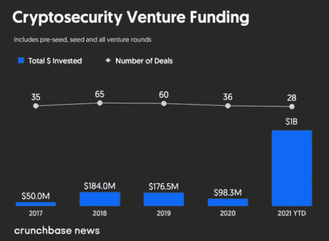
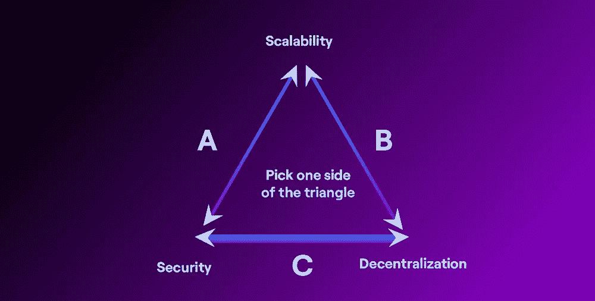

# Web3 安全视角和方向

> 原文：<https://medium.com/coinmonks/web3-security-perspective-and-directions-4dde746e5615?source=collection_archive---------5----------------------->

## 0x01 安全和注册技术

根据 Crunchbase 的数据，2021 年，VC 在(Security & Regtech)领域的投资已经超过 10 亿美元。注意，这个数字在 2020 年的风险投资总额中还不到 1 亿美元。

*Crunchbase*

随着加密市场引人注目，投资者开始关注安全性和合规性。

## 0x02 网络安全的发展

在 Web 1.0 和 Web 2.0 中，互联网安全随着应用架构的演进而改变，以协助构建新的互联网经济模式，在 Web 1.0 时代，SSL 由 Netscape Communications 率先提出，以提供用户的浏览器和这些服务器之间的安全通信。在 Web2.0 时代，比如**谷歌**、**微软**、**亚马逊**，他们在(TLS:传输层安全)中发挥了核心作用。从某种角度来说，TLS 是 SSL 的进化。

那么什么是 ***安全套接字层？***

SSL 代表安全套接字层，简而言之，它是保持互联网连接安全和保护在两个系统之间发送的任何敏感数据的标准技术，防止犯罪分子读取和修改任何传输的信息，包括潜在的个人详细信息。

TLS 基础。传输层安全性(TLS) **对通过互联网发送的数据进行加密，以确保窃听者和黑客无法看到您传输的内容**，这对于私人和敏感信息(如密码、信用卡号和个人信件)尤其有用。

Web3 的成功依赖于创新的模式，尤其是解决不同应用架构带来的新的安全挑战。在 Web3 中，dApps 的建立不依赖于 Web 2.0 中已有的传统应用逻辑和数据层；在 Web3 时代，区块链、网络节点和智能合约的模式管理逻辑和状态。

从用户的角度来看，仍然需要通过访问连接到这些节点的前端来进行交互和更新数据。一种场景是:发布新内容或购买 NFTs 等类似行为。这种类型的用户行为需要使用私钥来签署交易，私钥通常由钱包管理。这种模式是为了保护用户的控制和隐私。区块链的交易是完全透明的、公开的、不可改变的。

Web3 用户可以通过当前的模式保持对自己身份和数据所有权的控制，但也存在某些问题:例如，在发生攻击或严重危害的情况下，没有中介可以向新手用户提供求助(例如，Web 2.0 供应商将协助用户追回被盗资金或帮助您重置密码)。

在这个层面上，Web3 钱包仍然有机会泄露敏感信息；软件就是软件，总会有一定的漏洞和瑕疵。**因此，Web3 的成功取决于如何在安全层面进行创新，解决不同应用架构带来的新的安全挑战。**

在 Web 2.0 中，安全模型的一个非常重要的部分是**响应**。在 Web3 中，事务一旦执行就不能更改，所以安全性的思路通常是需要建立一个机制来验证事务是否应该具备安全的条件，然后再进行，也就是在防范方面安全性必须更好。

Web3 社区必须思考如何在技术上进行规划，解决系统性弱点，并预防和阻止针对**密码原语**和**智能合约漏洞**的新攻击载体。

## 0x03 **漏洞的真实数据来源**

一个真实的来源(SSOT)是**将来自组织内许多系统的数据聚集到一个位置的实践**。SSOT 不是一个系统、工具或战略，而是公司数据的一种状态，因为它可以通过单个参考点找到。

Web3 需要去中心化的数据对应工作，以消除信息不对称。目前，由于不完整(漏洞、暴露等。)信息分散在 SWC 注册表、Rekt、智能合同攻击向量和 DeFi 威胁矩阵中，Immunefi 运行了一个 bug 赏金程序，以更好地发现新的弱点。

## 0x04 **安全决策规范**

安全决策:**当决策基于恐惧而非事实**时。**风险管理**2015 年 7 月 15 日。分享一下。凯文比弗 2 分钟阅读。在任何一天，在大大小小的企业中，都会做出许多关于信息安全的决策。

在 Web3 中，关键的安全设计选择和事件决策模型仍在探索中。去中心化意味着没有人能对这些问题负全责，对用户的影响可能是巨大的。例如，最近的 **Log4j 漏洞**是对分散社区的安全问题的警告。

> 你可能会问什么是 Log4j 漏洞？

Log4j 漏洞使得恶意攻击者能够在任何目标计算机上远程执行代码。Log4j 是一个开源软件，是 Java 的日志库，被企业和门户网站广泛使用。本月早些时候，这个开源软件因其漏洞而成为新闻。

## 0x03 **认证和签名**

认证和数字签名通常被认为是两件不同的事情:认证是关于“登录”，而数字签名用于表达您对文档的同意，并批准交易。

当今市场上的大多数 dApps 都没有 API 响应的认证或签名。这意味着当用户的钱包从这些 DApps 中检索数据时，在验证这些响应是否来自预期的(真实而非伪造的)应用程序以及数据是否被篡改方面存在风险。

## 0x04 **用户控制密钥管理(KMC)**

简而言之，密钥控制指的是**您围绕物理密钥管理系统的流程，以及更广泛地说，您如何控制对关键资产、人员、信息和空间的访问**。密钥授予对贵组织最重要资源的访问权限；你应该毫不留情地保护他们。

管理私钥的复杂性和风险也是用户选择保管型钱包而非非保管型钱包的主要原因之一。但代管钱包的使用会导致新的现象:会产生新的“中间产品”，如**比特币基地**，不利于 Web3 完全去中心化的方向和理想；在一定程度上，这也将限制用户使用 Web3 提供所有优势的能力。理想情况下，进一步的安全创新将在非托管场景中为用户提供更好的可用性保护用户体验。

## 0x05 Web3。面对障碍

互操作性:虽然 Web 3 是关于拥有你钱包中的资产，而不是让它们受一个集中平台的支配，但是现在有一个小问题。其实区块链行业正在努力解决的核心问题之一。它被称为互操作性或**一个区块链与另一个**对话的能力。简而言之，这个问题总的来说还没有解决——在这方面还有很多工作要做。

## 可量测性

这是区块链技术的一个非常复杂的问题，**也是 Web 3 采用的一大阻碍**。这个问题在 2016 年首次浮出水面，当时一款名为“加密小猫”的游戏迅速走红。

游戏包括繁殖一些小猫，抚养它们，并与同伴交换。所有这些都发生在区块链上。但是有一天**这个游戏太受欢迎了，以太坊网络都被掐了**。汽油费(交易费)飙升，玩这个游戏变得太贵了。

这引发了关于 Web 3 中导致可伸缩性问题的讨论。事实上，以太坊的联合创始人维塔利克·布特林(Vitalik Buterin)提出了一个“可扩展性三难问题”。

可伸缩性 trilemma 说，出于安全性、去中心化和可伸缩性，在给定的时间点只能选择两个方面。

为了解决这个问题，许多区块链发展成为以太坊的 L2 或第 2 层解决方案。从广义上讲，这意味着**所有的中间交易都发生在这些 L2 区块链**上，而最终交易被提交给以太坊。这有助于卸载主区块链(以太坊)，保持事情在控制之中。

但这是有代价的。虽然 Polygon 具有可扩展性和安全性，但它不像以太坊那样分散。

类似地，许多其他区块链进化出了自我标榜为 ETH 杀手。这些区块链的例子有索拉纳，雪崩，泰拉，币安智能链等。

然而，**这些区块链中的每一个都为了达到规模而放弃了一个或另一个方面**。

**最终，Web3 的安全创新是在开放和开源的环境中进行的，在这样的场景中会出现有创意的解决方案。**

裁判员

[https://nas academy . com/blog/article/problems-with-web-3-is-it-a-fad](https://nasacademy.com/blog/article/problems-with-web-3-is-it-a-fad)

 [## SSL vs TLS -有什么区别？

### 编者按:本帖原载于 2016 年 7 月，现已由 GlobalSign 高级产品更新…

www.globalsign.com](https://www.globalsign.com/en/blog/ssl-vs-tls-difference)  [## 加密安全领域的风险投资比去年增长了 10 倍，这是因为该领域与…

### 当您将前所未有的网络安全投资与对以下领域日益高涨的兴趣结合起来时，您会得到什么

news.crunchbase.com](https://news.crunchbase.com/news/crypto-security-startups-vc-investment/) 

> [Learn 分发的内容。Block6.tech](https://learn.block6.tech)
> 
> 👉[电报](https://t.me/block6_tech) —新鲜想法
> 
> 👉[推特](https://twitter.com/block6_tech) —最新文章
> 
> 👉 [LinkTr.ee](https://linktr.ee/block6)
> 
> 加入 Coinmonks [电报频道](https://t.me/coincodecap)和 [Youtube 频道](https://www.youtube.com/c/coinmonks/videos)了解加密交易和投资

# 另外，阅读

*   [AscendEx Staking](https://coincodecap.com/ascendex-staking)|[Bot Ocean Review](https://coincodecap.com/bot-ocean-review)|[最佳比特币钱包](https://coincodecap.com/bitcoin-wallets-india)
*   [霍比评论](https://coincodecap.com/huobi-review) | [OKEx 保证金交易](https://coincodecap.com/okex-margin-trading) | [期货交易](https://coincodecap.com/futures-trading)
*   [网格交易机器人](https://coincodecap.com/grid-trading) | [Cryptohopper 审查](/coinmonks/cryptohopper-review-a388ff5bae88) | [Bexplus 审查](https://coincodecap.com/bexplus-review)
*   [7 个最佳零费用加密交易平台](https://coincodecap.com/zero-fee-crypto-exchanges)
*   [氹欞侊贸易评论](https://coincodecap.com/anny-trade-review) | [霍比保证金交易](/coinmonks/huobi-margin-trading-b3b06cdc1519)