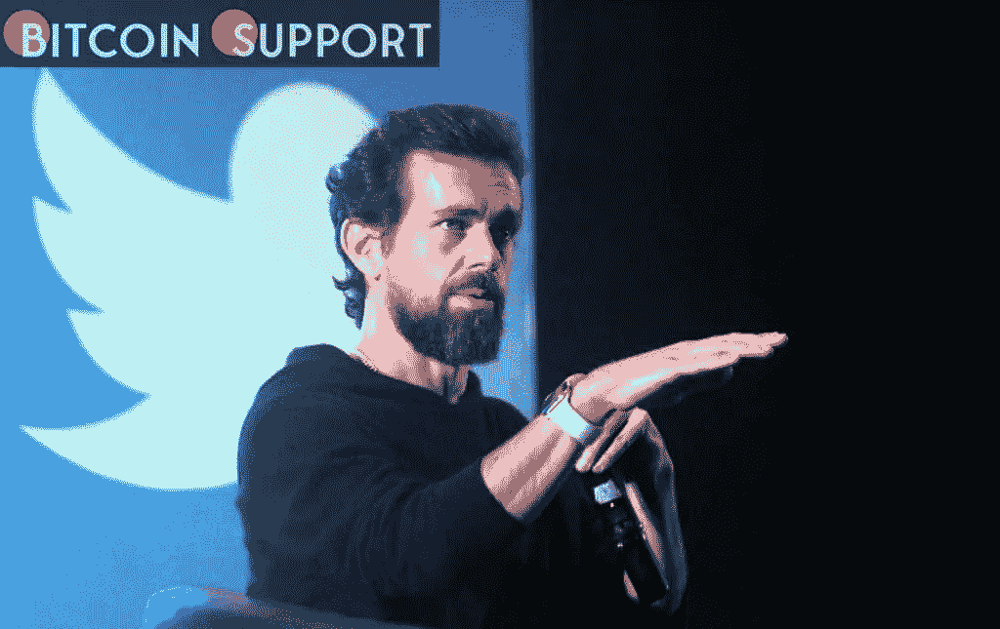

# Web3 不会由风险投资家杰克·多西经营

> 原文：<https://medium.com/coinmonks/web3-will-not-be-run-by-jack-dorsey-a-venture-capitalist-7c24ef719c9f?source=collection_archive---------71----------------------->

**Visit our website:-** [**https://bitcoinsupports.com/**](https://bitcoinsupports.com/)

这并不像杰克·多西把 Web3 描绘成一场针对老牌科技精英的风投政变那样直截了当，事情也可能不像他想的那样一目了然。以色列连续创业家 Ariel Shapira 在他的每月加密技术专栏中分析了加密、分散金融和区块链空间中的发展技术，以及它们在创造 21 世纪经济中的责任。

前 Twitter 首席执行官、比特币(BTC)爱好者杰克·多西并不喜欢 Web3，至少不喜欢它的宏伟愿景。他反复强调，用户不会拥有下一代互联网。相反，在区块链和 Web3 项目上投资数百万的风险投资基金将掌握控制权。然而，他们会成功吗？

按照惯例，事实并不像任何一方想让你相信的那样扭曲。简而言之，Web3 是一个没有像 Twitter 这样的集中平台的互联网的梦想。不同批评者提到的其他功能包括无处不在的监控的结束，更加分散化，人类和机器都可以理解的数据，以及 AR/VR 功能。但是，就其核心而言，Web3 运动似乎是要打倒大鱼。

毕竟，互联网，以其目前的状态和结构，在很多方面都是相当集中的。只有四家企业控制了全球约 70%的云基础设施，这些基础设施承载着数百万在线页面和应用。所有可识别的面孔都在入侵构成网络主干的关键基础设施。此外，正如脸书与澳大利亚新闻媒体的不和所证明的那样，Twitter 和脸书等平台在很大程度上集中了我们消费材料的方式，成为许多人进入更大网络的窗口。

根据杰克的说法，整个 Web 3.0 混乱类似于一场政变。一群被抛弃的人联合起来密谋推翻君主制，但他们只是为了自己的利益而行动。他们对普通人没有任何同情。如果他们赢了，除了悬挂在首都的旗帜之外，这个王国将基本保持不变。

**我们相信代码。**

web 3 里有什么是给中央集权王国的俗人看的吗？真相是困难的，一如既往。Web3 无疑是风险投资领域的一个热门话题。这个愿景不仅仅是 a16z 的作品。Iconium 是一家专注于数字资产和去中心化计划的私人投资公司，已经投资了 Secret 和 Terra 等网络，以及数十家其他大型和小型基金。2021 年，风险资本家总共向区块链企业投资了 330 亿美元，这个数字本身就说明了问题——但并不总是意味着权力。

在数字世界里，种瓜得瓜，种豆得豆。区块链爱好者喜欢争论代码就是法律，虽然加密社区并不总是遵循这一哲学，但它是一些最热情的支持者的战斗口号。论点是，代码是比任何中央实体更公平的法官，我们应该信任代码。

虽然这种观点可能有点简单，但这种对代码的关注值得进一步讨论。今天的用户受到广泛的监视，这是为他们使用的平台提供动力的编程的结果。脸书和 Twitter 服务的编码方式可以获取你的数据。另一方面，这个设计是基于一个特定的 Web2 商业模式:你的隐私是你为免费服务所付出的代价。另一方面，一个没有硬编码消费者监督的程序天生就无法监视它的用户。它也无法对它最初没有被设计去做的事情进行任何控制。而且，只要它在一个开放源代码的公共区块链上，人们就能自己检查它的局限性。那些不说 Solidity 的人仍然能够听到那些说 Solidity 的人的声音，因为开源社区总是充满有趣的对话和想法。

**投资的潮起潮落**

不要被骗了:风投不是为了帮助穷人；他们在寻求投资的良好回报。然而，问题是这些回报从何而来。在这方面，每个项目的情况都有所不同，但从最广泛的经济角度来看，区块链的举措都是象征性的。这并不总是一件好事，正如最近任何一场地毯拉锯战的受害者所证明的那样，但对风投来说，这本质上是他们赚钱的方式。他们通过购买代币向该计划投入资金，并在计划启动时获利。通常就是这么简单。多尔西的论文得到了一位风投的支持，他投资了一款针对老牌巨头的入侵性应用。是的，一个分散的应用程序(DApp)理论上和一个集中的应用程序一样具有侵入性。一个投资于隐私优先的开源项目并期望从中获利的风险资本家是不会成功的。除非他们投资的项目明确地向他们提供社区可以监控的东西，否则他们都不能在想象中的去中心化的未来互联网中积累任何形式的不成比例的影响力。

此外，投资的面貌正在发生变化。权力下放导致了分散自治组织(Dao)的形成，这些组织通常围绕着共同的愿景或投资而联合起来。本着类似的精神，像社交资产管理协议 dHEDGE 这样的项目允许普通投资者汇集他们的资金，并让他们在称职的经理或算法的监督下工作。这两种技术最终都会导致更加民主化和谨慎的投资，这与多尔西所倡导的正好相反。总的来说，Web3 的故事现在更多的是关于市场刺激和投机，而不是真正的技术天才和对更好的网络的推动，正如大目标和大词经常出现的情况。分析这样的东西而不落入其众多限定符中的任何一个都需要一定程度的怀疑，但寻找未经加工的钻石也是必要的。这正是投资者正在做的事情。Web3 基础可能永远不会有单一的结构性变化，但随着更多分散化项目的出现，为用户提供不仅仅是财务方面的真正价值，大型科技公司对互联网的控制可能真的会让位于一种新的范式，一种不会为我们提供更多相同东西的范式。

**访问我们的网站:-**[**【https://bitcoinsupports.com/】**](https://bitcoinsupports.com/)

**免责声明:这些是作者的观点，不应被视为投资建议。读者应该自己做研究。**

> 加入 Coinmonks [电报频道](https://t.me/coincodecap)和 [Youtube 频道](https://www.youtube.com/c/coinmonks/videos)了解加密交易和投资

# 另外，阅读

*   [Bookmap 评论](https://coincodecap.com/bookmap-review-2021-best-trading-software) | [美国 5 大最佳加密交易所](https://coincodecap.com/crypto-exchange-usa)
*   最佳加密[硬件钱包](/coinmonks/hardware-wallets-dfa1211730c6) | [Bitbns 评论](/coinmonks/bitbns-review-38256a07e161)
*   [新加坡十大最佳加密交易所](https://coincodecap.com/crypto-exchange-in-singapore) | [购买 AXS](https://coincodecap.com/buy-axs-token)
*   [红狗赌场评论](https://coincodecap.com/red-dog-casino-review) | [Swyftx 评论](https://coincodecap.com/swyftx-review) | [CoinGate 评论](https://coincodecap.com/coingate-review)
*   [投资印度的最佳密码](https://coincodecap.com/best-crypto-to-invest-in-india-in-2021)|[WazirX P2P](https://coincodecap.com/wazirx-p2p)|[Hi Dollar Review](https://coincodecap.com/hi-dollar-review)
*   [加拿大最佳加密交易机器人](https://coincodecap.com/5-best-crypto-trading-bots-in-canada) | [库币评论](https://coincodecap.com/kucoin-review)
*   [用于 Huobi 的加密交易信号](https://coincodecap.com/huobi-crypto-trading-signals) | [HitBTC 审查](/coinmonks/hitbtc-review-c5143c5d53c2)
*   [如何在 FTX 交易所交易期货](https://coincodecap.com/ftx-futures-trading) | [OKEx vs 币安](https://coincodecap.com/okex-vs-binance)