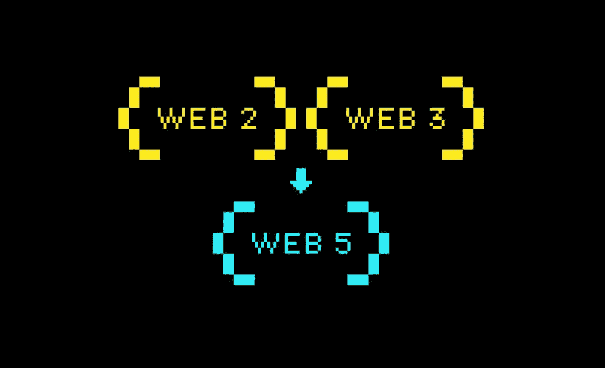
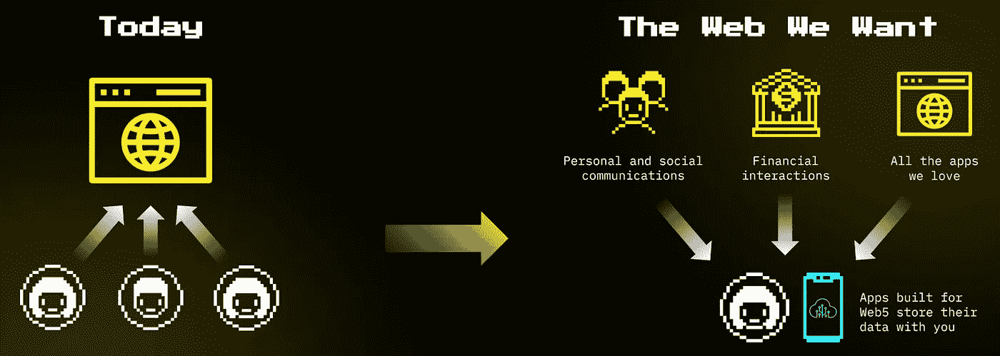
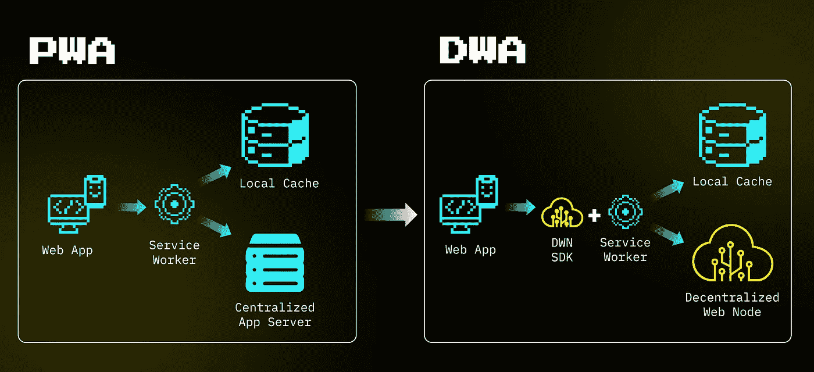

# Web5 是元宇宙和互联网的真正未来

> 原文：<https://medium.com/coinmonks/web5-is-the-real-future-of-metaverse-and-the-internet-d906b44f3a9a?source=collection_archive---------15----------------------->

WEB5 combines the advantages of WEB2 (Big Data) and WEB3 (Decentralization)

杰克·多西宣布了一个新的分散式网络平台 Web5，它将在 Web2(网络应用)和 Web3(区块链)技术的基础上进行改进，成为 Web5 平台。MetaIncubator 看到了 Web3 技术的局限性，并已经在与朝这个方向发展的初创公司合作。对于正在构建拥有大量数据和跨链、跨元宇宙功能的应用的初创公司，你可能会考虑 Web5 架构。

**背景:Web5 及以后**

区块链(Web3)的可伸缩性是我最近关注的问题之一。众所周知，把所有东西都放在区块链上效率太低。甚至今年一些大的秘密事件(比如无聊的猿卖地)也让大多数区块链崩溃了，比如以太坊和索拉纳。Jack 和他的团队提供了一个关于如何分散数据的非常好的解决方案。它不仅将提高效率，而且将最终实现我们的数据应该属于我们，而不是集中的网络的原则。

在架构上，Web5 有三个元素:分散标识符(did)、分散 Web 节点(dwn)和分散 Web 应用(DWA)。目前，当使用 web 应用程序时，用户、用户数据和应用程序本身这三个要素都包含在软件公司内部。例如，当您使用 Gmail 时，您的用户帐户(ID)、数据(电子邮件)和应用程序(Gmail)都属于谷歌，并存储在其服务器上。

Blockchain changed the way how we store data and “money” on the internet

【Web3 的现状

在区块链的 Web3 中，用户 ID 由两部分组成:私钥和公钥。私钥在钱包里，但公钥或钱包地址存储在区块链(公共地址)里。数据(您的交易或余额)和应用程序(智能合约)都存储在区块链中，并在每个完整节点中复制。

在这种模式下，用户拥有自己的数据，但处理速度和燃气费用有限。每次你写信给区块链，你都需要付煤气费。举个简单的例子，在区块链存储你所有的邮件/聊天记录是非常昂贵的。

**展望 Web5**

Web5 DIDs 利用数字签名不仅用于您的身份，还用于您所有数据的清单。这就是为什么它们被称为*标识符*，而不是*身份*。你的每个数据集，比如音乐播放列表和银行交易，都会有标识符。然而，数据需要结构化。对于每个不同的数据集，杰克建议使用 Schema.org 来组织你的数据，这样所有的网络应用程序都能够正确地读取你的数据。

例如，现在你可以将邮件从 Gmail 转移到 Outlook，但这只是从一个中央数据库转移到另一个。然而，由于它们都遵循相同的电子邮件模式，你在另一个应用程序上阅读电子邮件没有问题。所有这些数据都由所有者(您)进行了数字签名和加密，因此这些数据属于您是安全的、可靠的和可验证的。它们被称为可验证凭证(VCs)。

> 交易新手？试试[加密交易机器人](/coinmonks/crypto-trading-bot-c2ffce8acb2a)或者[复制交易](/coinmonks/top-10-crypto-copy-trading-platforms-for-beginners-d0c37c7d698c)

在未来，你甚至不需要进行电子邮件迁移，因为它可以在任何电子邮件应用程序上运行(DWA)。在 Web5 中，您的电子邮件将存储在 DWNs 中，当您处理电子邮件时，DWAs (Gmail，Outlook)将在您的授权下动态读取您的数据。你真正拥有你的数据，你可以随时切换到任何其他 DWA。

Blockchain provides the security that we can decentralize our data

【Web5 的实际考虑

对于用户身份，杰克的 Web5 平台使用 W3C 的 DID 标准和 ION network，这是一个分散的标识符网络，作为第二层建立在顶级比特币区块链上。它仅使用比特币钱包地址空间来生成身份，并且它没有使用任何比特币进行转移。生成地址是免费的，就像现在创建元掩码钱包一样。

MetaIncubator 与优秀的 Web5 就绪型初创公司合作过。我们总是在为未来而建设。我好骄傲 Hypersign([https://Hypersign . id](https://hypersign.id))。它是我们目前正在孵化的创业公司之一，在过去的两年里，它已经根据 W3C 规范构建了 DID 基础设施软件，Jack 也遵循了这一规范。事实上，该架构非常先进，可以兼容杰克·多西提出的 Web5 架构。它拥有自己的区块链，支持更先进的区块链间通信协议(IBC)，因此它也可以与大多数区块链一起工作。更多内容请见下一篇博客。

MetaIncubator 与强大的技术创始人合作，帮助他们进行产品市场匹配和财务规划，以便他们走上正确的发展道路。