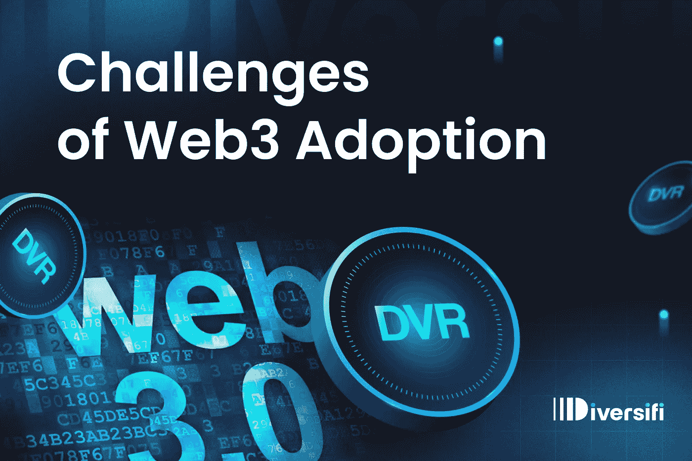

# 采用 Web3 的挑战(第 1 部分，共 2 部分)

> 原文：<https://medium.com/coinmonks/website-and-medium-c9be832ac96e?source=collection_archive---------6----------------------->

Web3 仍处于起步阶段。就像 Web2 和“网络”(又名“Web1”)，它被认为是需要知识、时间和资源来参与的事情。

在这篇文章中，我们将讨论 Web3 在接纳新用户时面临的一些问题。

## **使用 Web3 时的主要问题**

在与许多人交谈后，包括一些对 Web3 和 crypto 作为一个整体提供了非常负面反馈的人，Guy 确定了阻止 Web3 项目广泛采用的三组主要问题:可访问性、安全性和教育。

## **无障碍**

访问 Web3 平台是极度隔离的。根据您居住的地方、使用的银行或使用的设备，您可能会也可能不会与某些 Web3 项目、令牌或 dapps 进行交互。

这与互联网的起源非常相似，你拥有的设备、你的 ISP、你的物理位置和其他环境因素在很大程度上控制了你可以体验的网络部分。再加上语言和文化障碍，世界上很少有人能真正接触到有意义的应用和内容。

即使世界各地的条件有所改善，并且“Web2.0”开始出现，但访问仍然受到浏览器版本、技术支持、位置和金融手段(你拥有哪张信用卡)的限制。

有了 Web3，我们可以看到不同技术、协议、钱包和链条的不和谐阻碍了无缝采用的道路。此外，国家/州/金融壁垒限制甚至惩罚了某些项目的准入。

## **安全**

公司一步一步地缩小了 Web2 安全性的差距。网络标准已经达成一致，浏览器已经与标准接轨，支付方式已经标准化，焦虑程度已经开始下降。SSL 安全已成为规范，双因素身份验证已成为保护访问的推荐方法。

Web3 仍然没有非常安全的标准。用户依靠他们的钱包来保护他们的私钥，并通过集中的公司(如 Infura)连接到区块链。这些钱包中有许多是浏览器扩展，带来了固有的安全挑战。

但是，即使在钱包和访问之外，区块链也是一个丛林:未经审查和审计的合同，未经核实的运营商随时准备掠夺你辛辛苦苦挣来的 ETH，还有许多陷阱，让 Web3 dapps 感觉像是狂野的西部。

## **教育**

人们花了一段时间才学会使用网络。在标准的 web 浏览器和始终连接的设备出现之前，您必须知道如何物理连接到互联网，以及如何使用 ISP 允许您使用的封闭应用程序集。

即使当浏览器成为标准时，你也必须学会如何使用它们，如何浏览，如何输入新地址等等。后来，你学会了如何搜索，如何审查搜索结果，如何避免骗局，等等。

Web3 本来就更复杂。它迫使用户了解许多关于区块链理论、智能合约、钱包、协议、令牌估值……这个清单还在继续……完全可以理解为什么有些人会感到沮丧并放弃，或者只是说“这都是一个大骗局”并走开，进入门槛如此之高。

在下一篇文章中，我们将讨论消除或至少减轻 Web3 带来的挑战的可能的最佳实践方法。

## **关于 Diversifi**

Diversifi 是一个开源协议，提供跨链和链外流动性的访问，以支持构建安全、用户友好和可互操作的分散式应用程序。

*在这里* *了解更多关于 Diversifi 协议的信息并尝试 Diversifi 的 dapps* [*。*](http://www.diversi.fi)

> 加入 Coinmonks [电报频道](https://t.me/coincodecap)和 [Youtube 频道](https://www.youtube.com/c/coinmonks/videos)了解加密交易和投资

# 另外，阅读

*   [Bitsgap 审查](/coinmonks/bitsgap-review-a-crypto-trading-bot-that-makes-easy-money-a5d88a336df2) | [Quadency 审查](/coinmonks/quadency-review-a-crypto-trading-automation-platform-3068eaa374e1) | [Bitbns 审查](/coinmonks/bitbns-review-38256a07e161)
*   [加密复制交易平台](/coinmonks/top-10-crypto-copy-trading-platforms-for-beginners-d0c37c7d698c) | [Coinmama 评论](/coinmonks/coinmama-review-ace5641bde6e)
*   [印度的加密交易所](/coinmonks/bitcoin-exchange-in-india-7f1fe79715c9) | [比特币储蓄账户](/coinmonks/bitcoin-savings-account-e65b13f92451)
*   [OKEx vs KuCoin](https://coincodecap.com/okex-kucoin) | [摄氏替代品](https://coincodecap.com/celsius-alternatives) | [如何购买 VeChain](https://coincodecap.com/buy-vechain)
*   [币安期货交易](https://coincodecap.com/binance-futures-trading)|[3 commas vs Mudrex vs eToro](https://coincodecap.com/mudrex-3commas-etoro)
*   [如何购买 Monero](https://coincodecap.com/buy-monero) | [IDEX 评论](https://coincodecap.com/idex-review) | [BitKan 交易机器人](https://coincodecap.com/bitkan-trading-bot)