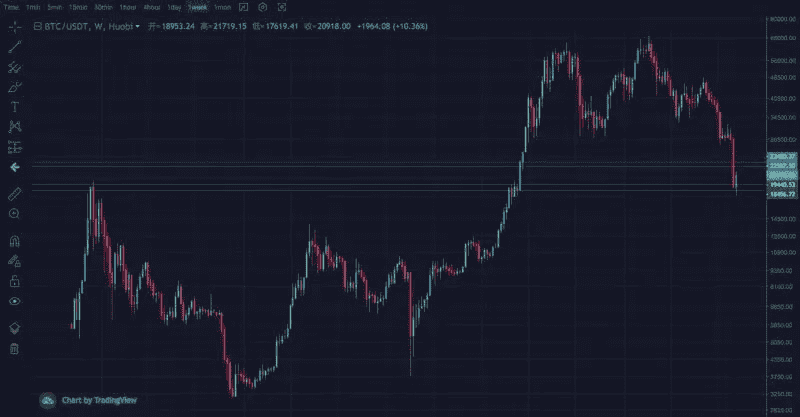
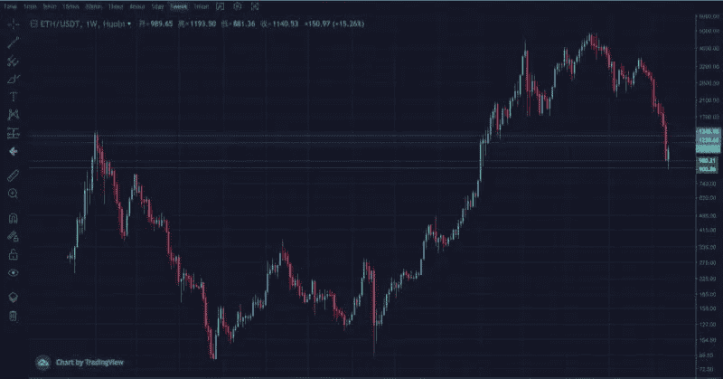
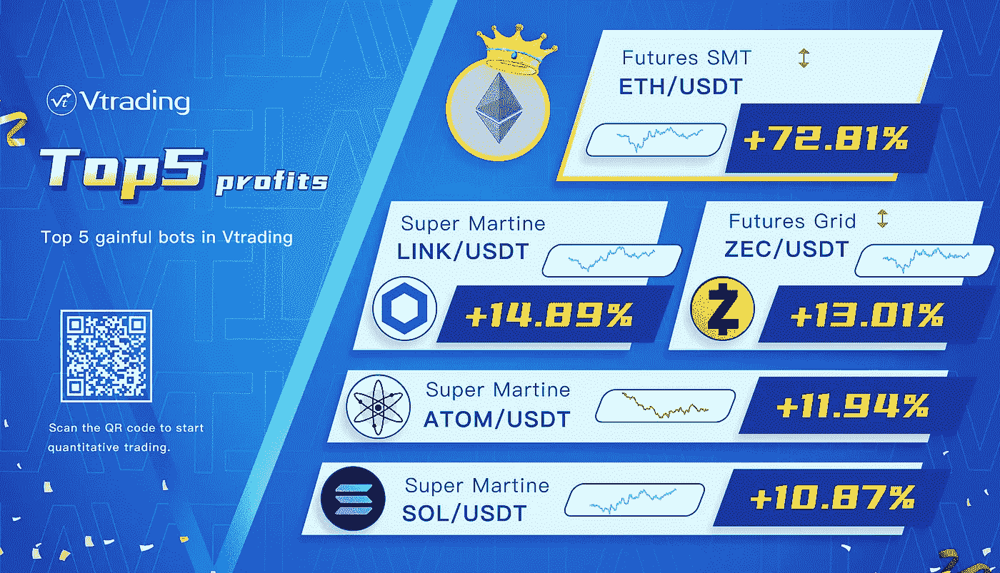

# 2022 年 6 月加密投资周分析

> 原文：<https://medium.com/coinmonks/weekly-analyze-of-crypto-investing-in-june-2022-6f79d4dfd91d?source=collection_archive---------59----------------------->

**日期:2022 年 6 月 20 日—2022 年 6 月 24 日**

本周，加密市场在加速下跌和恐慌性抛售后经历了超卖反弹。

BTC 顺势突破周线 20000 美元关口，随后再度收复失地。日线阴阳柱交替，震荡走高。目前，多头占据优势。注意左侧盘整区的盘整区是否有突破，这对后续结构的构建更为关键。支撑区间 18500–19500，压力区间 22500–23500。

ETH 收复了近 50%的周跌幅，交易量大幅增加，市场上出现了针棒。阴后有收阳的预期，但趋势上还是有惯性下跌。日线两次被阳柱反转，结构低位盘整。关键水平是 1050，支撑范围是 900–1000，压力范围是 1250–1400。

Vtrading 是一个加密交易平台，为每个交易者提供智能硬币交易策略。如果你正在使用 Vtrading 智能加密交易机器人，建议现货市场使用 Grid 和 Martin 策略，期货市场使用 SMT 策略。

(仅供参考，请理性投资)

> 加入 Coinmonks [电报频道](https://t.me/coincodecap)和 [Youtube 频道](https://www.youtube.com/c/coinmonks/videos)了解加密交易和投资

# 另外，阅读

*   [加密货币储蓄账户](/coinmonks/cryptocurrency-savings-accounts-be3bc0feffbf) | [加密交易机器人](/coinmonks/crypto-trading-bot-c2ffce8acb2a)
*   [BigONE 交易所评论](/coinmonks/bigone-exchange-review-64705d85a1d4) | [CEX。IO 审查](https://coincodecap.com/cex-io-review) | [交换区审查](/coinmonks/swapzone-review-crypto-exchange-data-aggregator-e0ad78e55ed7)
*   [最佳比特币保证金交易](/coinmonks/bitcoin-margin-trading-exchange-bcbfcbf7b8e3) | [比特币保证金交易](https://coincodecap.com/bityard-margin-trading)
*   [加密保证金交易交易所](/coinmonks/crypto-margin-trading-exchanges-428b1f7ad108) | [赚取比特币](/coinmonks/earn-bitcoin-6e8bd3c592d9)
*   [WazirX vs coin dcx vs bit bns](/coinmonks/wazirx-vs-coindcx-vs-bitbns-149f4f19a2f1)|[block fi vs coin loan vs Nexo](/coinmonks/blockfi-vs-coinloan-vs-nexo-cb624635230d)
*   [BlockFi 信用卡](https://coincodecap.com/blockfi-credit-card) | [如何在币安购买比特币](https://coincodecap.com/buy-bitcoin-binance)