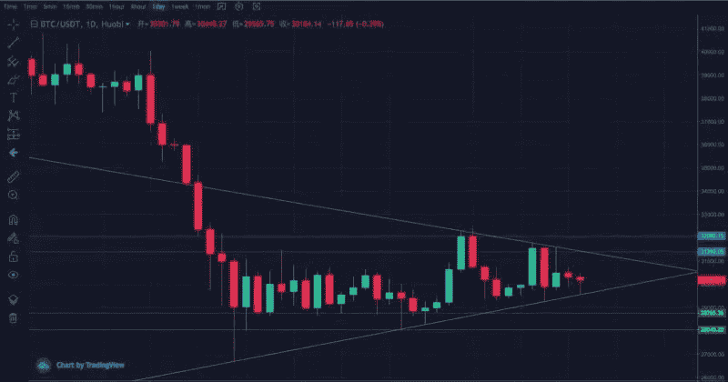
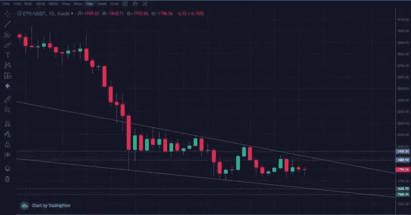
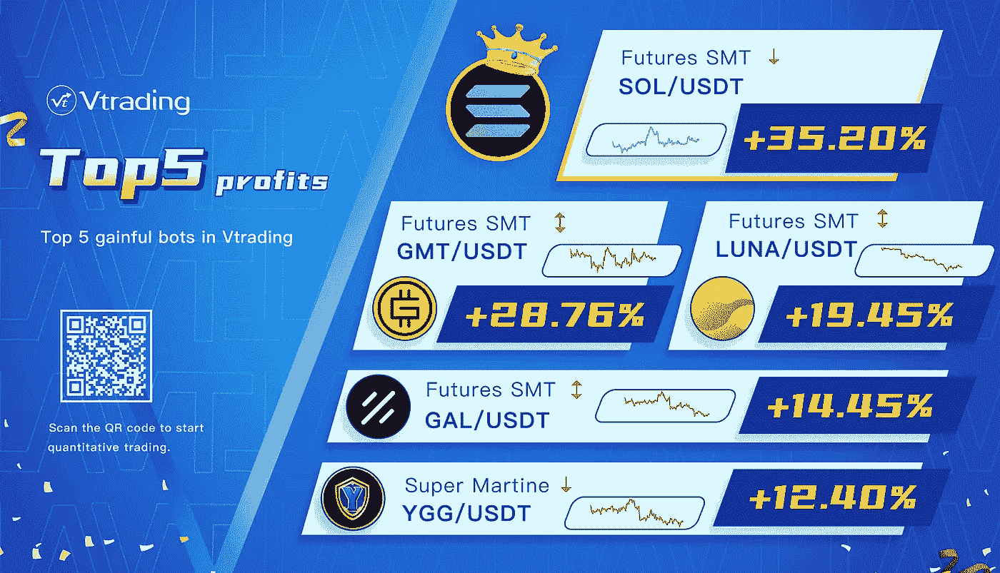

# 2022 年 6 月加密投资周分析

> 原文：<https://medium.com/coinmonks/weekly-analyze-of-crypto-investing-in-june-2022-9e2c11b55294?source=collection_archive---------60----------------------->

**日期:2022 年 6 月 6 日—2022 年 6 月 10 日**

本周，密码市场处于顶部形态。

在周线量价背离的情况下，BTC 没有破新低，继续小幅反弹。再次受到 MA120 的阻击，日线第二波段小于上一波段，量能同步减弱。三角形收敛的终点接近方向选择，关键位是 29200 和 31300。支撑区间 28000–28700，压力区间 31600–32200。

ETH 周线围绕 MA120 窄幅震荡，有跳空反弹趋势。日线前带低点区域箱体整理，下降通道二次收敛待破。支撑区间 1550–1600，压力区间 1900–2000。

# **Vtrading.com 前五大利润**

Vtrading 是一个加密交易平台，为每个交易者提供智能硬币交易策略。如果你正在使用 Vtrading 智能加密交易机器人，建议现货市场使用 Grid 和 Martin 策略，期货市场使用 SMT 策略。

(仅供参考，请理性投资)

> 加入 Coinmonks [电报频道](https://t.me/coincodecap)和 [Youtube 频道](https://www.youtube.com/c/coinmonks/videos)了解加密交易和投资

# 另外，阅读

*   [印度的加密交易所](/coinmonks/bitcoin-exchange-in-india-7f1fe79715c9) | [比特币储蓄账户](/coinmonks/bitcoin-savings-account-e65b13f92451)
*   [OKEx vs KuCoin](https://coincodecap.com/okex-kucoin) | [摄氏替代品](https://coincodecap.com/celsius-alternatives) | [如何购买 VeChain](https://coincodecap.com/buy-vechain)
*   [币安期货交易](https://coincodecap.com/binance-futures-trading)|[3 comas vs Mudrex vs eToro](https://coincodecap.com/mudrex-3commas-etoro)
*   [如何购买 Monero](https://coincodecap.com/buy-monero) | [IDEX 评论](https://coincodecap.com/idex-review) | [BitKan 交易机器人](https://coincodecap.com/bitkan-trading-bot)
*   [CoinDCX 评论](/coinmonks/coindcx-review-8444db3621a2) | [加密保证金交易交易所](https://coincodecap.com/crypto-margin-trading-exchanges)