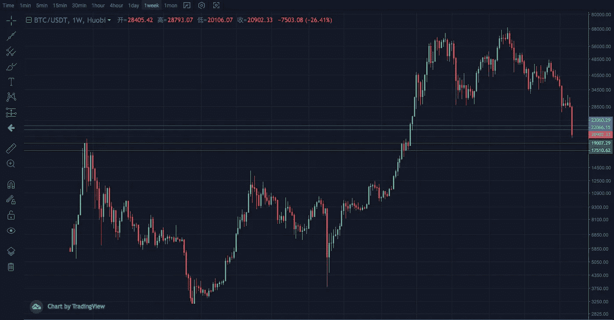
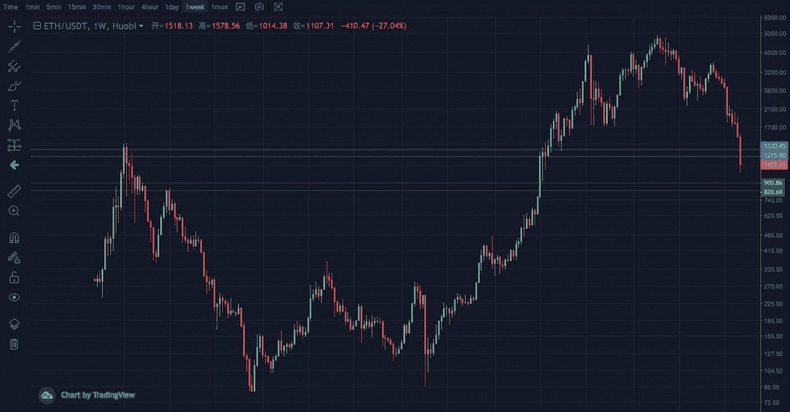
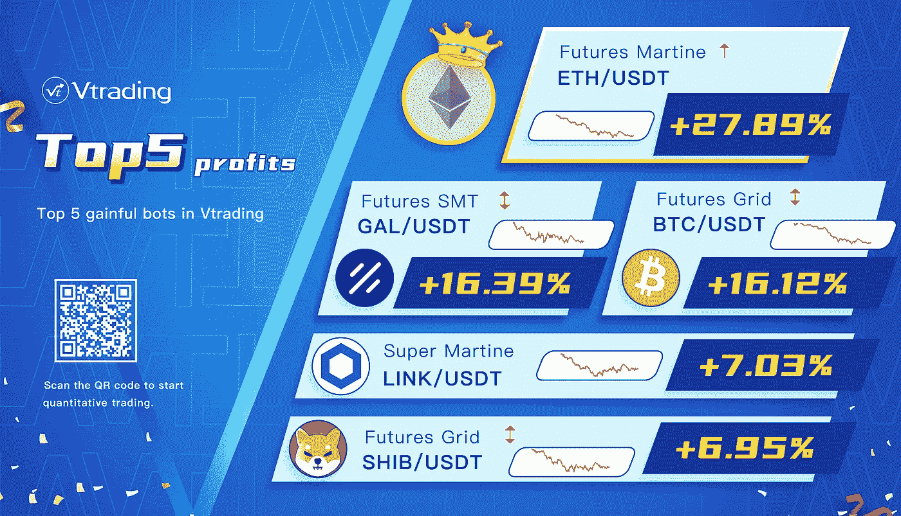

# 2022 年 6 月加密投资周分析

> 原文：<https://medium.com/coinmonks/weekly-analyze-of-crypto-investing-in-june-2022-a5d4697d5224?source=collection_archive---------50----------------------->

**日期:2022 年 6 月 13 日—2022 年 6 月 17 日**

本周，加密市场崩溃，并继续下降趋势。

BTC 周线放量加速下跌，日线收敛形态选择下行。到达 20000 关口的心理支撑位后，多空争夺加剧，长上影线开始频繁。在多空比逐渐上升的前提下，一旦市场再次破位，就会出现大量的恐慌盘。支撑区间为 17500–18500，压力区间为 22000–23000。

周线 ETH 线有所回落，击穿 2017 年高点。目前跌幅已经超过上周的 20%。日线双针见底。虽然跌势有所缓解和逆转，但在突破 1300 的波段高点之前，原有趋势不会改变。支撑范围是 800–900，压力范围是 1200–1300。

Vtrading Top 5 trading bots this week

Vtrading 是一个加密交易平台，为每个交易者提供智能硬币交易策略。如果你正在使用 Vtrading 智能加密交易机器人，建议现货市场使用 Grid 和 Martin 策略，期货市场使用 SMT 策略。

(仅供参考，请理性投资)

> 加入 Coinmonks [电报频道](https://t.me/coincodecap)和 [Youtube 频道](https://www.youtube.com/c/coinmonks/videos)了解加密交易和投资

# 另外，阅读

*   [AscendEx Staking](https://coincodecap.com/ascendex-staking)|[Bot Ocean Review](https://coincodecap.com/bot-ocean-review)|[最佳比特币钱包](https://coincodecap.com/bitcoin-wallets-india)
*   [霍比审核](https://coincodecap.com/huobi-review) | [OKEx 保证金交易](https://coincodecap.com/okex-margin-trading) | [期货交易](https://coincodecap.com/futures-trading)
*   [网格交易机器人](https://coincodecap.com/grid-trading) | [Cryptohopper 审查](/coinmonks/cryptohopper-review-a388ff5bae88) | [Bexplus 审查](https://coincodecap.com/bexplus-review)
*   [7 个最佳零费用加密交易平台](https://coincodecap.com/zero-fee-crypto-exchanges)
*   [氹欞侊贸易评论](https://coincodecap.com/anny-trade-review) | [火币保证金交易](/coinmonks/huobi-margin-trading-b3b06cdc1519)
*   [分散交易所](https://coincodecap.com/what-are-decentralized-exchanges) | [比特 FIP](https://coincodecap.com/bitbns-fip) | [Pionex 评论](https://coincodecap.com/pionex-review-exchange-with-crypto-trading-bot)