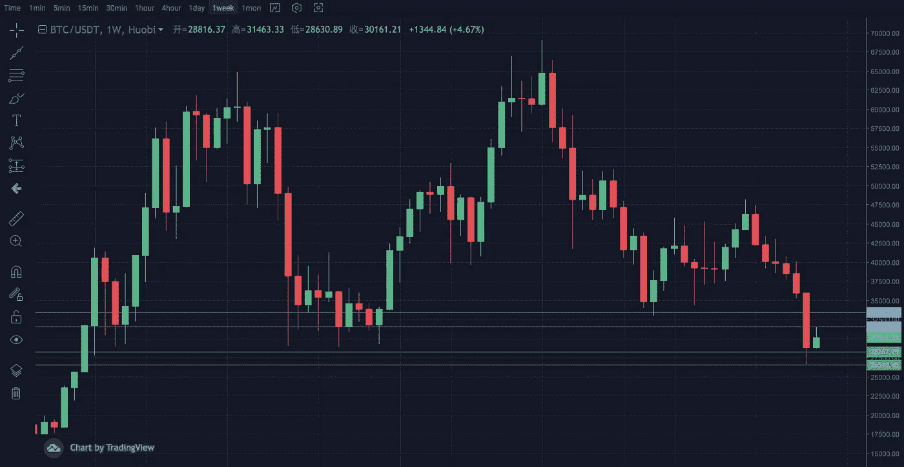
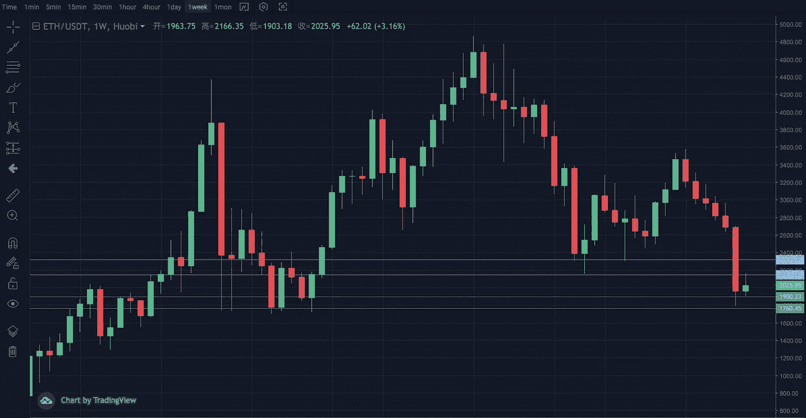
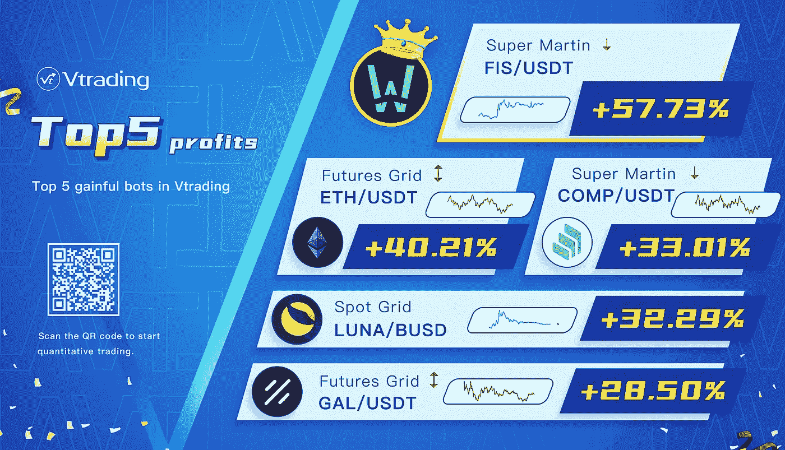

# 5 月份加密投资周分析

> 原文：<https://medium.com/coinmonks/weekly-analyze-of-crypto-investing-in-may-6ab3bf5f1f84?source=collection_archive---------69----------------------->

**日期:2022 年 5 月 16 日—2022 年 5 月 20 日**

本周，crypto 市场的快速下跌已经告一段落，市场进入修复阶段。但市场情绪仍处于恐慌之中。

BTC WEEKLY LINE

BTC 周线目前显示八连阴。走势仍未摆脱前期下影线的局部压制。28500–31500 区间内，日线在 30000 附近交替震荡。结构突破可以引起一波小趋势的延续。支撑区间 26500–28000，压力区间 32500–34000。

ETH WEEKLY LINE

由于上周 ETH 走出了补跌，且走势弱于大盘。日线二次探底的迹象也更加明显。但还是需要等一等，看能不能止跌。条件是突破 2150 波段高点构筑潜在双底形态。支撑范围是 1650–1800，压力范围是 2200–2350。

Vtrading crypto trading strategy

建议现货采用网格和马丁策略，期货采用 SMT 策略。

*(仅供参考，请理性投资)*

> 加入 Coinmonks [电报频道](https://t.me/coincodecap)和 [Youtube 频道](https://www.youtube.com/c/coinmonks/videos)了解加密交易和投资

# 另外，阅读

*   [3 商业评论](/coinmonks/3commas-review-an-excellent-crypto-trading-bot-2020-1313a58bec92) | [Pionex 评论](https://coincodecap.com/pionex-review-exchange-with-crypto-trading-bot) | [Coinrule 评论](/coinmonks/coinrule-review-2021-a-beginner-friendly-crypto-trading-bot-daf0504848ba)
*   [莱杰 vs n rave](/coinmonks/ledger-vs-ngrave-zero-7e40f0c1d694)|[莱杰 nano s vs x](/coinmonks/ledger-nano-s-vs-x-battery-hardware-price-storage-59a6663fe3b0) | [币安评论](/coinmonks/binance-review-ee10d3bf3b6e)
*   [Bybit Exchange 评论](/coinmonks/bybit-exchange-review-dbd570019b71) | [Bityard 评论](https://coincodecap.com/bityard-reivew) | [Jet-Bot 评论](https://coincodecap.com/jet-bot-review)
*   [3 commas vs crypto hopper](/coinmonks/3commas-vs-pionex-vs-cryptohopper-best-crypto-bot-6a98d2baa203)|[赚取秘密利息](/coinmonks/earn-crypto-interest-b10b810fdda3)
*   最好的比特币[硬件钱包](/coinmonks/hardware-wallets-dfa1211730c6) | [BitBox02 回顾](/coinmonks/bitbox02-review-your-swiss-bitcoin-hardware-wallet-c36c88fff29)
*   [BlockFi vs 摄氏](/coinmonks/blockfi-vs-celsius-vs-hodlnaut-8a1cc8c26630) | [Hodlnaut 点评](/coinmonks/hodlnaut-review-best-way-to-hodl-is-to-earn-interest-on-your-bitcoin-6658a8c19edf) | [KuCoin 点评](https://coincodecap.com/kucoin-review)