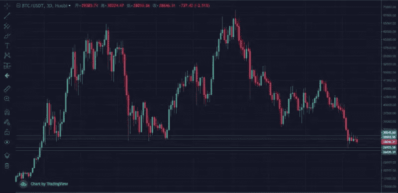
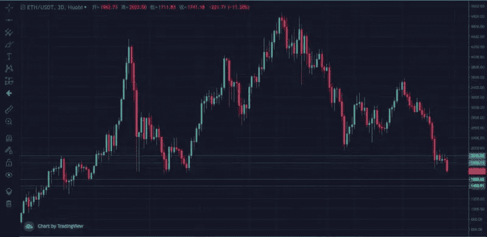
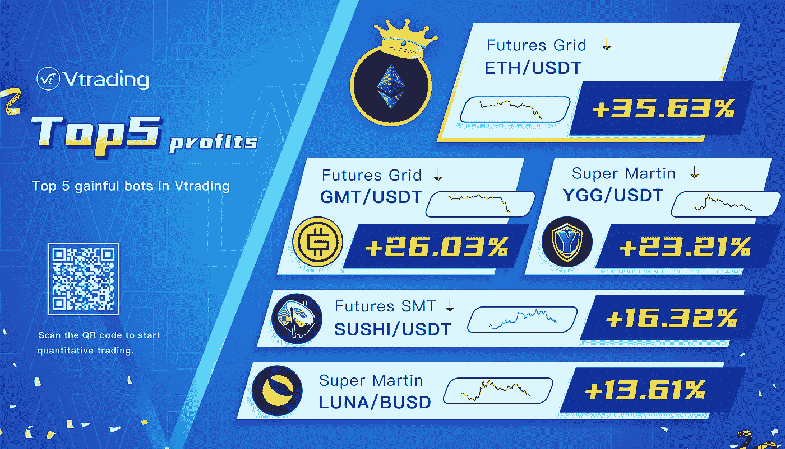

# 5 月份加密投资周分析

> 原文：<https://medium.com/coinmonks/weekly-analyze-of-crypto-investing-in-may-c99ce1d51b49?source=collection_archive---------64----------------------->

**日期:2022 年 5 月 23 日—2022 年 5 月 27 日**

本周，加密市场下跌，并再次被削弱。

BTC WEEKLY LINE

BTC 周线震荡下跌。前影继续下探，日线区间弱势盘整。波动幅度进一步缩小。在收敛模式结束时崩溃的可能性更大。支撑范围是 26000–27000，压力范围是 30000–30500。

ETH WEEKLY LINE

ETH 周线再创新低。虽然市场目前处于前一波低点 1700 点附近，市场有所反复，但下跌依然存在。日线上突破 1900 低点后，转为后期反弹的第一阻力位。支撑范围是 1500- 1600，压力范围是 1900-2050。

本周 Vtrading crypto 交易平台前 5 名收益。最上面的是 35.63%，用期货网格做空 ETH

如果你正在使用 Vtrading 智能加密交易机器人，建议现货市场使用 Grid 和 Martin 策略，期货市场使用 SMT 策略。

(仅供参考，请理性投资)

> *加入 Coinmonks* [*电报频道*](https://t.me/coincodecap) *和* [*Youtube 频道*](https://www.youtube.com/c/coinmonks/videos) *了解加密交易和投资*

# 另外，阅读

*   [3 商业评论](/coinmonks/3commas-review-an-excellent-crypto-trading-bot-2020-1313a58bec92) | [Pionex 评论](https://coincodecap.com/pionex-review-exchange-with-crypto-trading-bot) | [Coinrule 评论](/coinmonks/coinrule-review-2021-a-beginner-friendly-crypto-trading-bot-daf0504848ba)
*   [莱杰 vs n rave](/coinmonks/ledger-vs-ngrave-zero-7e40f0c1d694)|[莱杰 nano s vs x](/coinmonks/ledger-nano-s-vs-x-battery-hardware-price-storage-59a6663fe3b0) | [币安评论](/coinmonks/binance-review-ee10d3bf3b6e)
*   [Bybit Exchange 审查](/coinmonks/bybit-exchange-review-dbd570019b71) | [Bityard 审查](https://coincodecap.com/bityard-reivew) | [Jet-Bot 审查](https://coincodecap.com/jet-bot-review)
*   [3 commas vs crypto hopper](/coinmonks/3commas-vs-pionex-vs-cryptohopper-best-crypto-bot-6a98d2baa203)|[赚取加密利息](/coinmonks/earn-crypto-interest-b10b810fdda3)
*   最好的比特币[硬件钱包](/coinmonks/hardware-wallets-dfa1211730c6) | [BitBox02 回顾](/coinmonks/bitbox02-review-your-swiss-bitcoin-hardware-wallet-c36c88fff29)
*   [BlockFi vs 摄氏](/coinmonks/blockfi-vs-celsius-vs-hodlnaut-8a1cc8c26630) | [Hodlnaut 点评](/coinmonks/hodlnaut-review-best-way-to-hodl-is-to-earn-interest-on-your-bitcoin-6658a8c19edf) | [KuCoin 点评](https://coincodecap.com/kucoin-review)