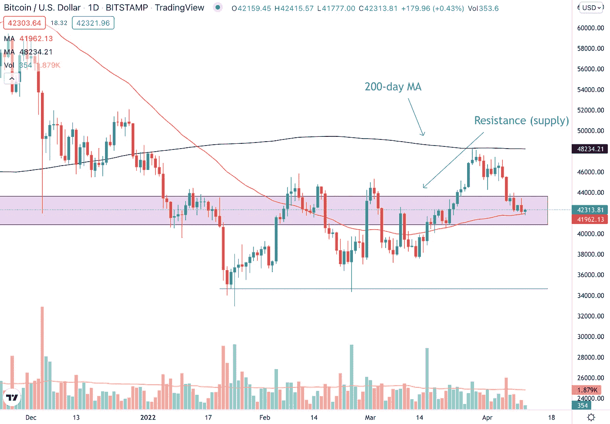

# 每周加密技术分析(4 月 11 日至 15 日)

> 原文：<https://medium.com/coinmonks/weekly-crypto-technical-analysis-11th-15th-april-cd7577f3dbf8?source=collection_archive---------74----------------------->

Weekly Crypto Technical Analysis (11th — 15th April)

2022 年 4 月 11 日

你好，密码专家，

10 年期美国国债收益率上周触及 3 年高点。华尔街经历了失败的一周，科技股尤其受到重创。比特币 2022 于上周举行，一些知名人士发表了演讲，如迈克尔·塞勒、彼得·泰尔和凯西·伍德等。

让我们来看看上周我们观察名单上的加密程序的表现。

(如果你有一种加密货币想让我在这个每周观察列表中查看，请对文章发表评论。)

**比特币(BTC)**

Will Bitcoin (BTC) find support at the previous resistance and at the 50-day moving average?

比特币较上周下跌 9.20%，目前处于前期阻力(供给)区。在过去一个月飙升超过 28%之后，正如我们在[的上一篇文章](/aqx-official/weekly-crypto-technical-analysis-4th-8th-april-137c4beb016f)中提到的，下跌 5-10%是很自然的。

BTC 目前处于一个重要的价格水平，之前的阻力(现在是支撑)区域和 50 天移动平均线都位于这个价格区域。如果我们要看到比特币进一步上涨，我们希望看到加密货币在这个价格区域保持不变。

**以太坊**

Ethereum (ETH) is currently trading in a range between $3150-$3300.

200 日均线已被证明是以太坊的阻力。ETH 上周达到移动平均线时下跌了 9.03%，4 月 6 日交易时段的交易量高于平均水平，并伴随着一个大红色(熊市)烛台。

截至本文撰写时，以太坊正在 3150 美元至 3300 美元的短期区间内交易。在 4 月 8 日和 10 日的交易时段，ETH 肯定会有额外的供应。也就是说，买家目前也支持 ETH 在 3165 美元的价格水平。阻力或支撑的突破将会给我们以太坊下一个短期到中期方向的线索。

**特拉(露娜)**

Terra (LUNA) has erased all of its gains and have moved back below the breakout level at $95.

自 3 月 28 日突破以来，LUNA 已经收复了所有的涨幅。加密货币的涨幅高达 23%，但连续三个交易日(4 月 6 日至 8 日)高于平均水平的成交量抹去了这些涨幅。

LUNA 正在 50 天移动平均线处寻找一些支撑，如果 LUNA 设法突破移动平均线，我们可能会看到加密的进一步下行。

**索拉纳(SOL)**

Solana (SOL) is down 23% last week.

阻力和供应区压倒了买家，将索拉纳的价格从 143 美元的高点推低至目前的 111 美元。SOL 看起来已经在这个价格水平找到了暂时的支撑，多个相对较长的较低的灯芯向我们表明，有买家愿意支持 Solana 的价格。

如果买家无法在这个价位支持索拉纳，我们可能会看到进一步的下跌。下一个要关注的主要支撑位是 50 日均线(红线)。

**卡尔达诺(阿达)**

Cardano (ADA) encountered resistance at the $1.18–1.19 price level last week.

与我们列表中的许多加密货币类似，Cardano 上周在 1.18 美元至 1.19 美元的价格水平遇到阻力后下跌，我们在之前的文章中强调了这一点。ADA 现在处于一个关键的价格区域，用粉色方框表示。

这个价格区域已经在 2021 年的多个场合成功地为 ADA 提供了支撑，如果历史重演，那么我们可以看到 Cardano 再次在这个价格区域找到支撑。此外，50 天移动平均线目前位于这个价格区域。所以在这个价位会有两个而不是一个支持卡尔达诺。

不顾一切，

莱纳斯（m.）

*免责声明:本文分享的任何观点仅代表作者的观点和看法，不应被视为财务建议。AQX 对上传的项目或内容不做任何判断。*

关注我们:

*   推特:【https://twitter.com/AqxCom 
*   电报通知:[https://t.me/aqxannouncement](https://t.me/aqxannouncement)
*   https://www.facebook.com/AQXofcl 脸书
*   insta gram:[https://www.instagram.com/aqx_official/](https://www.instagram.com/aqx_official/)
*   中:[https://medium.com/aqx-official](https://medium.com/aqx-official)
*   不和:[https://discord.gg/mn5CNScMev](https://discord.gg/mn5CNScMev)
*   YouTube:[https://www . YouTube . com/channel/UC _ 3J-wzfgdu 2 p 8 nf _ CrjAYg/featured](https://www.youtube.com/channel/UC_3J-wzFgDu2P8NF_CrjAYg/featured)
*   https://www.reddit.com/r/AQX_official/
*   https://www.tiktok.com/@aqx_official 抖音
*   领英:[https://www.linkedin.com/company/aqx-official/](https://www.linkedin.com/company/aqx-official/)

> 加入 Coinmonks [电报频道](https://t.me/coincodecap)和 [Youtube 频道](https://www.youtube.com/c/coinmonks/videos)了解加密交易和投资

# 另外，阅读

*   [Godex.io 审核](/coinmonks/godex-io-review-7366086519fb) | [邀请审核](/coinmonks/invity-review-70f3030c0502) | [BitForex 审核](https://coincodecap.com/bitforex-review)
*   [最佳比特币保证金交易](/coinmonks/bitcoin-margin-trading-exchange-bcbfcbf7b8e3) | [萝莉点评](/coinmonks/lolli-review-e6ddc7895ad8) | [比特币保证金交易](https://coincodecap.com/bityard-margin-trading)
*   [创造并出售你的第一个 NFT](https://coincodecap.com/create-nft) | [密码交易机器人](https://coincodecap.com/best-crypto-trading-bots)
*   [如何在 CoinDCX 上购买柴犬(SHIB)币？](https://coincodecap.com/buy-shiba-coindcx)
*   [CBET 评论](https://coincodecap.com/cbet-casino-review) | [库科恩 vs 比特币基地](https://coincodecap.com/kucoin-vs-coinbase) | [拜比特 vs 比特币基地](https://coincodecap.com/bybit-vs-coinbase)