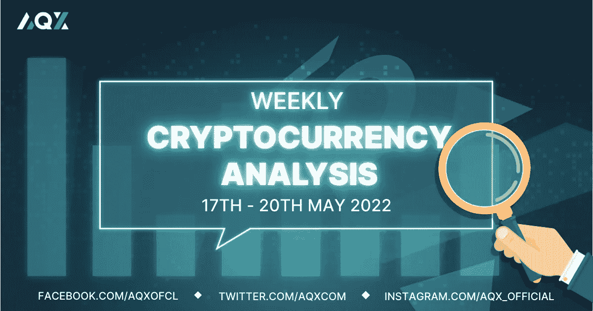
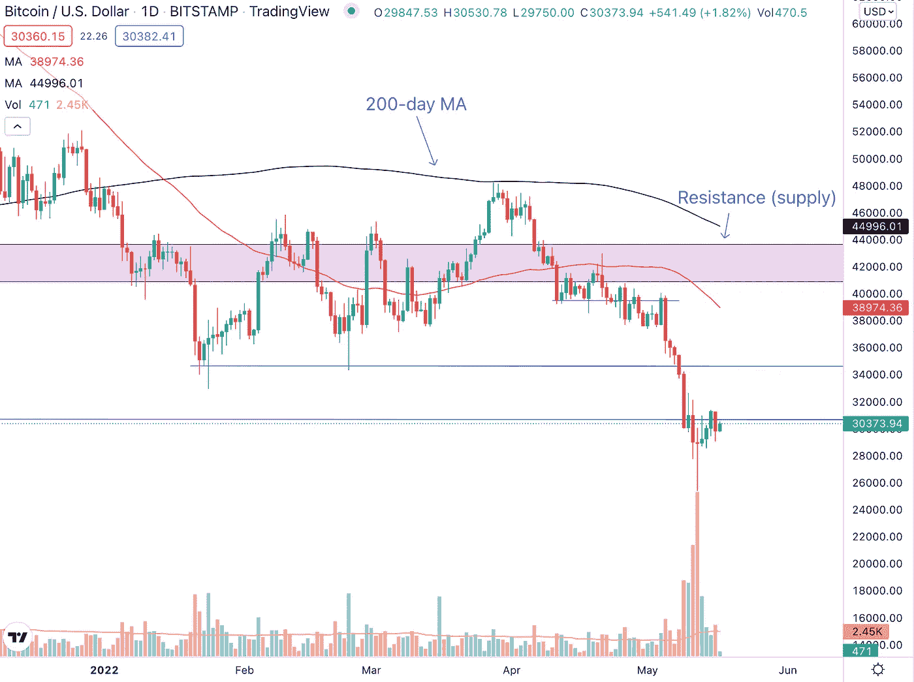
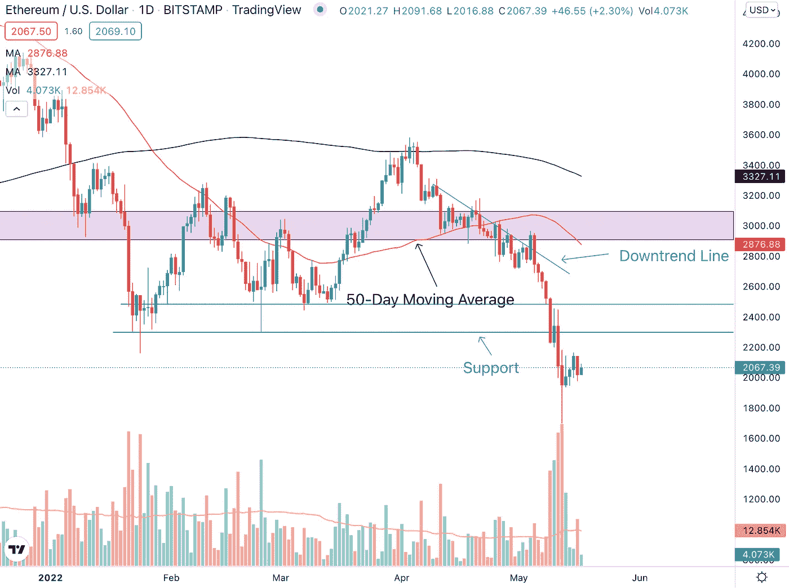
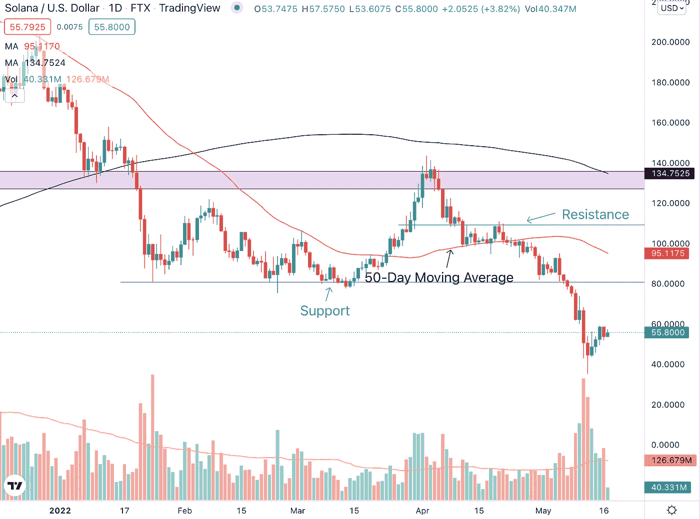
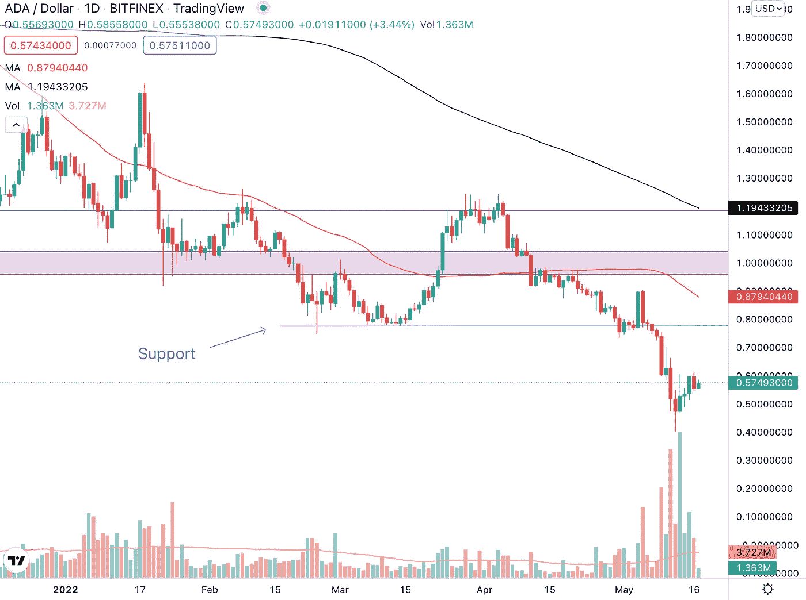

# 每周加密技术分析(5 月 17 日至 20 日)

> 原文：<https://medium.com/coinmonks/weekly-crypto-technical-analysis-17th-20th-may-e6d4bf41503d?source=collection_archive---------54----------------------->

2022 年 5 月 17 日

Weekly Crypto Technical Analysis (17th — 20th May)

你好，密码专家，

上周，随着 terraUSD(或 UST)跌至 1 美元以下，LUNA 从 119 美元左右的高点跌至不足 1 美分，恐慌情绪在市场上蔓延，加密市场在一天之内蒸发了超过 2000 亿美元的财富。尽管 Terra 创始人道·权(Do Kwon)设立的基金 Luna Foundation Guard 将其储备的大部分比特币用于支撑和拯救 UST，但这不足以阻止 UST 和 Luna 的崩溃。

随着上周加密市场的波动性增加，许多加密货币经历了两位数的百分比下跌。对于 crypto 来说，这是艰难的几天和几周，但这一切都会过去的。在这个波动加剧的时期，确保你相应地管理你的风险，只投资那些你可能会损失的钱。

一如既往，我将为您提供我对主要加密技术的分析，以及它们最近的表现。

(如果你想分析一种加密货币，只需在本文中发表评论，我们将在下一期每周加密技术分析中的评论中包括加密货币。)

**比特币(BTC)**

Bitcoin (BTC) managed to form a doji candlestick on heavy volume on the 12th May trading session which might see a temporary bottom for the cryptocurrency.

与许多其他加密货币一样，比特币上周经历了下跌。事实上，BTC 跌破了 30，000 美元的主要支撑位，并一度跌至 25，300 美元。虽然跌破主要支撑位是个坏消息，但也有一些乐观的理由。

这是因为在 5 月 12 日的交易时段，比特币设法在巨大的成交量上形成了一个道吉烛台([你可以在这篇烛台文章](/aqx-official/candlestick-patterns-explained-with-examples-a-comprehensive-guide-to-candlestick-patterns-7315e11ac522)中了解更多关于烛台的知识)。这表明我们可能会在这里找到支撑，这可能是比特币的底部，至少在中短期内是如此。

**以太坊**

Ethereum (ETH) broke below the $2,300 support level but managed to find support on the 12th May trading session.

以太坊跌破 2300 美元价格水平的重要支撑位，成交量高于平均水平。这通常是进一步下跌的信号，然而，在 5 月 12 日的交易时段，ETH 设法形成了一根长下弦线的蜡烛线，交易量很大。

较长时间的下跌表明，在那个交易时段，有买家准备支持和推动价格上涨，这可能是未来几天和几周潜在复苏的开始。

**索拉纳(SOL)**

Solana (SOL) was supported by buyers on the 11th and 12th May trading session even though prices closed lower.

索拉纳目前低于其 80 美元的支撑位 30%，但如果 5 月 11 日和 12 日的交易时段有任何迹象，我们可以看到这一差距在未来几天和一周内关闭。SOL 在这些交易时段形成的长下盘告诉我们，有现成的买家和支撑价格的需求。

如果索拉纳开始复苏，我们希望看到加密形成更高的低点和更高的高点。因此，如果 SOL 下跌，我们希望看到它收盘时高于上周形成的 43 美元的价格水平，然后继续上涨并创造更高的高点。

**卡尔达诺(阿达)**

Cardano (ADA) faces a ready supply of sellers at the $0.6 price level.

虽然 Cardano 似乎在 0.46 美元的价格水平找到了暂时的底部，但 ADA 的复苏因 5 月 13 日的交易时段而变得复杂。虽然卡达诺设法关闭了一天，高于平均水平的交易量，长上灯芯表明，仍然有很多卖家和供应商在阿达。

在 0.6 美元有一个阻力位，所以如果我们要看到 Cardano 的上行反转，我们希望看到加密在这个价格水平之上移动和收盘。

不顾一切，

莱纳斯（m.）

*免责声明:本文分享的任何观点仅代表作者的观点和看法，不应被视为财务建议。AQX 对上传的项目或内容不做任何判断。*

关注我们:

*   推特:【https://twitter.com/AqxCom 
*   电报通知:[https://t.me/aqxannouncement](https://t.me/aqxannouncement)
*   https://www.facebook.com/AQXofcl 脸书
*   insta gram:[https://www.instagram.com/aqx_official/](https://www.instagram.com/aqx_official/)
*   中:[https://medium.com/aqx-official](https://medium.com/aqx-official)
*   不和:[https://discord.gg/mn5CNScMev](https://discord.gg/mn5CNScMev)
*   YouTube:[https://www . YouTube . com/channel/UC _ 3J-wzfgdu 2 p 8 nf _ CrjAYg/featured](https://www.youtube.com/channel/UC_3J-wzFgDu2P8NF_CrjAYg/featured)
*   https://www.reddit.com/r/AQX_official/
*   https://www.tiktok.com/@aqx_official 抖音
*   领英:[https://www.linkedin.com/company/aqx-official/](https://www.linkedin.com/company/aqx-official/)

> 加入 Coinmonks [电报频道](https://t.me/coincodecap)和 [Youtube 频道](https://www.youtube.com/c/coinmonks/videos)了解加密交易和投资

# 另外，阅读

*   [非洲最佳加密交易所](https://coincodecap.com/crypto-exchange-africa) | [胡交易所评论](https://coincodecap.com/hoo-exchange-review)
*   [eToro vs 罗宾汉](https://coincodecap.com/etoro-robinhood)|[MoonXBT vs Bybit vs Bityard](https://coincodecap.com/bybit-bityard-moonxbt)
*   [有哪些交易信号？](https://coincodecap.com/trading-signal) | [比特斯坦普 vs 比特币基地](https://coincodecap.com/bitstamp-coinbase)
*   [ProfitFarmers 回顾](https://coincodecap.com/profitfarmers-review) | [如何使用 Cornix Trading Bot](https://coincodecap.com/cornix-trading-bot)
*   [如何在势不可挡的域名上购买域名？](https://coincodecap.com/buy-domain-on-unstoppable-domains)
*   [印度的秘密税](https://coincodecap.com/crypto-tax-india) | [altFINS 审查](https://coincodecap.com/altfins-review) | [Prokey 审查](/coinmonks/prokey-review-26611173c13c)
*   [赢取注册奖金——10 大最佳加密平台](https://coincodecap.com/earn-sign-up-bonus)