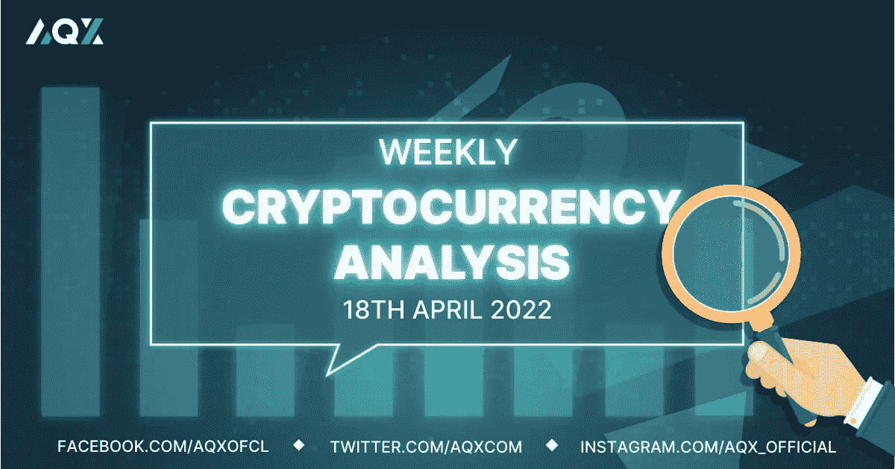
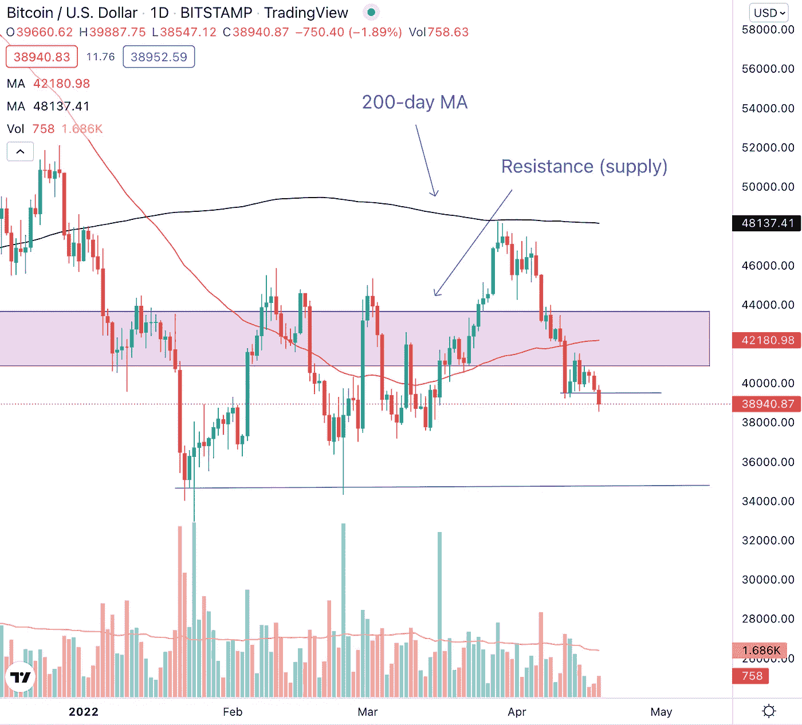
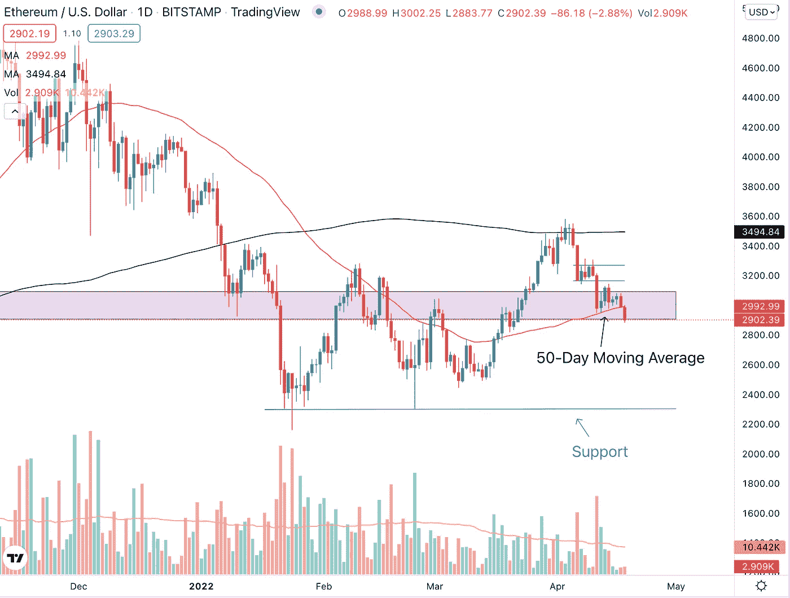
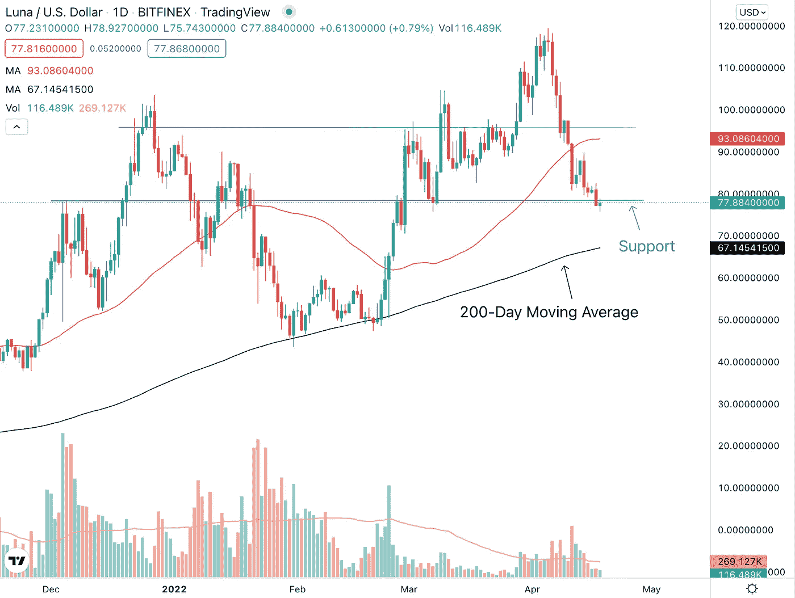
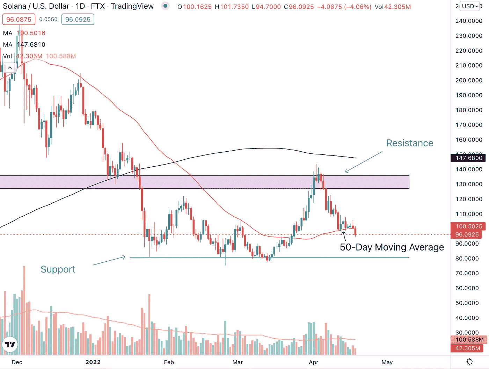
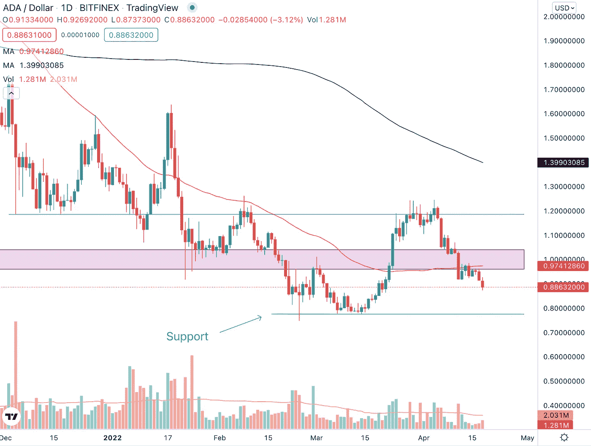

# 每周加密技术分析(4 月 18 日至 22 日)

> 原文：<https://medium.com/coinmonks/weekly-crypto-technical-analysis-18th-22nd-april-bc47561fad56?source=collection_archive---------70----------------------->

Weekly Crypto Technical Analysis (18th — 22nd April)

2022 年 4 月 18 日

你好，密码专家，

作为世界第二大经济体，中国第一季度的 GDP 数据令人惊讶，在众多的 Covid 锁定中实现了同比增长。尽管由于持续的通胀担忧，以科技股为主的纳斯达克指数经历了下跌，但大宗商品继续保持强劲。

让我们看看投资者的通胀担忧和避险前景如何影响我们观察名单上的加密货币的价格。

(如果你有一种加密货币想让我在这个每周观察列表中查看，请对文章发表评论。)

**比特币(BTC)**

Bitcoin (BTC) experienced three consecutive down weeks and is down 5.80% last week.

比特币上周下跌 5.80%，延续了连续三周下跌的势头。在 4 月 11 日的交易时段，我们有一个看跌(负面)信号，BTC 在成交量上跌破 50 天移动平均线(红线)。

这很重要，因为 50 天移动平均线是比特币的潜在支撑。下方的决定性突破加上高于平均水平的成交量表明 BTC 还有进一步下跌的潜力。截至本文撰写之时，比特币目前正在 39500 美元的价格水平找到支撑。

**以太坊**

Ethereum (ETH) broke below its short-term price of $3150-$3300.

以太坊已经跌破 3150-3300 美元价格水平之间的短线区间。这是我们在[之前的每周加密技术分析文章](/coinmonks/weekly-crypto-technical-analysis-11th-15th-april-cd7577f3dbf8)中强调的价格范围，跌破该范围伴随着巨大的下跌量，这向我们表明 ETH 价格进一步下跌。

以太坊到目前为止找到了支撑，并保持在 50 天移动平均线(红线)上方。加密货币也在关键价格区域内，如粉红色方框所示，这一因素和 50 天移动平均线的汇合意味着我们可以预计以太坊将在该价格区域找到支持。

**特拉(露娜)**

Terra (LUNA) rally could not be sustained even after the bullish news two weeks ago.

自 1 月底以来，Terra 已经购买了超过 10 亿美元的比特币，这一消息设法将 LUNA 的价格暂时推高至 95 美元以上。然而，价格很快耗尽天然气，并回落到关键价格水平以下。

为了加剧价格的下跌，LUNA 下跌时的成交量也低于平均水平，而上涨时的成交量仍然很少。这与我们希望看到的健康上升趋势相反。LUNA 目前在 78 美元的价位找到了一些支撑。如果加密指数跌破这一支撑，下一个需要关注的关键价格区域是 200 日均线(黑线)。

**索拉纳(SOL)**

Solana (SOL) has retraced 30% from the resistance.

自从在关键价格区域(粉红色方框)遇到阻力以来，索拉纳已经下跌了约 30%，并出现了更低的高点和更低的低点。到目前为止，它设法找到了 50 天移动平均线(红线)的支持，尽管在撰写本文时，索拉纳已跌破 50 天移动平均线。

如果 SOL 继续保持在 50 天移动平均线以下，我们可以预计短期内将进一步下跌，下一个关键支撑位将在 80 美元的价格水平。

**卡尔达诺(阿达)**

Cardano (ADA) broke below its 50-day moving average on huge downside volume.

Cardano 在 4 月 11 日的交易时段经历了跌破 50 天移动平均线的大幅下跌。巨大的红色烛台和下跌的高成交量暗示了对 ADA 的悲观情绪。

首先要关注的支撑是 0.88 美元的价格水平。第二个也是更强的支撑位在 0.77 美元的价位。

不顾一切，

莱纳斯（m.）

*免责声明:本文分享的任何观点仅代表作者的观点和看法，不应被视为财务建议。AQX 对上传的项目或内容不做任何判断。*

关注我们:

*   推特:【https://twitter.com/AqxCom 
*   电报通知:[https://t.me/aqxannouncement](https://t.me/aqxannouncement)
*   https://www.facebook.com/AQXofcl 脸书
*   insta gram:[https://www.instagram.com/aqx_official/](https://www.instagram.com/aqx_official/)
*   中:[https://medium.com/aqx-official](https://medium.com/aqx-official)
*   不和:[https://discord.gg/mn5CNScMev](https://discord.gg/mn5CNScMev)
*   YouTube:[https://www . YouTube . com/channel/UC _ 3J-wzfgdu 2 p 8 nf _ CrjAYg/featured](https://www.youtube.com/channel/UC_3J-wzFgDu2P8NF_CrjAYg/featured)
*   https://www.reddit.com/r/AQX_official/
*   https://www.tiktok.com/@aqx_official 抖音
*   领英:[https://www.linkedin.com/company/aqx-official/](https://www.linkedin.com/company/aqx-official/)