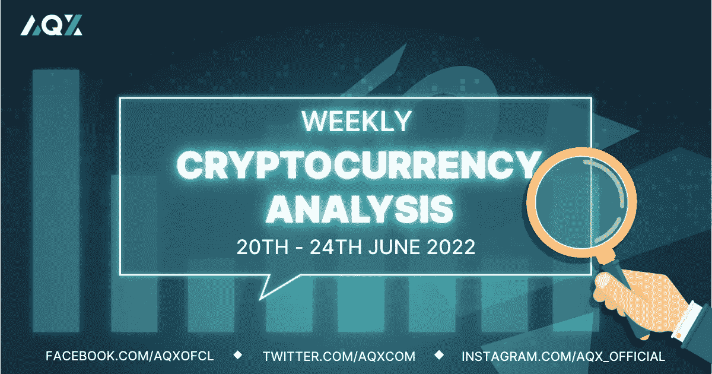
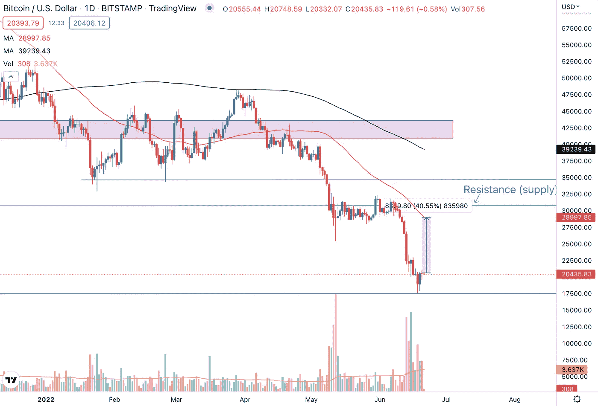
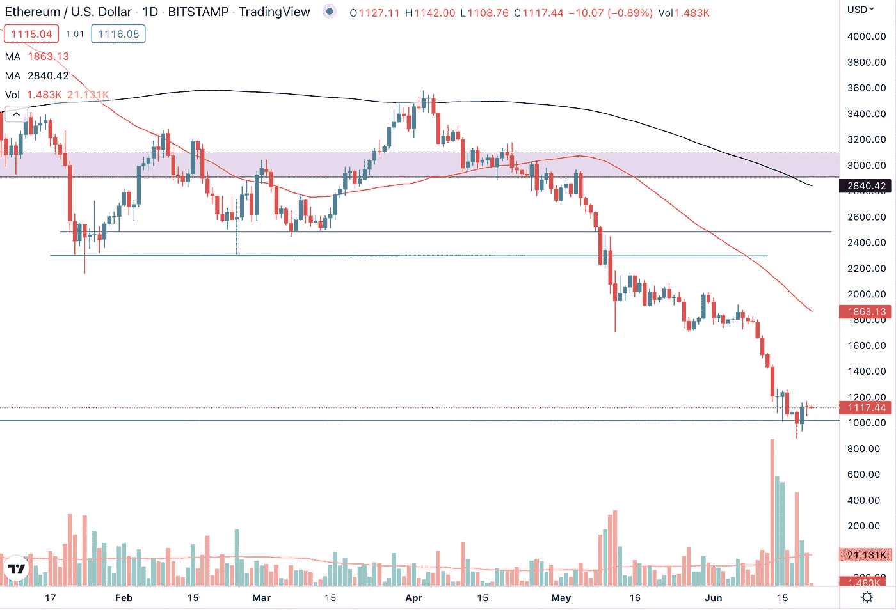
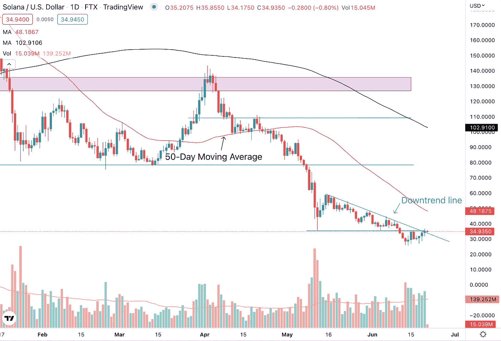
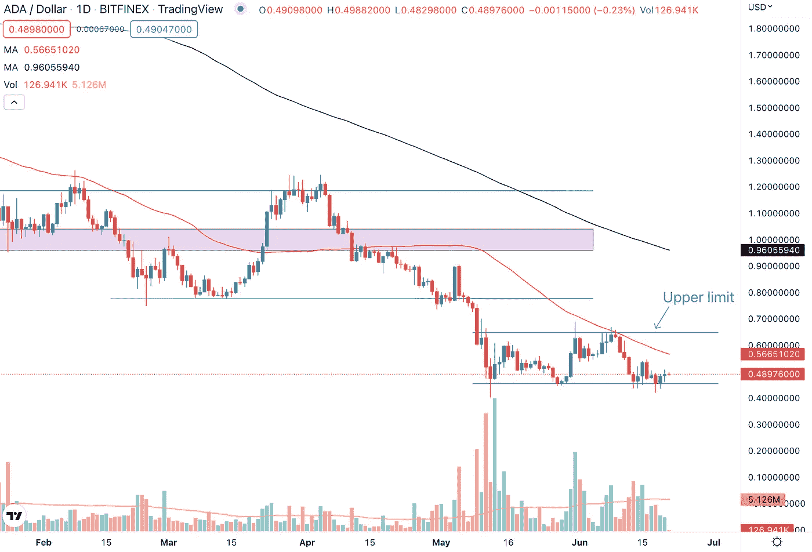

# 每周加密技术分析(6 月 20 日至 24 日)

> 原文：<https://medium.com/coinmonks/weekly-crypto-technical-analysis-20th-24th-june-d224b0a9c482?source=collection_archive---------57----------------------->

Weekly Crypto Technical Analysis (20th — 24th June)

2022 年 6 月 20 日

你好，密码专家，

美国股市正式进入熊市。房地产市场正在迅速降温。美联储进一步将利率提高了 75 个基点，以对抗有可能失控的通胀。

在这些宏观逆风的背景下，观察名单上的加密货币表现如何？在这篇文章中，我们看看我们观察名单上的加密货币过去一周的价格走势，并对它们进行技术分析，以及未来一周我们可以关注的图表。

**比特币(BTC)**

Bitcoin (BTC) is short-term overextended on the downside.

比特币跌破了此前一周许多分析师都在关注的 2 万美元技术价格水平。按照目前的价格水平，BTC 也低于 2.1 万美元的水平，据报道，这种加密货币的大股东 MicroStrategy 面临追加保证金的要求。

目前，比特币的交易价格比其 200 天移动平均线低 46%左右，这使其短期内过度下行。因此，至少在接下来的几个交易日里，我们很有可能看到 BTC 出现反弹，或者至少是横盘整理。比特币也保持在 17500 美元的水平，该加密技术在大约一年半前设法找到了支持。

**以太坊**

Ethereum (ETH) has managed to find temporary support at the $1,000 price level.

上周形成的高交易量和长期低吸意味着以太坊可以在 1000 美元的价格水平找到临时支撑。整数也是许多交易者倾向于关注的心理点，这进一步加强了在这个价格水平找到支撑的情况。

如果 ETH 的价格保持在这一水平，我们希望看到加密货币的价格形成更高的高点，并在 1250 美元以上结算。然而，ETH 的交易量并不乐观，因为下跌日的交易量高于上涨日的交易量。

**索拉纳**

Solana (SOL) is facing resistance at the $35 price level.

索拉纳跌破下降三角形形态的水平线，这条线现在是阻力，因为价格无法突破该水平。溶胶的价格也在下降趋势线以下交易，并提出越来越低的高点和低点。

如果索拉纳能够在强劲的交易量下突破下降三角形模式的水平线和 35 美元价格水平的下降趋势线，我们很有可能看到加密货币的潜在复苏。因此，索拉纳如何对这一价格水平做出反应是加密货币短期价格行动的关键。

**卡尔达诺(阿达)**

Cardano (ADA) is trading between the $0.45 — $065 price range.

Cardano 保持在 0.45 美元的支撑位，我们在之前的每周加密技术分析文章中强调了这一点，买家在该支撑位买入加密货币。我们在价格图表上看到了这一点，在过去的一周里，烛台上形成了多个长而低的灯芯。

对于 ADA 来说，要实现复苏，我们希望看到价格首先突破 50 天移动平均线，然后在 0.65 美元清除该区间的上限。在此之前，我们很有可能会看到卡达诺的交易价格在 0.45 美元到 0.65 美元之间。

莱纳斯（m.）

*免责声明:本文分享的任何观点严格来说是作者的观点和看法，不应被解释为财务建议。AQX 对上传的项目或内容不做任何判断。*

关注我们:

*   推特:【https://twitter.com/AqxCom 
*   电报通知:【https://t.me/aqxannouncement 
*   https://www.facebook.com/AQXofcl:[脸书](https://www.facebook.com/AQXofcl)
*   insta gram:[https://www.instagram.com/aqx_official/](https://www.instagram.com/aqx_official/)
*   中:[https://medium.com/aqx-official](https://medium.com/aqx-official)
*   不和:[https://discord.gg/mn5CNScMev](https://discord.gg/mn5CNScMev)
*   YouTube:[https://www . YouTube . com/channel/UC _ 3J-wzfgdu 2 p 8 nf _ CrjAYg/featured](https://www.youtube.com/channel/UC_3J-wzFgDu2P8NF_CrjAYg/featured)
*   https://www.reddit.com/r/AQX_official/
*   https://www.tiktok.com/@aqx_official
*   领英:[https://www.linkedin.com/company/aqx-official/](https://www.linkedin.com/company/aqx-official/)

> 加入 Coinmonks [电报频道](https://t.me/coincodecap)和 [Youtube 频道](https://www.youtube.com/c/coinmonks/videos)了解加密交易和投资

# 另外，阅读

*   [币安 vs FTX](https://coincodecap.com/binance-vs-ftx) | [最佳(SOL)索拉纳钱包](https://coincodecap.com/solana-wallets)
*   [比诺莫评论](https://coincodecap.com/binomo-review) | [斯多葛派 vs 3Commas vs TradeSanta](https://coincodecap.com/stoic-vs-3commas-vs-tradesanta)
*   [Capital.com 审查](https://coincodecap.com/capital-com-review) | [港加密借贷平台](https://coincodecap.com/crypto-lending-hong-kong)
*   [如何在 Uniswap 上交换加密？](https://coincodecap.com/swap-crypto-on-uniswap) | [A-Ads 审核](https://coincodecap.com/a-ads-review)
*   [WazirX vs coin dcx vs bit bns](/coinmonks/wazirx-vs-coindcx-vs-bitbns-149f4f19a2f1)|[block fi vs coin loan vs Nexo](/coinmonks/blockfi-vs-coinloan-vs-nexo-cb624635230d)
*   [本地比特币审核](/coinmonks/localbitcoins-review-6cc001c6ed56) | [加密货币储蓄账户](https://coincodecap.com/cryptocurrency-savings-accounts)