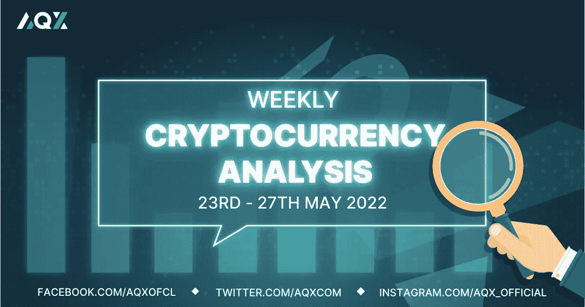

# 每周加密技术分析(5 月 23 日至 27 日)

> 原文：<https://medium.com/coinmonks/weekly-crypto-technical-analysis-23rd-27th-may-abe2441f2f4e?source=collection_archive---------60----------------------->

Weekly Crypto Technical Analysis (23rd — 27th May)

2022 年 5 月 23 日

你好，密码专家，

通货膨胀继续蹂躏世界各地的经济。加上供应链混乱和俄罗斯-乌克兰冲突，未来几周和几个月的经济前景看起来很暗淡。这是一个更加谨慎和更加严格地管理风险的时候。

让我们来看看在 LUNA 危机的背景下，加密货币市场上周的表现。

(如果你想分析一种加密货币，只需在本文中发表评论，我们将在下一期每周加密技术分析中的评论中包括加密货币。)

**比特币(BTC)**

比特币上周在 10%的范围内交易，没有出现任何明显的上涨或下跌。前一周 BTC 波动性的降低与两周前比特币的大幅下跌形成了鲜明对比。

波动性已经平息，这意味着投资者和交易员正在权衡他们的下一步行动。然而，比特币在 30，000 美元价格水平下保持在阻力/供应区以下的时间越长，加密货币进一步下行的可能性就越大。

**以太坊**

以太坊的交易低于 2100 美元的水平，它仍然在创造更低的高点和更低的低点。除非 ETH 能够停止并扭转这种价格波动，并开始制造更高的低点和更高的高点，否则我们可以预计加密技术将进一步下跌。

请注意，即使在下跌趋势中，价格也不总是直线下跌。偶尔会有反弹，在这些反弹期间，许多投资者往往会被骗以为下跌趋势已经结束，新的上涨趋势已经开始。减少这种情况发生的可能性的一个方法是坚持看到以太坊制造更高的低点和更高的高点。

**索拉纳**

索拉纳已经设法提出了一个更高的低点，并在本周继续前进，如果索尔能够达到 59 美元，这也将形成一个更高的高点。如果你一直在阅读我的每周加密分析，更高的低点和更高的高点(更低的高点和更低的低点)经常被提及，因为这是确定趋势是否完好无损或反转是否会很快发生的最可靠的方法之一。

因此，如果索拉纳能够上涨并超过 59 美元，它不仅会突破阻力位，而且在这个过程中还会形成一个更高的低点和更高的高点，这将进一步推动加密的潜在复苏。

**卡尔达诺(阿达)**

在我们之前的[每周加密技术分析文章](/coinmonks/weekly-crypto-technical-analysis-17th-20th-may-e6d4bf41503d)中，我强调了 Cardano 的恢复因 5 月 13 日的交易时段而变得复杂，该日形成了长上灯芯和高交易量，并注意 0.6 美元的阻力位。

快进一周后，ADA 仍然在 0.6 美元处发现阻力，多个上吸(在第 16 和 17 个交易时段)表明仍然有很多供应和卖方准备在该价格水平出售 Cardano。但尽管如此，从第 19 个交易日到第 22 个交易日，交易量沿着低点逐渐减少，表明抛售至少在 0.5 美元的水平上有所放缓。

莱纳斯（m.）

*免责声明:本文分享的任何观点严格来说是作者的观点和看法，不应被解释为财务建议。AQX 对上传的项目或内容不做任何判断。*

关注我们:

*   推特:【https://twitter.com/AqxCom 
*   电报通知:【https://t.me/aqxannouncement 
*   https://www.facebook.com/AQXofcl:[脸书](https://www.facebook.com/AQXofcl)
*   insta gram:[https://www.instagram.com/aqx_official/](https://www.instagram.com/aqx_official/)
*   中:[https://medium.com/aqx-official](https://medium.com/aqx-official)
*   不和:[https://discord.gg/mn5CNScMev](https://discord.gg/mn5CNScMev)
*   YouTube:[https://www . YouTube . com/channel/UC _ 3J-wzfgdu 2 p 8 nf _ CrjAYg/featured](https://www.youtube.com/channel/UC_3J-wzFgDu2P8NF_CrjAYg/featured)
*   https://www.reddit.com/r/AQX_official/
*   https://www.tiktok.com/@aqx_official
*   领英:[https://www.linkedin.com/company/aqx-official/](https://www.linkedin.com/company/aqx-official/)

> *加入 Coinmonks* [*电报频道*](https://t.me/coincodecap) *和* [*Youtube 频道*](https://www.youtube.com/c/coinmonks/videos) *了解加密交易和投资*

# 另外，阅读

*   [Bookmap 评论](https://coincodecap.com/bookmap-review-2021-best-trading-software) | [美国 5 大最佳加密交易所](https://coincodecap.com/crypto-exchange-usa)
*   最佳加密[硬件钱包](/coinmonks/hardware-wallets-dfa1211730c6) | [Bitbns 评论](/coinmonks/bitbns-review-38256a07e161)
*   [新加坡十大最佳密码交易所](https://coincodecap.com/crypto-exchange-in-singapore) | [收购 AXS](https://coincodecap.com/buy-axs-token)
*   [红狗赌场评论](https://coincodecap.com/red-dog-casino-review) | [Swyftx 评论](https://coincodecap.com/swyftx-review) | [CoinGate 评论](https://coincodecap.com/coingate-review)
*   [投资印度的最佳加密软件](https://coincodecap.com/best-crypto-to-invest-in-india-in-2021)|[WazirX P2P](https://coincodecap.com/wazirx-p2p)|[Hi Dollar Review](https://coincodecap.com/hi-dollar-review)
*   [加拿大最好的加密交易机器人](https://coincodecap.com/5-best-crypto-trading-bots-in-canada) | [库币评论](https://coincodecap.com/kucoin-review)
*   [OKEx vs KuCoin](https://coincodecap.com/okex-kucoin) | [摄氏替代品](https://coincodecap.com/celsius-alternatives) | [如何购买 VeChain](https://coincodecap.com/buy-vechain)
*   [币安期货交易](https://coincodecap.com/binance-futures-trading)|[3 commas vs Mudrex vs eToro](https://coincodecap.com/mudrex-3commas-etoro)
*   [如何购买 Monero](https://coincodecap.com/buy-monero) | [IDEX 评论](https://coincodecap.com/idex-review) | [BitKan 交易机器人](https://coincodecap.com/bitkan-trading-bot)
*   [CoinDCX 评论](/coinmonks/coindcx-review-8444db3621a2) | [加密保证金交易交易所](https://coincodecap.com/crypto-margin-trading-exchanges)
*   [红狗赌场评论](https://coincodecap.com/red-dog-casino-review) | [Swyftx 评论](https://coincodecap.com/swyftx-review) | [造币厂评论](https://coincodecap.com/coingate-review)
*   [Bookmap 评论](https://coincodecap.com/bookmap-review-2021-best-trading-software) | [美国 5 大最佳加密交易所](https://coincodecap.com/crypto-exchange-usa)