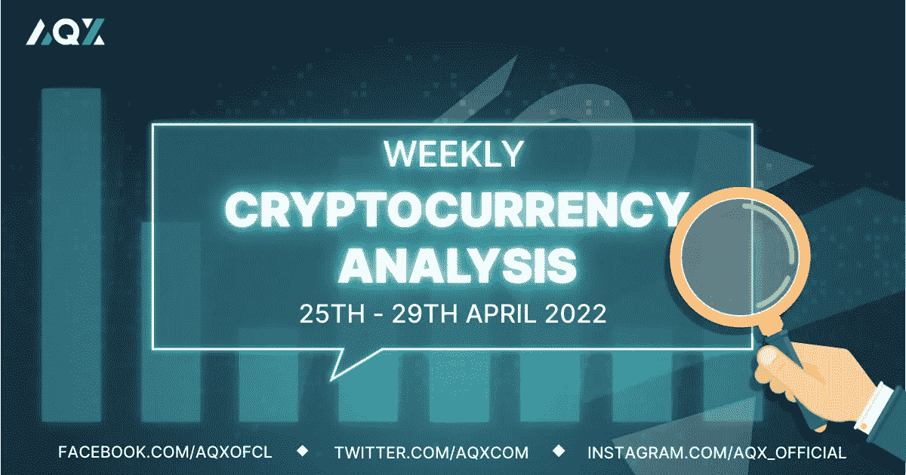
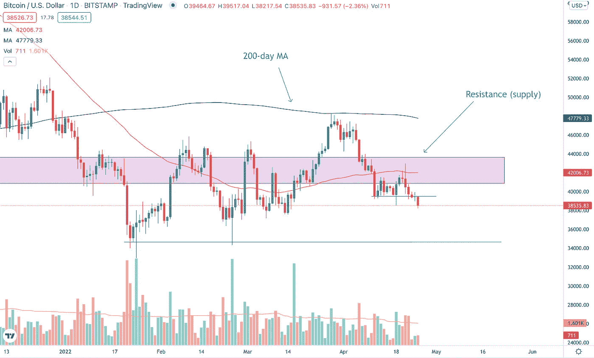
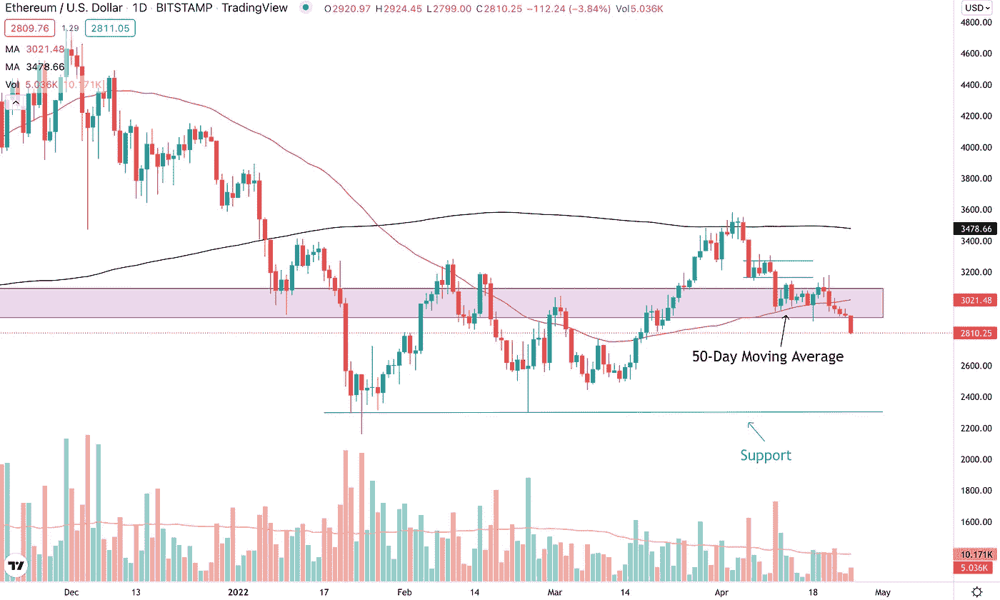
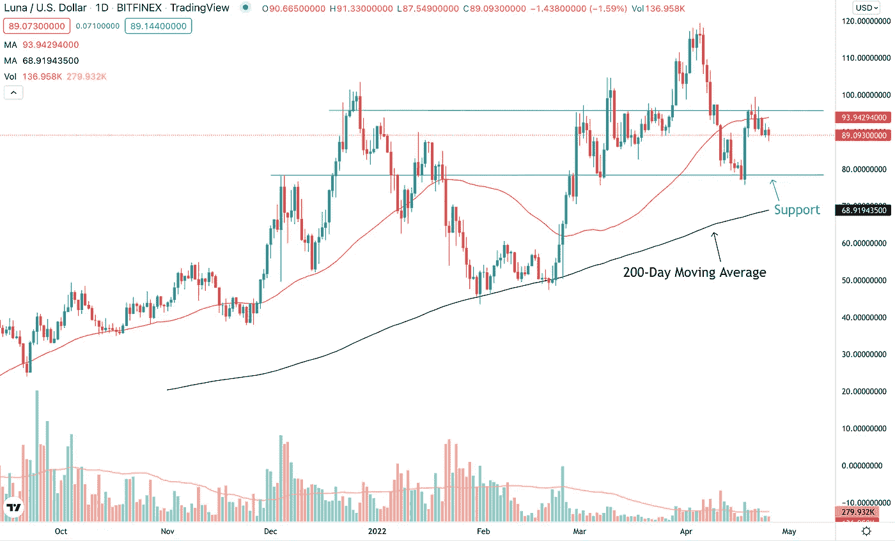
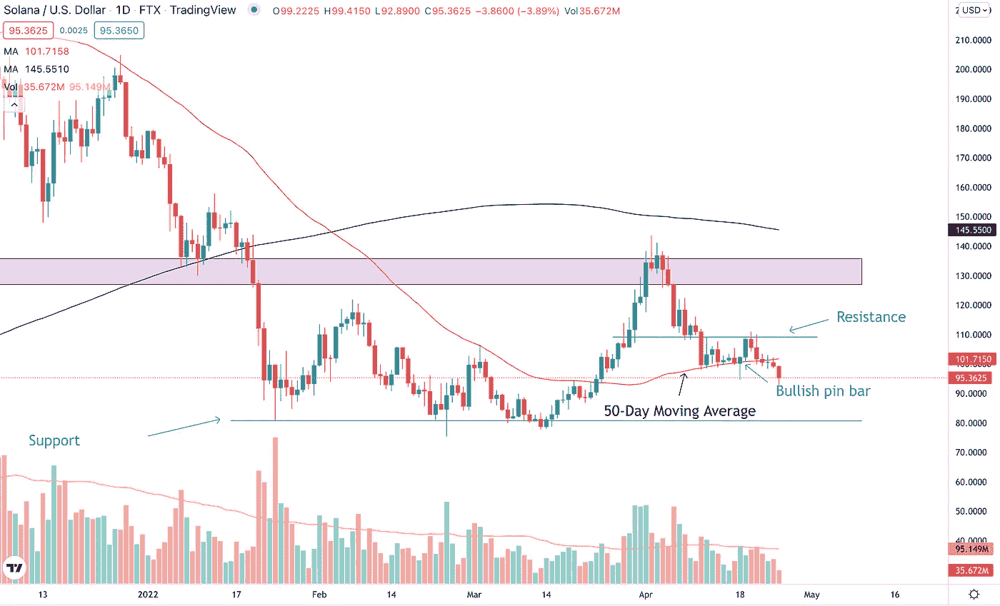
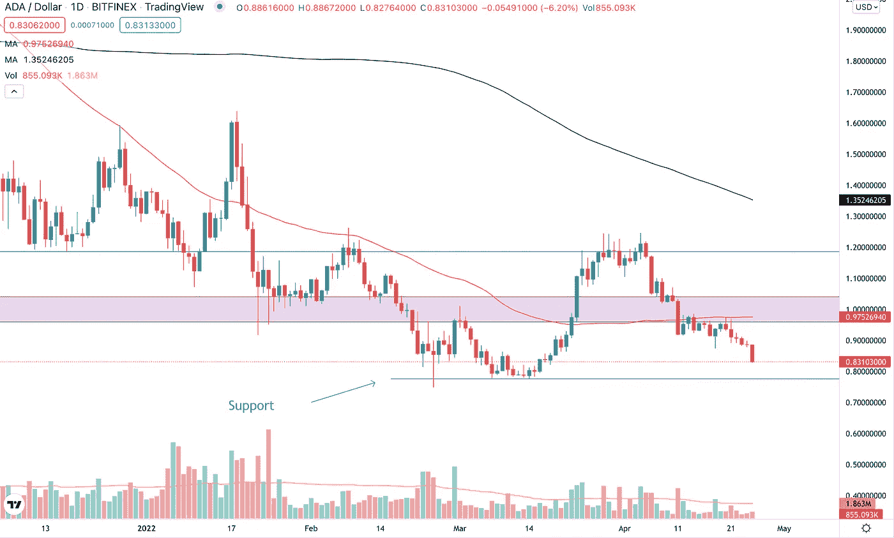
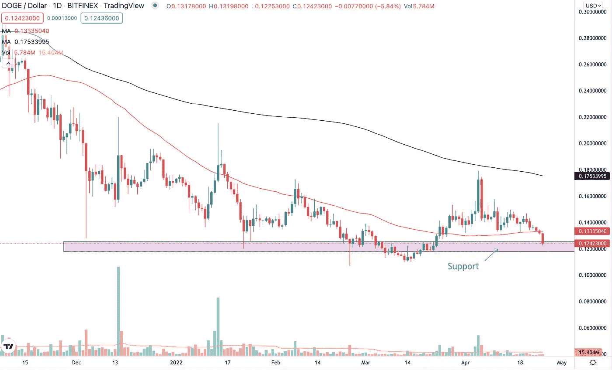

# 每周加密技术分析(4 月 25 日至 29 日)

> 原文：<https://medium.com/coinmonks/weekly-crypto-technical-analysis-25th-29th-april-f9ab915365ee?source=collection_archive---------52----------------------->

Weekly Crypto Technical Analysis (25th — 29th April)

2022 年 4 月 25 日

你好，密码专家，

繁忙的收益季节再次降临股票市场。埃隆·马斯克(Elon Musk)披露，他获得了 465 亿美元的资金，加剧了 Twitter 收购要约的传言。美元触及两年多高点。

由于美国三大股市指数上周均下跌超过 2%，让我们看看我们观察名单上的加密货币价格在股市抛售后的表现。

(应我们一些追随者的要求，我们在本周的分析中加入了 Dogecoin。因此，如果你有一种加密货币想让我在这份每周观察清单上看一看，只需对这篇文章发表评论，我会将其纳入下一期每周加密技术分析。)

**比特币(BTC)**

Bitcoin (BTC) broke below its $39,500 level support.

在两周前下跌超过 5%后，比特币未能在上周反弹。BTC 遭遇抛售，两次跌破 50 天移动平均线(红线)。这告诉我们，向前看，50 日均线是一个值得关注的重要指标，尤其是如果要恢复上升趋势。

截至本文撰写之时，比特币已经跌破我们在[上一篇文章](/coinmonks/weekly-crypto-technical-analysis-18th-22nd-april-bc47561fad56)中确定的 39500 美元临时支撑。突破这一支撑位表明 BTC 将进一步下跌，下一个主要支撑位为 34，600 美元。

**以太坊**

Ethereum (ETH) close below its 50-day moving average on above-average volume.

以太坊上周大部分时间在 20 日和 50 日移动平均线之间交易，分别用蓝色和红色线表示。这家市值第二大的加密公司面临阻力，无法突破 20 天移动平均线。

相反，在 4 月 21 日的交易中，ETH 的成交量突破了 50 天移动平均线，这总结了以太坊熊市的一周。展望未来，如果我们继续看到以太坊进一步下跌，下一个需要关注的主要支撑位是 2400 美元的价格水平。

**特拉(露娜)**

LUNA managed to rally on strong volume at the support level.

LUNA 在我们之前的文章[中提到的 78 美元价位找到了支撑。事实上，在 4 月 18 日交易时段达到支撑位时，LUNA 在高于平均水平的成交量上形成了一个大的看涨(绿色)蜡烛线。这告诉我们，有很多买家愿意购买这个价格水平的加密货币。](/coinmonks/weekly-crypto-technical-analysis-18th-22nd-april-bc47561fad56)

此外，这不是 LUNA 第一次在 78 美元的价格水平上找到支持。早在三月初，这个加密程序就设法找到了这个级别的支持。所以这绝对是一个需要关注的价格水平。LUNA 目前在 95 美元的价格水平发现阻力，如果我们要看到 LUNA 创造新高，它必须突破这个阻力区域。

**索拉纳(SOL)**

Solana (SOL) could not hold above the 50-day moving average and closed below the moving average.

当之前的每周加密技术分析文章还在撰写时，索拉纳设法在 50 天移动平均线找到了支撑，在 4 月 18 日交易时段到达移动平均线时形成了一个看涨的针棒烛台。

一周过去了，SOL 不仅跌破了 50 天移动平均线，还收于 50 天移动平均线以下。除非 Solana 能够回升并接近 50 天移动平均线，否则我们可以看到加密货币的进一步下行，下一个主要支撑位在 80 美元附近 15%。

**卡尔达诺(阿达)**

Cardano (ADA) encountered selling pressure at the 50-day moving average.

4 月 20 日和 21 日交易时段的长上攻告诉我们，当 Cardano 接近 50 天移动平均线并试图收回到移动平均线上方时，有很多抛售。这一尝试失败了，因为 ADA 的价格上周下跌了 3.16%。

大量的现货卖家表明，我们可以预计在未来几天和几周内，卡尔达诺将进一步下跌。我们甚至有可能看到 ADA 在 2 月底和 3 月初测试之前的 0.77 美元支撑位。

**Dogecoin (DOGE)**

Dogecoin (DOGE) is in a downtrend as prices are below the 50 and 200-day moving averages.

Dogecoin，也许是最臭名昭著的迷因硬币之一，正处于明显的下降趋势。它位于 50 日和 200 日移动平均线下方，两条移动平均线都向下倾斜。DOGE 目前处于关键的 0.12 美元价格区域，如果过去的价格行为预示着未来的价格走势，我们可以看到硬币在这一区域找到支撑。

如果我们要看到 Dogecoin 趋势的变化，我们要注意这三件事:1)价格形成更高的低点和更高的高点，2) DOGE 回到 50 和 200 天移动平均线以上，3)两个移动平均线都向上倾斜。

不顾一切，

莱纳斯（m.）

*免责声明:本文中分享的任何观点仅是作者的观点和意见，不应被视为财务建议。AQX 对上传的项目或内容不做任何判断。*

关注我们:

*   推特:[https://twitter.com/AqxCom](https://twitter.com/AqxCom)
*   电报通知:[https://t.me/aqxannouncement](https://t.me/aqxannouncement)
*   https://www.facebook.com/AQXofcl
*   https://www.instagram.com/aqx_official/
*   中:[https://medium.com/aqx-official](https://medium.com/aqx-official)
*   不和:【https://discord.gg/mn5CNScMev】T2
*   YouTube:[https://www . YouTube . com/channel/UC _ 3J-wzfgdu 2 p 8 nf _ CrjAYg/featured](https://www.youtube.com/channel/UC_3J-wzFgDu2P8NF_CrjAYg/featured)
*   https://www.reddit.com/r/AQX_official/
*   https://www.tiktok.com/@aqx_official 抖音
*   领英:[https://www.linkedin.com/company/aqx-official/](https://www.linkedin.com/company/aqx-official/)

> 加入 Coinmonks [电报频道](https://t.me/coincodecap)和 [Youtube 频道](https://www.youtube.com/c/coinmonks/videos)了解加密交易和投资

# 另外，阅读

*   [OKEx vs KuCoin](https://coincodecap.com/okex-kucoin) | [摄氏替代品](https://coincodecap.com/celsius-alternatives) | [如何购买 VeChain](https://coincodecap.com/buy-vechain)
*   [币安期货交易](https://coincodecap.com/binance-futures-trading)|[3 commas vs Mudrex vs eToro](https://coincodecap.com/mudrex-3commas-etoro)
*   [如何购买 Monero](https://coincodecap.com/buy-monero) | [IDEX 评论](https://coincodecap.com/idex-review) | [BitKan 交易机器人](https://coincodecap.com/bitkan-trading-bot)
*   [CoinDCX 评论](/coinmonks/coindcx-review-8444db3621a2) | [加密保证金交易交易所](https://coincodecap.com/crypto-margin-trading-exchanges)
*   [红狗赌场评论](https://coincodecap.com/red-dog-casino-review) | [Swyftx 评论](https://coincodecap.com/swyftx-review) | [CoinGate 评论](https://coincodecap.com/coingate-review)