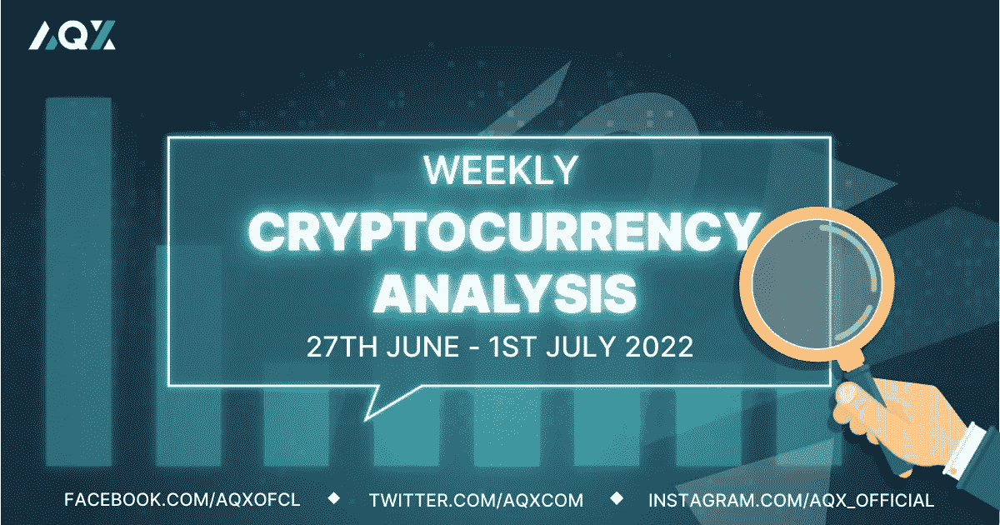
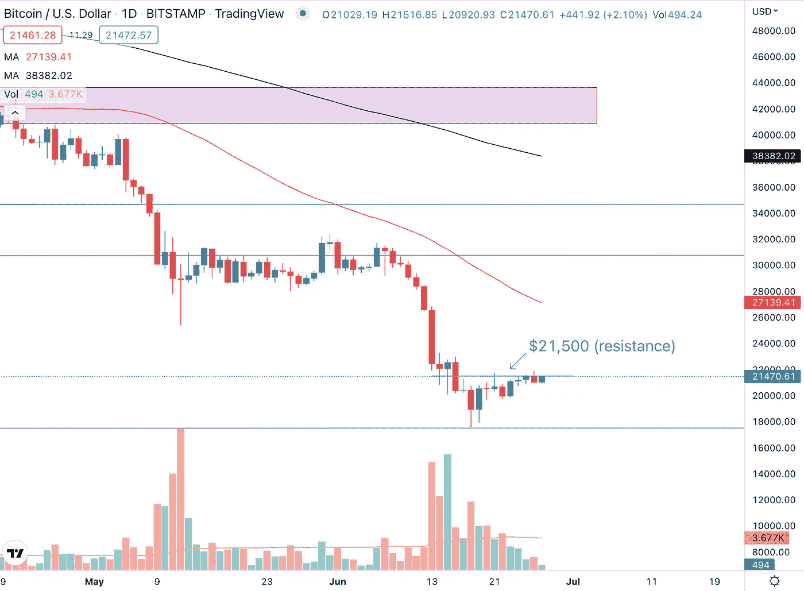
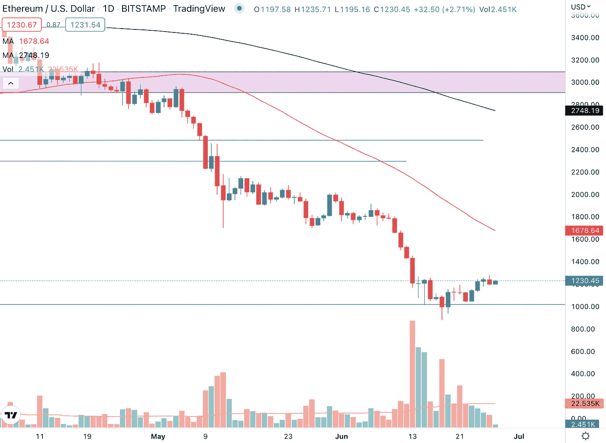
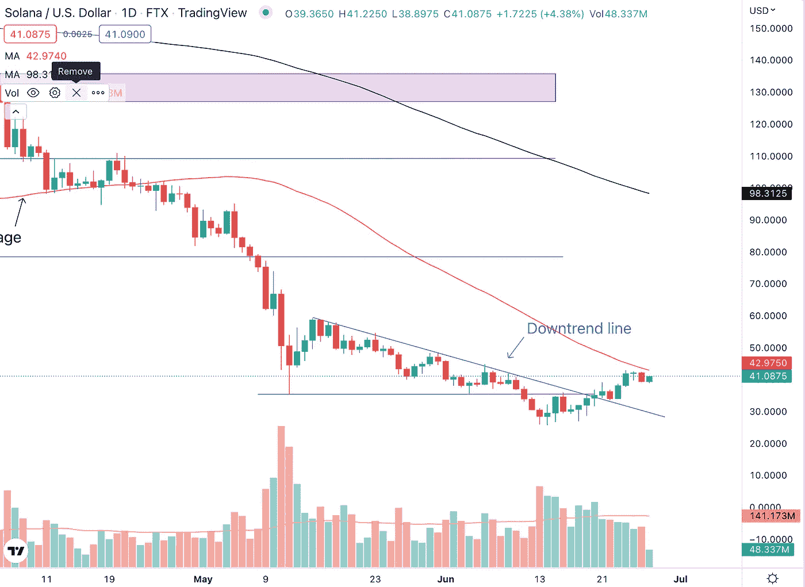
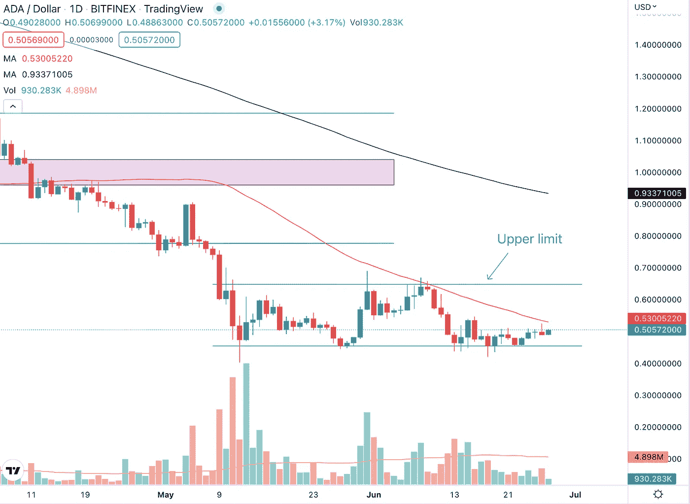

# 每周加密技术分析(6 月 27 日—7 月 1 日)

> 原文：<https://medium.com/coinmonks/weekly-crypto-technical-analysis-27th-june-1st-july-919fcb101d64?source=collection_archive---------58----------------------->

Weekly Crypto Technical Analysis (27th June — 1st July)

2022 年 6 月 27 日

你好，密码专家，

密码市场出现了更多的大屠杀。股市经历了自 1970 年以来最糟糕的 6 个月。事实证明，通货膨胀比美联储预期的更加持久。

让我们看看，即使市场继续弥漫着悲观情绪，我们观察名单上的加密货币价格如何保持不变。

**比特币(BTC)**

Bitcoin (BTC) is likely to face resistance at the $21,500 price level.

比特币从 17500 美元的支撑位被推高，我们在上周的[每周加密技术分析文章](/coinmonks/weekly-crypto-technical-analysis-20th-24th-june-d224b0a9c482)中强调了这一点。18 日和 19 日交易时段的两次长时间下跌表明，有很多准备好的买家愿意买入，并在支撑位支撑价格。BTC 也突破了许多分析师预测的 20，000 美元的价格水平。

目前，比特币在 21500 美元的价格水平上遇到了一些阻力。如果价格能够突破这一水平，比特币将创造更高的低点和更高的高点。这对市值最大的加密货币来说是积极的价格行动，因为 BTC 将不再制造与下跌趋势相关的更低的高点和更低的低点。

**以太坊**

Ethereum (ETH) managed to find a temporary bottom and support at the $1,000 price level.

以太坊在 1000 美元的价格水平找到了支撑，我们在之前的文章中强调过，因为这个整数是许多投资者和交易者关注的心理点。6 月 18 日是交易量较大的一天。

通常情况下，这将是熊市。然而，在那个时段，价格有一个“好”的收盘。它收于蜡烛线区间的上半部分,这向我们表明，虽然有卖家，但买家正在买入，并将价格从当天的低点推高。展望未来，如果 ETH 的价格确实回落到 1000 美元的价格水平，我们可以期待那里的强劲支撑。

**索拉纳(SOL)**

Solana (SOL) broke above the multi-month downtrend line on strong volume.

索拉纳在强劲的成交量下成功突破了多月来的下降趋势线。虽然突破日的烛台可以更好(绿色长烛台)，但它仍然是一个积极的迹象，看到索尔打破和关闭在下降趋势线以上。

索拉纳的价格正在快速逼近 50 天移动平均线，如果历史有任何迹象的话，移动平均线应该会成为加密货币的价格阻力。自三周前的低点以来，索拉纳已经连续三周看涨，涨幅超过 50%。考虑到所有这些，索拉纳很有可能在接下来的一周横盘整理，甚至小幅下跌。

**卡尔达诺(阿达)**

Cardano (ADA) is trading at the lower limit of the range and is likely to encounter resistance at the 50-day moving average.

Cardano 没有突破我们在上一篇文章中强调的 0.65 美元的价格水平。这是一个重要的价格水平，因为它符合 ADA 目前交易范围的上限和 50 天移动平均线的位置。

Cardano 在该区间的下限找到了支撑，现在它正在向上移动，接近 50 天移动平均线。50 天移动平均线将用于测试买家的决心，以及他们是否能够提出足够的购买需求来推动价格上涨并超过移动平均线，即使他们可能在该区域遇到重要的卖家。

莱纳斯（m.）

*免责声明:本文分享的任何观点严格来说是作者的观点和看法，不应被解释为财务建议。AQX 对上传的项目或内容不做任何判断。*

关注我们:

[推特](https://twitter.com/AqxCom) | [电报](https://t.me/aqxannouncement) | [脸书](https://www.facebook.com/AQXofcl) | [Instagram](https://www.instagram.com/aqx_official/) | [媒体](https://medium.com/aqx-official) | [不和](https://discord.gg/mn5CNScMev) | [Youtube](https://www.youtube.com/channel/UC_3J-wzFgDu2P8NF_CrjAYg/featured) | [抖音](https://www.tiktok.com/@aqx_official) | [Linkedin](https://www.linkedin.com/company/aqx-official/)

**关于 AQX**

AQX 成立于 2020 年，是面向零售交易商和机构的加密网关。它为用户提供了一个购买、销售、交易和学习密码的一体化平台。AQX 的核心是一个加密货币交易平台，该公司凭借无与伦比的卓越工程设计、世界一流的安全性和卓越的交易功能，为投资者提供全面的服务来管理他们的数字资产组合，从而引领行业发展。

了解更多关于 AQX 的信息:

*   推特:[https://twitter.com/AqxCom](https://twitter.com/AqxCom)
*   电报通知:[https://t.me/aqxannouncement](https://t.me/aqxannouncement)
*   https://www.facebook.com/AQXofcl
*   insta gram:[https://www.instagram.com/aqx_official/](https://www.instagram.com/aqx_official/)
*   中:【https://medium.com/aqx-official】T2
*   不和:【https://discord.gg/mn5CNScMev】T4
*   YouTube:[https://www . YouTube . com/channel/UC _ 3J-wzfgdu 2 p 8 nf _ CrjAYg/featured](https://www.youtube.com/channel/UC_3J-wzFgDu2P8NF_CrjAYg/featured)
*   https://www.reddit.com/r/AQX_official/
*   https://www.tiktok.com/@aqx_official 抖音
*   领英:[https://www.linkedin.com/company/aqx-official/](https://www.linkedin.com/company/aqx-official/)

> 加入 Coinmonks [电报频道](https://t.me/coincodecap)和 [Youtube 频道](https://www.youtube.com/c/coinmonks/videos)了解加密交易和投资

# 另外，阅读

*   [支持卡审核](https://coincodecap.com/uphold-card-review) | [信任钱包 vs MetaMask](https://coincodecap.com/trust-wallet-vs-metamask)
*   [Exness 回顾](https://coincodecap.com/exness-review)|[moon xbt Vs bit get Vs Bingbon](https://coincodecap.com/bingbon-vs-bitget-vs-moonxbt)
*   [如何开始用加密贷款赚取被动收入](https://coincodecap.com/passive-income-crypto-lending)
*   [BigONE 交易所评论](/coinmonks/bigone-exchange-review-64705d85a1d4) | [电网交易机器人](https://coincodecap.com/grid-trading)
*   [氹欞侊贸易评论](https://coincodecap.com/anny-trade-review) | [CoinSpot 评论](https://coincodecap.com/coinspot-review)
*   [新加坡十大最佳加密交易所](https://coincodecap.com/crypto-exchange-in-singapore) | [购买 AXS](https://coincodecap.com/buy-axs-token)