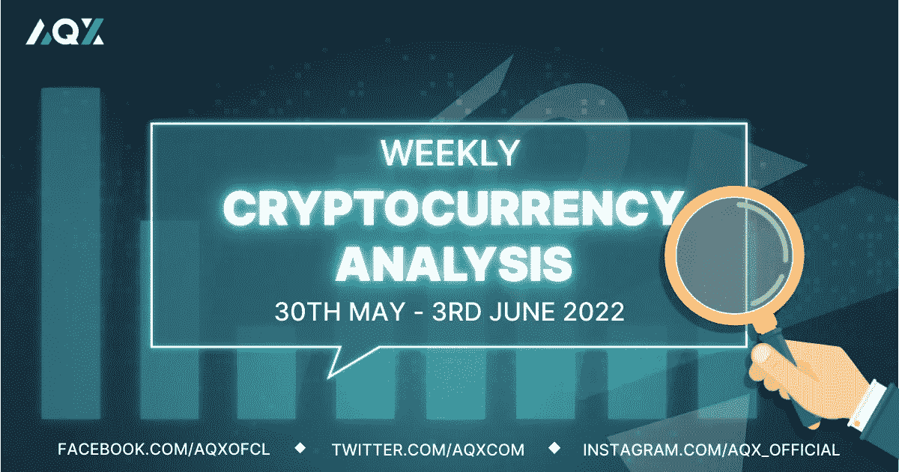

# 每周加密技术分析(5 月 30 日-6 月 3 日)

> 原文：<https://medium.com/coinmonks/weekly-crypto-technical-analysis-30th-may-3rd-june-64f4ec887ef4?source=collection_archive---------55----------------------->

Weekly Crypto Technical Analysis (30th May — 3rd June)

2022 年 5 月 30 日

你好，密码专家，

上周是七周以来标准普尔 500 和纳斯达克首次成功实现周内上涨。5 月份的就业报告将于下周公布，届时我们将更好地了解企业在报告的通胀相关压力下如何处理其就业活动。

在加密市场，让我们看看我们观察名单上的加密货币是如何表现的，即使该行业正试图从 LUNA 的崩溃中恢复过来。

(如果你想分析一种加密货币，只需在本文中发表评论，我们将在下一期每周加密技术分析中的评论中包括加密货币。)

**比特币(BTC)**

Bitcoin (BTC) managed to rally and close above the $30,600 price level (resistance zone).

截至本文撰写之时(2022 年 5 月 30 日)，比特币已经在 30600 美元的价格水平反弹到阻力和供应区。自 5 月 11 日下跌并收于这一数月前支撑位以下以来，BTC 从未突破这一水平。如果比特币能够反弹并收于 30600 美元以上，这将是多头的胜利。

然而，对于公牛队来说，还有许多工作要做。目前，在阻力区有现成的卖家，如当天烛台上长长的上灯芯所示(在这里了解如何阅读我们的文章中的烛台)。因此，展望未来，如果比特币出现持续反弹，我们不仅希望看到价格收于 30，6000 美元以上，而且希望成交量也高于平均水平。

**以太坊**

Ethereum’s (ETH) price action indicates further downside can be expected for the crypto.

在我们之前的文章中，我们提到了以太坊要反转回到上升趋势，ETH 必须开始创造更高的低点和更高的高点，而不是更低的高点和更低的低点。自那篇文章发表以来，ETH 价格不断下跌，不断出现更低的高点和低点。

按市值计算，第二大加密货币的熊市走势更加复杂，下跌日的交易量(红色烛台)高于上涨日的交易量(绿色烛台)。在健康的上升趋势中，情况正好相反。就目前情况而言，可以预计加密货币会进一步下跌。

**索拉纳**

Solana (SOL) has erased all of the gains it made from one year ago.

索拉纳现在回到了一年前的价格水平，抹去了一年来的所有收益。举个例子，7 个月前，SOL 的最高交易价为 260 美元。目前，该密码的交易价格为 46 美元。

随着 50 天和 200 天移动平均线向下倾斜，价格在它们下方交易，索拉纳处于下降趋势。如果下跌趋势结束，首先，我们希望看到价格出现更高的低点(> 40 美元)和更高的高点(> 52 美元)。

**卡尔达诺(阿达)**

Cardano (ADA) is approaching a resistance zone at $59 and how it reacts at this level will give clues to its future price movements.

在过去的几天和几周内，相对于看涨蜡烛线(绿色)，Cardano 通常形成更大的看跌(红色)蜡烛线。与上涨相比，下跌幅度也更大。仅仅从上面的描述中，即使不知道价格波动和移动平均线，我们也能看出 ADA 像我们文章中的许多其他加密货币一样处于下降趋势。

虽然 Cardano 上周设法进行了相对横向的交易，但它未能超过我们在上周的文章中强调的 0.6 美元的价格水平。除非 ADA 开始交易并收盘在 0.6 美元水平以上，否则我仍将保持对该密码的看跌情绪。

莱纳斯（m.）

*免责声明:本文分享的任何观点严格来说是作者的观点和看法，不应被解释为财务建议。AQX 对上传的项目或内容不做任何判断。*

关注我们:

*   推特:【https://twitter.com/AqxCom 
*   电报通知:【https://t.me/aqxannouncement 
*   https://www.facebook.com/AQXofcl:[脸书](https://www.facebook.com/AQXofcl)
*   insta gram:[https://www.instagram.com/aqx_official/](https://www.instagram.com/aqx_official/)
*   中:[https://medium.com/aqx-official](https://medium.com/aqx-official)
*   不和:[https://discord.gg/mn5CNScMev](https://discord.gg/mn5CNScMev)
*   YouTube:[https://www . YouTube . com/channel/UC _ 3J-wzfgdu 2 p 8 nf _ CrjAYg/featured](https://www.youtube.com/channel/UC_3J-wzFgDu2P8NF_CrjAYg/featured)
*   https://www.reddit.com/r/AQX_official/
*   https://www.tiktok.com/@aqx_official
*   领英:[https://www.linkedin.com/company/aqx-official/](https://www.linkedin.com/company/aqx-official/)