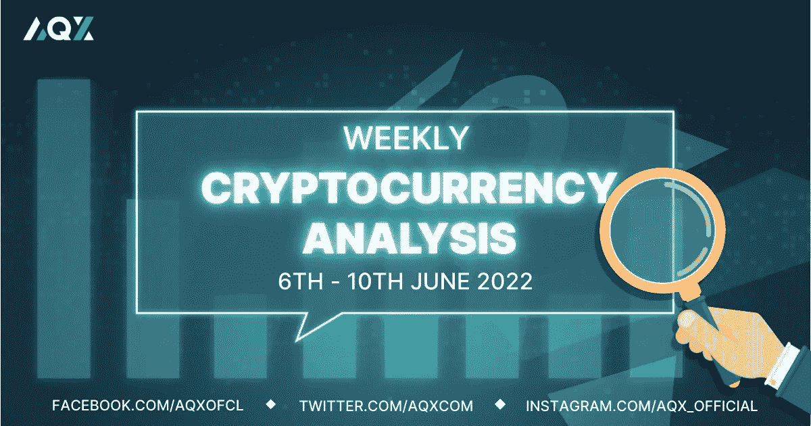

# 每周加密技术分析(6 月 6 日至 10 日)

> 原文：<https://medium.com/coinmonks/weekly-crypto-technical-analysis-6th-10th-june-962e8728d1ae?source=collection_archive---------57----------------------->

Weekly Crypto Technical Analysis (6th — 10th June)

2022 年 6 月 7 日

你好，密码专家，

投资者等待即将到来的 5 月份消费者价格指数，多份报告显示，持续的通胀趋势已经见顶。作为世界第二大经济体，中国取消了一些与 Covid 相关的限制，这给人们带来了希望，即中国的复苏也可能推动全球经济增长。

上周我们观察名单中的加密货币表现如何，我们终于看到加密市场的底部了吗？

(如果你想分析一种加密货币，只需在本文中发表评论，我们将在下一期每周加密技术分析中的评论中包括加密货币。)

**比特币(BTC)**

Bitcoin closed above the $30,600 resistance level but still faces significant overhead supply.

上周，在 5 月 30 日的交易中，比特币以高于平均水平的成交量突破了 30，600 美元的阻力(供应)区。然而，BTC 没过多久就回落到供应区以下，这表明在比特币价格能够持续反弹之前，仍有一些卖家需要淘汰。

截至本文撰写之时，比特币再次在 30600 美元上方交易，并创下了更高的低点。接下来我们希望看到的是一个更高的高点，以确认下降趋势已经结束，新的上升趋势已经到位。要实现这一点，BTC 需要收于 32，400 美元上方。

**以太坊**

Ethereum (ETH) has generally experienced higher volume on down days compared to up days.

与比特币不同，以太坊尚未出现更高的低点，价格仍在不断创造更低的高点和低点。此外，下跌日的交易量通常也高于上涨日的交易量。

唯一积极的消息是以太坊的价格没有跌破 5 月 12 日(大约三周前)创下的低点。除非 ETH 能够形成更具建设性的价格行为(更高的低点和更高的高点&上涨量高于下跌量)，否则我们可能会看到加密的进一步潜在下跌。

**索拉纳**

Solana (SOL) is forming a descending triangle (bearish) pattern.

索拉纳正在创造越来越低的高点和低点，我们可以画一条下降趋势线将这些低点和高点连接起来。下降趋势线加上 35 美元的平坦支撑位给了我们一个[下降三角形模式](https://school.stockcharts.com/doku.php?id=chart_analysis:chart_patterns:descending_triangle_continuation)。下降三角形形态是一种熊市形态，这向我们表明 SOL 可以预期进一步下跌。

也就是说，如果索拉纳能够突破下跌趋势线并以强劲的成交量收盘，那么我们可以看到下跌趋势反转为上涨趋势。

**卡尔达诺(阿达)**

Cardano (ADA) has managed to put in higher lows and higher highs with strong volume on the upside.

在我们观察名单上的加密货币中，Cardano 的价格走势最为积极。ADA 已经设法 1)在一个更高的低点和更高的高点，2)上涨日的交易量通常高于下跌日的交易量，3)回调时的交易量低于反弹时的交易量。

现在，Cardano 正面临 50 天移动平均线，加密货币能够以强劲的交易量收盘，这可能是 Cardano 新的上升趋势的开始。

莱纳斯（m.）

*免责声明:本文分享的任何观点严格来说是作者的观点和看法，不应被解释为财务建议。AQX 对上传的项目或内容不做任何判断。*

> 加入 Coinmonks [电报频道](https://t.me/coincodecap)和 [Youtube 频道](https://www.youtube.com/c/coinmonks/videos)了解加密交易和投资

关注我们:

*   推特:[https://twitter.com/AqxCom](https://twitter.com/AqxCom)
*   电报通知:[https://t.me/aqxannouncement](https://t.me/aqxannouncement)
*   https://www.facebook.com/AQXofcl 脸书
*   insta gram:https://www.instagram.com/aqx_official/
*   中:[https://medium.com/aqx-official](https://medium.com/aqx-official)
*   不和:[https://discord.gg/mn5CNScMev](https://discord.gg/mn5CNScMev)
*   YouTube:[https://www . YouTube . com/channel/UC _ 3J-wzfgdu 2 p 8 nf _ CrjAYg/featured](https://www.youtube.com/channel/UC_3J-wzFgDu2P8NF_CrjAYg/featured)
*   https://www.reddit.com/r/AQX_official/
*   https://www.tiktok.com/@aqx_official
*   领英:[https://www.linkedin.com/company/aqx-official/](https://www.linkedin.com/company/aqx-official/)