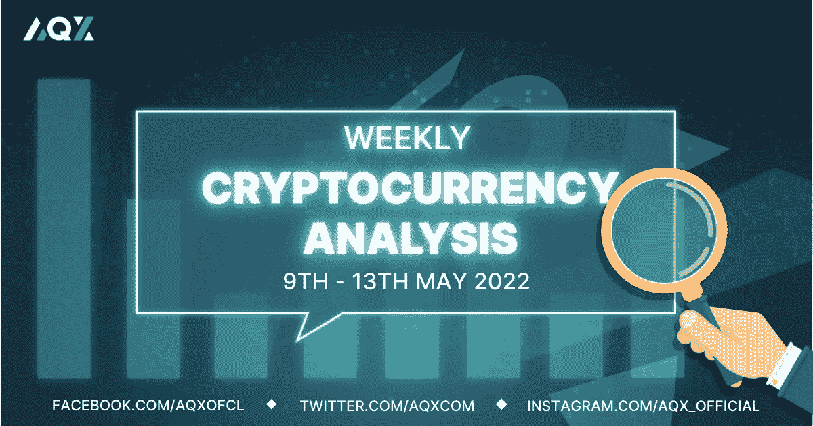
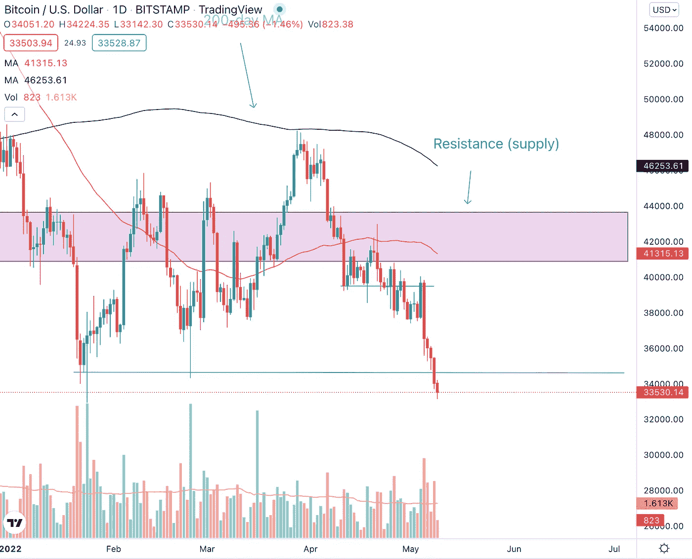
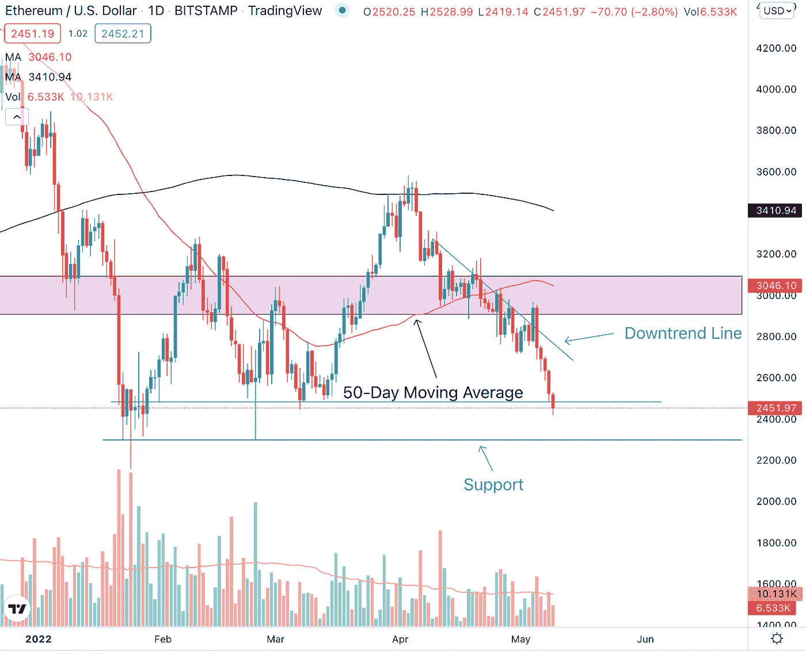
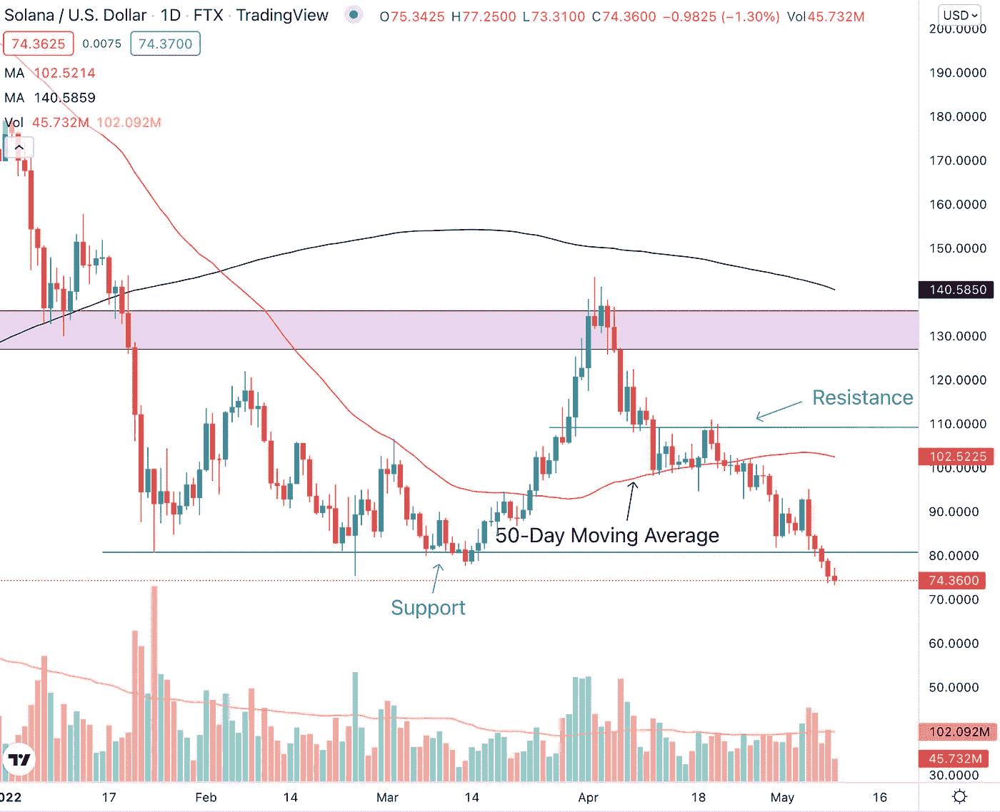
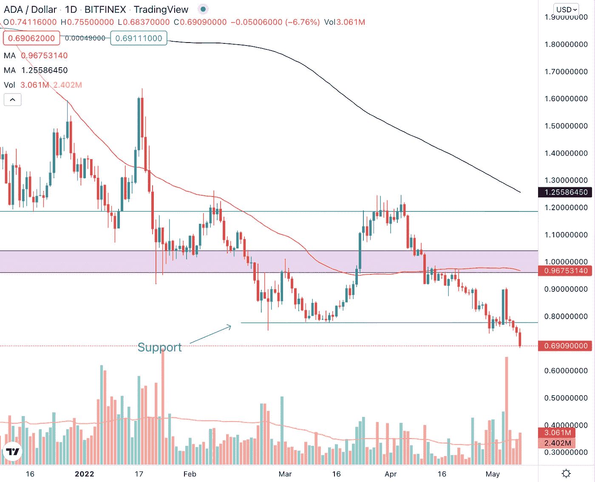

# 每周加密技术分析(5 月 9 日至 13 日)

> 原文：<https://medium.com/coinmonks/weekly-crypto-technical-analysis-9th-13th-may-b457c3ad6717?source=collection_archive---------58----------------------->

Weekly Crypto Technical Analysis (9th — 13th May)

2022 年 5 月 9 日

你好，密码专家，

为了对抗通货膨胀，美联储将利率提高了 20 多年来的最高水平。10 年期国债收益率自 2018 年以来首次超过 3%。股票继续下滑。

让我们来看看在这种环境下，我们观察名单上的加密货币表现如何。

(请继续评论，我们将在下一期每周加密技术分析的评论中加入加密货币。简单评论一下这篇文章。)

**比特币(BTC)**

Bitcoin (BTC) had four consecutive bearish trading sessions that were accompanied by above-average volume.

比特币经历了连续四个交易日的价格下跌，其中三个交易日的下跌量是平均水平的两倍以上。为了进一步加剧上周的价格下跌，BTC 跌破了 34，580 美元的主要支撑位。跌破这一重要支撑位发生在 5 月 8 日的交易时段，交易量高于平均水平。

目前，比特币比支撑位低 4.2%，尽管这一跌破支撑位可能预示着加密货币的进一步下行，但这也可能是淘汰弱势持有者的潜在震荡。因此，向前看，关注比特币在 34580 美元的价格水平上的反应非常重要。

**以太坊**

Ethereum (ETH) had a false break above the downtrend line before it came crashing back below.

在之前的每周加密技术分析文章中，尽管以太坊在 5 月 4 日的交易时段成功突破了下降趋势线，但我们强调了成交量的缺乏，这表明在下降趋势线上方的推动失败的可能性较高。

紧接着的交易时段，ETH 在高于平均水平的成交量下回落至下降趋势线以下。目前，以太坊处于 2480 美元价格水平的次要支撑位，如果加密有进一步的下跌，下一个主要支撑位是 2300 美元水平。

**索拉纳**

Solana (SOL) remains below the $80 support level and the longer it stays, the higher the downside probability.

索拉纳上周下跌 15.97%，一路跌破 80 美元支撑位。SOL 在以前的情况下确实跌破这个支撑位，但是，它们往往是暂时的和浅的突破，如 2 月 24 日和 3 月 13/14 日的交易时段所示。

截至本文撰写时，索拉纳已经在支撑位下方收盘三天了。索拉纳在 80 美元支撑位下方停留的时间越长，SOL 下跌的可能性就越大。

**卡尔达诺(阿达)**

Cardano (ADA) had a very bearish price and volume action on the 5th May trading session.

5 月 5 日对 Cardano 来说是一个非常熊市的交易时段，因为当天价格不仅下跌了 12.22%，而且下跌量是平均量的 4 倍以上。这表明在那个交易时段有很大的抛售压力，卖家控制了局面。

在那个交易时段之后，ADA 跌破 0.77 美元的支撑位，并连续多个熊市交易时段，收盘价格低于前一个交易时段。随着跌破这一支撑位，从去年的价格走势来看，附近没有任何明显的支撑位可供我们参考。

不顾一切，

莱纳斯（m.）

*免责声明:本文分享的任何观点严格来说是作者的观点和看法，不应被解释为财务建议。AQX 对上传的项目或内容不做任何判断。*

关注我们:

*   推特:【https://twitter.com/AqxCom 
*   电报通知:【https://t.me/aqxannouncement 
*   https://www.facebook.com/AQXofcl:[脸书](https://www.facebook.com/AQXofcl)
*   insta gram:[https://www.instagram.com/aqx_official/](https://www.instagram.com/aqx_official/)
*   中:[https://medium.com/aqx-official](https://medium.com/aqx-official)
*   不和:[https://discord.gg/mn5CNScMev](https://discord.gg/mn5CNScMev)
*   YouTube:[https://www . YouTube . com/channel/UC _ 3J-wzfgdu 2 p 8 nf _ CrjAYg/featured](https://www.youtube.com/channel/UC_3J-wzFgDu2P8NF_CrjAYg/featured)
*   https://www.reddit.com/r/AQX_official/
*   https://www.tiktok.com/@aqx_official
*   领英:[https://www.linkedin.com/company/aqx-official/](https://www.linkedin.com/company/aqx-official/)

> 加入 Coinmonks [电报频道](https://t.me/coincodecap)和 [Youtube 频道](https://www.youtube.com/c/coinmonks/videos)了解加密交易和投资

# 另外，阅读

*   [印度最佳 P2P 加密交易所](https://coincodecap.com/p2p-crypto-exchanges-in-india) | [柴犬钱包](https://coincodecap.com/baby-shiba-inu-wallets)
*   [八大加密附属计划](https://coincodecap.com/crypto-affiliate-programs) | [eToro vs 比特币基地](https://coincodecap.com/etoro-vs-coinbase)
*   [最佳以太坊钱包](https://coincodecap.com/best-ethereum-wallets) | [电报上的加密货币机器人](https://coincodecap.com/telegram-crypto-bots)
*   [交易杠杆代币的最佳交易所](https://coincodecap.com/leveraged-token-exchanges) | [购买 Floki](https://coincodecap.com/buy-floki-inu-token)
*   [3 commas vs . Pionex vs . crypto hopper](https://coincodecap.com/3commas-vs-pionex-vs-cryptohopper)|[Bingbon Review](https://coincodecap.com/bingbon-review)