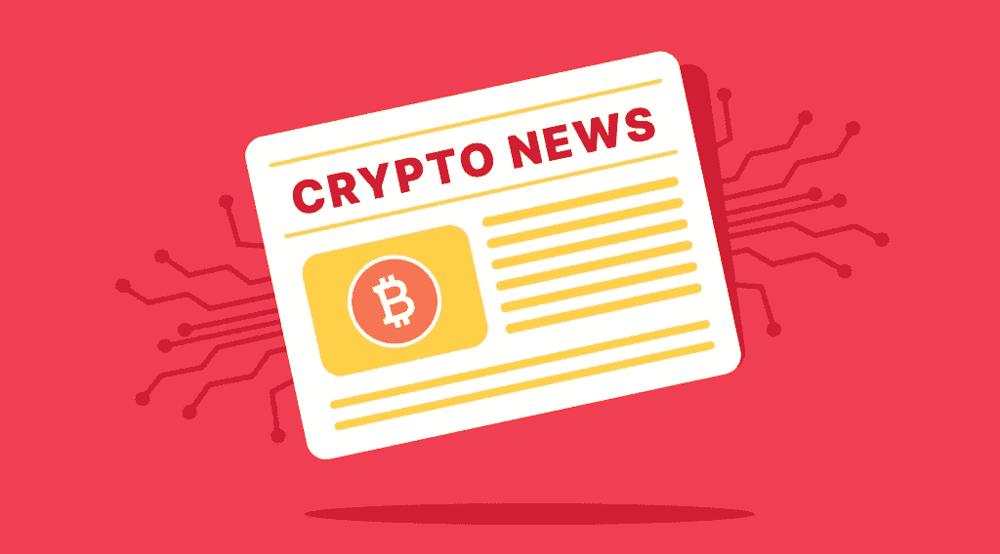
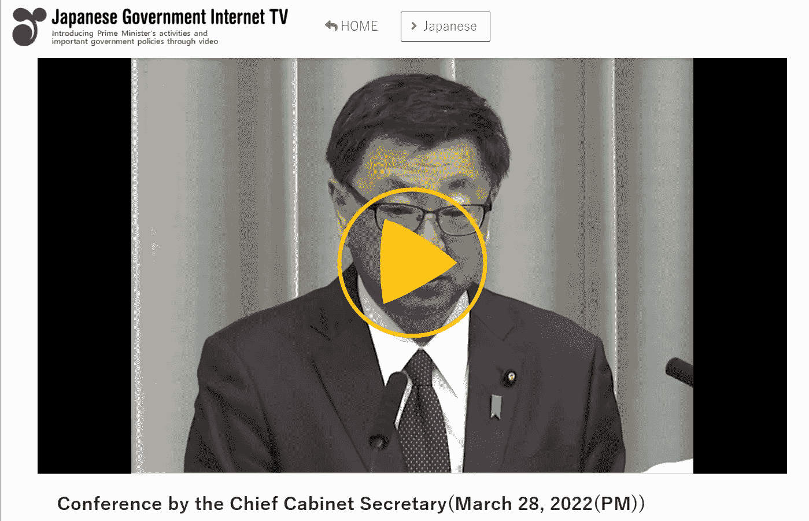
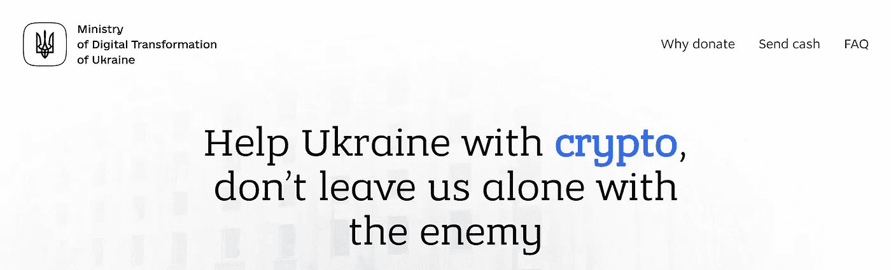

# 主要加密事件每周摘要—2022 年 3 月 30 日

> 原文：<https://medium.com/coinmonks/weekly-digest-of-the-main-crypto-events-march-30-2022-6774a336ffd?source=collection_archive---------33----------------------->

庞大而强大的全球密码产业继续发展。里约热内卢当局打算批准用比特币支付税款，欧洲议会将投票支持对加密货币用户进行强制验证，印度已经对数字资产的收入征税。

与此同时，在持续的战争中，日本正在收紧加密交换规则，以防止俄罗斯用户规避制裁，加密货币正在拯救乌克兰人的生命。阅读我们的新闻摘要，了解加密货币领域的主要事件。

# 日本监管机构收紧加密货币兑换规则

日本政府计划修改关于加密货币监管的立法。作为遵守制裁立法的一部分，它还计划加强对密码交换和服务的控制。

根据内阁发言人松野的说法，日本将坚持对某些国家的金融限制政策，不会允许数字货币的犯罪使用。

[Conference by the Chief Cabinet Secretary](https://nettv.gov-online.go.jp/eng/prg/prg7651.html)

将要求地方密码交易所跟踪资金的流动，并限制制裁名单上的用户进行交易。

首先，与俄罗斯官员、寡头和银行相关的账户将被冻结。

三月中旬，日本政府和加密公司之间的谈判开始为人所知。东京呼吁交易所和交易所完全停止为受到制裁的个人和法律实体提供服务。

# 俄罗斯矿业的合法化

3 月 26 日，俄罗斯联邦能源部副部长叶夫根尼·格拉布恰克(Evgeny Grabchak)表示，“有必要尽快消除加密货币开采领域的法律真空。”

他指出，在地区一级，而不是在联邦一级，确定采矿地点并为矿工分配免费能源容量更为有利，这应与地区发展计划相关联。

根据 Grabchak 的说法，市场进程不会调节矿工的安置和数量，当采矿在俄罗斯获得更多动力并导致电价上涨时，人们不应指望其中一些人会自发离开。

今年 1 月，俄罗斯银行发表了一份报告，其中建议禁止加密货币在俄罗斯的发行、开采和流通。后来，财政部提出了自己的加密市场监管概念。其中一项提议是通过俄罗斯银行进行所有加密货币操作。

普京总统呼吁政府和中央银行就加密货币的监管达成共识，并报告结果。2 月，政府批准了监管数字货币流通的概念，这是基于财政部的建议。

# 里约热内卢将批准使用 BTC 纳税

里约热内卢政府计划对有关加密货币的立法进行修订。他们将允许居民通过 BTC 缴纳财产税。

当局将雇佣一家专门从事 BTC 兑换巴西雷亚尔的公司。

目前还不知道哪家公司将成为中介，但早些时候市长赵昌鹏称，他已经与里约热内卢市长讨论了这个问题。

里约热内卢市长办公室还计划就 NFT 区的发展举行公开听证会。特别是，它提议发行带有城市地标图像的不可替代的代币。

> “我们在这里的努力是要表明，在里约市，我们有承认这个市场的官方举措。现在，那些投资加密货币并居住在里约市的人将能够在这里花费这笔资产，并在里约市缴纳官方税。里约热内卢市长爱德华多·派斯(Eduardo Paes)说

在里约热内卢，他们还讨论了成立加密投资市政委员会(CMCI)的事宜。它将负责开发和改进基于风险和盈利能力分析的方法，以确保资源能够投资于加密资产。

# 欧洲议会将投票支持对加密货币用户进行强制验证

3 月 31 日，欧洲议会经济和货币事务委员会(ECON)将投票取消所有加密货币交易的匿名化。立法者打算将 Ledger 和 Metamask 等钱包整合到反洗钱(AML)方案中。根据新规定，公司将被要求核实所有价值超过€1000 万英镑(1098 美元)的交易。打击匿名交易得到了立法者的广泛支持:最有可能的是，将有足够的票数通过该法案。

# 印度对加密收入征税

3 月底，印度当局对任何来自数字资产的收入征收 30%的税。除了收购资产的成本，没有其他扣除。转让数字资产的损失不能与任何其他收入抵消。此外，印度当局对数字资产转让支付的款项征收 1%的预提税。

除此之外，印度将在 4 月 1 日开始的下一个财政年度推出其国家数字货币——数字卢比。当局预计，央行的数字货币将推动印度的数字经济。

# 加密货币在战争中拯救了乌克兰人的生命

在俄罗斯军事入侵期间，乌克兰政府创建了一个以加密货币收集捐款的网站。在“援助乌克兰”网站上，可以用十种不同的加密货币进行捐赠，这些货币随后会被兑换成美元。

[Aid for Ukraine website](https://donate.thedigital.gov.ua/)

这些资金用于支持乌克兰军人和平民。FTX 平台在巴哈马注册，乌克兰公司 Everstake 和 Kuna 参与了该项目。在编写本报告时，乌克兰已收到超过 9650 万美元的加密资产捐赠。

总之，我们可以说，尽管地缘政治高度紧张，全球宏观经济指标恶化，但数字资产领域正在发展，加密货币的大规模采用过程仍在继续。

最后，如果你决定加入加密社区，你可以开始在[即时加密交易所 StealthEX](https://stealthex.io/) 购买自己的硬币。这项服务免注册，不将用户的资金存放在平台上。

# [如何用信用卡购买密码？](https://stealthex.io/blog/2021/03/23/how-to-buy-crypto-with-credit-card/)

就去 [StealthEX](https://stealthex.io/?from=btc&to=eth&amount=0.1) 。打开[购买密码](https://stealthex.io/?amount=100&from=usd&to=btc)窗口，而不是自动加载的交易所。

1.  然后选择法定货币，并选择您想要购买的加密货币。例如，美元对 [BTC](https://stealthex.io/coin/btc) 。
2.  输入您的加密钱包地址。
3.  同意 StealthEX 的服务条款。首次购买 crypto 时，您需要确认您的身份并输入 Mercuryo 系统要求的数据。一旦所有提供的信息将被确认，您将能够购买加密，而无需通过这一程序了。
4.  发送菲亚特，等待您的购买通过！

在 [Medium](https://stealthex-io.medium.com/) 、 [Twitter](https://twitter.com/Stealthex_io) 、 [Telegram](https://t.me/StealthEX) 、 [YouTube](https://www.youtube.com/channel/UCeES_XBesX76ge7xf1meuSw) 和 [Reddit](https://www.reddit.com/user/Stealthex_io) 上关注我们，获取 [StealthEX.io](https://stealthex.io/) 的更新和关于密码世界的最新消息。对于所有请求，请通过 support@stealthex.io 给我们发消息。

此处表达的观点仅代表作者个人观点。每一次投资和交易都有风险。做决定时，你应该进行自己的研究。

非常欢迎您访问 [**StealthEX 交易所**](https://stealthex.io/) **，看看它有多快多方便**。

> 加入 Coinmonks [电报频道](https://t.me/coincodecap)和 [Youtube 频道](https://www.youtube.com/c/coinmonks/videos)了解加密交易和投资

# 另外，阅读

*   [Bookmap 评论](https://coincodecap.com/bookmap-review-2021-best-trading-software) | [美国 5 大最佳加密交易所](https://coincodecap.com/crypto-exchange-usa)
*   最佳加密[硬件钱包](/coinmonks/hardware-wallets-dfa1211730c6) | [Bitbns 评论](/coinmonks/bitbns-review-38256a07e161)
*   [新加坡十大最佳加密交易所](https://coincodecap.com/crypto-exchange-in-singapore) | [购买 AXS](https://coincodecap.com/buy-axs-token)
*   [红狗赌场评论](https://coincodecap.com/red-dog-casino-review) | [Swyftx 评论](https://coincodecap.com/swyftx-review) | [CoinGate 评论](https://coincodecap.com/coingate-review)
*   [投资印度的最佳密码](https://coincodecap.com/best-crypto-to-invest-in-india-in-2021)|[WazirX P2P](https://coincodecap.com/wazirx-p2p)|[Hi Dollar Review](https://coincodecap.com/hi-dollar-review)