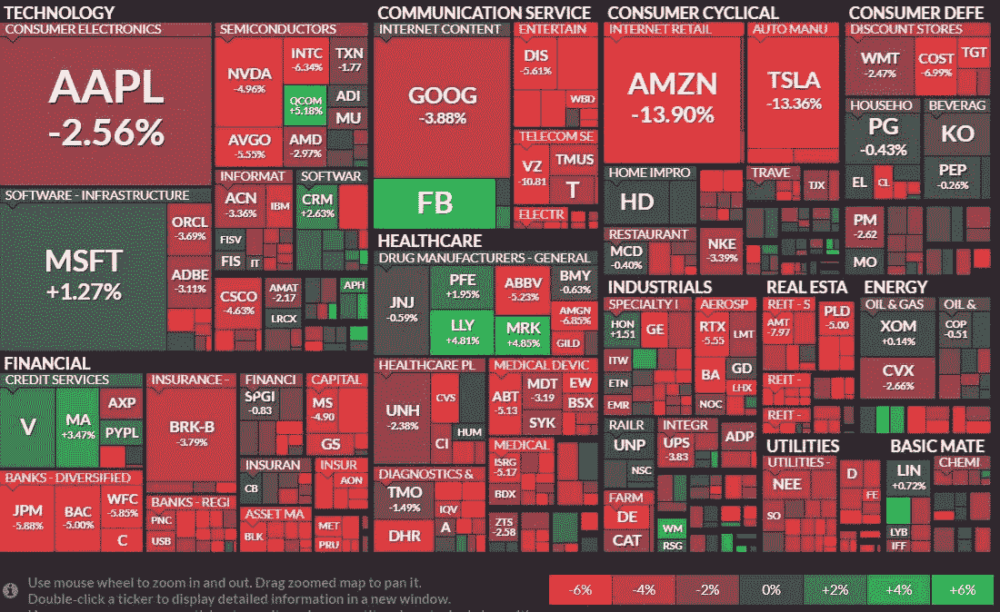
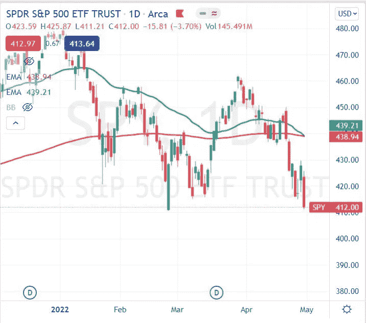
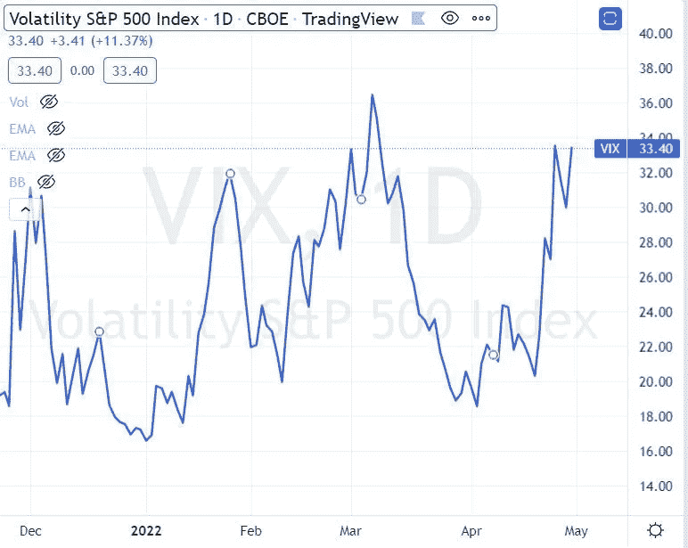
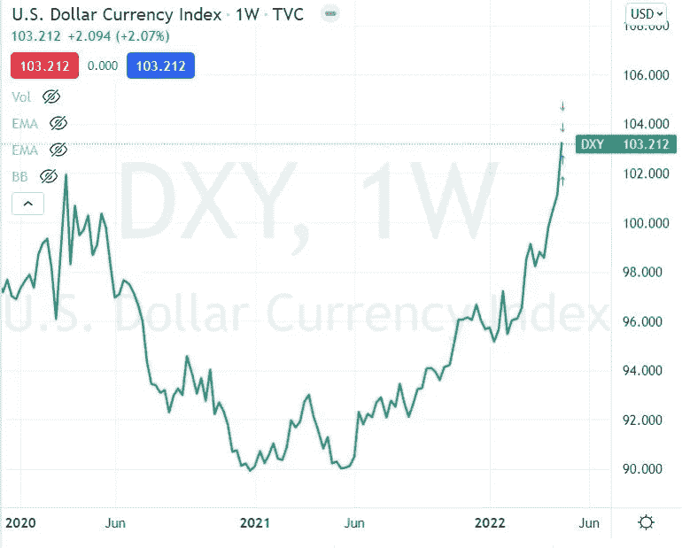
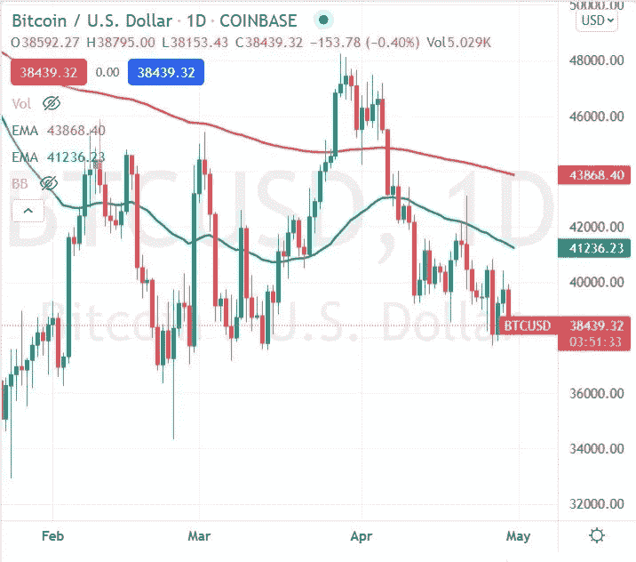

# 每周市场报告—2022 年 5 月 1 日

> 原文：<https://medium.com/coinmonks/weekly-market-report-5-1-2022-131367feb17f?source=collection_archive---------57----------------------->

While this week was incredibly red, there was notable market outperformance from MSFT, FB, V and PFE. (Source: finviz)

战争、通胀、加息、供应链约束、中国封锁和疫情——这是丑陋的一周，无可回避。随着亚马逊、微软和苹果公布财报，所有板块收盘走低。SPY 继续收在 50 和 200 日均线以下，指数移动平均线和“死亡交叉”似乎即将来临(死亡交叉是指 50 均线绿线移动到 200 均线红线以下)。非必需消费品、房地产和公用事业受到的冲击最大。ARKK 今年的股价下跌了 60%以上。GLD 下跌近 2%，SLV 下跌超过 5%。天然气和石油分别上涨了+10%和+1%。虽然 XHB(住宅建筑商)衰落了，家得宝和 Lowes 却能够发展出一个小的<1% gain each. Did anyone notice that Sherwin Williams and BABA climbed over +12% this week?

The VIX continues to trade north of 30, making long puts expensive, and short premium selling strategies favorable.

The US dollar continued to rise this week almost +2%, although on Friday, strength in the Euro and GBP were starting to show as the dollar started to weaken.

Trading around 38,000, BTC is down almost -3%, and ETH is below 2,800\. BTC has a .61 correlation with the Nasdaq (QQQ) over the past 3 months, and is getting higher (to .71) over the past 10 days.(correlation source: [The Trade Risk](https://moneyvikings.us6.list-manage.com/track/click?u=6e6d68c1dcf85d431c4821ef5&id=31603d8dfc&e=2f8d21ca4d) and [Macroaxis](https://moneyvikings.us6.list-manage.com/track/click?u=6e6d68c1dcf85d431c4821ef5&id=ad6e0d5d59&e=2f8d21ca4d)).

> *加入 Coinmonks* [*电报频道*](https://t.me/coincodecap) *和* [*Youtube 频道*](https://www.youtube.com/c/coinmonks/videos) *了解加密交易和投资*

# 另外，阅读

*   [Bookmap 评论](https://coincodecap.com/bookmap-review-2021-best-trading-software) | [美国 5 大最佳加密交易所](https://coincodecap.com/crypto-exchange-usa)
*   最佳加密[硬件钱包](/coinmonks/hardware-wallets-dfa1211730c6) | [Bitbns 评论](/coinmonks/bitbns-review-38256a07e161)
*   [新加坡十大最佳加密交易所](https://coincodecap.com/crypto-exchange-in-singapore) | [购买 AXS](https://coincodecap.com/buy-axs-token)
*   [红狗赌场评论](https://coincodecap.com/red-dog-casino-review) | [Swyftx 评论](https://coincodecap.com/swyftx-review) | [CoinGate 评论](https://coincodecap.com/coingate-review)
*   [投资印度的最佳密码](https://coincodecap.com/best-crypto-to-invest-in-india-in-2021)|[WazirX P2P](https://coincodecap.com/wazirx-p2p)|[Hi Dollar Review](https://coincodecap.com/hi-dollar-review)