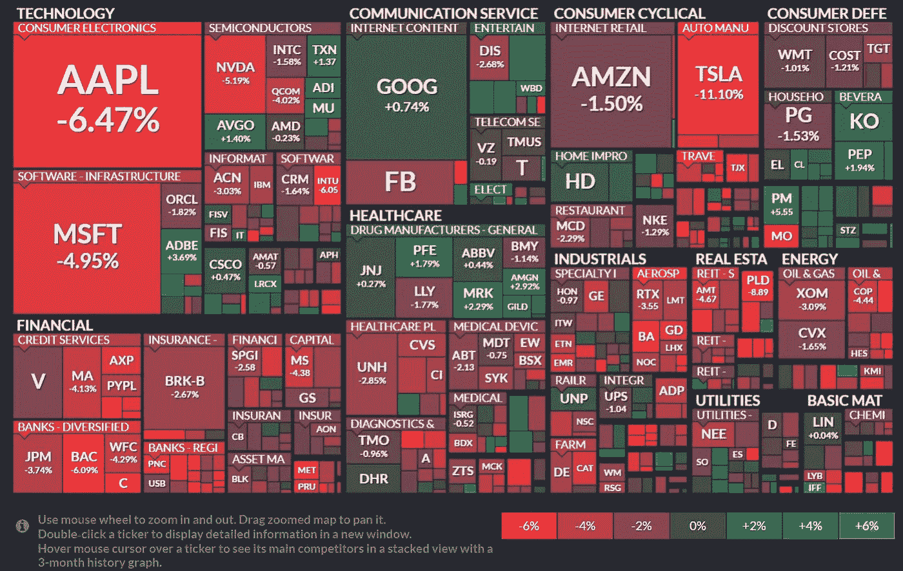

# 每周市场报告—2012 年 5 月 15 日

> 原文：<https://medium.com/coinmonks/weekly-market-report-5-15-22-6cc2170cdb86?source=collection_archive---------37----------------------->

**每周市场报告—** 标准普尔 500 指数本周下跌 2.41%，但在过去的周三和周四的不同时间里，该指数甚至更低。最终，周四出现反弹，周五出现缺口，但这不足以将指数拉成绿色。除了日用消费品，所有行业都有所回落。

