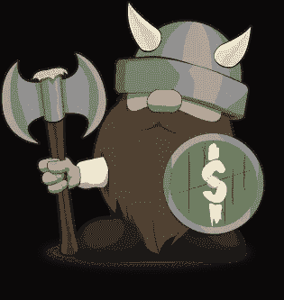

# 每周市场报告—2022 年 5 月 9 日

> 原文：<https://medium.com/coinmonks/weekly-market-report-5-9-2022-24ca9b3fd053?source=collection_archive---------19----------------------->

**每周市场报告——让我们对抗通货膨胀—** 这一周无疑是过山车。杰罗姆·鲍威尔(Jerome Powell)加息 50 个基点(正如预期的那样)，市场出现反弹——然后在接下来的两天里全部回吐，还有一些回吐。

**每周加密报告—** 交易在 34，500 左右，BTC 本周下跌超过 10%，自 1 月以来首次交易低于 35，000。在过去的 10 天里，BTC 与标准普尔 500 指数有 72%的相关性。我继续用 [Gemini Crypto BTC 奖励信用卡](https://gemini.com/share/ndkkvewc9)积累 BTC，并寻找下注机会赚取我的长期加密持有的利息..

美元本周上涨了约 0.5%，但似乎正遭遇 104 的阻力。交易风险指出，美元与全球股票市场和垃圾债券等风险资产有很强的负相关性。

本周大部分时间 VIX 继续在 30 上方交易。

收益率继续上升。本周，30 年期和 10 年期国债收益率均超过 3%，距离反转仅 8 个基点(自 4 月以来的第二次)。同样值得注意的是，就在上周，30 年期国债上涨了近 10%。

标准普尔 500 指数 200 均线(红线)和 50 均线(绿线)形成了一个“死亡交叉”，这是一个看跌未来的技术指标。房地产受到重创，下跌-3.80%。金价下跌了 2%多一点。然而，并非所有人都悲观失望，能源板块涨幅超过 10%。

如果你喜欢这份简讯，请考虑成为[金钱维京人高级会员](http://me.dm/r-_gCYxatDr1?source=email-d089059f586e-1650168826489-newsletter.subscribeToProfile-------------------------f43e7fb2_a5b1_40b2_80e6_74a9efa8d939--------599ed243e542)以获得更多见解、热门交易和健康提示。第一个月使用 code **medium** 享受五折优惠。

*保留所有权利。Money Vikings，LLC 既不是投资顾问也不是财务顾问。Money Vikings，LLC 不提供金融建议，所提供的任何信息都不应被视为金融建议。这包括但不限于 Money Vikings，LLC 提供的任何文章、视频和/或任何其他社交媒体渠道。所有内容都是作者和 Money Vikings，LLC (Greg，Jerry 和 Bob)的观点、信仰和个人策略。Money Vikings，LLC 建议每个人在开始任何由自己的理解、能力和风险承受能力支持的交易活动之前，做自己的研究、技术分析，并得出自己的结论。所有交易都带有内在风险，因此应相应地使用适当的风险管理策略。Money Vikings，LLC 不保证结果，也不对任何个人或组织所遭受的损失承担任何责任。我们可能会定期强调我们正在使用的服务，并可能从他们各自的附属计划中获得补偿。*

> 加入 Coinmonks [电报频道](https://t.me/coincodecap)和 [Youtube 频道](https://www.youtube.com/c/coinmonks/videos)了解加密交易和投资

# 另外，阅读

*   [什么是融资融券交易](https://coincodecap.com/margin-trading) | [成本平均法](https://coincodecap.com/dca)
*   [支持卡审核](https://coincodecap.com/uphold-card-review) | [信任钱包 vs 元掩码](https://coincodecap.com/trust-wallet-vs-metamask)
*   [Exness 回顾](https://coincodecap.com/exness-review)|[moon xbt Vs bit get Vs Bingbon](https://coincodecap.com/bingbon-vs-bitget-vs-moonxbt)
*   [如何开始通过加密贷款赚取被动收入](https://coincodecap.com/passive-income-crypto-lending)
*   [BigONE 交易所评论](/coinmonks/bigone-exchange-review-64705d85a1d4) | [电网交易 Bot](https://coincodecap.com/grid-trading)
*   [氹欞侊贸易评论](https://coincodecap.com/anny-trade-review) | [CoinSpot 评论](https://coincodecap.com/coinspot-review)
*   [新加坡十大最佳加密交易所](https://coincodecap.com/crypto-exchange-in-singapore) | [收购 AXS](https://coincodecap.com/buy-axs-token)