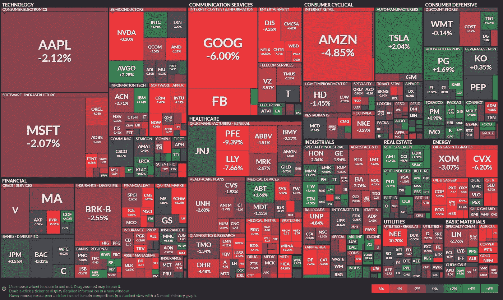
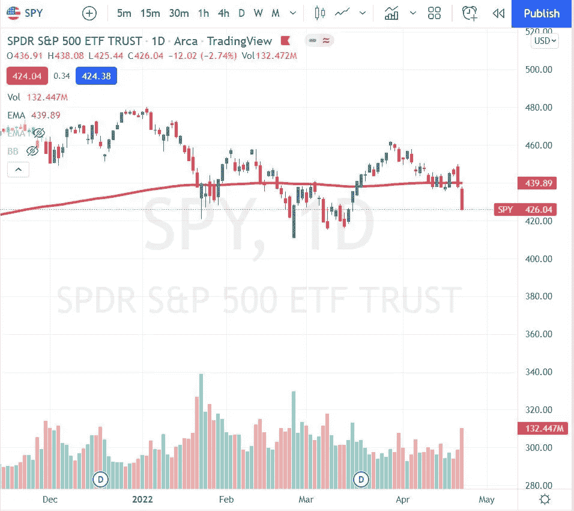
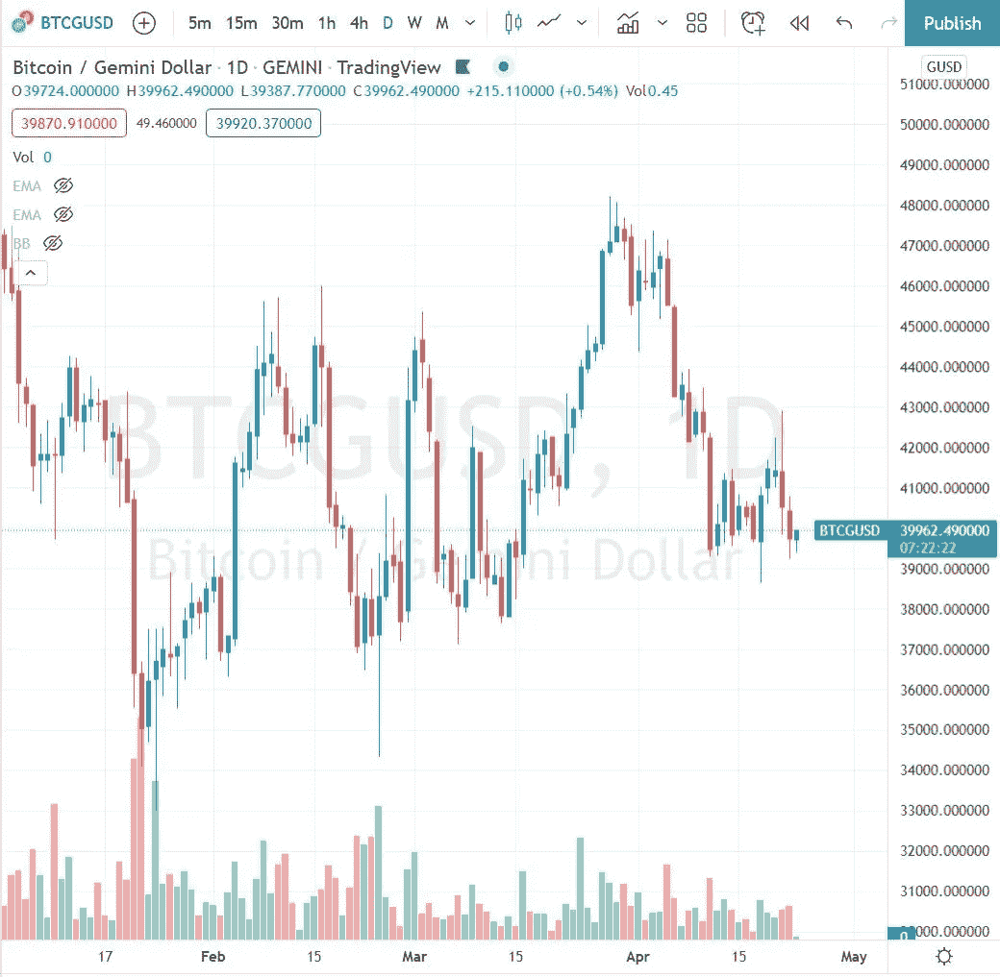
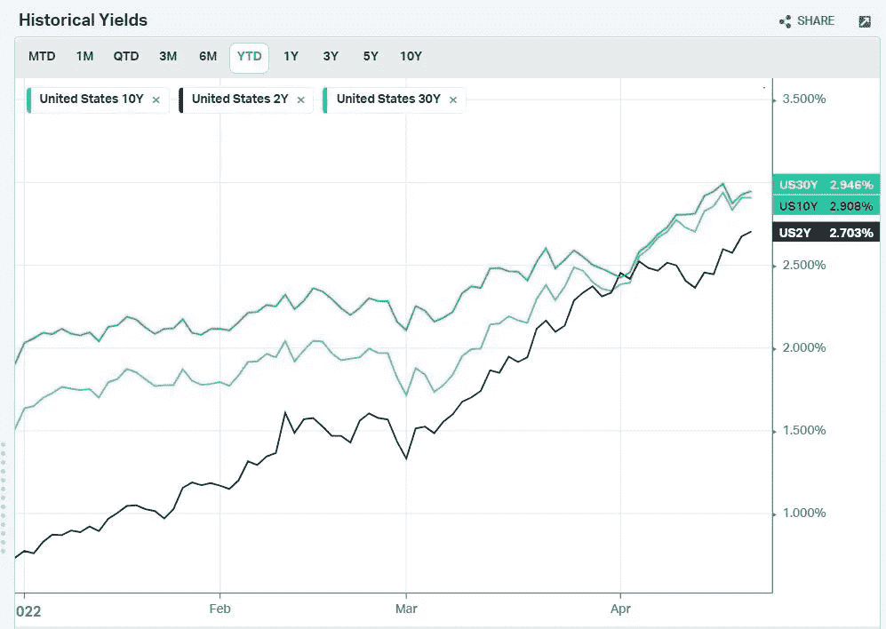
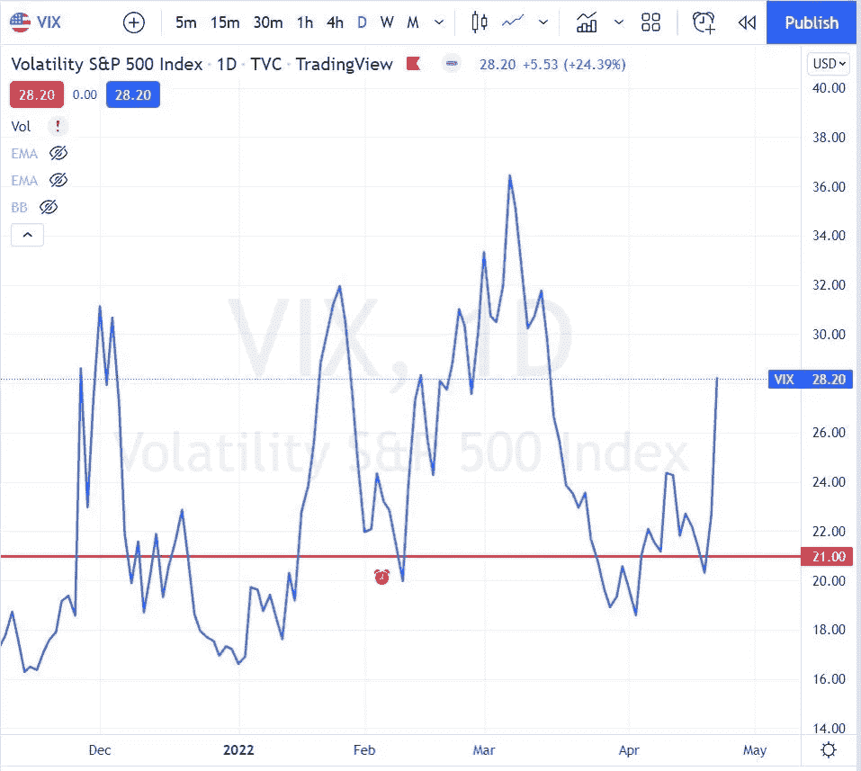
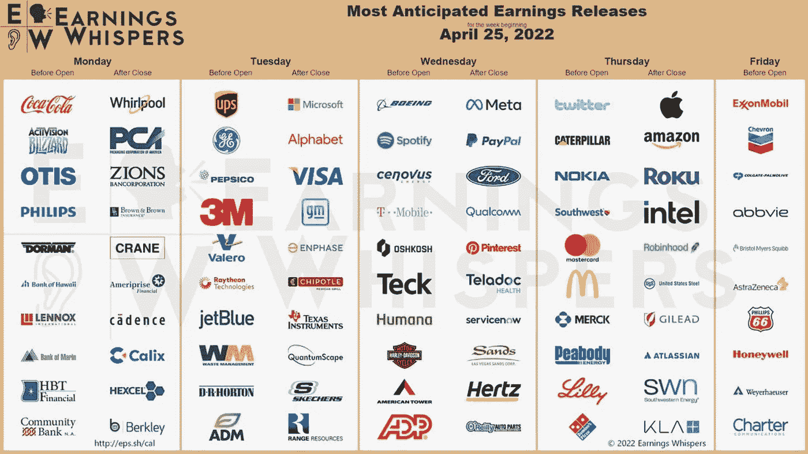
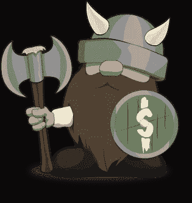

# 每周市场报告—2022 年 4 月 25 日

> 原文：<https://medium.com/coinmonks/weekly-market-report-april-25th-2022-f03552ff5c85?source=collection_archive---------31----------------------->

这是底部，还是仅仅是开始？

**每周市场报告—** 标准普尔 500 指数(SPY)再次下跌 2.75%。它继续在 200 日均线(红线)下方交易。唯一领先的板块是房地产+1.25%和消费品+0.51%。今年领跌的能源板块下跌了 4.5%。本周受打击最大的是通信板块，跌幅超过 7%。虽然人们可能会选择 GLD(下跌 2%)、石油(下跌 4%)和农产品(下跌 5.42%)等大宗商品，但它们本周的表现都不好。

**每周加密报告—** BTC 继续在一个区间内交易，本周相对持平。本周大部分时间交易于 40，000 下方，并保持在 50 和 200 均线下方。[与此同时，我在 BTC](https://crypto.com/app/yjq2px82d2) 上押了注，赚了 6%。

利率继续攀升，10 年期(蓝色)和 30 年期(绿色)之间的差距继续缩小。对于那些参与我们不和的人，我们能够通过简单的配对交易，在一夜之间做空 10 年期债券，做多 2 年期债券，获利约 68 美元。

在交易周的最后两天，VIX 指数从 19 左右飙升至 28 以上。图表上的红线是我在 21 日卖出的 5/18 看跌期权(看涨),试图从这次上涨中获得一点溢价。如果你认为 VIX 将继续上升，你也可以积累 UVXY。

对于下周以下公司的收益是否有助于扭转市场，媒体似乎有一些争论。对于以下公司 5 月份的头寸，如可口可乐、惠而浦、微软、福特、苹果、亚马逊、艾伯维，我正在仔细观察，并将寻找风险确定的机会卖出溢价。

# 我们藏在哪里？

[*Fundrise*](https://fundrise.com/i/9582x?utm_source=fundrise&utm_campaign=ios_share) *再一次做到了这一点，并向这群资助“eREIT”的所有者交付了出色的结果。我长期投资，并期待更多年的回报。*

**基金增长概述(10–20%以上的回报率)**

*   获得房地产行业曝光率的简单方法，令人敬畏的外观和有趣的平台，令人兴奋的更新，几下点击即可投资
*   1000 美元的小额最低投资
*   管理和咨询费通常加起来是 1%，但要注意其他费用，尤其是 1 年、3 年甚至 5 年前的提前提款。我尝试了 5 年
*   2017–2021 年的投资回报率超过 18.4%(所有投资都有一定程度的风险，过去的回报不能保证未来的回报)
*   在下跌周期中未经测试的平台，不知道如果投资者大规模挤兑他们的资金，崩溃时会发生什么。
*   底线观点:值得考虑增加投资组合的多样化，一旦所有其他基本的个人财务状况都检查过了:最大 401k，合理的债务负担，应急基金，稳定的就业，很多年都不需要使用这些资金…

如果你喜欢这份简讯，请考虑成为[金钱维京人高级会员](https://email.mg1.substack.com/c/eJxdkMtuwyAQRb_GLC08YBsWLCpV-Q2Lx8ShscHikcp_X9xsqkojZnGBo3usLrjGdKoj5kKuYynngSrgd96wFEykZkyLd4rTic9CzsQpOoOdDfF5uSfEXftNkaOazVtdfAzXbSY5F0AeyvJxNnetmaBGsAGdccKNE3Bg1krt3lBdncdgUeEL0xkDkk09Sjlyxz46uLU5Eu6-7v3ewvPlnz6subdxv1J2O_SKDduxT8mZIF4BBaAMZmBUjqyHXk9SaDkh2MGMIG3_0HUbYnx1nO7r0OdqctH2ef1JkvrClM4r-oe7ei5t7zX4ci4YtNnQqZIqkvK2-CtkWTFganbdoosaJi44wCi5mMZ34-ZoHIamSTDS2C62V0H9xf0AcbuLiA)以获得更多见解、热门交易和健康提示。第一个月使用 code **medium** 可享受 50%的优惠。

> 加入 Coinmonks [电报频道](https://t.me/coincodecap)和 [Youtube 频道](https://www.youtube.com/c/coinmonks/videos)了解加密交易和投资

# 另外，阅读

*   [如何在 FTX 交易所交易期货](https://coincodecap.com/ftx-futures-trading) | [OKEx vs 币安](https://coincodecap.com/okex-vs-binance)
*   [OKEx vs KuCoin](https://coincodecap.com/okex-kucoin) | [摄氏替代品](https://coincodecap.com/celsius-alternatives) | [如何购买 VeChain](https://coincodecap.com/buy-vechain)
*   [ProfitFarmers 点评](https://coincodecap.com/profitfarmers-review) | [如何使用 Cornix 交易机器人](https://coincodecap.com/cornix-trading-bot)
*   [如何匿名购买比特币](https://coincodecap.com/buy-bitcoin-anonymously) | [比特币现金钱包](https://coincodecap.com/bitcoin-cash-wallets)
*   [瓦济里克斯 NFT 评论](https://coincodecap.com/wazirx-nft-review)|[Bitsgap vs Pionex](https://coincodecap.com/bitsgap-vs-pionex)|[坦吉姆评论](https://coincodecap.com/tangem-wallet-review)