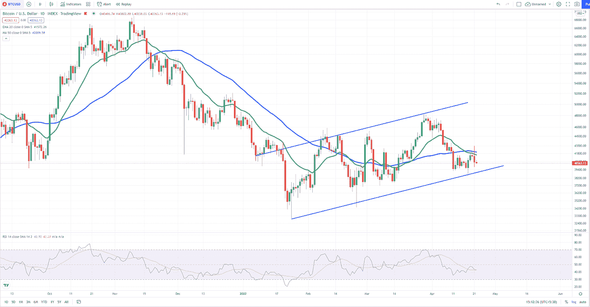
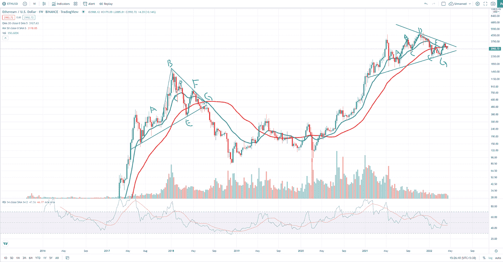
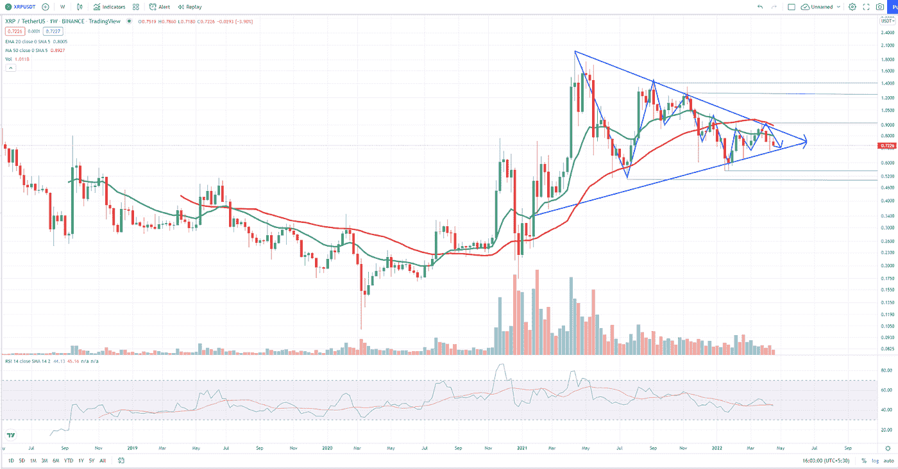
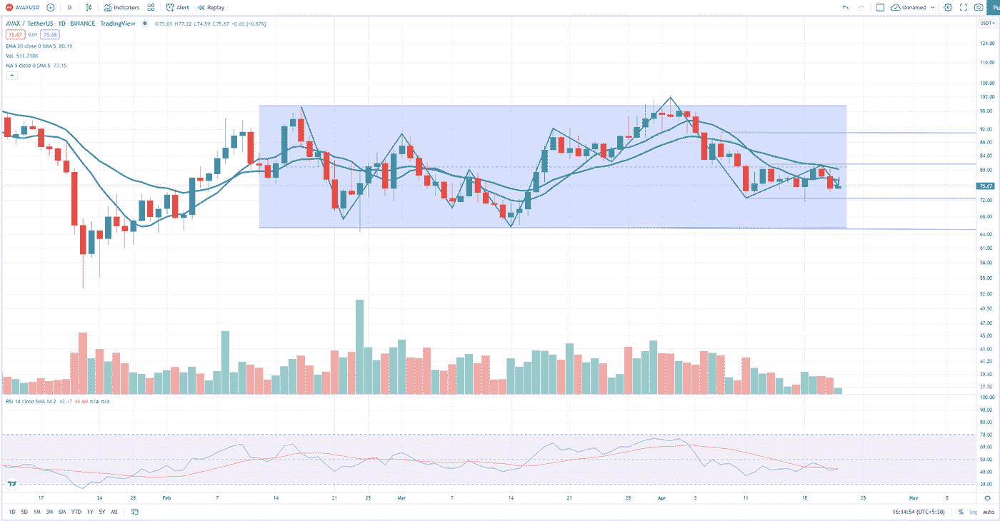
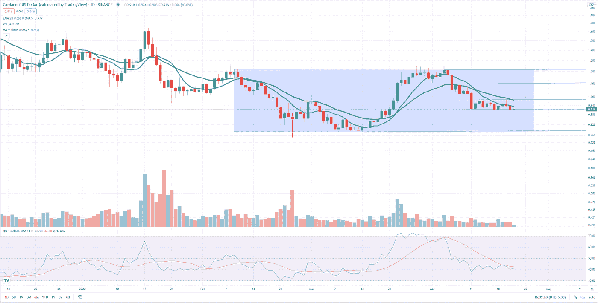

# 每周市场更新:BTC、瑞士联邦理工学院、XRP、AVAX、ADA

> 原文：<https://medium.com/coinmonks/weekly-market-update-btc-eth-xrp-avax-ada-ce07a67fc443?source=collection_archive---------19----------------------->

未来几周要寻找的五种加密货币。

又到了周五，是时候给出每周市场更新了。最大的流媒体平台网飞本周直线下跌，跌幅超过 35%。原因可能如下，许多 Twitter 用户声称内容质量差，竞争激烈，以及该公司决定停止在多个账户和设备之间共享密码。

但不管是什么，我们不能否认，像抖音和 Instagram reels 这样的短视频平台正在获得更多的用户。我们可以看到人们在乘坐地铁和公共汽车时，在抖音滚动卷轴。只是人们花费更多的时间在短格式的视频上。

回到加密市场，本周早些时候我们看到了一个巨大的反弹，但未能打破重大阻力。让我们潜入更深的地方。

# 比特币

本周早些时候，BTC/美元市场测试了 20 天指数移动平均线，但未能成功。多头有机会在低于 40，000 美元的价格买入，涨势持续到第二天。与上周的“极度恐惧”相比，“恐惧和贪婪”指数处于“恐惧”水平。记住“恐惧和贪婪”指数分析投资者和市场参与者的情绪和情感，它通常能告诉我们很多关于市场趋势的信息。

目前，RSI 指标正在日线图上的 50 下方移动，而市场仍保持在 40，000 美元的心理阻力上方，我们正在 39，400 美元处给出新的支撑弯曲。在日蜡烛图中，BTC/美元市场尊重宏观上涨趋势，但记住要保持警惕，因为如果市场没有守住 39，400 美元的支撑，它可能会变成另一个空头机会。

# 以太坊

以太坊是“计算机未来”的区块链，其本地令牌 ETH 正在形成与 2018 年夏天非常相似的模式。自去年冬天以来，ETH 市场对美元的交易量一直在减少和盘整。在周线蜡烛图形态上，ETH/USD 在 2 月中旬的上一次失败尝试后，正在重新测试 50 天移动平均线。RSI 指标略微向中间移动，给出了“等待和观察”的信号。因此，对于当前的 ETH/USD 市场，我们可以说，如果历史重演，我们正在经历熊市，但如果时间对我们有利，我们可以等待和观察。也就是说，ETH/USD 市场出现牛市的可能性不大，但并非不可能。

# 涟漪

Ripple native token XRP 是目前市值第四大的加密货币，被称为比特币数字黄金的“数字银”。在周蜡烛图中，XRP 市场对美元的汇率正在形成一个明显的对称三角形。市场正在形成更低的低点，同时形成更低的高点作为支撑。XRP 兑美元的价格仍在 20 天指数移动平均线和 50 天移动平均线下方运行，但同时试图进行多次测试。就像 ETH/USD 市场一样，我们正处于 XR/USD 市场的“观望”时刻。如果 XRP 未能在对称弯曲内守住支撑，它可能跌至 0.5 美元，相反，如果它突破阻力，它可能反弹至 0.9 美元。

# 雪崩

Avalanche 声称是区块链行业最快的智能合约平台，自 2 月初以来，其硬封顶的本地令牌 AVAX 一直在横向交易。虽然很难对这种类型的市场发表任何评论，但多头和空头都在进行一场艰苦的战斗。AVAX 市场对美元的交易低于 20 天指数移动平均线，同时进行多次测试。虽然 RSI 指标在 40 附近移动，但我们在 72.6 美元有一条支撑线。相反，如果多头反弹，在 81 美元有一个阻力位。

# 卡尔达诺

自 2 月份以来，卡达诺区块链及其本土标志 ADA 一直在横盘整理。由于整个加密市场都在努力摆脱阻力，ADA/USD 市场目前正在 20 天移动平均线下方运行。在日蜡烛图中，ADA/USD 正在下跌以支撑 0.919 美元，如果它继续下跌，我们可能在 0.7 美元有新的支撑。这将使 ADA/USD 从当前价格下跌超过-14%。相反，如果多头发起新一轮反弹，我们有望突破 1 美元的心理关口。

*嗨，如果我们是第一次见面，我是研究分析师阿库佐，你可以在推特上关注我* [*这里*](https://twitter.com/Kuzotelohe) *。也请关注我的 Twitter 页面 PlanB Invest* [*这里*](https://twitter.com/story_bitcoin) *我在这里分享每日、每周对比特币和加密市场的分析，以帮助你做出明智的决定。*

*注意:投资加密包含风险。提交人对资产损失没有责任。这只是为了教育和信息的目的，因此，它不应该被视为财务建议。请在投资前做好自己的研究。*

> 加入 Coinmonks [电报频道](https://t.me/coincodecap)和 [Youtube 频道](https://www.youtube.com/c/coinmonks/videos)了解加密交易和投资

# 另外，阅读

*   【Capital.com】|[港加密借贷平台](https://coincodecap.com/crypto-lending-hong-kong)
*   [如何在 Uniswap 上交换加密？](https://coincodecap.com/swap-crypto-on-uniswap) | [A-Ads 评论](https://coincodecap.com/a-ads-review)
*   [WazirX vs CoinDCX vs bit bns](/coinmonks/wazirx-vs-coindcx-vs-bitbns-149f4f19a2f1)|[block fi vs coin loan vs Nexo](/coinmonks/blockfi-vs-coinloan-vs-nexo-cb624635230d)
*   [本地比特币审核](/coinmonks/localbitcoins-review-6cc001c6ed56) | [加密货币储蓄账户](https://coincodecap.com/cryptocurrency-savings-accounts)
*   [什么是保证金交易](https://coincodecap.com/margin-trading) | [美元成本平均法](https://coincodecap.com/dca)