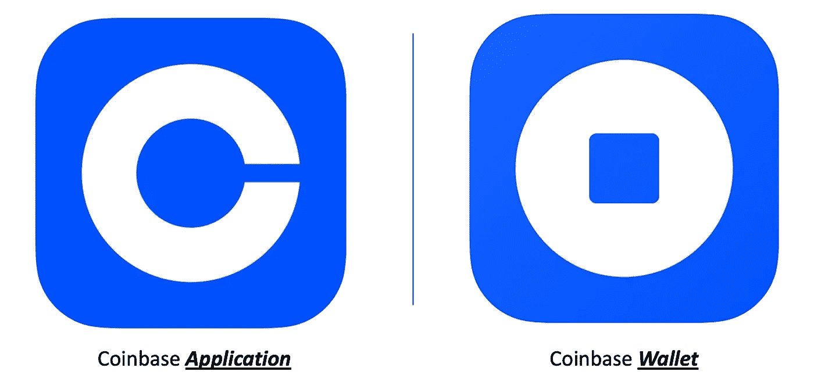

# 欢迎，新的加密超级碗用户

> 原文：<https://medium.com/coinmonks/welcome-new-crypto-super-bowl-users-bd57be7ca250?source=collection_archive---------47----------------------->

比特币基地的 2022 年超级碗广告引起了数百万人的兴趣，随着新用户加入加密社区，需要了解一些关键概念，包括:

*   保管，自我保管和钱包
*   大多数事情都需要钱包
*   安全和如何不丢失东西

这些概念中的每一个都将在这个由三部分组成的系列中进行探讨，从保管、自我保管和钱包开始。

# ***、保管、自保管和钱包***

比特币基地的超级碗广告将他们的移动应用推向了苹果应用商店的第二名。许多比特币基地的新用户在安装该应用程序后，可能会认为他们有一个加密钱包，里面有来自比特币基地的 15 美元比特币作为奖金标志。

但这并不完全正确。

相反，数百万人拥有一个比特币基地*账户*，现在以保管关系*与比特币基地合作。这意味着，当用户 ***【拥有】*** 比特币时，比特币基地 ***【管理】*** 比特币。这不同于用户直接管理比特币。用加密术语说:*

*   比特币基地负有保管责任，因为比特币基地代表客户持有比特币
*   另一种选择是自我保管，这意味着客户直接控制他们的比特币

从传统银行的角度思考这个问题是有用的。当钱存在银行时，银行代表银行的客户管理、保护并承担对这笔钱的责任。银行有保管责任。客户取钱直接持有，他们自保管的时候，客户是有责任的。

这也解释了“钱包”这个词。在现实世界中，当有人有钱时，他们会把钱放在钱包里。数字世界遵循同样的词汇。当有人持有自己的比特币时，他们会把它放在“钱包”里。

理解这一点很重要，因为在 App Store 中搜索“比特币基地”会显示多个工具。比特币基地应用程序是超级碗期间安装最多的应用程序，这与比特币基地钱包不同。

通过“比特币基地应用程序”,比特币基地提供了一种类似银行的服务，代表他们的客户持有余额。比特币基地超级碗客户下载的移动应用程序与银行的移动应用程序非常相似。这两款应用都提供了对第三方的访问，比特币基地或银行，第三方控制资金。

这与应用商店中的“比特币基地钱包”不同。“比特币基地钱包”是一种从比特币基地的系统中取钱并将其存储在用户直接控制的工具中的方式。“比特币基地钱包”这个术语令人困惑，但它仅仅意味着比特币基地制造了钱包。

为了进一步解释，考虑由古驰制造的实体钱包。把钱放在古驰的钱包里并不意味着古驰管理钱包里的钱。古驰不知道钱包里有什么。“古驰”这个头衔只是意味着古驰制造了钱包，比特币基地的钱包也是如此。比特币基地写了代码，但他们不知道也不控制钱包的内容。比特币基地钱包是一种直接存储数字资产的工具，就像古驰钱包是一种存储金钱、驾照或信用卡等实物资产的工具一样。

理解这种差异是下一个主要趋势的关键，也是我们第二篇文章的主题，大多数事情都需要钱包。

> 加入 Coinmonks [电报频道](https://t.me/coincodecap)和 [Youtube 频道](https://www.youtube.com/c/coinmonks/videos)了解加密交易和投资

# 另外，阅读

*   [八大加密附属计划](https://coincodecap.com/crypto-affiliate-programs) | [eToro vs 比特币基地](https://coincodecap.com/etoro-vs-coinbase)
*   [最佳以太坊钱包](https://coincodecap.com/best-ethereum-wallets) | [电报上的加密货币机器人](https://coincodecap.com/telegram-crypto-bots)
*   [交易杠杆代币的最佳交易所](https://coincodecap.com/leveraged-token-exchanges)
*   [最佳加密分析或链上数据](https://coincodecap.com/blockchain-analytics) | [Bexplus 评论](https://coincodecap.com/bexplus-review)
*   [NFT 十大市场造币集锦](https://coincodecap.com/nft-marketplaces)
*   [AscendEx Staking](https://coincodecap.com/ascendex-staking)|[Bot Ocean Review](https://coincodecap.com/bot-ocean-review)|[最佳比特币钱包](https://coincodecap.com/bitcoin-wallets-india)
*   [Bitget 回顾](https://coincodecap.com/bitget-review) | [双子 vs 区块链](https://coincodecap.com/gemini-vs-blockfi) | [OKEx 期货交易](https://coincodecap.com/okex-futures-trading)
*   [美国最佳加密交易机器人](https://coincodecap.com/crypto-trading-bots-in-the-us) | [经常性回顾](https://coincodecap.com/changelly-review)
*   [在印度利用加密套利赚取被动收入](https://coincodecap.com/crypto-arbitrage-in-india)