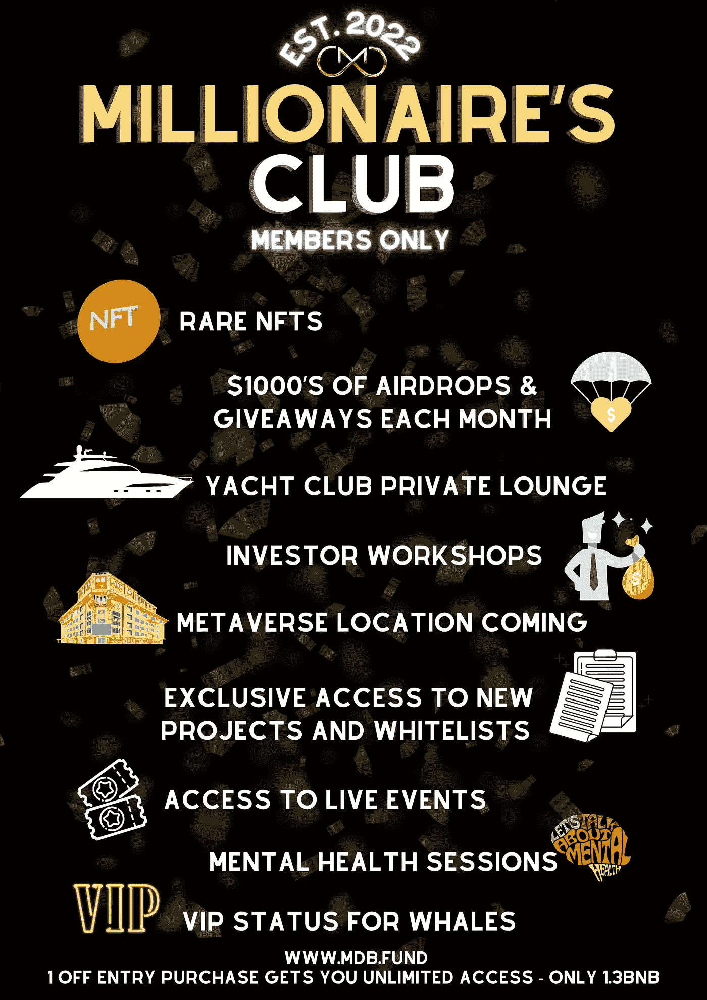

# 欢迎来到 MDB 百万富翁俱乐部——现在是独家！

> 原文：<https://medium.com/coinmonks/welcome-to-the-mdb-millionaires-club-now-exclusive-cdbe60997940?source=collection_archive---------14----------------------->

新发布的 [**MDB.fund**](https://www.mdb.fund/) 项目继续创新，为其持有者提供价值。其中一项创新是**百万富翁俱乐部(MC)** ，该俱乐部最近在社区 [**Discord 频道发布公告。**](https://discord.gg/Zp3rSXuP) ***以前对所有持有者开放，现在俱乐部的会员资格是独家的！***

不和谐公告( [**完整公告此处**](https://discord.com/channels/952941612592410664/952942952844525628/972213282016473148) ):

> 独家准入要求:我们认识到市场目前充满挑战，因此我们渴望找到一个健康的平衡，确保 MC 有一个合理的准入门槛，但同时了解人们在 MDB 和市场条件方面的现有投资。因此，入场费将是最低购买和持有价值 1.3 BNB 的 MDB。这必须是从世界协调时 19:00(2022 年 5 月 6 日)开始的新购买。如果你想为你的参赛提供资金，你可以出售 MDB。作为持续会员，您必须持有至少 1.3 BNB 的 MDB，才能继续享受 MC 提供的优惠。

# **什么是百万富翁俱乐部，谁可以加入？**

独家会员俱乐部，人人共赢！百万富翁俱乐部成员是 MDB 的热情而忠诚的投资者，他们的忠诚将得到回报。

在最低 1.3 BNB 投资和向验证信道提交 tx 散列之后，作为 Discord 服务器的成员的任何人都可以加入。要保持百万富翁俱乐部的会员资格，会员必须至少持有价值 1.3 BNB 的 MDB——低于这一水平将导致您的会员资格被取消。你可以稍后重新进入，一旦你符合标准，你将在 30 天内被列入候补名单并获准进入。

# 我还需要做什么？

什么都不用做，在购买并持有 MDB 超过要求的门槛后，你可以继续成为会员，只要遵守俱乐部规则。

# 我为什么要加入百万富翁俱乐部？

作为会员，会员将享受一系列金融、社区和投资机会。

**金融**

成员每月将获得 MDB 的 ***空投，团队预计奖励轻松超过每年 30%。此外，您可以在项目的第 3 阶段将您的 MDB 作为赌注，以获得更多奖励。***

您还将参加俱乐部会员抽奖， ***三个随机抽取的钱包将每人每月空投 1000 美元的 MDB***。

**社区**

作为会员，您将获得进入 ***百万富翁俱乐部休息室*** 的权利，其中包括与团队进行炉边聊天。社区支持会议主要围绕投资、交易、生活方式、心理健康等内容。还会时不时的有付费娱乐。你将有机会参与 MDB TF 投资的决策。

**健康蔻驰**

[**第一个正式的百万富翁俱乐部福利之一，最近在这里宣布的**](https://discord.com/channels/952941612592410664/952942952844525628/972229234670059551) ，是 ***每月一次的精神健康研讨会，与凯蒂从*** 中得到的大便联系在一起。这个空间可能会有压力，日常生活也是如此，所以凯蒂会和你一起工作！

> 我们都知道压力对我们有害。这是事实。从工作到人际关系，它会影响我们的身体健康、思维质量和工作能力。用工具和策略建立一个强大的基础，以确保我们通过饮食、锻炼、睡眠和其他健康习惯来管理我们的压力，这将确保我们建立复原力和防止倦怠。T22**https://www . getyourshittogether . io**

**投资机会**

百万富翁俱乐部将在更广泛的社区之前了解 MDB TF 投资。您将独家获得“流动性增加”和“收购资金”。这些是为收购资产而推出的特设金融机制，将在 MDB 奖励中为独家投资者提供健康的 ROI。 ***你将独家获得其他项目的投资者推介和代币，以及 WL 赠品*** 。最后… ***您将获得 MDB Infinity 的优先入场券，MDB Infinity 是 MDB 项目*** 备受期待的第四期，为持有人提供长期的金融机会。

**VIP 角色**

这是为选择投资并在钱包中持有价值 8 BNB 的 MDB 代币的俱乐部会员保留的；在最初发布后购买。这个角色将在服务器中获得一个特殊的角色，目前只是一个灵活的机会。将来可能会有更多的机会提供给贵宾。

**加上**

*   该团队将探索百万富翁俱乐部作为元宇宙的一个位置，并可能与元宇宙的其他项目整合。
*   独家访问每月向 MC 推介的项目的奖励和激励
*   每月 2 个 1k 美元大奖，在会员中随机抽取
*   获得 MDB 债券和其他投资机会的独特途径
*   公开发布前优先访问测试项目(MDB+

**MDB 是 DeFi 的未来，它提供了一种经过数学证明的永续增长的象征，一种产生高利息的独特信托基金，支持超过 570%的流动性。百万富翁俱乐部只是为 MDB 持有者提供价值的一长串创新中的一个！**

**别忘了关注社交活动，了解最新消息！**👇

*   Youtube: [MDB DeFi](https://www.youtube.com/channel/UCNZ8ZADUtu-zHhvQJm-hilw)
*   推特:[https://twitter.com/mdb_defi](https://twitter.com/mdb_defi)
*   网址: [https://www.mdb.fund](https://www.mdb.fund/)
*   电报:[https://t.me/mdbtoken](https://t.me/mdbtoken)
*   文件:[https://million-dollar-baby.gitbook.io/mdbwhitepaper](https://million-dollar-baby.gitbook.io/mdbwhitepaper)

> *加入 Coinmonks* [*电报频道*](https://t.me/coincodecap) *和* [*Youtube 频道*](https://www.youtube.com/c/coinmonks/videos) *了解加密交易和投资*

# 另外，阅读

*   [3 商业评论](/coinmonks/3commas-review-an-excellent-crypto-trading-bot-2020-1313a58bec92) | [Pionex 评论](https://coincodecap.com/pionex-review-exchange-with-crypto-trading-bot) | [Coinrule 评论](/coinmonks/coinrule-review-2021-a-beginner-friendly-crypto-trading-bot-daf0504848ba)
*   [莱杰 vs n rave](/coinmonks/ledger-vs-ngrave-zero-7e40f0c1d694)|[莱杰 nano s vs x](/coinmonks/ledger-nano-s-vs-x-battery-hardware-price-storage-59a6663fe3b0) | [币安评论](/coinmonks/binance-review-ee10d3bf3b6e)
*   [Bybit Exchange 评论](/coinmonks/bybit-exchange-review-dbd570019b71) | [Bityard 评论](https://coincodecap.com/bityard-reivew) | [Jet-Bot 评论](https://coincodecap.com/jet-bot-review)
*   [3 commas vs Cryptohopper](/coinmonks/3commas-vs-pionex-vs-cryptohopper-best-crypto-bot-6a98d2baa203)|[赚取加密利息](/coinmonks/earn-crypto-interest-b10b810fdda3)
*   最好的比特币[硬件钱包](/coinmonks/hardware-wallets-dfa1211730c6) | [BitBox02 回顾](/coinmonks/bitbox02-review-your-swiss-bitcoin-hardware-wallet-c36c88fff29)
*   [block fi vs Celsius](/coinmonks/blockfi-vs-celsius-vs-hodlnaut-8a1cc8c26630)|[Hodlnaut 审核](/coinmonks/hodlnaut-review-best-way-to-hodl-is-to-earn-interest-on-your-bitcoin-6658a8c19edf) | [KuCoin 审核](https://coincodecap.com/kucoin-review)