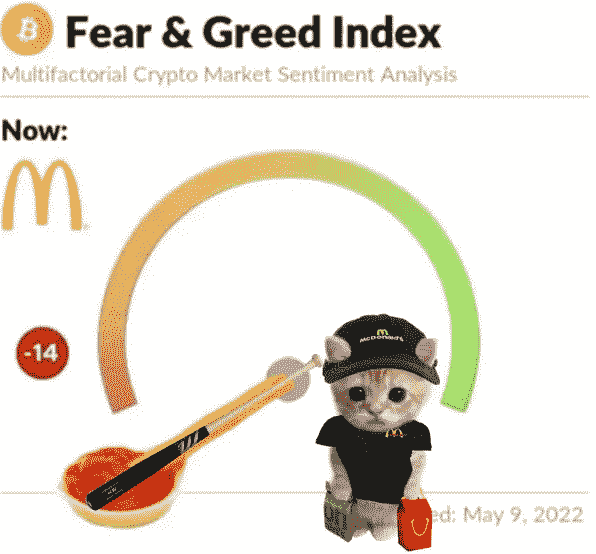
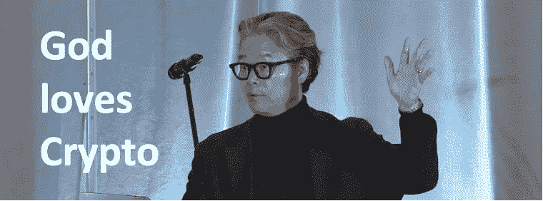

# 我们都会成功的

> 原文：<https://medium.com/coinmonks/were-all-gonna-make-it-c4973fb2ceaa?source=collection_archive---------12----------------------->

对于那些因 Luna 崩溃而失去 rekt 的疯子来说，这是一个悲伤的时刻。卢娜的遭遇很可怕，这让我想到:

如果我们停止用法定价值来思考，卢娜灾难能避免吗？

DeFi 只是一群不切实际的隐秘理想主义者的幻想吗？

crypto 是庞氏骗局吗？

并非所有的加密都是平等的，以比特币为例，比特币是为了解决法定货币的根本问题而创建的，必须相信中央银行不会使货币贬值。我们必须信任银行持有我们的钱，并以电子方式转移，但它们在信贷泡沫的浪潮中贷出这些钱，储备中几乎没有一部分。

区块链技术解决了信任、匿名和不变性的问题，因为它允许在不需要集中化的情况下执行。

基于中本聪创造的区块链技术，以太坊提供了一个可以用来创建“合同”的区块链，只需用几行代码编写逻辑，允许用户创建应用程序、智能合同和 Dao。

将所有加密概括为庞氏骗局就像将所有东西都称为庞氏骗局。每一种资产类别，无论是股票、房地产、手表还是鞋子，都带有某种形式的先令元素。如果人们相信他们可以通过转售某样东西赚钱，他们就会购买它，制造炒作，从而推动 FOMO，并最终从出售它中获利，就像我现在完全没有写文章和先令谈论加密的伟大一样。

以下是我的观点，我希望它能给你一些启示和鼓励，让你开始探索 crypto 和 DeFi，它可能什么都不是。

虽然我不是 Luna 的 rekt，但这件事让我对我对 crypto 和 DeFi 的信任进行了压力测试。然而，这让我对加密技术，尤其是比特币和以太坊的未来重新充满了乐观和信心。回到比特币的基本面，它实际上不是一种承诺给我们带来财富或简单的 20% APY 的投资，而是一种不经过金融机构的点对点版本的电子现金。这是一场通过了时间考验的货币革命，它将颠覆现有的货币体系。

要了解比特币如何通过时间的考验，请查看*迄今为止的所有比特币讣告*

**

*如果比特币是一场货币革命，那么以太坊就是一场金融革命。以太坊目前正在取代金融市场的未来，以及许多我们尚未想象到的未来。DeFi 的智能合约是开源的，大多数不依赖于中介，从而降低了交易对手风险，比 TradFi 的交易速度更快。*

*当然，以太坊和 DeFi 仍然是一个正在进行中的工作。它仍然是金融业的蛮荒之地，但发展速度很快。创新通常很有可能失败，因为创新者试图创造新产品和新的工作方式。好的产品和系统不是一夜之间建成的，我们应该明白没有失败就没有成功。因此，失败应该永远是一种选择。*

*在我看来，今天购买比特币或以太坊，就相当于购买一个现在或未来都可以使用的区块空间，硬币或代币的价值在于其区块链网络。网络活跃度和效果越大，网络价值越大。如果网络被大规模采用，对块空间的需求将会增加。这是因为用户需要块空间将他们的交易上传到区块链。*

**

*很难不对加密的未来持乐观态度，因为随着我们从工业时代过渡到信息时代，人力资本正在进入这个领域，偏好分散化而不是集中化。尽管熊市刺激了经济增长，但 DeFi 基础设施的建设速度很快，用户采用率很高，这可能会对历史产生深远的影响。*

*我们应该理解并承认所有的投资都有风险。去中心化是很难实现的，但是当它实现的时候，它的价值会被累积到用户身上。总会有 FUD，但我们应该学会如何把噪音拒之门外。*

*所以，在五月卖掉然后走人？*

**

*感谢阅读，敬请关注更多 DeFi 内容！*

*作为我的新年决心的一部分，我将分享我在 crypto 的经历，以讲述由我工作中的朋友& crypto OGs 激发的更好的故事。*

**免费加密&股票连同推荐启动你的旅程:*[*https://docs . Google . com/spreadsheets/d/1 f2bx-xkvmezorxdzqavgckina 1 PME _ uI9pa _ c4l 4-DM/edit？usp =分享*](https://docs.google.com/spreadsheets/d/1f2bX-xKvmEzOrxDZqAvgCkIna1pmE_uI9pa_C4l4-DM/edit?usp=sharing)*

> *加入 Coinmonks [电报频道](https://t.me/coincodecap)和 [Youtube 频道](https://www.youtube.com/c/coinmonks/videos)了解加密交易和投资*

# *另外，阅读*

*   *[3 商业评论](/coinmonks/3commas-review-an-excellent-crypto-trading-bot-2020-1313a58bec92) | [Pionex 评论](https://coincodecap.com/pionex-review-exchange-with-crypto-trading-bot) | [Coinrule 评论](/coinmonks/coinrule-review-2021-a-beginner-friendly-crypto-trading-bot-daf0504848ba)*
*   *[莱杰 vs Ngrave](/coinmonks/ledger-vs-ngrave-zero-7e40f0c1d694) | [莱杰 nano s vs x](/coinmonks/ledger-nano-s-vs-x-battery-hardware-price-storage-59a6663fe3b0) | [币安评论](/coinmonks/binance-review-ee10d3bf3b6e)*
*   *[Bybit Exchange 评论](/coinmonks/bybit-exchange-review-dbd570019b71) | [Bityard 评论](https://coincodecap.com/bityard-reivew) | [Jet-Bot 评论](https://coincodecap.com/jet-bot-review)*
*   *[3 commas vs crypto hopper](/coinmonks/3commas-vs-pionex-vs-cryptohopper-best-crypto-bot-6a98d2baa203)|[赚取加密利息](/coinmonks/earn-crypto-interest-b10b810fdda3)*
*   *最好的比特币[硬件钱包](/coinmonks/hardware-wallets-dfa1211730c6) | [BitBox02 回顾](/coinmonks/bitbox02-review-your-swiss-bitcoin-hardware-wallet-c36c88fff29)*
*   *[BlockFi vs 摄氏](/coinmonks/blockfi-vs-celsius-vs-hodlnaut-8a1cc8c26630) | [Hodlnaut 点评](/coinmonks/hodlnaut-review-best-way-to-hodl-is-to-earn-interest-on-your-bitcoin-6658a8c19edf) | [KuCoin 点评](https://coincodecap.com/kucoin-review)*
*   *[Bitsgap 审查](/coinmonks/bitsgap-review-a-crypto-trading-bot-that-makes-easy-money-a5d88a336df2) | [Quadency 审查](/coinmonks/quadency-review-a-crypto-trading-automation-platform-3068eaa374e1) | [Bitbns 审查](/coinmonks/bitbns-review-38256a07e161)*