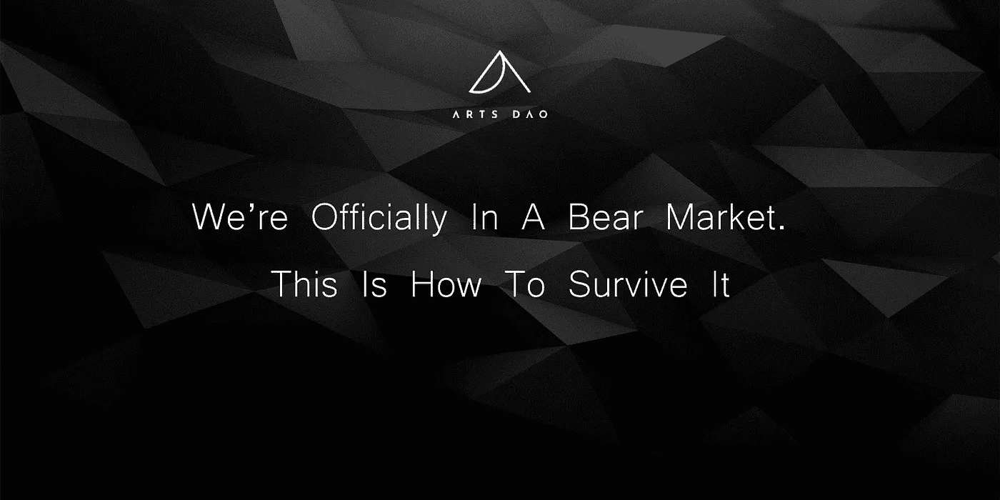
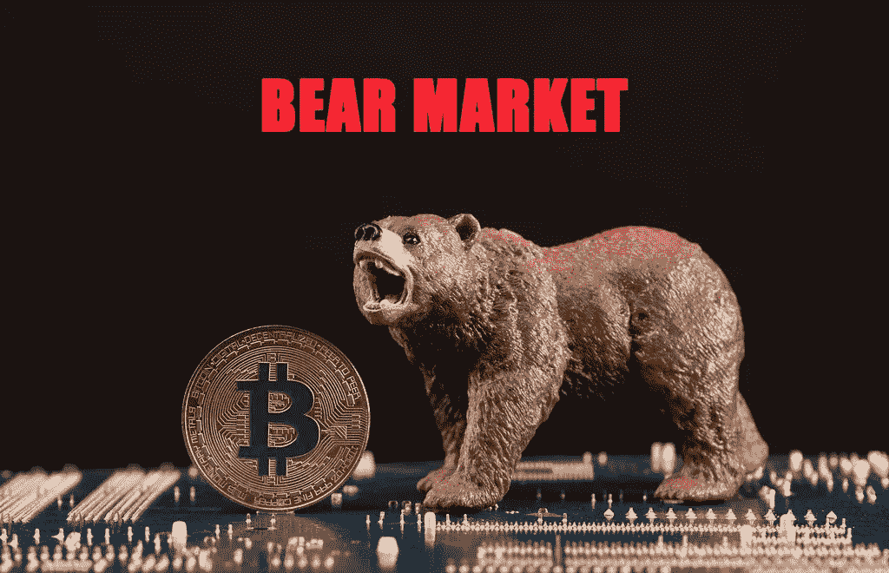

# 我们正式进入了熊市。这是如何生存下来的

> 原文：<https://medium.com/coinmonks/were-officially-in-a-bear-market-this-is-how-to-survive-it-7ee1b39aacd3?source=collection_archive---------12----------------------->

## 现在不是恐慌的时候。改为这样做。

熊市可能会令人恐慌。如果这是你第一次经历这种情况，你可能会想躲在树林里的一个小木屋里，把现金藏在床垫下，等待金融市场的阳光再次照耀。

然而，与传统思维相反，熊市实际上有利于经验丰富的投资者和那些知道如何从中获利的人。这是因为主流媒体**不想让你知道的一些原因。**

从表面上看，所有在网上展示的都是加密市场的红色海洋，人们在他们认为要去月球的项目中失去了他们一生的积蓄，还有许许多多的恐惧。虽然不幸的是，这是大多数人的情况，但也有少数人一直在为此做准备，在下跌时获利，并将在下一轮牛市中赚到改变生活的钱，因为他们处理这一季密码的方式。

玩笑开够了，下面是 T2 少数人做的事情，这些事情确保他们不仅能在熊市中生存，还能从中获利。

# 一、什么是熊市？

[Source](https://www.google.co.uk/url?sa=i&url=https%3A%2F%2Fwww.flickr.com%2Fphotos%2F30478819%40N08%2F50823389861&psig=AOvVaw25-SpXPuNWQcFSHRrE7VvX&ust=1653743293867000&source=images&cd=vfe&ved=0CAwQjRxqFwoTCMjTtIzg__cCFQAAAAAdAAAAABAD)

熊市被定义为任何给定的[金融市场经历价格持续下跌 20%或更多，从而导致普遍恐惧和悲观情绪的时期。](https://www.investopedia.com/terms/b/bearmarket.asp)这些市场下跌时期是不可避免的，每隔一段时间就会发生，而且完全正常。

另一方面，牛市是金融市场价格上涨或预期上涨的一种状态。平均而言，熊市往往会持续 289 天，也就是大约 9.6 个月。如果这个数字让你害怕，你只需要知道牛市往往会持续 991 天或 2.7 年，这就是为什么在相对短暂的熊市期间，利用一切事物的折扣价是很重要的。

现在你知道什么是熊市了，以下是你如何度过熊市的方法。

# 心态

首先，你需要正确的心态。很多人并不经常把哲学和投资联系在一起，但这两者在很多方面是密切相关的。现在有太多不同的哲学可以借鉴，当谈到形成投资心态时，有一种哲学脱颖而出——斯多葛主义。

斯多葛派教导我们，一个人应该专注于他们控制的事物，抛弃他们控制之外的元素。这在投资中很有用，因为很多事情都不在你的控制之内，有时会令人沮丧。例如，不要试图预测市场的底部和顶部，这是一个即使最好的交易者也做不到的行为，而是关注在价格大幅下跌时你能投资多少钱。记住，你不能控制从一项投资中收回多少钱，但你可以控制投入多少钱，以及当事情不顺心时你如何应对。

斯多葛派也相信为最坏的情况做准备，使用一种被称为*预谋错误*或负面视觉化的策略。他们会想象最坏的可能结果，并问自己如果这种情况发生，他们将如何克服。在投资领域，最糟糕的情况总是你失去所有的钱。出于这个原因，只投资你能承受的损失的建议是有用的，因为即使最坏的情况发生，你知道你内心深处仍然会很好，可以从中恢复。

# 美元成本平均和持有

无论你是新手还是高级交易者，每周或每月的平均成本被证明是应对熊市最有效的策略。美元成本平均法(DCA)是在一个循环周期内进行小额投资的过程，如每周、每两周或每月，而不管市场状况如何。这种策略确保了从长期来看，你对任何给定加密货币的平均购买价格将达到平均水平，因为你将在市场的高点和低点都进行购买。这种方法结合熊市中的持有，几乎可以保证你在下一轮牛市中获得可观的利润。

# 立桩标界

在提供加密货币的 DeFi 协议或加密钱包上下注是一种很好的方式，可以让你的闲置硬币在熊市中为你创造一些被动收入。一些钱包，如 [NEXO](https://nexo.io/ref/hzllhyqrz7?src=ios-link) wallet，允许你从钱包中持有的加密货币中赚取利息，被动地为你赚取一些硬币高达 36%的 APY。这是一个极好的对冲通货膨胀的方法，当市场动荡时，你可以利用你的资本为你工作。

# 避免杠杆交易

在熊市中，最不可预测的事件可能会发生，无论多少技术分析都无法拯救你。例如，最近卢娜和 UST 的价值与美元脱钩，如果你做了错误的判断，很可能会让你破产。一般来说，杠杆交易是一种高风险的尝试，只有高级交易者才应该考虑涉足。如果你是一个初学者或中级投资者，对市场如何运作没有太多的经验和知识，你应该避免与杠杆有关的任何事情。

# 熊市的(隐藏的)真相

大多数人讨厌熊市，考虑到大多数人在这段时间里损失了大量个人财富，这是完全合理的。然而，在所有的 FUD 和消极中，隐藏着利益和机会，这些利益和机会被加密鲸和聪明的投资者留给了他们自己。

## **世代财富**

大多数人期待牛市，因为他们看到每个人都在购买，并认为在这段时间里他们会变得更富有，因为他们接触的任何东西都会升值。然而，他们没有意识到的是，当一个行动看起来最确定的时候，也是失去机会最多的时候。有一句老话，每个投资者都应该知道，它说:

> “当别人贪婪时要恐惧，当别人恐惧时要贪婪”——沃伦·巴菲特

换句话说，当每个人都在恐慌，市场在流血时，那就是聪明的投资者大举买入的时候。然后，当每个人都很高兴，市场繁荣，一切都创下历史新高时，这是聪明的投资者拿走他的利润，等待下一个机会再投资。

听起来很简单，但是你会惊讶有多少人做相反的事情。

## 揭示了抗脆弱资产

熊市有助于消除牛市留下的所有噪音。在牛市中，任何东西看起来都是好的投资，因为一切都在上涨，然而，只有在压力时期，一个项目的真正价值和实力才会显现出来。抗脆弱是一种由于压力或疼痛而变得更强大和茁壮成长的品质。所有经受住时间考验的优质资产都是抗脆弱的，这些资产只有在熊市和艰难时期才会显露出来。因此，那些在熊市中存活下来而其他项目都在下跌的项目告诉你，你应该把你辛苦赚来的钱放在哪里。

## 你了解你自己

熊市教会你对风险和压力的承受能力。你可能不总是喜欢它给你带来的感觉，但作为一名新投资者，你得到的痛苦和反馈往往是必要的。你可能想知道，作为一名投资者，了解自己为什么如此重要。答案是，当涉及到你的金钱时，你是你自己最大的敌人，因为人类本质上是情感动物。不幸的是，你的情绪，尤其是负面情绪和投资不是最好的朋友。因此，学习如何应对损失和挫折，以及如何在这些时候克服自己的情绪，将是一项非常实用的技能，值得尽快掌握。

# 最后的想法

随着加密市场两位数的百分比下降，以及世界上正在发生的一切，加密的未来可能看起来很暗淡。然而，重要的是要记住这个行业自诞生以来已经走了多远。迄今为止，前几次熊市的波动性经历了比这次更剧烈的下跌，并在一夜之间抹去了更多的银行余额。因此，如果那些从熊市中走出来的人能够挺过来，并活着讲述这个故事，那么你也可以。

# 与我们联系

在这里关注我们，在 [**Twitter**](https://twitter.com/arts_dao?ref_src=twsrc%5Egoogle%7Ctwcamp%5Eserp%7Ctwgr%5Eauthor) 上获取新闻，并关注我们的 [**不和**](https://discord.gg/ZXJH5zfC) 与我们聚集在一起的未来主义者、艺术家、收藏家和创作者社区的更深层次的联系。

*   **阿纳斯**:[twitter.com/ananasbrb](https://twitter.com/ananasbrb)
*   **达诺斯奇**:[twitter.com/thecryptosheikh](https://twitter.com/thecryptosheikh)
*   拉希姆:[twitter.com/rahim_mahtab](https://twitter.com/rahim_mahtab)
*   **扎亚恩**:[twitter.com/thenftpenguin](https://twitter.com/thenftpenguin)
*   **山姆 Z:**twitter.com/zuckerswag
*   克里斯特尔:[twitter.com/atelier_kristel](https://twitter.com/atelier_kristel)

# 谢谢你

感谢您及早参与道艺术之旅。我们每时每刻都在致力于建设并成为区块链技术、NFT 空间以及更广泛的艺术发展的一部分。我们期待在现实生活中或元宇宙的其他地方与您见面！

> *加入 Coinmonks* [*电报频道*](https://t.me/coincodecap) *和* [*Youtube 频道*](https://www.youtube.com/c/coinmonks/videos) *了解加密交易和投资*

# 另外，阅读

*   [Bookmap 评论](https://coincodecap.com/bookmap-review-2021-best-trading-software) | [美国 5 大最佳加密交易所](https://coincodecap.com/crypto-exchange-usa)
*   最佳加密[硬件钱包](/coinmonks/hardware-wallets-dfa1211730c6) | [Bitbns 评论](/coinmonks/bitbns-review-38256a07e161)
*   [新加坡十大最佳加密交易所](https://coincodecap.com/crypto-exchange-in-singapore) | [购买 AXS](https://coincodecap.com/buy-axs-token)
*   [红狗赌场评论](https://coincodecap.com/red-dog-casino-review) | [Swyftx 评论](https://coincodecap.com/swyftx-review) | [CoinGate 评论](https://coincodecap.com/coingate-review)
*   [投资印度的最佳密码](https://coincodecap.com/best-crypto-to-invest-in-india-in-2021)|[WazirX P2P](https://coincodecap.com/wazirx-p2p)|[Hi Dollar Review](https://coincodecap.com/hi-dollar-review)