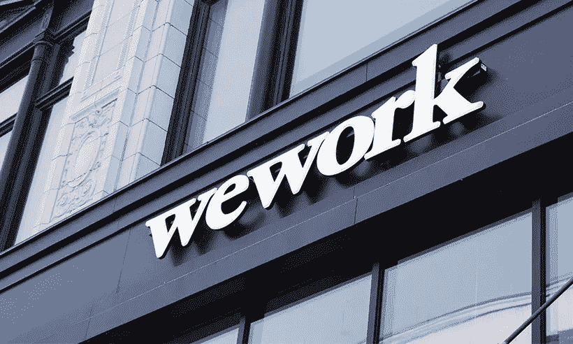

# WeWork 创始人凭借价值 7000 万美元的加密碳信用平台重塑自我

> 原文：<https://medium.com/coinmonks/wework-founder-reinvents-himself-with-70m-crypto-carbon-credit-platform-75a2dbee45b?source=collection_archive---------49----------------------->

合作的太空创始人兼亿万富翁亚当·诺伊曼正在密码领域一试身手，为他的区块链驱动的气候技术平台 Flowcarbon 筹集了 7000 万美元。

亚当·诺伊曼(Adam Neumann)在被驱逐出 WeWork 首席执行官职位三年后，已经加入了加密潮流，为他的气候技术风险投资公司 Flowcarbon 筹集了 7000 万美元的第一轮主要资金。

该项目旨在通过在区块链设置碳信用额度，使碳交易变得更加容易。

诺伊曼是一名以色列裔美国商人和投资者，他因在 2010 年创立联合办公空间提供商 WeWork 而闻名，这家公司曾被誉为工作空间的未来。

然而，当该公司试图上市时，这一切都在 2019 年崩溃了，这反而揭开了 WeWork 无利可图的商业模式和可疑的领导行为。该公司在 2019 年 8 月的私人估值为 470 亿美元，仅六周后就开始谈论申请破产，纽曼被迫辞去首席执行官一职。

诺伊曼和他的妻子丽贝卡·诺伊曼(Rebekah Neumann)被列为 Flowcarbon 的联合创始人，此外还有首席执行官达纳·吉伯(Dana Gibber)和首席运营官卡罗琳·克拉特(Caroline KL att)——他们都是头条新闻实验室(headlinelabs)的联合创始人，该公司为主要媒体品牌开发人工智能聊天机器人。Flowcarbon 的另一位联合创始人伊兰斯特恩(Ilan Stern)负责纽曼自己的家族办公室。

据 Flowcarbon 称，最近的一轮融资包括硅谷投资者马克·安德森和本·霍洛维茨通过他们的安德森·霍洛维茨(Andreessen Horowitz)加密风险投资公司提供的 3200 万美元资金。其他投资者包括通用催化剂和三星 Next。

另外 3800 万美元是通过象征性出售 Flowcarbon 的首款碳支持代币——自然女神代币(GNT)筹集的。

该公司将自己描述为一家开创性的气候技术公司，致力于在自愿碳市场(VCM)建立市场基础设施。通过在塞洛区块链对碳信用额进行令牌化，Flowcarbon 希望使碳信用额的购买、出售和交易比当前的碳市场更加容易和有效。

碳交易是一个基于市场的系统，旨在减少导致全球变暖的温室气体排放。

产生碳排放的企业可以购买碳信用额，以抵消从大气中去除或减少温室气体的项目，如重新造林项目。

然而，Flowcarbon 认为，自愿碳市场目前“效率低下，不透明，难以进入”，经纪人和顾问收取高达 20%的费用，许多交易是秘密进行的，碳信用的定价因买家而异。

Flowcarbon 针对自愿碳市场的解决方案并非独一无二。其他旨在促进令牌化碳信用的买卖的项目包括 Toucan Protocol、JustCarbon 和 Likvidi。

a16z 的普通合伙人 Arianna Simpson 说，这是一个明显可以从区块链理工学院受益的领域。

“碳市场极其不透明，我们认为，对碳补偿的需求正迅速超过供应增长的速度，尤其是对基于自然的项目而言。令牌化是一个显而易见的解决方案。”

> 加入 Coinmonks [电报频道](https://t.me/coincodecap)和 [Youtube 频道](https://www.youtube.com/c/coinmonks/videos)了解加密交易和投资

# 另外，阅读

*   [CoinDCX 点评](/coinmonks/coindcx-review-8444db3621a2) | [加密保证金交易交易所](https://coincodecap.com/crypto-margin-trading-exchanges)
*   [红狗赌场评论](https://coincodecap.com/red-dog-casino-review) | [Swyftx 评论](https://coincodecap.com/swyftx-review) | [CoinGate 评论](https://coincodecap.com/coingate-review)
*   [Bookmap 评论](https://coincodecap.com/bookmap-review-2021-best-trading-software) | [美国 5 大最佳加密交易所](https://coincodecap.com/crypto-exchange-usa)
*   [如何在 FTX 交易所交易期货](https://coincodecap.com/ftx-futures-trading) | [OKEx vs 币安](https://coincodecap.com/okex-vs-binance)
*   [CoinLoan 审查](https://coincodecap.com/coinloan-review) | [YouHodler 审查](/coinmonks/youhodler-4-easy-ways-to-make-money-98969b9689f2) | [BlockFi 审查](https://coincodecap.com/blockfi-review)
*   《XT.COM 评论》的|