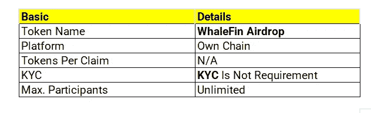
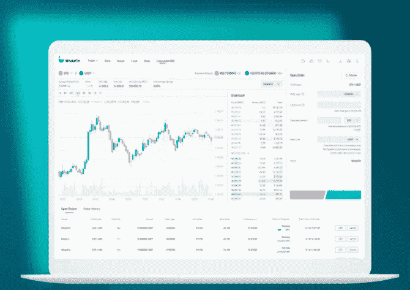
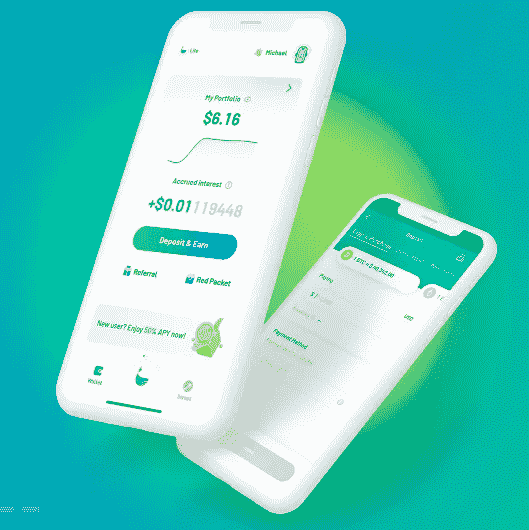

# WhaleFin 空投审查:在 BTC 获得高达 58 美元

> 原文：<https://medium.com/coinmonks/whalefin-airdrop-review-get-up-to-58-in-btc-f2b985ff0916?source=collection_archive---------2----------------------->

WhaleFin 是世界上最好的数字投资平台

# WhaleFin 是什么？

Photo by [Gabriel Dizzi](https://unsplash.com/@gabrieldizzi?utm_source=medium&utm_medium=referral) on [Unsplash](https://unsplash.com?utm_source=medium&utm_medium=referral)

[WhaleFin](https://h5.whalefin.com/register?referral_code=tRX080) Airdrop 是一种数字投资体验，提供简单的投资组合管理工具、有竞争力的投资收益，以及接触新兴数字生活方式的途径。[交易量超过 1 万亿美元的 WhaleFin](https://h5.whalefin.com/register?referral_code=tRX080) ，为 150 多个国家的数十种数字资产提供个性化、合规、安全的服务。

[WhaleFin](https://h5.whalefin.com/register?referral_code=tRX080) 在 BTC 赠送**高达 58 美元**和 stablecoins 给新注册的应用用户。要获得奖励，请下载 [WhaleFin](https://h5.whalefin.com/register?referral_code=tRX080) 应用程序，完成您的验证，存款，并完成下面列出的任务。每推荐一个人，你还可以赚到 20 美元。

# 分步指南:

1.  访问 [WhaleFin](https://h5.whalefin.com/register?referral_code=tRX080) Airdrop 页面。
2.  提交您的详细信息，然后单击“注册”。
3.  现在下载[安卓/IOS](https://h5.whalefin.com/register?referral_code=tRX080) 的 App。
4.  登录并完成您的 KYC 验证，以获得价值 5 美元的 BTC。

> 完成你的 KYC 还会让你参加幸运抽奖，有机会赢得第一次机会。

Photo by [Nick Chong](https://unsplash.com/@nick604?utm_source=medium&utm_medium=referral) on [Unsplash](https://unsplash.com?utm_source=medium&utm_medium=referral)

5.进入应用程序主页，点击“打开”农历新年红包，领取您最高 3 美元的奖励。向两个未注册的朋友发送红包，如果他们兑现奖励，您将获得额外的 10 美元 Stablecoins。

6.如果您的推荐人完成了 kycproceed to me>优惠券，以找到您的两张总价值为 20 美元的 BTC 代金券，则每次推荐还可获得 10 美元 USDⓢ，最高可达 20 美元 USDⓢ。

7.存款 100 美元，并以至少 100 美元(16%年利率)加入固定收入计划至少 10 天。

**兑换您在 BTC 最高 20 美元的欢迎优惠:**

1.  进入“我”>“优惠券”,找到您在 BTC 的两张总价值 20 美元的优惠券。
2.  存款 100 美元，在 BTC 获得额外的 5 美元。
3.  在 BTC，订阅新用户专属的固定收入(最低 100 美元，4 月 16%，10 天)可额外获得 15 美元的奖励。

# 鲸骨固定收益产品

WhaleFin 提供主要加密货币的固定收益产品，高收益，无服务费。WhaleFin 还会不时推出一些吸引人的红利活动。存入 WhaleFin Earn 的资产可以用作保证金交易的抵押品，从而增加流动性。
产品主要有三大类:
(1)固定收益:有固定期限的标准收益产品(例如 30/60/180/365 天等。).
(2)定制:一款期限灵活的 Earn 产品，用户可以定制(从 1 天到 365 天)
(3)推广:结合推广发布的 Earn 产品，如新用户专享、VIP 专享等活动。

# 世界上最好的数字投资平台

每个人都可以使用这些投资、借贷工具

> 24/7 全球客户服务
> 自成立以来的总交易量
> 国家/地区
> 机构客户
> 用户的数字财富被创造

**改善投资**

查看 100 多个交易所和场所的最优惠价格。
帮助你有效投资的免费工具

**WhaleFin 的顾客获得最优惠的价格。**

他们提供来自 100 多个交易所和场所的价格，使投资和利用你的资产变得简单。

**帮助你有效投资的免费工具**

广泛控制你的买卖
降低你的市场影响力，获得更好的价格
检查你的交易水平。

# 让你的资产发挥作用

当你有信心时增加杠杆，提高你的投资组合的资本效率
从你的资产中赚取回报，同时有能力以它们为抵押借款

# 为我们的客户提供灵活的杠杆条款

*   当市场对他们不利时，他们与客户合作

# 使用我们的 API 进行自动化投资

*   灵活的交易和数据 API 允许机构利用全球基础设施
*   支持 REST 和 WebSocket API

# WhaleFin——购买加密和比特币

数字财富。与众不同。
下载 [WhaleFin](https://h5.whalefin.com/register?referral_code=tRX080) 应用程序，并通过 [WhaleFin](https://h5.whalefin.com/register?referral_code=tRX080) 注册开始拥有 25 美元的比特币。WhaleFin 是 Amber Group 的产品，Amber Group 是一家全球金融科技独角兽，由世界各地一些最优秀的投资者支持。

未来的财富将以不同的方式构建。我们正在进入一个由区块链、人工智能和大数据等技术推动的数字元宇宙。WhaleFin 在这里为你提供工具和平台，让你数字化地增加财富。在 [WhaleFin](https://h5.whalefin.com/register?referral_code=tRX080) 上，你可以灵活融资，明智投资，强力采购，令人钦佩地行动，毫不费力地赚钱。

**1。新用户专属** ——使用 [WhaleFin](https://h5.whalefin.com/register?referral_code=tRX080) 注册开始拥有 25 美元的比特币。
–在 BTC、ETH、USDT 和 usdt.赚取高达 16%的年利率

**2。明智投资，轻松获利** –存入您的钱包，立即获得 50 多种加密货币的利息，APY 高达 5%。利息是每天支付的，帮助你随着时间的推移赚取更多。
–认购固定收益以获得更高的利息。您可以随时赎回，以备不时之需。
–从 1 天到 365 天定制您的投资，获得高达 8%的年利率。
–老练的投资者可以使用双重货币，WhaleFin 定制的结构性产品，在获得高收益的同时高卖或低买。

**3。灵活融资** ——利用互换、现货、保证金和执行(Beta)等多种功能灵活交易您的资产。
–根据实时汇率在 20 多个硬币之间进行兑换。一键换货，不收服务费。
-由于 WhaleFin 与 100 多家交易所&紧密相连，现货交易价格极具竞争力。
——利用赚取的资产作为抵押品的保证金交易，增加杠杆，提高你整个投资组合的资本效率。
–通过执行交易(一种定量交易)，您可以合理、准确地下单，同时通过增量执行将市场影响降至最低。

**4。有效地以你的资产为抵押借款——以低于市场平均水平的利率借更多的钱。用你的资产抵押借款，同时用你的投资作为抵押品来获得回报。
–选择从 7 天、30 天或 90 天承诺到无期限的灵活期限。**

**5。安全存放你的资产** –安全存放你的资产，因为安全是 [WhaleFin 的](https://h5.whalefin.com/register?referral_code=tRX080)首要任务。WhaleFin 建立了历史上最全面的安全协议，并与包括 Fireblocks & BitGo 在内的业界领先的安全基础设施提供商合作。

*不熟悉捕鲸业？WhaleFin 应用程序的创新设计让您只需轻轻一点就可以在 Lite 和 Pro 界面之间切换。保持简单或访问高级功能，一切尽在一个应用中。

*   请注意，WhaleFin 应用程序上的产品和服务的可用性受管辖限制。由于潜在或实际的监管限制，WhaleFin 可能不会在某些司法管辖区提供 WhaleFin 应用程序上的某些产品、功能和/或服务。

> 加入 Coinmonks [电报频道](https://t.me/coincodecap)和 [Youtube 频道](https://www.youtube.com/c/coinmonks/videos)了解加密交易和投资

# 另外，阅读

*   [加拿大最佳加密交易机器人](https://coincodecap.com/5-best-crypto-trading-bots-in-canada) | [Bybit vs 币安](https://coincodecap.com/bybit-binance-moonxbt)
*   [阿联酋 5 大最佳加密交易所](https://coincodecap.com/best-crypto-exchanges-in-uae) | [SimpleSwap 评论](https://coincodecap.com/simpleswap-review)
*   [购买 Dogecoin 的 7 种最佳方式](https://coincodecap.com/ways-to-buy-dogecoin) | [ZebPay 评论](https://coincodecap.com/zebpay-review)
*   [最佳期货交易信号](https://coincodecap.com/futures-trading-signals) | [流动性交易所评论](https://coincodecap.com/liquid-exchange-review)
*   [火币的加密交易信号](https://coincodecap.com/huobi-crypto-trading-signals) | [Swapzone 审查](/coinmonks/swapzone-review-crypto-exchange-data-aggregator-e0ad78e55ed7)