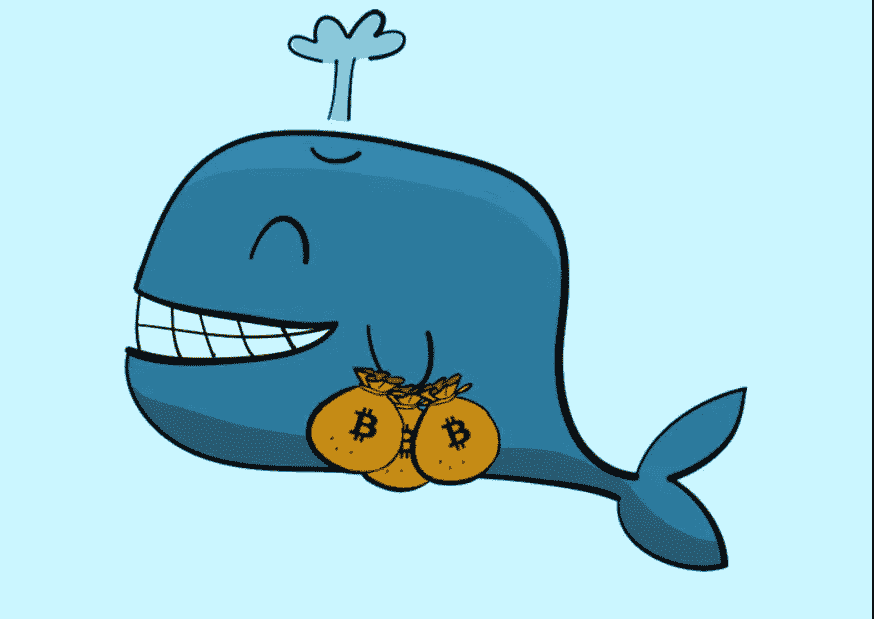

# 鲸鱼出生在这样的时代

> 原文：<https://medium.com/coinmonks/whales-are-born-in-times-like-this-8bdf5e07852e?source=collection_archive---------45----------------------->

Bitcoin Curious Baby Whale

今天早上，我像往常一样购买了比特币。我有点震惊地看到，我从 2019 年年中开始定期购买比特币的投资回报率只有 400%。就在几个月前，它的回报率高达 700%以上。

如果我对比特币和区块链经济持悲观态度，我会指出不太稳定的 UST 币或“月球币”的惊人爆炸。我将这一事件视为自 2019 年年中开始的这波特殊牛市开始以来，唱反调者和有线电视和播客上的谈话者所预测的疯狂看涨的加密货币投机市场的结束。那是我第一次注意到市场的转变，并开始购买比特币，原因有二:

1.易用性。我可以通过 CashApp 购买价值 5 美元的比特币，就像购买 5 美元的卡布奇诺一样简单。

2:我觉得在 2017 年底从上一个高点暴跌后进入市场的时机很好。

毫无疑问，Terra Luna 的崩溃是一个里程碑式的事件。比特币和加密社区的一些人将它比作[长期资本管理](https://en.wikipedia.org/wiki/Long-Term_Capital_Management)和[贝尔斯登](https://en.wikipedia.org/wiki/Bear_Stearns)的崩溃。一个不同之处是，你不会看到任何形式的对 Terra Luna 持有者的救助，就像你对以前的参考文献所做的那样。事实上，这些救助正是比特币及其三重分类账分散支持被创造出来的原因。

因此，我很高兴地购买了比特币，因为我知道很快比特币的价格就会上涨 700%，很可能在未来一两年内上涨更多，当然是在 2024 年下一次减半事件之前。事实上，在这种时候，下一批鲸鱼就诞生了。因此，现在是时候在比特币和其他具有良好效用的区块链项目上变得聪明起来了。

我个人认为，我们将很快看到反弹，即使我们短暂测试比特币的 20k 或以下。我很快放弃了任何交易或把握市场时机的想法。我在这场竞赛中毫不动摇，每天都在有条不紊地增加我的比特币头寸，同时越来越聪明地应对通过 NFTs 和其他区块链项目慢慢发生的破坏。

从技术商业模式的角度来看，我确信 NFTs 将在未来 2-3 年内彻底颠覆价值 3000 亿美元的游戏产业。最后，当 FAANG 股票下跌时，每 10 个人决定不看他们的投资组合，躲在石头下面，就有许多其他未来的鲸鱼正在悄悄地寻找真正理解变化的时代，并采取措施调整他们的投资组合，以适应未来十年唯一的增长机会。

经济正从投机性的科技增长转向更保守的硬资产和大宗商品。你只需要去一趟加油站或杂货店，然后看看纳斯达克指数就能理解这种转变。原本会流入纳斯达克和 FAANG 股票的大量资本将会流向比特币和区块链，成为下一个也是唯一的增长机会。新的鲸鱼将在 2024 年底前的 1-2 年内出生，届时我们将看到最终结算层比特币的供应再次减半。

祝一切顺利，

吉姆(人名)

> 加入 Coinmonks [电报频道](https://t.me/coincodecap)和 [Youtube 频道](https://www.youtube.com/c/coinmonks/videos)了解加密交易和投资

# 另外，阅读

*   [CoinDCX 点评](/coinmonks/coindcx-review-8444db3621a2) | [加密保证金交易交易所](https://coincodecap.com/crypto-margin-trading-exchanges)
*   [红狗赌场评论](https://coincodecap.com/red-dog-casino-review) | [Swyftx 评论](https://coincodecap.com/swyftx-review) | [CoinGate 评论](https://coincodecap.com/coingate-review)
*   [Bookmap 评论](https://coincodecap.com/bookmap-review-2021-best-trading-software) | [美国 5 大最佳加密交易所](https://coincodecap.com/crypto-exchange-usa)
*   [如何在 FTX 交易所交易期货](https://coincodecap.com/ftx-futures-trading) | [OKEx vs 币安](https://coincodecap.com/okex-vs-binance)
*   [CoinLoan 审查](https://coincodecap.com/coinloan-review) | [YouHodler 审查](/coinmonks/youhodler-4-easy-ways-to-make-money-98969b9689f2) | [BlockFi 审查](https://coincodecap.com/blockfi-review)
*   XT.COM 评论 | [币安评论](https://coincodecap.com/xt-com-review)