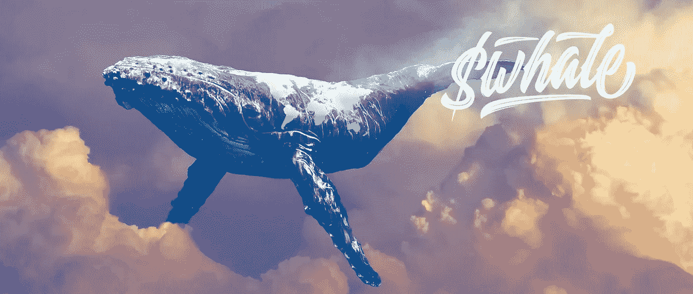

# 鲸鲨| IkarisDaily #5

> 原文：<https://medium.com/coinmonks/whaleshark-ikarisdaily-5-84e8ff087bc6?source=collection_archive---------82----------------------->

WhaleShark by [SuperRare](https://editorial.superrare.com/2022/01/05/into-the-heart-of-whale-sharks-nft-investing-brilliance/)

2022 年 3 月 17 日星期四

我想我开始尝到朝九晚五生活的滋味了，我也明白了为什么大多数人不喜欢这种生活。随着一周时间的推移，我变得更加疲惫和易怒。你知道，这是一种精神疲劳。每天都有，然后你睡一觉就变少了，但还是有一些残留。残留物越积越多。不管怎样，今天也是个好日子。做了很多事，尽管很无聊。尽管如此，有工作总比没有工作好。

正如我昨天提到的，我们基本上完成了 NFT 佳能。真的很高兴我通过了那套庞大的文章。在计划我今天要做的事情时，我必须把明天也考虑进去。我不想为今天和明天开始任何真正重大的事情，以免疲劳过度。我期待着周末开始我的社交媒体方面的事情&完成所有与 NFT 佳能相关的任务。由于这个原因，我计划在明天和周六的 IkarisDaily 上记录我以前在 NFT 经典中的文章。我也会在周日收集所有的信息，为 NFT 论文的创作做准备。

今天，我看了 Coin Desk 的这篇文章，杰夫·威尔瑟的《[鲸鲨的 NFT 收藏手册](https://www.coindesk.com/business/2021/03/26/whale-sharks-nft-collectors-playbook/)》。至少可以说，我印象深刻。

## 1)成为 NFT 投资者

一个有抱负的 NFT 投资者要做的第一件事是真正理解什么是 NFT，以及它们如何改变数字资产的所有权和管理。这可以通过 Youtube 或文章来完成。

其次，他们应该在 Twitter 上，这是 NFT 空间的通信枢纽。他们应该关注所有最大的创作者、收藏家和项目。WhaleShark 推荐的项目:

**资讯**——[nonfungible.com](https://twitter.com/nonfungibles?ref_src=twsrc%5Egoogle%7Ctwcamp%5Eserp%7Ctwgr%5Eauthor)， [L'Atelier](https://twitter.com/latelier?lang=en) ， [DCL 博主](https://twitter.com/DCLBlogger)，[安德鲁·斯坦沃德](https://twitter.com/AndrewSteinwold)

**重大项目(+你感兴趣的)——**[诸神被解放](https://twitter.com/GodsUnchained)、[创客之地](https://twitter.com/makersplaceco)、[已知起源](https://twitter.com/KnownOrigin_io)、[超级稀有](https://twitter.com/SuperRare)、[俏皮网关](https://twitter.com/niftygateway)、[沙盒](https://twitter.com/TheSandboxGame)、[隐密体素](https://twitter.com/cryptovoxels)、[去中心化](https://twitter.com/decentraland)

**主要收藏家—** [MoCa](https://twitter.com/museumcryptoart?ref_src=twsrc%5Egoogle%7Ctwcamp%5Eserp%7Ctwgr%5Eauthor) 、WhaleShark、 [Gary Vee](https://twitter.com/GaryVee) 、 [Jamie Burke](https://twitter.com/jamie247)

接下来，他们应该听 NFT 的播客。Whaleshark 推荐安德森·斯坦伍德的《马孜红》[，《非印第安人》的《非印第安人》](https://anchor.fm/andrew-steinwold)，《马修和里兹勒秀》。他们还应该考虑加入 NFT 最大的两个分歧——鲸鱼&[令牌智能](https://discord.com/invite/nft)。

> “这绝对是我立即采取行动的事情。我跟踪了他提到的所有账户。我跟上他们的能力将非常有限，因为我通常不怎么上 Twitter 或 Discord。这是我必须随着时间发展的东西，但我会努力的。正如他提到的，你需要了解什么是非功能性测试以及为什么它们很重要。我想说我对此有很好的理解(甚至更多)。当然，还有更多的东西需要开发，这就是为什么 Twitter 上的 50 小时作业即将开始。”

## 2) WhaleShark 的投资框架

99.99%的项目都会失败。由于这一点，投资者需要分析他们如何进入这个空间，他们想要收集什么。鲸鲨不收集他不喜欢的食物。

该框架的第一个支柱是——传统收藏品和数字收藏品的并行。这种相似性的存在意味着有传统收藏品价值上升的历史证据，这将预示着数字收藏品相似的命运。例如，运动鞋 NFT 是增值的传统收藏品，并且可以预期其数字形式也会增值。

第二个支柱是——项目团队。看看创始人和团队，了解他们是否有专业知识、职业精神和过往记录。

第三个支柱——非物质文化遗产的性质和质量。寻找高质量的项目，充分利用数字产品的功能，将收藏品带入数字时代。很快，许多主流项目将进入这个领域——只有高质量的项目才会成功。这些才是你想投资的。

最后一个支柱——资金。投资有强大投资者支持和雄厚资本的项目。项目需要能够在熊市中存活，才能在牛市中成功。

毫无疑问，WhaleShark 相信秘密艺术会在一开始就爆发。现在，他相信能让你展示秘密艺术的项目——元宇宙。他信任的一个项目是隐体素。他还认为未来在音乐领域。

一般来说，他的卖出时间跨度是永远不会。他想买入那些他能够在有生之年长期持有的项目，这些项目仍在增值。

WhaleShark 认为，当主流进入这个领域时，99%的项目都会内爆。届时，新的项目将会启动。这就是为什么永远不会太晚。你只需要留心地面(关注 Twitter)来解读哪些项目会蓬勃发展。这也是一种很好的投资方式，通过确定哪些艺术家将会成名并进入主要拍卖行——这将需要大量的研究和分析，但这是值得的。

最后，WhaleShark 采取的方法是，当他发现一个喜欢的项目时，尽可能多地购买。

> “在股票市场上，我是沃伦·巴菲特的忠实追随者。当我通读这篇文章时，我发现巴菲特先生在 WhaleShark 的方法和技巧上有相似之处。WhaleShark 有一个基于基本面的框架，一个不确定的时间范围和一个购买大项目的政策。很像巴菲特先生。
> 
> 我非常高兴我决定今天读这篇文章。当我进入 NFT 研究过程的项目分析部分时，我发现了一个很好的框架。我将能够以我自己的经验为基础，使它更加详细。然而，更重要的是，我已经赢得了尊重，并找到了一位投资英雄——鲸鲨。他的哲学和方法与我自己的想法和信念一致，也与我的投资英雄沃伦巴菲特的想法和信念一致。
> 
> 我一写完这篇文章，就跑去 Uniswap 买了一些$WHALE。不幸的是，汽油费很高(300GWEI 时 80 美元，信不信由你),这就是为什么我在周日早上提醒买一些代币。通常，我不会在没有分析的情况下做任何投资(这就是为什么我还没有一只 NFT)。然而，就像我完全基于巴菲特先生购买伯克希尔哈撒韦公司的股票一样，我也会完全基于 WhaleShark 购买$WHALE，因为他的想法和信念与我的一致。当然，我会投资一小笔我不介意损失的钱。"

今天在 NFT 前线很棒。我非常非常高兴我被介绍到了鲸鲨。你知道，在你崇拜并试图复制的空间里拥有某些人真的很重要。它给你一个最初的奋斗目标。

如前所述，明天将更为 NFT 佳能笔记的编撰。应该会很快，因为我会更专注于几周前完成的部分。我会做我还没有开始的部分，可能在周六，那时我会有更多的精力和空闲时间。除此之外，我可能还会在周六研究和了解更多关于 WhaleShark 的信息——他的投资方法、金库、鲸鱼社区等等。应该很有意思！明天见…

> 加入 Coinmonks [电报频道](https://t.me/coincodecap)和 [Youtube 频道](https://www.youtube.com/c/coinmonks/videos)了解加密交易和投资

# 另外，阅读

*   [最佳期货交易信号](https://coincodecap.com/futures-trading-signals) | [流动性交易回顾](https://coincodecap.com/liquid-exchange-review)
*   【Huobi 的加密交易信号 | [Swapzone 审查](/coinmonks/swapzone-review-crypto-exchange-data-aggregator-e0ad78e55ed7)
*   最佳[密码交易机器人](https://coincodecap.com/best-crypto-trading-bots) | [购买索拉纳](https://coincodecap.com/buy-solana) | [矩阵导出审查](https://coincodecap.com/matrixport-review)
*   [Coldcard 评论](https://coincodecap.com/coldcard-review) | [BOXtradEX 评论](https://coincodecap.com/boxtradex-review)|[uni swap 指南](https://coincodecap.com/uniswap)
*   [比特币基地评论](/coinmonks/coinbase-review-6ef4e0f56064) | [德里比特评论](/coinmonks/deribit-review-options-fees-apis-and-testnet-2ca16c4bbdb2) | [FTX 评论](/coinmonks/ftx-crypto-exchange-review-53664ac1198f)
*   [n ave 零点回顾](/coinmonks/ngrave-zero-review-c465cf8307fc) | [Phemex 回顾](/coinmonks/phemex-review-4cfba0b49e28) | [PrimeXBT 回顾](/coinmonks/primexbt-review-88e0815be858)