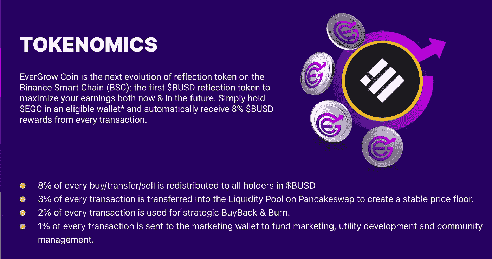
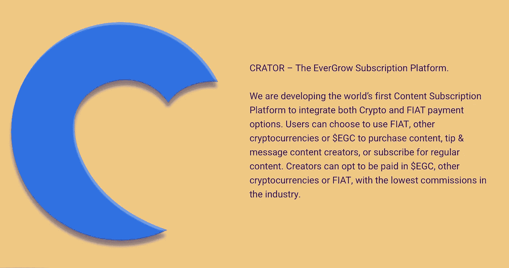
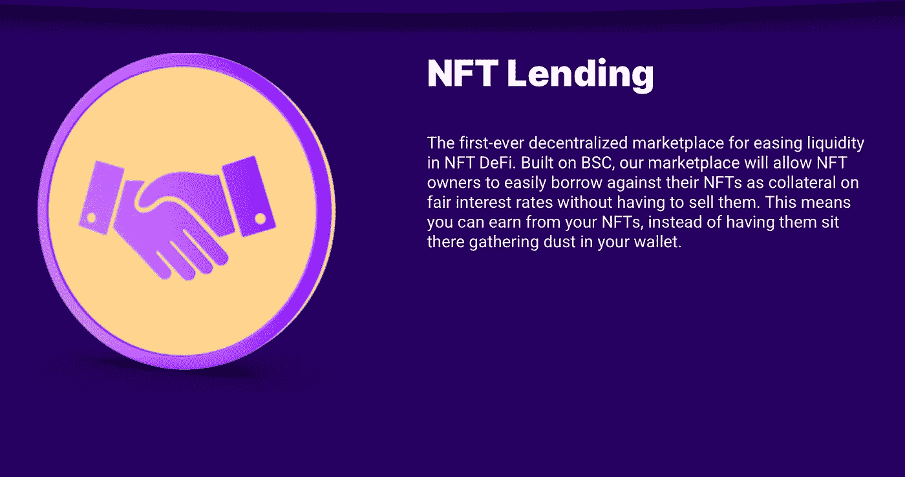
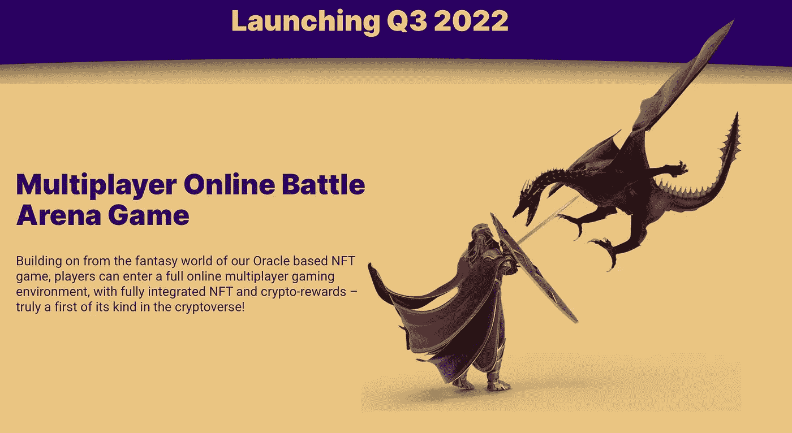
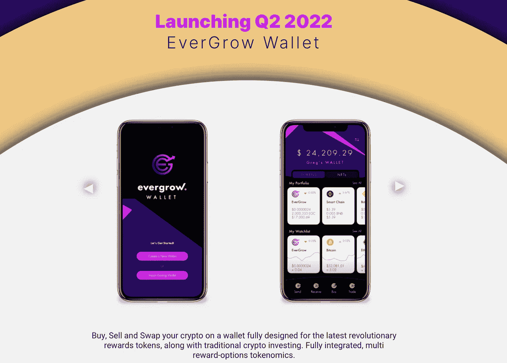
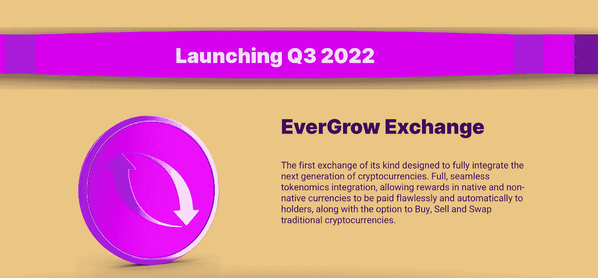

# 关于……

> 原文：<https://medium.com/coinmonks/what-about-50e93a9bb72a?source=collection_archive---------55----------------------->

… [恒丰](https://evergrowcoin.com)？如果你从未听说过恒丰币，那么这篇文章可能会让你感兴趣。

在加密货币的世界里，有很多炒作。围绕比特币、Defi(去中心化金融)、NFT(不可替代代币)、meme coin 的炒作。也许下一个大炒作正在出现，这个被称为反射令牌。这些代币属于分散融资等范畴。

什么是反射令牌？

反射令牌是基于现有区块链的令牌，如来自币安的令牌(币安智能链)。代币的对应物是一枚有自己区块链的硬币。

有了反射令牌，你可以在购买、出售和转让时获得应得的费用份额。根据您拥有的代币数量，此份额可大可小。

示例:

假设“XYZ”令牌具有以下费用结构，也称为“令牌组学”。

购买/销售:14%
反映:10%

你买 1000 个代币。其中，14%或 140 枚代币进入底池，86%或 860 枚代币进入您的钱包。

另一个人购买 500 枚代币，另外 70 枚进入底池。

现在这个底池中有 210 个代币，其中 10%归所有代币持有者所有。然而，不是 10%归每个代币持有人，而是根据持有人份额的大小，所有收取费用的 10%分配给持有人。

在我们的示例中，有 1500 个令牌和 2 个持有者。您在 210 个代币中的份额约为 67%，其他持有者的份额约为 33%。
你得到大约 140 个代币，另一个得到大约 70 个代币。随着每一次交易，代币持有者赚取更多代币。

以下是 Evergrow 的 tokenomics:

恒丰硬币

恒丰币也是一种反射令牌。但你不会得到代币的奖励，而是 BUSD，这是一种来自币安的稳定硬币。稳定的硬币在价值上是稳定的，并且总是有 1 的价值，并且通常由像美元这样的法定货币支持。

这就是恒丰硬币的特别之处。例如，许多像 Safemoon 这样的项目用 Safemoon 来补偿他们的投资者。但问题是 Safemoon 的价值是有波动的。所以一天下来你赚了多少取决于价格。
另一方面，BUSD 总是有同样的价值。

反射标记的问题？

反射令牌取决于交易量。如果没有人交易，就不会有费用，因此持有者也不会得到报酬。因此，目标是保持代币交易。

另一个问题是，没有像币安或比特币基地这样的交易所有接受反射令牌的要求。以前从来没有代币奖励持有代币的用户。为此，必须首先实现必要的协议。

你如何解决这些问题？

通过创造应用的可能性。这里的一个例子是币安的硬币，称为 BNB。币安智能链上的每一笔交易都是用 BNB 支付的。所以有必要购买 BNB 来进行交易。因此，它总是与 BNB 进行交易。

恒丰也想为 EGC 创造一种实用工具(恒丰币)。他们在一些计划应用可能性的帮助下正在做这件事。

有哪些申请机会？

一个是名为“CRATOR”的内容创作者平台。这类似于 Platform Only 粉丝，并将其功能与 Instagram 和 YouTube 的功能相结合。如果你想给你最喜欢的内容创作者捐款，可以使用 EGC。所以粉丝买下了 EGC 并支付了购买费用。创作者可以持有或出售 EGC，并支付一定费用。这就填满了罐子，代币持有者得到了更多的补偿。

还计划建立一个 NFT 平台，在这个平台上，除了别的以外，人们还可以借用 NFT 的平台。这种可能性是以前从来没有过的，非常令人兴奋。

还计划了一场游戏。此外，恒丰希望成为元宇宙的货币，最近刚刚宣布与一个提供虚拟现实内容的平台合作。

此外，它有自己的钱包和交易所，这两者都适用于令牌组学。因此，用户有可能在交易所购买 EGC，并收到他们的 BUSD。

结论

恒丰硬币是一个非常令人兴奋的项目，未来有很大的潜力。只能推荐你去看一看，去了解一下。
每天产生被动收入的可能性非常有利可图，并将越来越受到用户的关注。

我写这篇文章是因为我喜欢它，并想告诉你那里有什么。如果你喜欢这篇文章，我会很高兴喜欢。

链接:

[恒丰银行网站](https://evergrowcoin.com)

[恒丰推特](https://twitter.com/evergrowcoinEGC?s=20&t=MBImS8eVJ8981aIaVZqzXA)

[审计报告](https://www.certik.com/projects/evergrow)

> 加入 Coinmonks [电报频道](https://t.me/coincodecap)和 [Youtube 频道](https://www.youtube.com/c/coinmonks/videos)了解加密交易和投资

# 另外，阅读

*   [交易杠杆代币的最佳交易所](https://coincodecap.com/leveraged-token-exchanges) | [购买 Floki](https://coincodecap.com/buy-floki-inu-token)
*   [3Commas 对 Pionex 对 Cryptohopper](https://coincodecap.com/3commas-vs-pionex-vs-cryptohopper)|[Bingbon Review](https://coincodecap.com/bingbon-review)
*   [加密复制交易平台](/coinmonks/top-10-crypto-copy-trading-platforms-for-beginners-d0c37c7d698c) | [如何在 WazirX 上购买比特币](/coinmonks/buy-bitcoin-on-wazirx-2d12b7989af1)
*   [CoinLoan 评论](https://coincodecap.com/coinloan-review)|[Crypto.com 评论](/coinmonks/crypto-com-review-f143dca1f74c)
*   [如何在加拿大购买加密货币？](https://coincodecap.com/how-to-buy-cryptocurrency-in-canada)