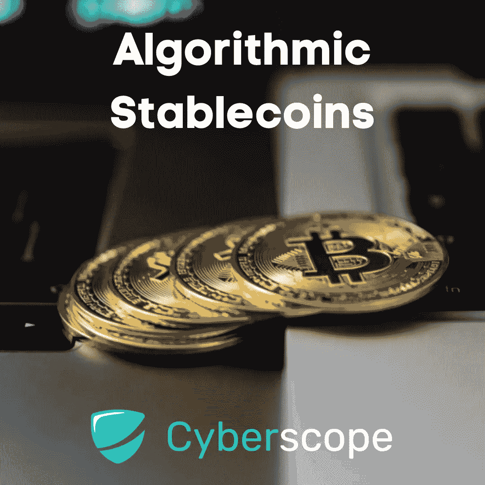
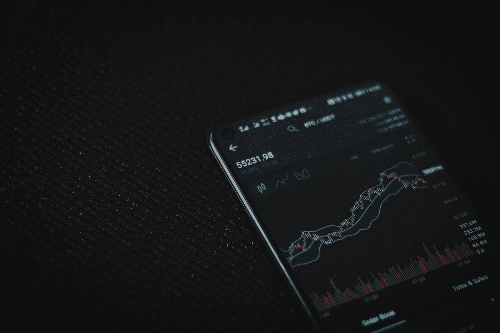
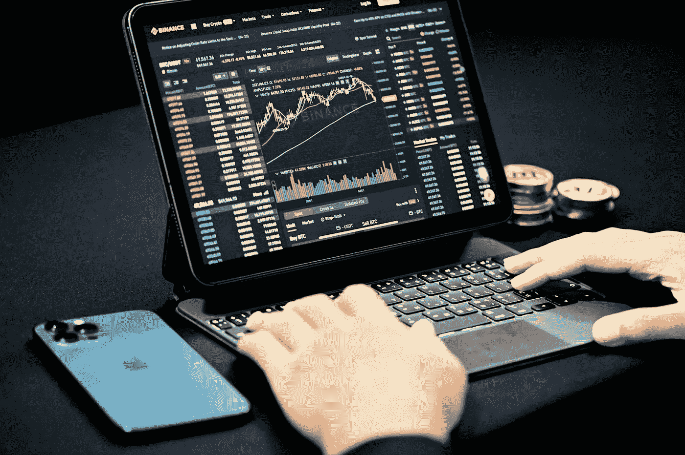

# 什么是算法稳定点？

> 原文：<https://medium.com/coinmonks/what-are-algorithmic-stablecoins-57c90925d632?source=collection_archive---------38----------------------->

在 2022 年 5 月最大的算法稳定币(按市值计算)TerraUSD 崩溃后，相当多的注意力转向了稳定币，许多投资者想知道，“算法稳定币有多安全？”

Stablecoins 旨在消除加密货币的一些波动性。与美元等法定货币 1:1 挂钩，稳定的货币正如其所宣称的那样:价格稳定。在短暂失去与美元的挂钩后，TerraUSD 的价值从 190 亿美元下降到 10 亿美元，使生态系统螺旋上升。然而，这并不意味着稳定的债券对投资者来说是一个坏赌注。

在你决定投资之前，重要的是要了解算法稳定点是如何工作的，以及它们的不同之处。

# 算法 Stablecoins 是如何工作的？

大多数稳定货币通过抵押机制跟踪一种货币，并由现金或各种其他资产支持。像 USDT 这样的稳定货币是由像美元这样的法定货币支持的。大宗商品支持的稳定资产，如 XAUT，是由贵金属、石油或房地产大宗商品支持的。密码支持的 stablecoins 像 ETH 一样由密码支持，并由智能合约运行。

像 Terra 的 UST 一样，算法稳定币没有法定货币、实物资产或密码的支持，而是基于专门的算法和智能合约来创造稳定性，这些算法和智能合约管理流通中的代币供应，并保持其与被跟踪的法定货币挂钩。这些算法还可以刺激投资者的行为，以稳定硬币的价格。

一般来说，我们指的是重计基数和铸币税算法稳定资本。重制稳定币操纵稳定币的供应，通过铸造和焚烧与稳定币价格运动一致的硬币来维持其价值，从而维持稳定币与法定货币的挂钩。例如，如果稳定硬币的价值低于 1 美元，硬币将被烧毁(从流通中去除)以提高其价值。

铸币税稳定币以类似的方式运作，但也将稳定币与其他数字货币配对，并向参与者提供购买或出售配对加密货币的激励，以保持稳定币的价格稳定。TerraUSD 是一种铸币税稳定币，使用其本国货币(LUNA)来维持其对美元的价值。

结果是这样的。根据协议，你可以用 1 美元的月神兑换 1 UST。当露娜被换成 UST 时，为了铸造 UST，露娜被烧掉，反之亦然。不幸的是，当 UST 的价格下降时，参与者开始交换月神来赚取利润，这反过来又使月神的供应量飙升。基本上，如果你的 UST 跌到 0.5 美元，你可以用 25 美元买 50 个 UST，然后用 50 个 UST 换 50 个卢纳，卖掉它，你的利润就会翻倍。

2022 年 5 月，一头鲸鱼倾倒了价值 1.93 亿美元的 UST，导致 UST 的价值滑落到美元以下。恐慌袭来，人们开始出售露娜。几天之内，LUNA 的价值从健康的 87 美元跌至 0.00018 美元。

# 稳定的收入仍然是一个好的投资吗？

TerraUSD 的崩溃可能会让大多数人暂停。然而，现金支持的稳定资本仍然被认为是可靠的投资，重要的是不要完全低估算法稳定资本。

稳定和可预测的加密货币的梦想仍然存在。加密市场是不稳定的，稳定的货币提供了一些常规加密货币所不能提供的保证。稳定的货币价值对 DeFi 非常重要，尤其是在贷款、借款和高产农业方面。

当谈到算法稳定硬币时，当挂钩打破时，令牌供应管理(UST 和卢娜交换)导致了死亡螺旋。值得注意的是，在那次不幸的事件之前，UST 只两次打破了盯住美元的政策。设置参数和进行治理变革可能会让算法稳定币重新受到青睐，这主要是因为无抵押算法稳定币代表着加密投资的终极圣杯:无中生有地赚钱。当然，失败的风险很高，但总会有投资者愿意赌一把，总会有回报的赌博。

随着加密货币进入主流金融世界，规则和治理将开始发挥作用，要么是自我施加的，要么是当局强制规定的。参与者很可能会要求更稳健的储备，即使是在算法稳定的情况下。这个系统会是什么样子(以及它是否可能实现)还有待观察。包括高盛(Goldman Sachs)在内的一些分析师指出，算法稳定的货币与外汇市场上一些与其他货币挂钩的货币(如港币)并不完全不同，额外的用例将为这些加密资产创造更稳定的需求。

# 结论

那么，你应该买一个算法稳定币吗？答案完全取决于你的风险偏好。算法稳定的货币可以提供巨大的收益和令人难以置信的低收益，但许多加密货币都是如此。如果你的风险偏好较低，最好看看市场上一些即将上市的、经过审计的、声誉良好的稳定债券。你可以在[的 Coinscope](https://coinscope.co/) 上找到他们，并阅读他们的报告来做出自己的决定。算法稳定很可能会持续很长一段时间。

[*Cyberscope*](https://www.cyberscope.io/) *是密码行业领先的智能合同审计& KYC 公司之一，已经审计了 500 多个区块链项目和 NFT。所有主要发射台的官方合作伙伴。*

…

*最初发布于*[*https://www . cyber scope . io*](https://www.cyberscope.io/)*。*

> 加入 Coinmonks [电报频道](https://t.me/coincodecap)和 [Youtube 频道](https://www.youtube.com/c/coinmonks/videos)了解加密交易和投资

# 另外，阅读

*   [印度的加密交易所](/coinmonks/bitcoin-exchange-in-india-7f1fe79715c9) | [比特币储蓄账户](/coinmonks/bitcoin-savings-account-e65b13f92451)
*   [OKEx vs KuCoin](https://coincodecap.com/okex-kucoin) | [摄氏替代品](https://coincodecap.com/celsius-alternatives) | [如何购买 VeChain](https://coincodecap.com/buy-vechain)
*   [币安期货交易](https://coincodecap.com/binance-futures-trading)|[3 commas vs Mudrex vs eToro](https://coincodecap.com/mudrex-3commas-etoro)
*   [如何购买 Monero](https://coincodecap.com/buy-monero) | [IDEX 评论](https://coincodecap.com/idex-review) | [BitKan 交易机器人](https://coincodecap.com/bitkan-trading-bot)
*   [CoinDCX 评论](/coinmonks/coindcx-review-8444db3621a2) | [加密保证金交易交易所](https://coincodecap.com/crypto-margin-trading-exchanges)
*   [红狗赌场评论](https://coincodecap.com/red-dog-casino-review) | [Swyftx 评论](https://coincodecap.com/swyftx-review) | [CoinGate 评论](https://coincodecap.com/coingate-review)