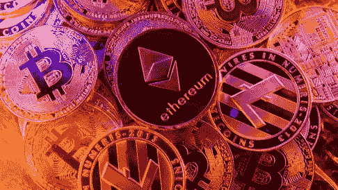
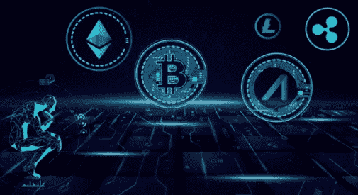

# 什么是山寨币？

> 原文：<https://medium.com/coinmonks/what-are-altcoins-981564e775f3?source=collection_archive---------35----------------------->

你很有可能听说过比特币，但你有没有遇到过类似比特币价值正在贬值或比特币价值正在升值这样的说法。如果是的话，那么像什么是代用币这样的问题呢？或者我应该投资 altcoins 你肯定想到过。

这里是你需要知道的关于替代硬币的一切。

**什么是山寨币？**

Altcoins 是非比特币的替代硬币或加密货币。所以莱特币、Ripple、Dash 或者其他任何非比特币的加密货币都可以称为 Altcoins。替代币是比特币的替代品。这些也是政府发行的货币的替代品。然而，它们没有任何物理存在，因为它们是与比特币一样的数字货币。

现在，你一定在想，当你有比特币的时候，为什么还需要替代币呢？

这个问题的答案非常清楚，比特币并不完美或者换个更好的说法，altcoin 是更好的或者不同版本的比特币。虽然替代币仍然具有比特币的坚实特征，但每种替代币都有其与比特币截然不同的独特功能。

让我们用例子来理解，陈述事实

莱特币属于 altcoins，确认交易的速度比比特币快得多。Dash 和 Monero 或 altcoins 在 anotomy 方面很棒，因为它们可以执行几乎无法追踪的交易。当谈到替代硬币时，每个替代硬币都有独特的功能，无法复制甚至试图这样做。要想知道哪种替代硬币越来越受欢迎，最有效的方法之一就是测量它们的市值。

衡量市值的公式是市值=硬币 x 汇率。它的计算方法是将流通中的硬币数量乘以美元汇率。例如，有 20，000，000 个比特币在流通，一个比特币的价格是 3，000 美元，那么比特币的市值将是 60，000，000 美元。在最长的一段时间里，市场被比特币占据，但随着越来越受欢迎，替代比特币已经设法取代了比特币的市场地位。

**山寨币历史:**

替代币不是比特币，因为它们是比特币以外的加密货币。在 2009 年推出比特币后不久，2011 年推出了第一个 altcoin，尽管它在 2013 年和 2014 年才开始流行。随着对新功能需求的增加，到 2017 年，altcoin 类别下推出了 600 多种加密货币。2011 年 4 月 1 日，第一个名为 altcoin 的硬币发行，它与比特币非常相似，同样拥有 2100 万枚硬币的最大供应量。替代硬币是一种加密货币，使用区块链技术来促进安全的点对点交易。根据最新的研究，在比特币发明后，已经有超过 900 种替代币被引入。

**代用币的种类:**

市场上有近 5000 枚替代硬币。人气和各种参数的 9 大 altcoins 列表。

1.Namecoin:比比特币晚两年推出。名字硬币是 2011 年 4 月出生的 altcoin 的第一个婴儿。发明 Namecoin 的唯一目的是以一种更加分散的方式取代域名系统。为了访问任何以 bit 结尾的网站，namecoin 中提供了一个用于 Firefox 或 Chrome 的特殊插件，它会自动指引正确的方向。它是一个打包的功能，确保简单可靠的功能，最终改善用户对功能合并挖掘的体验，这是一种独特的有趣的挖掘方法。

2.Litecoin:在命名 coin 之后的一段时间推出。莱特币诞生于 2011 年，并在最短的时间内获得了巨大的人气。多年来，莱特币是仅次于比特币的第二大加密货币，因为它使用内存硬最小化谜题，这也被称为两种货币的主要技术差异。

3.Peercoin:大约在 2012 年底推出，使用不涉及任何计算工作的股权证明采矿难题，而是通过使用矿工拥有的硬币进行交易来采矿。

4.doge coin:2013 年出生，目的是和加密货币玩得开心。Dogecoin 是一项独特的发明，它从其他货币和比特币中挖掘技术变化，使其在市场上脱颖而出。事实上，dogecoin 支持各种大大小小的公共活动，这使它在推出后不久就受到公众的欢迎。一个显著的技术差异是随机块奖励的概念，每个块奖励都是随机的。

5.以太坊:它是 2013 年初推出的第一种智能合约加密货币，并于 2014 年问世。简而言之，以太坊是分散程序的平台，也称为 DAPS。它允许用计算编程语言创建智能合同。这里的智能合同是存储在所有网络上的计算机程序。以太网上运行的合同的例子有金融市场、大众融资平台、拍卖等等。

6.Monero:这是一种加密货币，使用环签名算法，提高了高度隐私级别。该签名是多个参与者签名的组合。因此，它变得不可能打破。与比特币不同，monero 的每枚硬币都是一样的。

7.卡尔达诺:2015 年首次推出。Cardano 是第三代加密货币，旨在保护用户隐私。虽然它仍在发展，但它的特性使它成为 altcoin 类别下最好的加密货币之一。它的一些特点包括高速，这是各种其他加密货币的关注点。货币所有权意味着用户拥有的货币就像金融机构，更高的证券，这是大多数加密货币的另一个关注点。

8.ripple:2012 年推出。Ripple 是一个基于区块链的数字支付网络和协议，拥有自己的加密货币。它与比特币有很大不同，因为它的主要目的是帮助当局，而不是取代他们，这与比特币不同。

9.Polkadot:这是另一个成功的 altcoin，旨在提供其他区块链之间的互操作性。它旨在分配系统在一个屋檐下工作，并连接许可和无许可的区块链。以太坊和波尔卡多特的唯一区别在于，除了创建分散的应用程序，用户还可以开发自己的区块链，同时确保最大的安全性。根据 2021 年 1 月的报告，Polkadot 的市值为 11，200，000，000 美元，单点交易价格为 12.54 美元。

这是目前站在比特币旁边的九种替代性加密货币。

像这样的问题，现在是投资 altcoin 的好时机吗？或者我为什么要投资你脑子里蹦出来的 altcoins？

为什么要投资代用币？

替代硬币确实有更高的百分比收益，但它们也涉及更高的风险。随着受欢迎程度的迅速增加，不可否认的事实是，替代硬币目前是每个人的首选。如果你想投资替代币，分析它的潜力是必不可少的，据说替代币的回报率远远高于比特币。记住，投资替代货币或加密货币实际上不应该轻易进行，因为实现预先设定的目标并不容易。因此，一定要做广泛的研究，所有方面，以尽量减少风险因素。

**替代硬币和加密货币的未来:**

2021 年对于加密货币来说是值得记住的一年，当我们看到比特币触及新的高度时，它确实显示了工业机构的可命令的影响。普通大众也对比特币和替代币感兴趣，这不仅是投资者的热门话题。尽管新冠肺炎造成了经济损失，但在过去几个月里，这种加密货币还是设法进行了搜索。举个例子，比特币已经从 7000 美元涨到了 26000 美元，而年初的 130.27 美元现在已经翻了一倍多。尽管这不是比特币或其他加密货币第一次出现大幅上涨，但 2017 年货币意外飙升时也发生了同样的事情。

对未来的预测:

比特币会像 2018 年那样再崩盘一次吗？

这个问题围绕着每一个想投资加密货币的人，因为投资者现在很清楚，2017 年的飙升是由于个人投资者涌入投资，但情况有很大不同，因为 insulation 已经开始投资比特币和替代硬币。

风险:

如果你认为这一切都很好，只有彩虹和独角兽在你的道路上，那么它不是 100%真实的，因为每个硬币都有两面，加密货币也是如此。尽管乐观主义者对光明的未来抱有很高的期望，但分析师们发现，在未来的日子里，不可忽视的风险层出不穷。在所有风险中，最令人不安的风险之一是违反比特币，尽管从远处看它似乎是一种和平，但除了比特币之外，它的波动性非常大。与比特币相比，替代比特币的波动性更高，因为投资者更少。

这就把我们带到了“什么是山寨币？”博客。希望你喜欢它的每一点。

> *加入 Coinmonks* [*电报频道*](https://t.me/coincodecap) *和* [*Youtube 频道*](https://www.youtube.com/c/coinmonks/videos) *了解加密交易和投资*

# 另外，阅读

*   [有哪些交易信号？](https://coincodecap.com/trading-signal) | [Bitstamp vs 比特币基地](https://coincodecap.com/bitstamp-coinbase) | [买索拉纳](https://coincodecap.com/buy-solana)
*   [ProfitFarmers 点评](https://coincodecap.com/profitfarmers-review) | [如何使用 Cornix 交易机器人](https://coincodecap.com/cornix-trading-bot)
*   [十大最佳加密货币博客](https://coincodecap.com/best-cryptocurrency-blogs) | [YouHodler 评论](https://coincodecap.com/youhodler-review)
*   [my constant Review](https://coincodecap.com/myconstant-review)|[8 款最佳摇摆交易机器人](https://coincodecap.com/best-swing-trading-bots)
*   [MXC 交易所评论](/coinmonks/mxc-exchange-review-3af0ec1cba8c) | [Pionex vs 币安](https://coincodecap.com/pionex-vs-binance) | [Pionex 套利机器人](https://coincodecap.com/pionex-arbitrage-bot)