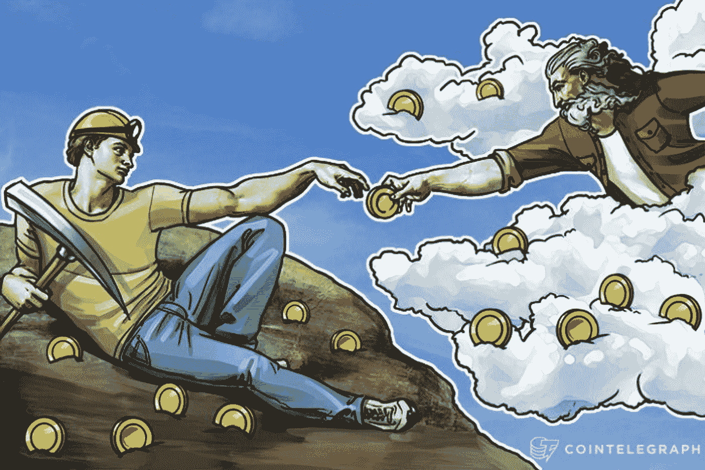
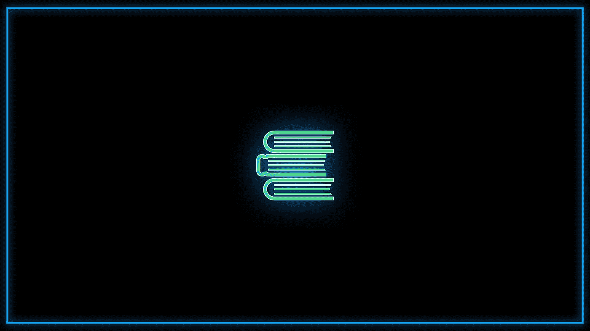

# 什么是山寨币？

> 原文：<https://medium.com/coinmonks/what-are-altcoins-9b15a92164bf?source=collection_archive---------66----------------------->

在我们的 YouTube 上观看视频的同时，享受这个流的资源！

YouTube:[https://youtu.be/gVoUu77DfP8](https://youtu.be/gVoUu77DfP8)

不和:【https://discord.gg/J73qhkj7kr】T2

推特:【https://twitter.com/CryptoverseDAO】

linktree:[https://linktr.ee/cryptoversedao](https://linktr.ee/cryptoversedao)

-

什么是 Altcoin？

比特币被认为是原始的加密货币，在它之后创造的其他货币将永远是比特币的替代品。因此，另类硬币通常被称为“另类硬币”。替代币是一大组加密货币，是用于非比特币加密货币的通称。

很多 Altcoins 都是基于比特币提供的框架。这意味着它们具有比特币的特征，变化非常小。比特币的特征，如点对点的性质，被“挖掘”的能力等，是大多数替代硬币和货币的核心组成部分。

市场上有成千上万的代用币，但人们在投资之前必须知道这些货币代表什么，以及它们的运作框架。

一些替代货币是为了解决特定的问题，或者为了特定的用途而制造的。一些硬币可以用来购买域名和主机。一些硬币仅用于购买成人内容等。

像以太坊这样的一些平台是相当革命性的，可以改变我们所知道的互联网的运作方式。然而，另一些人似乎没有什么目标，注定要失败。

理想情况下，替代硬币应该是为了解决某个特定的问题而创造的——而不仅仅是为了积聚金钱，像许多硬币一样走“让我们看它如何发展”的路线。然而，除此之外，还有许多替代硬币在市场上做得非常好，如以太、Ripple、Polkadot、Matic 等。

投资代用币前需要注意的事项

目的:

没有一个可靠的指标能告诉你你投资的硬币是否会变大。然而，首先，你想买的代用币必须有一个目的——它存在的动机。从大量替代货币来看，它们只是作为比特币的复制品或其他替代货币的复制品而存在，它们很有可能会停滞不前。你的硬币一定有它的用途。用最简单的话来说，一定有一个硬币想要解决的特定问题。

实际使用案例:

一个目的是不够的。你的币一定有一个问题在解决，你要投资的 altcoin 也一定有它要解决的问题的解决方案。这个“解决方案”也需要切实可行。说你想用一个新的基于区块链的系统取代互联网是容易的。很难说你将如何做这件事。

硬币背后的团队:

在投资替代硬币之前，另一件要注意的事情是了解谁为这个硬币提供动力。这枚硬币是由一个经验丰富的团队推动的，还是由一群缺乏实践经验的梦想家推动的？明智的做法是，选择有知名品牌支持的产品，而不是全新的产品。

风险:

任何交易或投资加密货币的人都必须知道市场存在风险。比特币、以太以及类似的东西已经显示出可持续增长的良好记录。然而，新的货币和代用币就不一样了！

为什么有人投资 Altcoins？

替代币主要由引入市场的新货币组成，旨在利用比特币的成功。虽然一些替代硬币已经在市场上存在多年，但每年都有越来越多的加密货币加入市场。人们出于以下原因投资代用币:

他们真的相信一种新推出的加密货币会为现有的原因或问题带来有效的解决方案。他们知道市场情绪，认为会有足够多的人愿意投资人民币，因此他们也会投资。

比特币从 0 美元到 6 万美元的增长让许多人相信，如果给予正确的支持和信任，所有加密货币总有一天会像比特币一样繁荣。

尽管其中一些人比其他人更专业，但他们大多试图通过牺牲某些技术方面来获得比比特币更大的优势。看看下面的十大硬币，你可能会发现更多的 dapp 平台和支付货币，以及具有更具体用例的公用事业和资产支持令牌。

在[https://coinmarketcap.com/](https://coinmarketcap.com/)上亲自看看，点击进入前 50 名山寨币，看看他们的网站、白皮书、价值主张&社交媒体；以更清楚地了解他们想要带来什么。总之，随着时间的推移，代用币只会越来越多。然而，并不是所有的替代硬币都会繁荣。许多人来了，许多人走了，就像许多人来了，许多人走了，却看不到一丝成功的曙光。投资 altcoins 要小心。

> 加入 Coinmonks [电报频道](https://t.me/coincodecap)和 [Youtube 频道](https://www.youtube.com/c/coinmonks/videos)来了解加密交易和投资

# 另外，阅读

*   [SmithBot 评论](https://coincodecap.com/smithbot-review) | [4 款最佳免费开源交易机器人](https://coincodecap.com/free-open-source-trading-bots)
*   [比特币基地僵尸程序](/coinmonks/coinbase-bots-ac6359e897f3) | [AscendEX 审查](/coinmonks/ascendex-review-53e829cf75fa) | [OKEx 交易僵尸程序](/coinmonks/okex-trading-bots-234920f61e60)
*   [如何在印度购买比特币？](/coinmonks/buy-bitcoin-in-india-feb50ddfef94) | [瓦济克斯审查](/coinmonks/wazirx-review-5c811b074f5b)
*   [隐翅虫替代品](/coinmonks/cryptohopper-alternatives-d67287b16d27) | [HitBTC 审查](/coinmonks/hitbtc-review-c5143c5d53c2)
*   [CBET 评论](https://coincodecap.com/cbet-casino-review) | [库科恩 vs 比特币基地](https://coincodecap.com/kucoin-vs-coinbase)
*   [折叠 App 审核](https://coincodecap.com/fold-app-review) | [Kucoin 交易机器人](/coinmonks/kucoin-trading-bot-automate-your-trades-8cf0ca2138e0) | [Probit 审核](https://coincodecap.com/probit-review)
*   [如何匿名购买比特币](https://coincodecap.com/buy-bitcoin-anonymously) | [比特币现金钱包](https://coincodecap.com/bitcoin-cash-wallets)