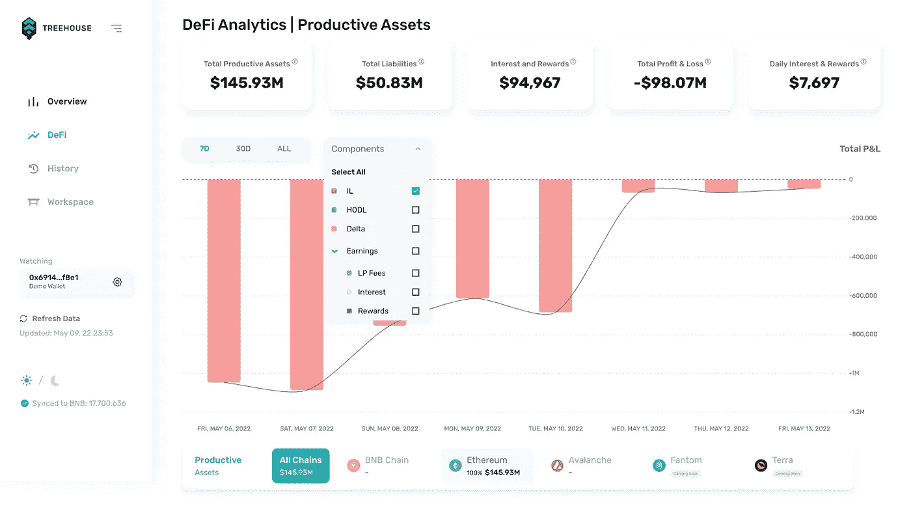

# 什么是 AMM，它们是如何工作的？

> 原文：<https://medium.com/coinmonks/what-are-amms-and-how-do-they-work-57c6f4fb2e23?source=collection_archive---------12----------------------->

本文旨在提供自动做市商(AMMs)的概述。它引用了区块链技术和短暂的损失。如果你对 DeFi 不熟悉，请先阅读我们关于 [*DeFi*](https://www.treehouse.finance/learn-defi/what-is-defi) *、* [*区块链*](https://www.treehouse.finance/learn-defi/what-is-a-blockchain) *、* [*非永久性损失*](https://www.treehouse.finance/learn-defi/what-is-impermanent-loss) *的入门文章，然后再阅读本文。*

# AMMs 背后的机制

AMMs 是自动做市商的简称，是利用流动性池促进数字代币交易的平台。与传统交易所相比，在传统交易所中，买方和卖方指明他们希望交易资产的价格，AMMs 便于用户和流动性池之间的自动和即时交易。

2017 年， [Bancor](https://www.treehouse.finance/learn-defi/bancor) 作为加密货币(crypto)的先驱分散交易所(dex)之一推出，最初建立在[以太坊](https://ethereum.org/en/)网络上。它率先推出了资产管理系统，在流动性池中对资产进行算法定价。[unis WAP](https://uniswap.org/)2018 年推广使用 AMMs。使用 AMMs 的[顶级加密分散交易所](https://coinmarketcap.com/rankings/exchanges/dex/)的其他例子包括 [SushiSwap](https://app.sushi.com/swap) 、 [PancakeSwap](https://www.treehouse.finance/learn-defi/pancake-swap) 和 [Curve Finance](https://www.treehouse.finance/learn-defi/curve-finance) 。

[Harvest](https://harvest.treehouse.finance/connect?utm_source=medium&utm_medium=social&utm_campaign=promotion) 支持这些协议以及更多。点击查看完整列表[。](https://harvest.treehouse.finance/supported-protocols?utm_source=medium&utm_medium=social&utm_campaign=promotion)

# 什么是流动性池？

流动性池是包括两种类型的加密令牌的池。用户可以存入等值的两种代币来参与流动性池，当其他用户交易这一对代币时，他们可以从中赚取交易费。

例如，如果用户在 ETH-DAI 流动性池中用 ETH 交换 DAI，所支付的交易费将根据他们拥有的池的百分比分配给 ETH-DAI 对的每个流动性提供者(LP)。在某些情况下，LP 可以在项目的原生令牌中获得额外的奖励，增加了一层额外的激励。了解更多关于 DeFi 农业的信息[点击这里](https://www.treehouse.finance/learn-defi/what-is-farming)！

# 常数乘积公式

AMM 可以持有许多不同的流动性池，每个池的利率取决于其受欢迎程度。为了保持平衡，许多 AMM 使用一个[常数乘积公式](https://www.gemini.com/cryptopedia/amm-what-are-automated-market-makers#section-constant-product-formula)。在下面由 [Uniswap](https://uniswap.org/) 推广的公式中，常数用“k”表示: **x** × **y = k**

此公式根据令牌数量调整池中每个令牌的价格，如“x”和“y”所示。为了帮助理解，我们将使用一个瑞士联邦理工学院/BTC 贸易对作为例子。当交易者购买 ETH 时，由于池中供应减少，ETH 的价格上升。相反，当资产池中的资产数量增加时，BTC 价格就会下跌。最终，资金池将通过调整资产价格保持恒定平衡，以保持 ETH 和 BTC 的总价值相等。

一般来说，这些资金池中的代币价格不会明显偏离真实市场价格。套利交易者利用多个交易所的资产差价来获利，从而维持流动性池的平衡。例如，如果某个交易所的 ETH 价格低于市场价格，套利交易者可以通过购买更便宜的 ETH 并在其他交易所出售来获利，从而利用这种价格不平衡。因此，ETH 的价格将不断调整，直到达到市场价格。

# 机制的变化

随着 DeFi 生态系统的不断变化和发展，除了恒定的产品配方之外，还出现了替代机制。这里有几个例子:

## 1.[平衡器](https://balancer.fi/)

平衡器池使用[常量平均值公式](https://balancer.gitbook.io/balancer/core-concepts/protocol/index)，允许多达 8 个可变比率的令牌，而更常见的是两个 1:1 比率的令牌。

## 2.[曲线](http://curve.fi/)

Curve 创建了类似资产的流动性池，如 stablecoins。这导致非永久性损失和交易费用的减少，因为稳定货币的价格波动通常要小得多。

## 3. [Uniswap v3](https://uniswap.org/blog/uniswap-v3)

Uniswap v3 具有许多改进，包括集中流动性和主动流动性。虽然它继续使用常数产品公式，但用户现在可以选择他们希望将资产分配到的价格范围，从而赚取费用。一旦超出这个范围，流动性将变得不活跃。以前，流动性会在从价格 0 到无穷大的整个曲线上均匀分布，使有限合伙人面临更多的非永久性损失。

# AMMs 的优势

# 众包流动性

不同于更大的集中交易所(cex)如[币安](https://www.binance.com/)和[比特币基地](https://www.coinbase.com/)，AMMs 可以众包更大的流动性。这对于在更新更小的项目中挖掘流动性特别有用。

# 大额交易的优惠利率

在 CEXs 上流行的以太坊交易对不能在一个更好的价格范围内容纳大量的交易订单。根据研究，[一名交易者在 Uniswap v3 上执行 500 万美元的交易比在比特币基地上节省大约 24，000 美元](https://coingape.com/defi-exchange-uniswap-claims-its-better-than-binance-and-coinbase-in-liquidity-game/)。

# 权力下放和透明度

交易所还因利用市场进行内幕交易而臭名昭著。AMM 是分散的和非托管的。链上订单簿的更大透明度和中央实体的缺乏使 dex 比它们的中央对手更安全。公众也可以访问智能合同代码，允许加密本地人验证代码，而不是依赖集中的业务来保持偿付能力。

# 提供流动性的风险

# 非永久性损失

[非永久性损失](https://www.treehouse.finance/learn-defi/what-is-impermanent-loss)是如果用户将代币放在钱包中而不是放在流动性池中，代币价值的差异。由于产品配方不变，AMM 不断试图维持流动性池中提供的代币比率。这意味着，在再平衡过程中，资产价格将会波动。由于加密资产是不稳定的，用户有可能通过持有他们的密码而不是将其放入池中来获利。

Harvest deconstructs your DeFi portfolio into various key P&L components

Treehouse 的 [Harvest](https://harvest.treehouse.finance/connect?utm_source=medium&utm_medium=social&utm_campaign=promotion) 等综合分析平台可以向你展示你的投资组合中发生的任何非永久性损失。Harvest 还为你提供了你的损益表的详细分类和你的投资组合的历史视图。

# 高额费用

资金池必须以费用的形式补偿有限合伙人的潜在价值损失。与流动性池交易的用户提供这些费用。虽然流动性提供者从这些支付中获得一定比例的收益，但交易者在每笔交易中都要承担相对较高的成本。

# 滑动

滑点是指在交易过程中，实际价格从原来的价格发生变化。滑点会因为资产池中资产的价格波动而恶化，因为交易者会影响每笔交易的价格。然而，滑点问题可以通过吸引更多的流动性到池中来解决。有了更大的流动性池，每笔交易中代币比率的变化就不那么显著了。因此，资产价格的变化可以最小化。

# 安全风险

除此之外，黑客利用智能合约漏洞的威胁一直存在，比如协议代码中的漏洞。最小化这种风险的唯一方法是做你自己的研究或 [DYOR](https://www.treehouse.finance/learn-defi/how-to-dyor) ，并且只将你的资金存放在已经被熟练的精明的合同审计员审计过的更有信誉的项目中。

# AMMs 的未来

尽管存在非永久性损失的风险，资产管理市场为那些寻求扩大其金融投资组合的人提供了许多机会。除了交易代币的便利性，AMMs 还提供了套利机会，并允许用户赚取回报。他们甚至可以通过流动性挖掘建立整个社区，并允许区块链项目更轻松地推出新的加密货币。作为 dex 的支柱，AMMs 为 DeFi 领域带来了宝贵的创新，并且很可能将继续成为该领域的主要产品。

*初来乍到？如果你觉得这很有用，请查看我们的其他* [*学习 DeFi*](https://treehouse.finance/learn-defi) *文章，深入了解 DeFi 的奇妙世界！或者，浏览我们的* [*见解*](https://treehouse.finance/insights) *部分，阅读更多关于 DeFi 空间的深入分析。您也可以试用我们的旗舰产品，*[*Harvest*](https://harvest.treehouse.finance/connect?utm_source=medium&utm_medium=content&utm_campaign=harvest)*，全面分析您的 DeFi 资产。最后，订阅快讯更新* [*这里*](https://www.treehouse.finance/newsletter?utm_source=medium&utm_medium=content&utm_campaign=treehouse%20daily) *！*