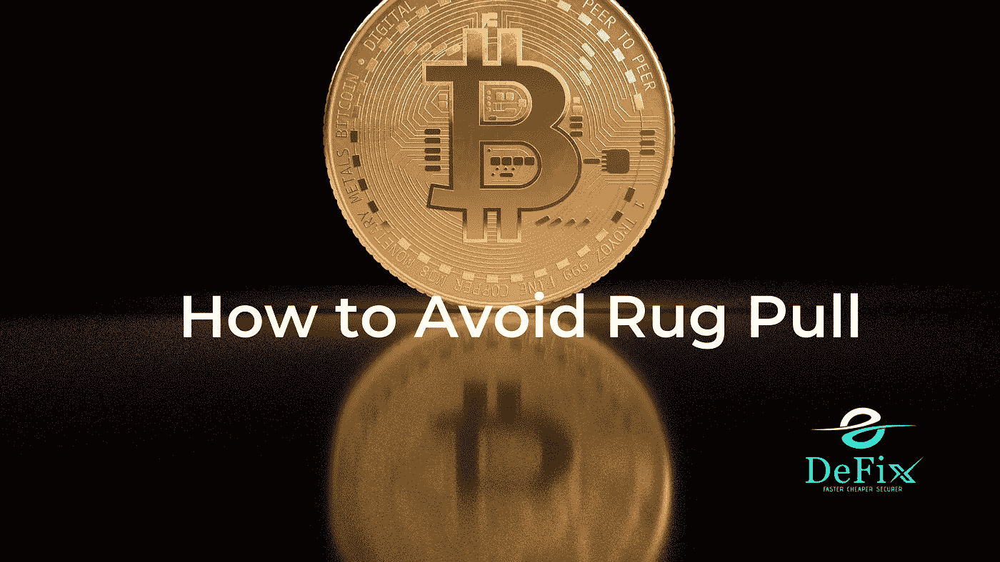
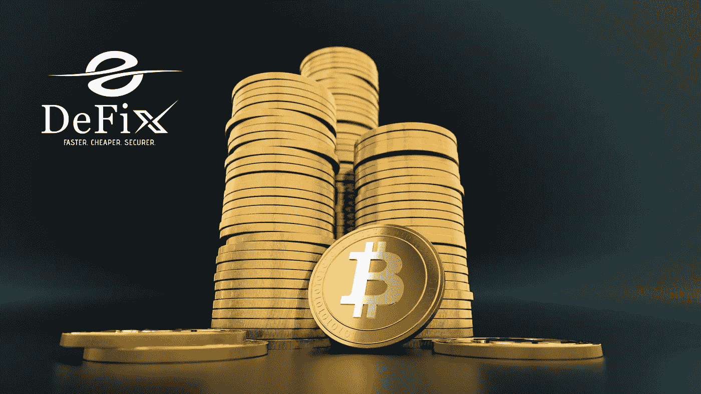

# 什么是秘密毒品以及如何避免它们？

> 原文：<https://medium.com/coinmonks/what-are-crypto-rug-pulls-and-how-to-avoid-them-b1090daf76b5?source=collection_archive---------69----------------------->

如果你站在一张地毯上，它突然从你下面被拉出来，你会摔倒在地板上，除非它是一张魔毯。更糟糕的是，你冒着弄洒或丢失你当时抓着的任何东西的风险。这就是为什么你必须警惕骗局，尤其是在交易不稳定的加密资产时。

我们将定义什么是拉地毯，它是如何发生的，如何防止它，以及你需要知道什么来保持领先地位和降低风险。

## **什么是加密货币中的‘地毯拉’?**

加密货币是一种狂野的西部氛围，一切皆有可能。每个角落都有积极变化和破坏的巨大潜力，但欺诈者和恶意窃贼也渴望从他人那里获得承诺和利润。

当开发人员建立一个与有价值的加密货币相关联的代币，在分散交易所(dex)提供代币，然后在投资者买入后撤回所有资金时，这被称为加密地毯拉。拉地毯通常是由无良的欺诈者进行的，他们为一种货币制造轰动效应，然后退出项目，窃取资金。通常，这些加密货币与可信的公用事业区块链(如以太坊或币安链)相结合。

用他们的 ETH 交换上市代币的投资者允许他们的开发商迅速从流动性中收回他们的 ETH。例如，迷因币导致投资者屈服于 FOMO 思维模式，从而上当受骗。

## **人是怎么变得粗犷的？**

加密货币黑客和欺诈普遍存在。它们可能以电子邮件网络钓鱼诈骗或您无意中在线访问的下载恶意软件的可疑 URL 的形式出现。众所周知，骗子会冒充人们的 SIM 卡来获取关键信息。然而，并不是所有的计划和情况都使用这种欺骗性的或幕后的方法。

这时地毯拉手就出现了。这些案件不能仅仅因为只有一个或几个受害者而不予考虑。地毯拉往往包括一个相当大的用户群，并经常失去整个市值的现金。地毯拉往往是明显的退出骗局伪装成一个伟大的倡议，以吸引消费者。当流动资金进入一个项目，价格上涨时，开发商会立即抽走所有可用的流动资金，从而打击那些剩下的投资者。

几个引人注目的企业吸引了很多关注，甚至吸引了一些世界上最强大的亿万富翁投资者，也陷入了类似的骗局，导致相关各方都遭受了巨大损失。当媒体关注他们的项目和努力时，开发商带着公众的钱消失了。

## **如何避免被加密货币诈骗**

避免这个问题并不简单，但是选择已经存在很长时间并且被认为是值得信赖的货币或协议是谨慎的。虽然最大的利润和回报可能来自一个模糊的新协议或计划，但这也是最大的危险所在。权衡整个风险和利润是至关重要的。因此，加密投资者和代币持有者如何优化他们的收入潜力，同时避免变得不稳定？

现在有几个选项可用，其中一项新服务将于 2021 年第三季度推出，这可能会显著提高 DeFi 项目和上述场景的安全性。加密货币的保证金交易提供了相当的利润潜力，是一种经过时间考验的可靠方法，可以从加密资产中获利，而没有欺诈的危险。

虽然风险仍然存在，但可以通过止损单和智能技术分析将其降至最低。PrimeXBT 是一个著名的获奖交易平台，提供加密货币、外汇、商品和股票指数的工具和差价合约。

> 加入 Coinmonks [电报频道](https://t.me/coincodecap)和 [Youtube 频道](https://www.youtube.com/c/coinmonks/videos)了解加密交易和投资

# 另外，阅读

*   [Bitsgap 审核](/coinmonks/bitsgap-review-a-crypto-trading-bot-that-makes-easy-money-a5d88a336df2) | [Quadency 审核](/coinmonks/quadency-review-a-crypto-trading-automation-platform-3068eaa374e1) | [Bitbns 审核](/coinmonks/bitbns-review-38256a07e161)
*   [加密复制交易平台](/coinmonks/top-10-crypto-copy-trading-platforms-for-beginners-d0c37c7d698c) | [Coinmama 审核](/coinmonks/coinmama-review-ace5641bde6e)
*   [印度的加密交易所](/coinmonks/bitcoin-exchange-in-india-7f1fe79715c9) | [比特币储蓄账户](/coinmonks/bitcoin-savings-account-e65b13f92451)
*   [OKEx vs KuCoin](https://coincodecap.com/okex-kucoin) | [摄氏替代品](https://coincodecap.com/celsius-alternatives) | [如何购买 VeChain](https://coincodecap.com/buy-vechain)
*   [币安期货交易](https://coincodecap.com/binance-futures-trading)|[3 commas vs Mudrex vs eToro](https://coincodecap.com/mudrex-3commas-etoro)
*   [如何购买 Monero](https://coincodecap.com/buy-monero) | [IDEX 评论](https://coincodecap.com/idex-review) | [BitKan 交易机器人](https://coincodecap.com/bitkan-trading-bot)