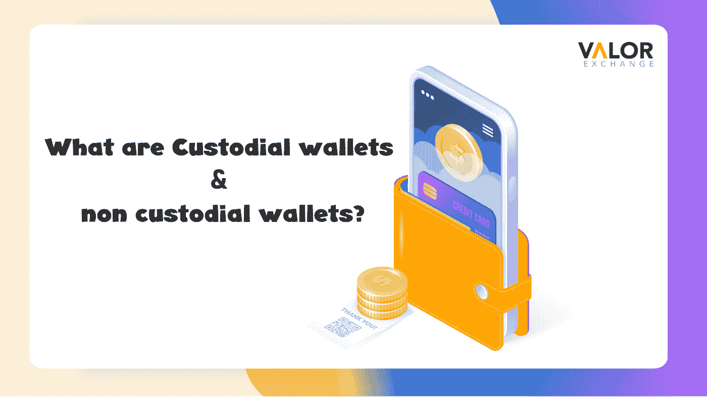
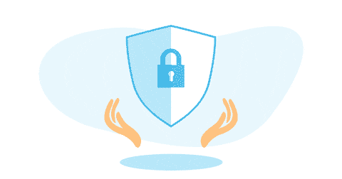

# 保管钱包和非保管钱包是什么？

> 原文：<https://medium.com/coinmonks/what-are-custodial-wallets-and-non-custodial-wallets-ee268f2b18da?source=collection_archive---------42----------------------->

你已经购买了你的第一种加密货币，是时候决定用什么样的钱包来保存它了。你想要保管的还是非保管的钱包？如果你对这些术语感到困惑，那么你很幸运。这篇文章深入探讨了这两种类型的钱包，它们的用途，优点和缺点。

**什么是非保管钱包？**

一个**非保管钱包**是一种让你完全控制你的加密资产的钱包。你有你自己的[私钥](https://valorexchange.com/blog/post?slug=what-are-public-and-private-keys-for-beginners)，如果你丢失了它们，你将失去你的加密货币。

没有客户支持或第三方来帮助您保护或恢复您的加密钱包。你必须想办法保护你的钱包和货币的安全。换句话说，你只能靠自己了。

**什么是保管钱包？**

**保管钱包**完全相反。第三方控制着您的私钥。换句话说，这一方负责保护你的加密货币。当您想要交易、发送或提取加密货币时，您将不必考虑如何访问您的资金。第三方会在你需要的时候为你提供货币。在 [ValorExchange](https://account.valorexchange.com/signup) 上，你可以用你的钱包进行支付、转账和充值，而且全部免费。

**非保管钱包的利与弊**

这些钱包让你完全控制你的钥匙，这意味着你是唯一一个谁有权使用你的钱包和硬币。尽管许多人将他们的加密货币存放在他们购买的交易所，但一些人更愿意将他们的货币置于自己的控制之下。

**保管钱包的利弊**

你购买的第一个密码可能会在保管钱包里。在这些情况下，交易所充当你的加密钱包的保管人。他们把钥匙放在安全的地方。这意味着无论你选择使用什么样的平台，都必须是非常安全和可信的。

有了 ValorExchange，你失去对你的加密资产的完全控制的机会很小。如果您忘记了帐户密码，我们的支持团队会帮助您找回密码。如果您进行买卖，您不必担心，因为该平台是 110%安全的，如果您在该平台内进行转账，您所有的转账都是免费的。

这就是为什么人们喜欢保管钱包，它非常方便。你不必担心失去你的密码，并因此永久失去你的密码。

**总之**

在选择保管钱包和非保管钱包时，没有对错之分。这完全取决于你的个人喜好。

然而，如果你很擅长记住你的密码，而且你不会轻易乱放东西，那么试试非保管钱包。然而，如果你知道你无法承受因为忘记密码而丢失资金的风险，那么就买一个保管钱包。

想要更多信息？我们有 it 和资源。我们希望与您分享如此多的资源、工具、新闻等。[加入我们的社区](https://t.me/valorexchangecommunity)永远不要错过利用您的 crypto 获取、学习或赚取更多的绝佳机会。