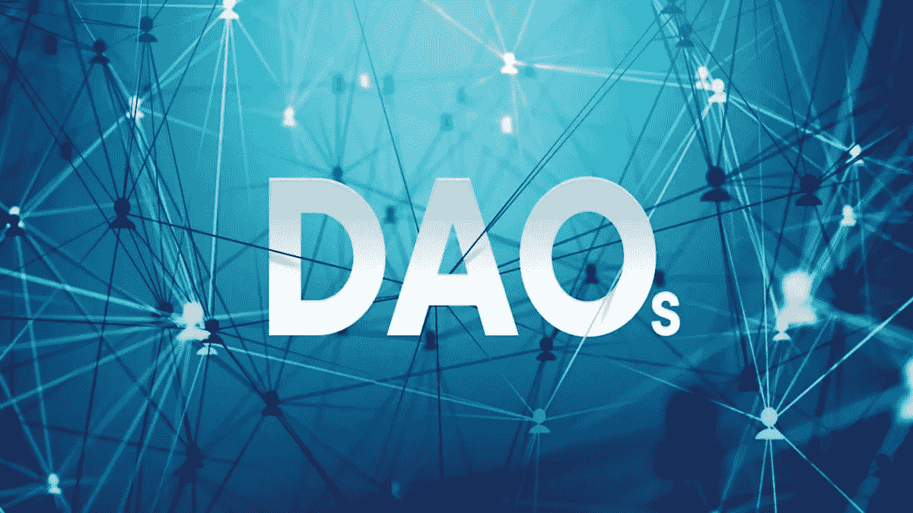
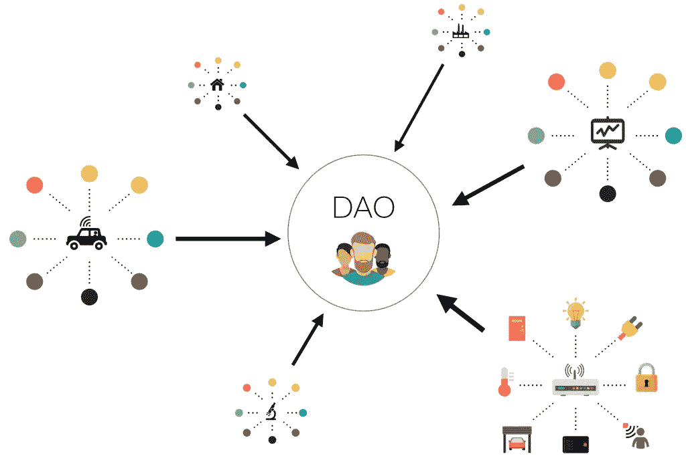
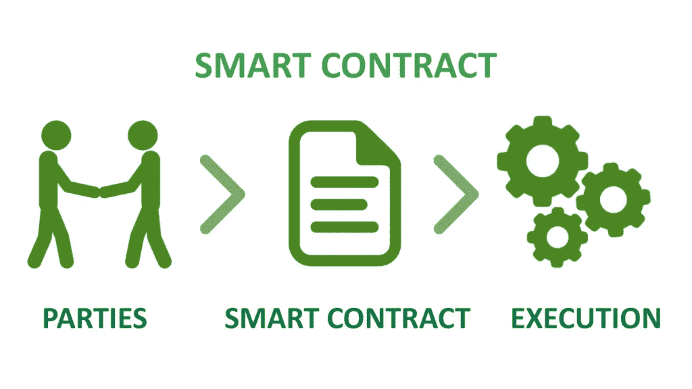

# 什么是 DAOs &我们为什么需要它们？

> 原文：<https://medium.com/coinmonks/what-are-daos-why-do-we-need-them-23738ab528df?source=collection_archive---------5----------------------->

## 关于道斯的一切

Decentralized Autonomous Organization

大家好，今天我们的话题是**什么是道&我们为什么需要它们**？在这个主题中，我将解释所有关于**道的事情。**

顾名思义，Dao 有三个核心特性:

*   **去中心化:**不是由一个单一的、集中的实体管理的。
*   **自主:**DAO 可以自动执行操作，无需任何干预。
*   **组织:**道像一个组织一样，由自己预定的规则所支配。

一个**去中心化的自治组织(DAO)** 顾名思义；一群人聚在一起，没有中央领导或公司来发号施令。它们建立在使用智能合约(数字一对一协议)的区块链之上。DAO 的成员经常购买他们的方式，大多数时候购买一个专门针对 DAO 的治理令牌，使他们能够就如何使用和管理资金池的决策进行投票。这些团体可以由来自世界各地的人组成，他们经常在不和谐频道上交流。

根据加密贸易出版物 Blockworks 的联合创始人 Jason Yanowitz 的说法，A DAO 具有“完全扁平的层次结构”。“这是一种围绕共享资产负债表以不同方式管理人们的方式。”

# 我们为什么需要 DAOs？

与涉及资金和金钱的人一起创办一个组织，需要对你的同事有很大的信任。但是很难相信一个你只在网上交流过的人。使用 DAO，您不需要信任组中的任何其他人，只需要信任 DAO 的代码，它是 100%透明的，任何人都可以验证。

这为全球协作和协调带来了如此多的新机会。

# 比较

## **刀**

通常是扁平的，完全民主化的。

任何要实施的变更都需要成员投票表决。

选票被统计，结果在没有可信中介的情况下自动执行。

所提供的服务以分散的方式自动处理(例如慈善基金的分配)。

所有活动都是透明和完全公开的。

## **传统组织**

通常是分等级的。

根据结构的不同，可以要求单一政党进行变革，也可以进行投票表决。

如果允许投票，投票将在内部统计，投票结果必须手动处理。

需要人工操作或集中控制的自动化，易于操作

活动通常是私人的，仅限于公众。

Examples of DAO

# 道示例

为了让这更有意义，下面是一些如何使用 DAO 的示例:

*   慈善机构——你可以接受世界上任何人的会员资格和捐款，这个团体可以决定他们如何使用捐款。
*   自由职业者网络——你可以创建一个承包商网络，他们共同出资购买办公空间和软件订阅。
*   风险投资和赠款——你可以创建一个风险投资基金，汇集投资资本并投票支持风险投资。偿还的钱以后可以在道成员之间重新分配。

# 刀在这里能有什么帮助？

Dao 使用智能联系人工作，这是一种自动、自动执行的合同，将两个人绑定在一起。在一个分散的环境中，人们通过开源协议相互交流。他们负责整体网络维护，并因成功完成各种任务而获得本地令牌奖励。

那么，这意味着什么呢？

个人行为不受法律契约的约束。取而代之的是，经济激励会自动使单个节点按照网络的最大利益行事。与具有复杂的自上而下结构和多个管理层的传统公司不同，DAO 的治理更加精细，并由预定义的代码进行管理。

此外，一旦部署，DAO 可以独立增长，而不依赖于它的创建者。

# Dao 是如何工作的？

# 第一步:制定规则

构建 DAO 的第一步是建立和定义将管理整个生态系统的规则。这些规则写入并存储在智能合约中。关于智能合约，您必须记住两件事:

*   它们是公开透明的。智能合同中记录的所有内容都是可见的。
*   智能合约是不可变的。一旦记录下来，任何人都不能更改其中定义的内容。

# 第二步:资金

下一个阶段是融资阶段。这一点非常重要，原因如下:

*   权力下放对于 Dao 的成功至关重要。在筹资阶段，它将有机会尽可能广泛地分发代币。
*   其次，通过获得这些令牌，用户在环境中获得了一些权利和特权。其中一项特权恰好是对某些事情的投票权。

# 第三步:变得自主

在部署之后，DAO 变得完全自治，也就是说，不受外部控制。每个持有道的本地令牌的人都拥有网络中的股份。因此，他们在生态系统中获得的投票权与他们的股份成正比。达到多数所需的批准百分比可能因提案而异。

现在，这种多数投票制既有优点也有缺点。

最显著的优势是大多数人的利益决定了所有的决策和资金。另一方面，这也使得决策成为一个漫长的过程。

假设有人在 DAO 的攻击面上发现了一个致命的漏洞。而不是立即用紧急硬分叉来修复，你将不得不等待大多数人投票来修复它。这可能是一个很大的时间浪费，因为你会理想地希望修复这些错误的速度比坏的。

# 道在现实世界中的好处

目前，DAO 加密令牌正被用于许多目的，如投资、慈善、购买和创建 NFT、筹款等等。例如，分散的土地道在元宇宙包括一个分散的城市规划委员会，他们在那里决定内容的适度性、土地政策和拍卖等。

下面概述了 Dao 及其本机令牌在现实世界中的三大优势:

# 分散、自动化和透明

DAO 的去中心化和透明的特性赋予了它的成员维护协议的完全所有权。此外，由于智能合约，Dao 是自动化的，决策是自动执行的。与传统公司相比，Dao 消除了所有第三方交易成本，组织只为区块链上的现有服务“付费”，从而提高了利润率。

# 社区驱动

组织中的决策权被赋予每个令牌持有者。这种权力与成员持有的代币成正比，但并没有赋予他们更多的权利或特权。令牌持有者有权实现进一步发展协议的更改，这使它成为一个有益的和真正民主化的空间。

# 潜在投资回报

在一个 DAO 中拥有一个治理令牌有点像在早期创业中持有股权——如果它后来成功了，这种股权将会非常有价值。同时也是代币持有者的 DAO 成员从交易所的交易量中获得固定百分比的奖励。这有助于创造一个更稳定的具有长期投资心态的代币用户群。总而言之，这种奖励机制将这些令牌与其他非 DAO 项目推出的令牌区分开来。

# 最大的道令牌

*   **UNI WAP(UNI):**UNI WAP 是同名 DEX 的治理令牌。Uniswap 是以太坊上第二大 DEX，其加密总价值超过 100 亿美元(TVL)。UNI 持有者可以对各种提案进行投票，包括是否应该将 DEX 移植到 Polygon 等其他网络。该平台不是完全分散的，因为它的开发者仍然对它有很大的控制权。例如，它取消了一些它认为对监管者来说有问题的代币，比如与股价挂钩的稳定硬币。
*   **Maker (MKR):** Maker 是以太坊上最大的 DeFi 应用程序 MakerDAO 的治理令牌，其 TVL 高达近 200 亿美元。MakerDAO 也是 DeFi 中最大的贷款平台，为其自己的稳定货币 DAI 提供加密贷款。MKR 持有者可以对 MakerDAO 借贷平台的各种重要参数进行投票，如其风险管理和业务逻辑。
*   **Aave (AAVE):** AAVE 是以太坊上第二大借贷协议的治理标志，也是 DApp 的第三大管理标志，拥有 130 亿美元的 TVL。它提供与 MakerDAO 类似的服务，但为 cryptos 提供了更多的借贷选择。这是一个非常受欢迎的 DApp 用户谁想要利用他们的加密控股。AAVE 持有者像 Maker 一样对新的代币上市和其他重要参数进行投票。
*   **Curve DAO Token(CRV):**Curve DAO Token 是另一个大型 DeFi 应用 Curve Finance 的治理令牌。Curve Finance 是世界上最大的指数，也是以太坊上第二大 DApp，TVL 为 160 亿美元。它专注于流动性池，其稳定的货币与美元等法定货币以及比特币和以太坊等大型加密货币的价格挂钩。CRV 用于投票决定是否增加更多的池，每个池获得的奖励数量等等。

# 结论

通过帮助许多区块链项目实现理想的分权，Dao 帮助创建了一个新的公司治理世界。通过智能合同自主开展企业运营，DAO 为其利益相关方带来许多好处——通过提供决策的完全所有权，可以根据 DAO 的增长相应地获得回报。随着 DAO 的法律挑战得到澄清和管理，越来越多的组织将寻求在其业务中采用 DAO 平台，以自动化其核心业务活动的某些方面。

## 在 Linkedin 上关注我，保持联系

[https://www.linkedin.com/in/ishanshahzad/](https://www.linkedin.com/in/ishanshahzad/)