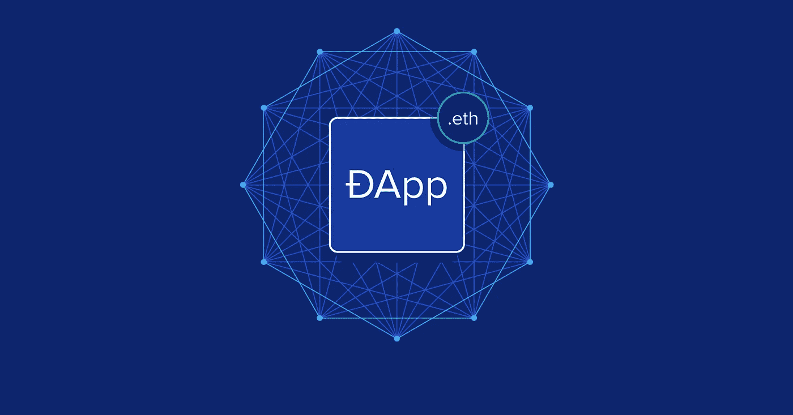
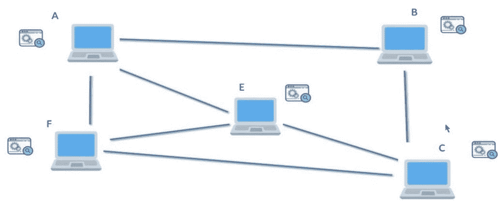

# 什么是分散式应用？

> 原文：<https://medium.com/coinmonks/what-are-decentralized-applications-f3fc21fd290e?source=collection_archive---------30----------------------->

**井**，

我猜你已经知道了*的一个集中应用*。如果没有，那么请查看我之前关于 [*集中应用*](https://saroj.hashnode.dev/centralized-application) 的文章。

我希望你现在已经熟悉了*集中式应用*，如果以前没有的话。

**伟大的**！

**让我们进入分散式应用。**

我很确定，在阅读了我之前的文章之后，你能够创建一个分散应用的思维导图。我就是我，对吧？

**耶**，你也是！

酷！我们来深入看看。

*分散式应用*是指数据和功能(*业务逻辑*)都驻留在多个*服务器*上的应用，这些服务器不是由单个实体拥有和管理的。这意味着，在*分散应用*的情况下，所有*服务器*都像对等体一样工作，并且这些*服务器*不由任何单个实体管理。

**这究竟是什么？让我们试着用一个简单的图表来理解。**

如上图所示，所有的计算机(*服务器*)都是相互链接的。没有*中央服务器*。这些*服务器*也被称为*对等网络*。假设如果一个新的*计算机(服务器)*被添加到这个*应用程序(网络)*中，它将再次通过所有网络分发数据，等等。

**还不能够理解？**

**我们来看一个例子，**

我想大家都知道 [*比特币*](https://www.investopedia.com/terms/b/bitcoin.asp) ，*比特币*就是一个*去中心化网络*的例子。

**但是，如何？**

*比特币*工作在*点对点* ( *P2P* )网络上，或者我们可以说，它工作在*去中心化应用*模式上。因为比特币没有中央服务器/数据库。它在区块链网络上工作。如你所知，*是一个分布式账本，也就是说，在这个网络上做一个应用的时候，必须是*去中心化* ( *可以是公有的，也可以是私有的*)。比特币网络上的所有参与者(*节点*)都可以看到其他参与者的数据(*以加密的方式*)，当一个新的参与者加入时，他/她的数据也可以与所有其他参与者共享。这些参与服务器中的每一个都由网络的参与者控制。类似地，应用程序业务逻辑的相同副本(*智能合约*)驻留在运行*比特币*网络的服务器上并在其上执行。*

*你可能会问，为什么我们需要一个分散的应用程序？对吗？*

*让我们看看为什么我们需要…*

*假设，如果您想要构建一个*应用程序*，其中*应用程序*的每个用户都可以访问关于业务流程的所有信息以建立信任。比方说，我想创建一个*鱼交付* *应用程序*，它可以帮助餐馆和他们的顾客。*

*这对餐馆有什么帮助？*

*正如您已经知道的，分布式应用程序本质上是不可变的，一旦添加了数据，您就不能更改任何数据。假设餐馆想知道鱼是从哪里来的？还是新鲜不新鲜？或者说这条鱼的卖家是谁？或者鱼在旅行时的温度是多少？等等……我们可以将所有细节添加到我们的*鱼交付应用程序*中，例如，鱼是何时被捕获的，谁是卖家，鱼的温度是多少(*我们可以从鱼交付车辆*中添加这些信息)，以及我们可以添加的关于鱼的所有信息。而且，一旦添加，任何人都不能修改/删除这些数据。*

*通过这种方式，餐馆可以在鱼交付应用程序的帮助下验证鱼数据。这将有助于餐馆与顾客建立信任。*

*我希望现在你已经对*分散应用*及其用途有所了解。*

***伟大的**！*

*就这些了，下次再见，我会有新的博客！*

*还有什么问题，随时联系我 [***领英***](https://www.linkedin.com/in/sarojvrc/)*[***推特***](https://twitter.com/iamsarojb)**

**感谢阅读:)**

> **加入 Coinmonks [电报频道](https://t.me/coincodecap)和 [Youtube 频道](https://www.youtube.com/c/coinmonks/videos)了解加密交易和投资**

# **另外，阅读**

*   **[币安期货交易](https://coincodecap.com/binance-futures-trading)|[3 comas vs Mudrex vs eToro](https://coincodecap.com/mudrex-3commas-etoro)**
*   **[如何购买 Monero](https://coincodecap.com/buy-monero) | [IDEX 评论](https://coincodecap.com/idex-review) | [BitKan 交易机器人](https://coincodecap.com/bitkan-trading-bot)**
*   **[CoinDCX 评论](/coinmonks/coindcx-review-8444db3621a2) | [加密保证金交易交易所](https://coincodecap.com/crypto-margin-trading-exchanges)**
*   **[红狗赌场评论](https://coincodecap.com/red-dog-casino-review) | [Swyftx 评论](https://coincodecap.com/swyftx-review) | [CoinGate 评论](https://coincodecap.com/coingate-review)**
*   **[Bookmap 评论](https://coincodecap.com/bookmap-review-2021-best-trading-software) | [美国 5 大最佳加密交易所](https://coincodecap.com/crypto-exchange-usa)**