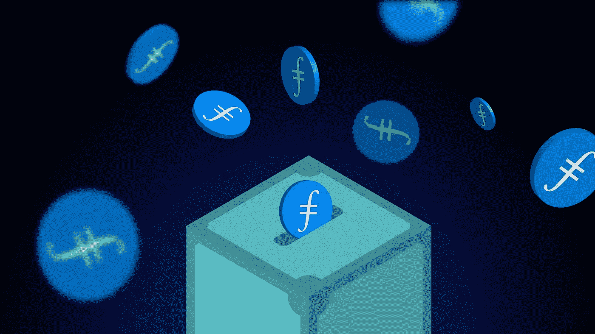
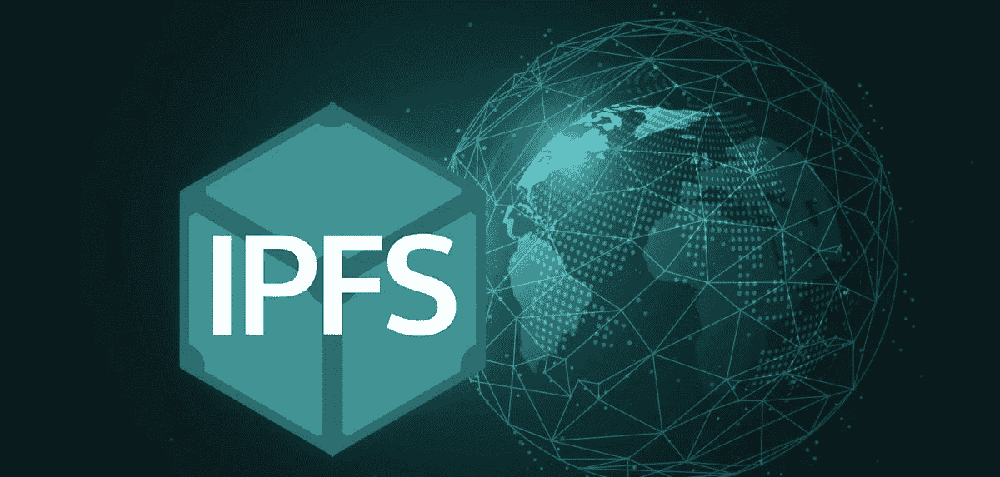
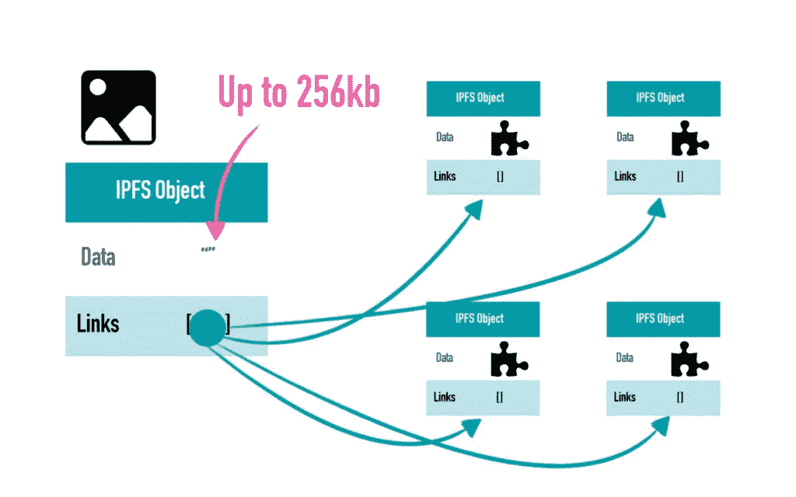
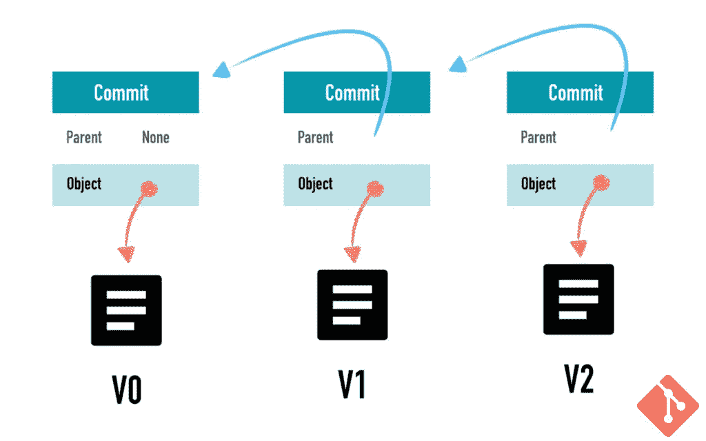
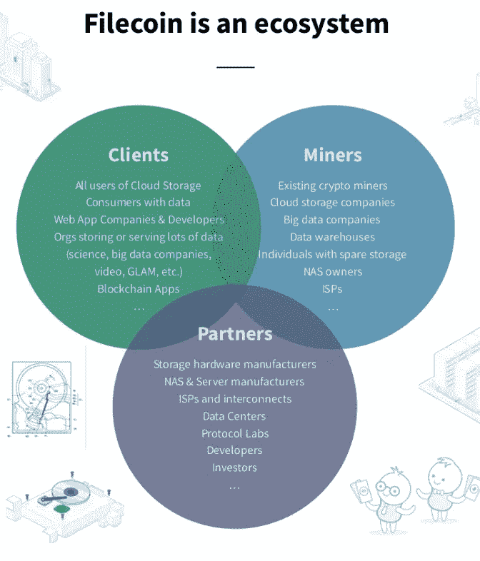

# 什么是分散存储系统？:Filecoin 给 IPFS 带来的 3 个好处。

> 原文：<https://medium.com/coinmonks/what-are-decentralized-storage-systems-3-benefits-of-filecoin-to-ipfs-45aaf7905ac3?source=collection_archive---------6----------------------->

image credit: filecoin.io

# 分散存储系统是什么？

分布式存储系统是过去十年发展起来的一项技术。

这些系统提供了在您的计算机或服务器上本地存储数据的替代方案。

其存储网络在多个节点上存储数据，服务器由独立运营商托管，而不是集中管理。

个人可以通过出租他们计算机上未使用的存储空间来参与进来。

# 集中式存储系统怎么样？

[集中式](https://101blockchains.com/decentralized-vs-centralized/)信息遍布网络，因为它使用了[集中式](https://alteblock.com/blockchain-guides/xt-com-review-2022-pros-cons-whats-new-how-to-sign-up-on-xt-com/)存储系统。

这些集中存储平台使用“[基于位置的寻址](https://www.computerlanguage.com/results.php?definition=location-based+addressing)来提供存储在大型[服务器群](https://www.google.com/amp/s/whatis.techtarget.com/definition/server-farm-Web-farm-Web-server-farm%3famp=1)中的文件，这些服务器群由谷歌、脸书、推特、微软和亚马逊等公司控制。

这使得政府很容易阻止/限制用户访问它们。

然而，存储系统也有一些缺点，因为数据的存储是中心的，通常由大公司使用。

当一个网站经历停机时，主要是因为集中服务的故障/技术性问题，如托管服务器或域名系统(DNS)问题。

此外，存储系统的[集中化](https://alteblock.com/blockchain-guides/fmfw-io-review-2022-pros-cons-how-to-sign-up-on-fmfw-io/)使它们面临本地[审查](https://media.okstate.edu/faculty/jsenat/censorship/defining.htm)的风险。

这意味着“某些国家”可以禁止“某些内容”以防止其公民、技术问题或停机。

对于许多用户来说，这可能导致在技术问题发生/持续期间缺乏服务和对信息/数据的访问。

历史表明，集中式存储系统效率很高，但不可靠。

1998 年，一台存储了美国 90%寻呼机的服务器停止工作，导致了美国历史上最严重的互联网连接中断。

想象一下，这样的事件再次发生，后果将是灾难性的，全世界都会感受到。

# 你如何避免这种情况？

由于与集中式存储系统的不一致性，像星际文件系统(IPFS)这样的分散式存储系统旨在解决这个问题。

# 什么是 IPFS？

image credit: icommunity.io

[IPFS](https://coinmarketcap.com/alexandria/glossary/interplanetary-file-system-ipfs) (星际文件系统)是由[协议实验室](https://protocol.ai/)构建的一个分散式存储系统。

该系统是一种依赖于分布式计算机网络的服务，其基于存储在世界各地的许多节点或计算机上的内容来传递信息。

它使用“[基于内容的寻址](https://www.techtarget.com/searchstorage/definition/content-addressed-storage)，根据其内容提供文件。

该系统是一个分散的点对点文件共享网络和开源 Web3 服务，旨在克服集中的故障点和审查工作，以确保所有人都可以自由访问网络。

# IPFS 的文件存储。

IPFS 将上传的文件存储在“IPFS 对象”上，该对象最多可存储 256kb 的数据，并包含其他 IPFS 对象的链接。

对于大于 256kb 数据的文件，系统会将其拆分为多个“IPFS 对象”，之后系统会创建一个链接到多个文件的空 IPFS 对象。

image credit: happycryptoschool.org

当用户请求并查看它时，它看起来就像合并成了一个。

这些文件一上 IPFS，它就生成一个唯一的散列来识别每一件物品。

这有助于定位哪个节点拥有该文件，然后通过对等连接提供给用户。

就像区块链一样，IPFS 是不变的，这意味着它可以抵抗篡改，因此内容不能改变。

此外，IPFS 有一个名为“文件版本控制”的系统，每当你想进行更改或更新时，可以添加文件的新版本。

而且，它还连接到前一个，就像块链一样，确保整个历史的维护。

image credit: happycryptoschool.org

# IPFS 的局限性

保持在线没有节点奖励。

网络上的所有节点之间没有文件分布。因此，如果一个节点离线，文件将无法访问。

由于这些限制，IPFS 集成了 Filecoin 来解决这些问题。

# Filecoin 是什么？

image credit: filecoin.io

[Filecoin](https://docs.filecoin.io/about-filecoin/what-is-filecoin/#new-to-web3) 是一个全球分散存储系统，通过点对点网络存储文件。

个人被称为矿工，他们奉献自己的计算机，并因确保用户维护 Filecoin 网络的存储空间而获得报酬。

它的本地令牌 FIL 为 Filecoin 网络提供动力。用户必须购买 FIL，并用它来支付网络内的数据存储和检索费用。

网络是建立在星际文件系统(IPFS)上的区块链。

> 世界上有大量的存储空间没有被使用。
> 
> 就当是 [Airbnb](https://www.investopedia.com/articles/personal-finance/032814/pros-and-cons-using-airbnb.asp) 吧。有人的房间没有被使用:Airbnb 为他们建立了一个市场。
> 
> **胡安·贝尼特。**

# 数据是如何存储和检索的？

当用户上传文件时，Filecoin 网络会确保安全地存储这些文件。

客户/用户与存储提供商(矿工)达成存储交易，以存储数据。

矿工被要求向网络出示证据，证明他们正在存储数据，而且存储得很可靠。

然后给区块链增加一个新的街区并接受他们的奖励。

专用于网络的存储越多，获得回报的机会就越大。

然后，网络会验证矿商是否正确存储了数据，之后他们会在存储协议期间定期支付小额费用。

此外，内容检索有时由存储提供商直接提供，或者由专门的检索存储提供商提供，请求数据的用户为此服务付费。

Image credit: ipfs.io/ipfs/QmWimYyZHzChb35EYojGduWHBdhf9SD5NHqf8MjZ4n3Qrr

# Filecoin 中的一致性算法

Filecoin 区块链依靠两种算法来帮助网络验证矿工存储他们声称持有的数据。

## 复制证明。

复制证据表明，矿工已经存储了他们声称拥有的数据副本的数量。

## 时空的证明。

这种算法显示，矿工已经存储了一段时间的数据。

这两种算法允许其他参与者/客户评估挖掘者是否可靠。

# Filecoin 给 IPFS 带来的三大好处

1.Filecoin 通过奖励网络上的节点操作员来保持文件在线，从而解决了节点离线的问题

2.它的系统在许多节点上复制单个数据，以便在需要时，它们不会变得不可用。

3.该系统提供安全性。

除此之外，分散存储更安全，可以防止数据泄露和攻击，因为所有节点都存储您的文件片段，而不是一个公司。

对黑客来说，获得单个存储点的访问权限要比试图从不同的未知来源访问数千个文件容易得多。

因为它分割了你的数据，黑客更难访问你的文件。

每个文件被分成不同的部分，并分别加密。

许多解决方案将 IPFS 和 Filecoin 这两个网络结合起来，以获得两者的优势。

Filecoin 旨在增加更长期的持久性，以安全地存储大量数据，而 IPFS 则针对内容的快速检索和分发进行了优化。

更多内容请访问 https://protocol.ai/:

**在 twitter 上关注我:** @ [区块链 _ 卡利](https://twitter.com/Blockchain_Cali?t=qZ06X9lrqTzkb1cMSONQuA&s=09)

> *加入 Coinmonks* [*电报频道*](https://t.me/coincodecap) *和* [*Youtube 频道*](https://www.youtube.com/c/coinmonks/videos) *了解加密交易和投资*

# 另外，阅读

*   [3 商业评论](/coinmonks/3commas-review-an-excellent-crypto-trading-bot-2020-1313a58bec92) | [Pionex 评论](https://coincodecap.com/pionex-review-exchange-with-crypto-trading-bot) | [Coinrule 评论](/coinmonks/coinrule-review-2021-a-beginner-friendly-crypto-trading-bot-daf0504848ba)
*   [莱杰 vs n rave](/coinmonks/ledger-vs-ngrave-zero-7e40f0c1d694)|[莱杰 nano s vs x](/coinmonks/ledger-nano-s-vs-x-battery-hardware-price-storage-59a6663fe3b0) | [币安评论](/coinmonks/binance-review-ee10d3bf3b6e)
*   [Bybit Exchange 审查](/coinmonks/bybit-exchange-review-dbd570019b71) | [Bityard 审查](https://coincodecap.com/bityard-reivew) | [Jet-Bot 审查](https://coincodecap.com/jet-bot-review)
*   [3 commas vs crypto hopper](/coinmonks/3commas-vs-pionex-vs-cryptohopper-best-crypto-bot-6a98d2baa203)|[赚取加密利息](/coinmonks/earn-crypto-interest-b10b810fdda3)