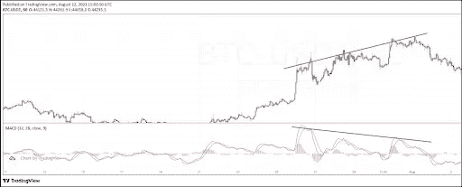
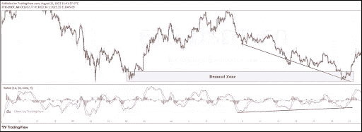

# 什么是分歧？确认市场反转的最佳工具

> 原文：<https://medium.com/coinmonks/what-are-divergences-the-best-tool-to-confirm-market-reversals-ba9a5f9b7a92?source=collection_archive---------42----------------------->

随着价格图表和几种分析技术的引入，可以肯定的是，金融市场上的价格不会随机变动。技术分析使交易者能够阅读、理解和预测未来价格。密码市场也不例外。尽管基本面与传统金融市场完全不同，但事情的技术面是一样的——因为价格是根据基础资产的需求和供给变动的。

价格行为和基于指标的分析是两种最流行的技术分析方法。虽然价格行为和指标遵循完全相反的方法，但有一些技术试图融合两者来巩固和强化策略。

结合价格行为分析和指标的一个著名策略是背离。强制背离策略通过在图表中增加一个指标来帮助交易者进行价格行为分析。该指标本身并不在分析中进行解释，但在识别市场差异方面起着重要作用。

# 散度介绍

市场通常要么上升，要么下降。上升趋势是一系列更高的高点和更高的低点，而下降趋势是一系列更低的低点和更低的高点。大多数指标都是为了跟随价格而设计的。例如，如果市场正在创造更高的高点，指标也遵循同样的更高的轨迹。

由于指标纯粹跟随价格，它们总是需要彼此同步。但市场上也有指标与价格走势不同步的情况。例如，如果一个市场处于上升趋势，该指标似乎处于下降趋势。市场中的这种情况被称为背离。

# 解释分歧

首先，许多交易者认为背离本身是一个描述市场背离发生的指标。但是，在现实中，背离只是一个市场场景，需要交易者通过结合指标分析价格行为来手动识别。通常，背离是由振荡指标确定的，如 [MACD、RSI、](https://steemit.com/cryptocurrency/@cryptolume/kucoin-trading-tool-rsi-macd-desktop-push-notification-alerts)随机指标等。

背离表明价格正在做一些比预期不寻常的事情。例如，在价格图表上有更高的高点，但在指标上没有更高的高点，这意味着市场试图改变方向。

从本质上讲，背离是由于市场动力的突然变化而产生的。如果价格有放缓的迹象，如果势头突然回升，指标不能对突然的运动做出反应。结果，指标对价格行为没有反应，导致市场出现背离。

在下面的图表中，我们可以看到价格正在向北移动，形成更高的高点和更高的低点。但是，与此同时，如果我们看看 MACD 指标，高点每一步都在变低。因此，给定的市场处于背离状态，因为指标与价格行为不同步。

*[*比特币*](https://www.kucoin.com/blog/what-is-bitcoin-and-how-does-it-work) *价格走势图|来源:* [*BTC/USDT*](https://trade.kucoin.com/BTC-USDT)*

# *如何交易背离？*

*背离是交易市场反转最常用的技术之一。市场不会从上升趋势转变为下降趋势，反之亦然。这种转变必须要么以[巩固](https://www.kucoin.com/blog/top-trading-strategies-for-stagnating-and-ranging-markets)的形式出现，要么以主导方向的放缓形式出现。*

*基于上面的想法，背离可以被应用于市场潜在反转的时间。但是[反转信号](https://www.kucoin.com/blog/undertsanding-different-candlestick-patterns-while-trading-cryptos-part-ii)必须在应用指标和现货背离之前使用价格行为技术进行初步识别。*

*将背离应用于价格行为分析的最简单的方法之一是使用供给和需求的概念。*

*快速回顾一下，供给是市场中由于缺乏购买资产的兴趣而导致价格下跌的水平，而需求是由于购买资产的兴趣高涨而导致价格大幅上涨的水平。*

*该策略的最终目标是预测市场反转。根据战略的运作，我们需要首先根据更高的时间框架标出主要的需求/供应水平。如果市场在这些水平附近出现背离，我们可以准备在需求区做多，或者在供应区做空。*

*在下面描述的市场中，需求区域位于 1700 美元和 1800 美元之间。在第一次对需求区做出反应后，价格开始向南移动。换句话说，下跌趋势从 2400 美元开始，并继续向南，形成更低的低点和更低的高点。但是，由于价格行为明显具有较低的低点序列，在相同的相应时间框架内，该指标具有较高的低点序列-确认下跌趋势已经结束，需求区即将起飞。因此，交易者可以在需求区稍有重大反应后做多。*

**

**发散讲解上* [*比特币*](https://www.kucoin.com/blog/everything-you-need-to-know-about-bitcoin-halving) *价格走势图|来源:* [*BTC/USDT*](https://trade.kucoin.com/BTC-USDT)*

*总之，背离是一种在加密市场中非常常见的市场情景，它极大地有助于确认市场中的潜在反转。就解释而言，背离是价格异常波动的迹象，也许是为了困住散户，让他们措手不及。*

*因此，基于价格行为分析和振荡器(识别背离)，交易者可以很容易地推测高回报的反转设置。*

> *加入 Coinmonks [电报频道](https://t.me/coincodecap)和 [Youtube 频道](https://www.youtube.com/c/coinmonks/videos)了解加密交易和投资*

# *另外，阅读*

*   *[德国最佳加密交易所](https://coincodecap.com/crypto-exchanges-in-germany) | [Arbitrum:第二层解决方案](https://coincodecap.com/arbitrum)*
*   *[币安交易机器人](/coinmonks/binance-trading-bots-d0d57bb62c4c) | [OKEx 评论](/coinmonks/okex-review-6b369304110f) | [阿塔尼评论](https://coincodecap.com/atani-review)*
*   *[最佳加密交易信号电报](/coinmonks/best-crypto-signals-telegram-5785cdbc4b2b) | [MoonXBT 评论](/coinmonks/moonxbt-review-6e4ab26d037)*
*   *如何在 Bitbns 上购买柴犬(SHIB)币？ | [买弗洛基](https://coincodecap.com/buy-floki-inu-token)*
*   *[CoinFLEX 评论](https://coincodecap.com/coinflex-review) | [AEX 交易所评论](https://coincodecap.com/aex-exchange-review) | [UPbit 评论](https://coincodecap.com/upbit-review)*
*   *[十大最佳加密货币博客](https://coincodecap.com/best-cryptocurrency-blogs) | [YouHodler 评论](https://coincodecap.com/youhodler-review)*