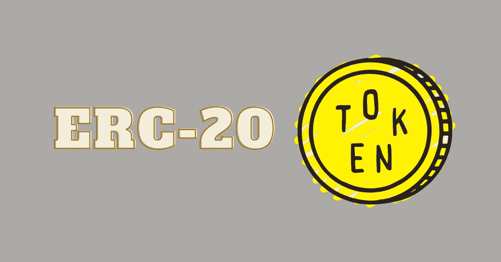

# 什么是 ERC 20 代币？

> 原文：<https://medium.com/coinmonks/what-are-erc-20-tokens-868a881c4557?source=collection_archive---------53----------------------->

简单地说，它们是建在区块链顶上的代币。

ERC-20 令牌是为了创建令牌之间的互操作性而创建的。ERC-20(币安智能链上的 BEP-20)标准化了每个令牌的核心功能，这意味着使用该框架创建的所有令牌都可以彼此互操作。它还允许 Metamask 等钱包与各种令牌一起使用，并在不同的网络上使用，因为它们是使用相同的标准设计的。

每个 ERC-20 令牌功能都由一组智能合约管理，确保加密令牌的运行不需要信任任何人或实体。当满足规则或条件时，代码会自动执行。例如，当将令牌传递给其他人时，用户不必信任任何人来将令牌传递给接收者。

每台 ERC-20 都有几个**必需的特性**供开发者实现。

*   **totalSupply:** 概括代币总供应量的函数。
*   **balanceOf:** 显示一个特定地址有多少令牌。
*   **转让:**将令牌的所有权转让给另一个用户。
*   **批准:**允许一定数量的余额被另一个地址使用
*   **津贴:**用于查看一个地址允许从另一个地址消费多少。
*   **transferFrom:** 用于有余量的地址希望将余额从一个地址转移到另一个地址

每个 ERC20 令牌也有两个**必需事件。**

*   **Transfer** —当某人成功使用 Transfer 或 transferFrom 函数时，会触发 Transfer 事件
*   **批准** —批准事件在成功调用批准函数时触发，并将返回所有者、支出者和批准的金额。

什么是包装令牌？

它被称为包装令牌，因为原始资产被放在包装器中，包装器允许包装版本在同一个或另一个区块链上铸造。您通常会在缩写名称前看到一个“w”。

ETH 到 wETH，BTC 到 wBTC，FTM 到 wFTM 等

包装令牌有助于在不同的区块链之间建立更多的桥梁。

例如，当您在 Fantom ($FTM)上使用 DeFi 平台时，您可能会注意到，您需要存放 wFTM，而不是 FTM。这是因为 wFTM 是 ERC-20 令牌版本，智能合约可以与之交互，但不能与 FTM 交互。

当您返回包装好的令牌时，它会被烧掉，原始令牌会返回给您。

什么是包装好的 ERC-20 代币？

可以使用 ERC20Wrapper 创建现有 ERC-20 的包装令牌。代替

FTM — wFTM(其中 wFTM 是 ERC-20 令牌)

我们实际上可以创造

FTM — wFTM — wwFTM(其中 wFTM 和 wwFTM 都是 ERC-20 令牌)

这非常有用，因为现在您可以通过 wwFTM 令牌的智能合约向 wwFTM 令牌添加新的功能，而 wFTM 令牌合约无法做到这一点。

如果这篇文章激起了你的兴趣，你会很高兴知道会有更多类似的文章，你可以在 MCC 官方社区中找到更多的我——[https://t.me/mccOFFICIALtg](https://t.me/mccOFFICIALtg)

> *加入 Coinmonks* [*电报频道*](https://t.me/coincodecap) *和* [*Youtube 频道*](https://www.youtube.com/c/coinmonks/videos) *了解加密交易和投资*

# 另外，阅读

*   [3 商业评论](/coinmonks/3commas-review-an-excellent-crypto-trading-bot-2020-1313a58bec92) | [Pionex 评论](https://coincodecap.com/pionex-review-exchange-with-crypto-trading-bot) | [Coinrule 评论](/coinmonks/coinrule-review-2021-a-beginner-friendly-crypto-trading-bot-daf0504848ba)
*   [莱杰 vs n rave](/coinmonks/ledger-vs-ngrave-zero-7e40f0c1d694)|[莱杰 nano s vs x](/coinmonks/ledger-nano-s-vs-x-battery-hardware-price-storage-59a6663fe3b0) | [币安评论](/coinmonks/binance-review-ee10d3bf3b6e)
*   [Bybit Exchange 审查](/coinmonks/bybit-exchange-review-dbd570019b71) | [Bityard 审查](https://coincodecap.com/bityard-reivew) | [Jet-Bot 审查](https://coincodecap.com/jet-bot-review)
*   [3 commas vs crypto hopper](/coinmonks/3commas-vs-pionex-vs-cryptohopper-best-crypto-bot-6a98d2baa203)|[赚取加密利息](/coinmonks/earn-crypto-interest-b10b810fdda3)
*   最好的比特币[硬件钱包](/coinmonks/hardware-wallets-dfa1211730c6) | [BitBox02 回顾](/coinmonks/bitbox02-review-your-swiss-bitcoin-hardware-wallet-c36c88fff29)
*   [BlockFi vs 摄氏度](/coinmonks/blockfi-vs-celsius-vs-hodlnaut-8a1cc8c26630) | [Hodlnaut 点评](/coinmonks/hodlnaut-review-best-way-to-hodl-is-to-earn-interest-on-your-bitcoin-6658a8c19edf) | [KuCoin 点评](https://coincodecap.com/kucoin-review)