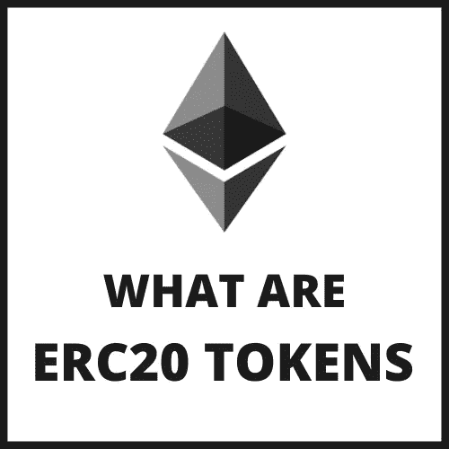

# 什么是 ERC20 令牌

> 原文：<https://medium.com/coinmonks/what-are-erc20-tokens-37817f4b0078?source=collection_archive---------46----------------------->

Splash Image

首先，什么是令牌？

代币**是虚拟货币代币或者加密货币**的面额。它代表一种可交易的资产或公用事业，存在于其自身的区块链上，并允许持有者将其用于投资或经济目的。

关于加密令牌，需要了解的关键是:它们是虚拟货币，不像美元是物理货币，它们存储在区块链，如以太坊、币安智能链、多边形区块链和其他几个，也可以在区块链之间转移，就像美元存储在银行一样，可以从一家银行转移到另一家银行。

现在我们知道什么是令牌，接下来的问题是，什么是 ERC20 令牌。

“ERC20”令牌是使用以太坊区块链中使用的特定脚本标准生成的令牌类别。

该技术标准规定了以太坊令牌或智能合约必须遵循的大量规则和操作，以及实现这些规则和操作的步骤。或许最简单的方法是将 ERC20 视为以太坊网络中创建的任何新令牌都必须遵循的一组基本准则和功能。

ERC20 令牌标准是管理大部分区块链空间的主要概念之一，尤其与[智能合同](https://www.investopedia.com/terms/s/smart-contracts.asp)和智能财产相关。

一段时间以来，ERC20 标准一直是加密货币领域创造新代币的主要途径。它特别受 ico 和众筹公司的欢迎。

虽然许多 ERC20 智能合约用于在数字空间中执行各种例程和功能，但其中许多合约已被用于创建不可替代的代币(NFT ),以实现首次硬币发行(ICO)的目的。ICO 本质上是加密货币行业在股票市场的首次公开募股(IPO)。一家希望筹集资金来创建新的加密货币、分散式应用或服务的加密公司推出了 ICO，作为从投资者和早期采用者那里筹集资金的一种方式。

# 关键要点

*   ERC20 令牌是用于在以太坊区块链上创建和发布智能合约的标准。
*   智能合约可以用来创造人们可以投资的智能财产或令牌化资产。
*   ERC 代表“以太坊征求意见稿”，ERC20 标准于 2015 年实施。
*   许多知名的数字货币都使用 ERC-20 标准，包括 Maker (MKR)、Basic Attention Token (BAT)、auger(REP)和 OMG Network (OMG)。

# ERC20 的历史

ERC20 由以太坊开发人员在 2015 年代表更广泛的以太坊社区创建，并于 2017 年 9 月获得正式认可。1 要为以太坊创建此类标准，开发人员或开发人员团队必须提交一份以太坊改进提案(EIP ),该提案描述了新功能及其具体协议和标准。然后，一个委员会审查，批准，修改，并最终确定 EIP——在这一点上，它成为一个 ERC。

以太坊中的智能合约和其他特性必须符合一个被认可的标准。尽管 ERC20 可能是所有这些 ERC 标准中最重要和最著名的，但它并不是现存的唯一标准。3

# ERC20 标准的内容

ERC20 包含兼容令牌必须能够实现的几个功能。

*   *TotalSupply:* 提供有关令牌供应总量的信息
*   *BalanceOf:* 提供业主账户的账户余额
*   *传送:*执行将指定数量的令牌传送到指定地址
*   *TransferFrom:* 执行从指定地址传输指定数量的令牌
*   *批准:*允许消费者从指定账户中提取一定数量的代币
*   *津贴:*将一定数量的代币从消费方返还给所有者 1

此外，这些功能还将触发最多两个事件，包括转移事件(在转移令牌时发生)和批准/验证事件(在需要批准时激活)。1

如今，人们可以在彼此之间以点对点的方式交易 ERC20 代币，或者在比特币基地和币安等加密货币交易所交易

# 问题和替代方案

尽管 ERC20 以符合其标准的新令牌的形式获得了广泛支持，但开发社区中有许多人认为 ERC20 在一个或多个方面存在局限性或缺陷。由于这个原因，自从 ERC20 开发以来，已经提出了几个替代令牌标准。其中包括 ERC223，该标准旨在解决与 ERC20.5 的批准和转让要素相关的问题

ERC621 是另一个备选方案，它提出了与 ERC20 相同的基本功能，但也增加了增加或减少总令牌供应的能力。6 另一方面，ERC827 允许持有者批准第三方消费令牌。7 这些新协议提案在某种程度上都以 ERC20 为基础。

> 加入 Coinmonks [电报频道](https://t.me/coincodecap)和 [Youtube 频道](https://www.youtube.com/c/coinmonks/videos)了解加密交易和投资

# 另外，阅读

*   [3 商业评论](/coinmonks/3commas-review-an-excellent-crypto-trading-bot-2020-1313a58bec92) | [Pionex 评论](https://coincodecap.com/pionex-review-exchange-with-crypto-trading-bot) | [Coinrule 评论](/coinmonks/coinrule-review-2021-a-beginner-friendly-crypto-trading-bot-daf0504848ba)
*   [莱杰 vs n rave](/coinmonks/ledger-vs-ngrave-zero-7e40f0c1d694)|[莱杰 nano s vs x](/coinmonks/ledger-nano-s-vs-x-battery-hardware-price-storage-59a6663fe3b0) | [币安评论](/coinmonks/binance-review-ee10d3bf3b6e)
*   [Bybit Exchange 审查](/coinmonks/bybit-exchange-review-dbd570019b71) | [Bityard 审查](https://coincodecap.com/bityard-reivew) | [Jet-Bot 审查](https://coincodecap.com/jet-bot-review)
*   [3 commas vs crypto hopper](/coinmonks/3commas-vs-pionex-vs-cryptohopper-best-crypto-bot-6a98d2baa203)|[赚取加密利息](/coinmonks/earn-crypto-interest-b10b810fdda3)
*   最好的比特币[硬件钱包](/coinmonks/hardware-wallets-dfa1211730c6) | [BitBox02 回顾](/coinmonks/bitbox02-review-your-swiss-bitcoin-hardware-wallet-c36c88fff29)